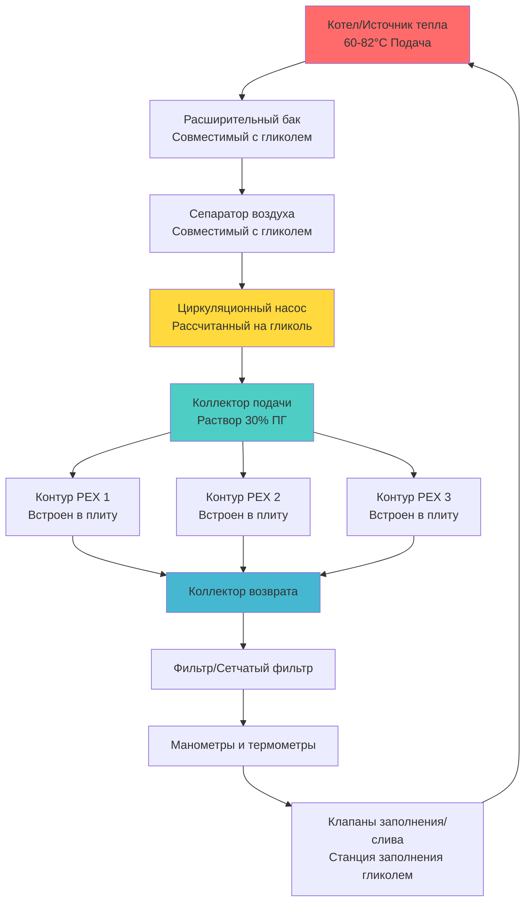

## Физические принципы антифризных растворов

Антифризные растворы предотвращают замерзание в гидронных системах снеготаяния путем нарушения образования кристаллов льда на молекулярном уровне. Когда молекулы гликоля растворяются в воде, они нарушают сетевую связь водородных мостиков, необходимую для кристаллизации льда, понижая точку замерзания через снижение коллигативного свойства. Депрессия точки замерзания пропорциональна молярной концентрации гликоля, а не его массовой доле, что объясняет нелинейную связь между концентрацией и защитой от замерзания.

Добавление гликоля принципиально изменяет термофизические свойства теплоносителя. Удельная теплоемкость снижается, поскольку молекулы гликоля имеют более низкую теплоемкость, чем молекулы воды. Коэффициент теплопроводности снижается из-за более слабых межмолекулярных сил в гликоле по сравнению с сетевой связью водородных мостиков воды. Вязкость резко увеличивается, потому что более крупные молекулы гликоля создают большее внутреннее трение при потоке.

## Сравнение типов гликолей

Два типа гликолей преобладают в приложениях гидронного снеготаяния, каждый со своими отличительными характеристиками:

| Свойство | Пропиленгликоль | Этиленгликоль |
|----------|------------------|-----------------|
| Токсичность | Пищевого качества, нетоксичен | Токсичен, требует изоляции | 
| Точка замерзания (50% по массе) | -34°C | -37°C |
| Удельная теплоемкость при 50% | 3.77 кДж/кг·К | 3.68 кДж/кг·К |
| Вязкость при 50%, -7°C | 28 сП | 19 сП |
| Коэффициент теплопроводности при 50% | 0.40 Вт/м·К | 0.43 Вт/м·К |
| Стоимость (относительная) | 1.0x | 0.7x |
| Защита от коррозии | Требует ингибиторов | Требует ингибиторов |
| Типичный срок службы | 3-5 лет | 3-5 лет |

Пропиленгликоль является стандартным выбором для систем снеготаяния благодаря его нетоксичной природе, что устраняет экологические проблемы в случае утечек рядом с источниками питьевой воды или озеленением. Этиленгликоль обеспечивает немного лучшую защиту от замерзания и более низкую вязкость, но требует строгих протоколов изоляции.

## Защита от замерзания и выбор концентрации

Связь между концентрацией гликоля и точкой замерзания следует корреляциям данных ASHRAE. Для пропиленгликоля в процентах по массе:

$$T_{freeze} = -0.354C - 0.0151C^2 + 0.000213C^3$$

где $T_{freeze}$ - температура замерзания в °C, а $C$ - концентрация в процентах по массе.

Для наружных систем снеготаяния расчетная точка замерзания должна быть на 6-8°C ниже ожидаемой минимальной температуры окружающей среды, чтобы учесть:
- Сценарии отключения системы с остаточной жидкостью в открытых трубопроводах
- Эффекты ветрового охлаждения на поверхностно установленные компоненты
- Деградация гликоля с течением времени, снижающая защиту от замерзания

Типичные концентрации варьируются от 25% до 35% по массе для большинства климатов. Раствор 30% пропиленгликоля обеспечивает защиту от замерзания примерно до -22°C, подходящий для климатов с расчетными зимними температурами выше -15°C. Концентрации выше 50% обеспечивают снижающиеся преимущества защиты от замерзания при резко возрастающих штрафах на вязкость.

## Штрафы на эффективность теплопередачи

Добавление гликоля снижает эффективность теплопередачи через три механизма: сниженная удельная теплоемкость, уменьшенный коэффициент теплопроводности и повышенная вязкость, влияющая на конвективные коэффициенты.

Коэффициент поправки эффективной теплоемкости для передачи явного тепла:

$$\dot{Q}_{glycol} = \dot{m} \cdot c_{p,glycol} \cdot \Delta T = \dot{Q}_{water} \cdot \frac{c_{p,glycol}}{c_{p,water}}$$

Для 30% пропиленгликоля:

$$\frac{c_{p,glycol}}{c_{p,water}} = \frac{3.97}{4.18} = 0.95$$

Штраф на конвективную теплопередачу от эффектов вязкости следует связи корреляции Диттуса-Бёлтерта:

$$\frac{h_{glycol}}{h_{water}} \approx \left(\frac{\mu_{water}}{\mu_{glycol}}\right)^{0.2} \cdot \left(\frac{k_{glycol}}{k_{water}}\right)^{0.6}$$

При 30% пропиленгликоля и 4°C:

$$\frac{h_{glycol}}{h_{water}} \approx (0.58)^{0.2} \cdot (0.85)^{0.6} = 0.89$$

Совокупный эффект требует примерно на 15-20% более высоких скоростей потока для поддержания эквивалентной доставки тепла по сравнению с водяными системами.

## Влияние вязкости на прокачку

Вязкость экспоненциально увеличивается с концентрацией гликоля и уменьшается с температурой. Динамическая вязкость для растворов пропиленгликоля:

$$\mu = \mu_{water} \cdot e^{A + B/T}$$

где коэффициенты $A$ и $B$ зависят от концентрации, а $T$ - абсолютная температура.

При 30% концентрации пропиленгликоля вязкость при -7°C примерно в 7 раз выше, чем у воды при той же температуре. Это резко влияет на требования к прокачке:

$$\Delta P_{glycol} = \Delta P_{water} \cdot \frac{\mu_{glycol}}{\mu_{water}}$$

Требования к напору насоса увеличиваются пропорционально, и характеристики насоса существенно смещаются. Проектировщики систем должны выбирать насосы на основе свойств гликоля при минимальной рабочей температуре, а не свойств воды. Увеличение размера циркуляционных насосов на 20-30% учитывает штрафы на вязкость гликоля при поддержании расчетных скоростей потока.

## Требования защиты от коррозии

Растворы гликоля становятся кислотными при окислении, требуя пакетов ингибиторов коррозии для защиты черных и цветных металлов. Стандарт ASHRAE 188 регулирует качество воды для систем с гликолем.

Ингибиторы должны защищать от:
- Общей коррозии черных компонентов (насосы, клапаны, коллекторы)
- Гальванической коррозии в соединениях разнородных металлов
- Язвенной коррозии в медной трубе
- Коррозионного растрескивания при напряжении

Ежегодное тестирование жидкости контролирует:
- Уровень pH (целевой показатель 8.5-10.5)
- Резервную щелочность (минимум 5-10 мл 0.1N HCl/10 мл образца)
- Точку замерзания с помощью рефрактометра
- Концентрацию ингибитора методом титрования

Заменяйте растворы гликоля, когда pH падает ниже 7.0, резервная щелочность истощается или точка замерзания выходит за пределы требований проекта.

## Заполнение и техническое обслуживание системы

Надлежащее насыщение гликолем предотвращает захват воздуха и обеспечивает точную концентрацию. Заполняйте системы, используя станции смешивания гликоля под давлением, которые предварительно смешивают до целевой концентрации. Заполнение через самую нижнюю точку системы с вентиляцией в верхних точках удаляет захваченный воздух, который снижает эффективность теплопередачи.

Контролируйте состояние гликоля ежегодно. Деградированный гликоль демонстрирует темную окраску, сниженный pH и повышенную точку замерзания. Промывайте и переполняйте системы каждые 3-5 лет или когда тестирование указывает на истощение ингибитора. Никогда не смешивайте типы пропиленгликоля и этиленгликоля, так как пакеты ингибиторов несовместимы.

---

**Ссылки на ASHRAE:**
- ASHRAE Handbook—HVAC Systems and Equipment, Chapter 13: Hydronic Heating and Cooling
- ASHRAE Handbook—Fundamentals, Chapter 31: Physical Properties of Secondary Coolants
