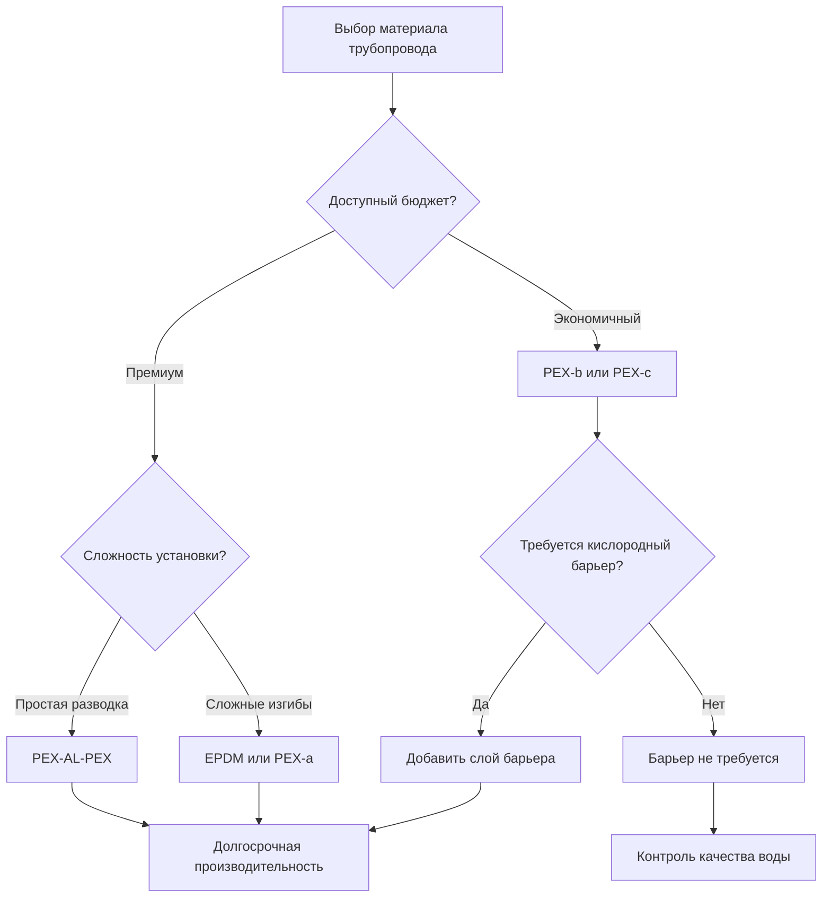
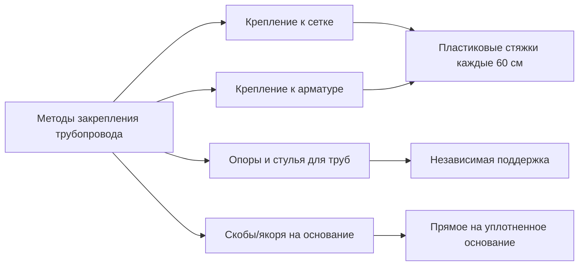
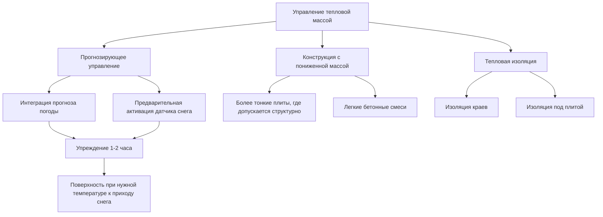

Встраиваемые системы трубопроводов образуют сеть теплопередачи для гидравлических приложений снеготаяния. Материал трубопровода, конфигурация установки и взаимодействие с тепловой массой структуры покрытия определяют производительность системы, время отклика и долгосрочную надежность. Правильный выбор материала и методика установки напрямую влияют на эффективность доставки тепла и срок службы.

## Сравнение материалов трубопровода

Два основных материала трубопровода доминируют в установках гидравлического снеготаяния: сшитый полиэтилен (PEX) и синтетический каучук этилен-пропилен-диеновый мономер (EPDM). Каждый материал имеет отличительные физические свойства, влияющие на производительность, процедуры установки и стоимость.

### Сшитый полиэтилен (PEX)

Трубопровод PEX проходит процесс молекулярного связывания, который создает трехмерные полимерные цепи, обеспечивающие превосходную механическую прочность и тепловую стабильность по сравнению со стандартным полиэтиленом. Это сшивание предотвращает плавление материала в нормальных рабочих условиях и обеспечивает отличную стойкость к циклам замораживания-оттаивания.

**Физические свойства:**
- **Теплопроводность:** $k = 1,34$ кДж/ч·м·°C
- **Максимальная рабочая температура:** 93°C постоянно
- **Минимальный радиус изгиба:** 6-8 номинальных диаметров
- **Коэффициент теплового расширения:** $\alpha = 2,0 \times 10^{-4}$ на °C
- **Проницаемость кислорода:** 0,05-0,10 г/м·день (без барьера) до <0,001 г/м·день (с кислородным барьером)

Коэффициент теплового расширения определяет изменения размеров при тепловых циклах. Для 91,4-метровой цепи, испытывающей повышение температуры на 27,8°C, рассчитайте расширение:

$$\Delta L = L_0 \cdot \alpha \cdot \Delta T = 91,4 \text{ м} \times 2,0 \times 10^{-4} \text{ на °C} \times 27,8\text{°C} = 0,51 \text{ м}$$

Это расширение происходит в бетонной матрице и требует надлежащих методик установки для предотвращения концентрации напряжений.

**Типы трубопровода PEX:**

| Тип | Структура | Кислородный барьер | Применение |
|------|-----------|----------------|--------------|
| PEX-a | Сшивание перекисью | Дополнительный слой | Наиболее гибкий, самая простая установка |
| PEX-b | Сшивание силаном | Дополнительный слой | Экономичный, умеренная гибкость |
| PEX-c | Сшивание электронным пучком | Дополнительный слой | Менее гибкий, самая низкая стоимость |
| PEX-AL-PEX | Алюминиевый сердечник | Интегральный алюминий | Лучшая защита от кислорода, сохраняет форму |

### Синтетический каучуковый трубопровод EPDM

Трубопровод EPDM состоит из синтетического каучука с отличной химической стойкостью и гибкостью. Материал демонстрирует превосходную стойкость к озону, ультрафиолетовому излучению и экстремальным температурам по сравнению с PEX.

**Физические свойства:**
- **Теплопроводность:** $k = 0,99$ кДж/ч·м·°C
- **Максимальная рабочая температура:** 121°C постоянно
- **Минимальный радиус изгиба:** 3-4 номинальных диаметра
- **Коэффициент теплового расширения:** $\alpha = 1,8 \times 10^{-4}$ на °C
- **Проницаемость кислорода:** естественно низкая, <0,005 г/м·день

Более низкая теплопроводность EPDM незначительно снижает эффективность теплопередачи по сравнению с PEX, но разница остается незначительной во встраиваемых приложениях, где тепловое сопротивление бетона доминирует над общей теплопередачей.

### Критерии выбора материала

**Факторы выбора:**

1. **Контроль проникновения кислорода:** Системы с железными компонентами требуют трубопровода с кислородным барьером для предотвращения коррозии
2. **Сложность установки:** Более узкие изгибы и препятствия благоприятствуют EPDM или PEX-a
3. **Рабочая температура:** Стандартное снеготаяние редко превышает 60°C температуру подачи
4. **Стойкость к замораживанию-оттаиванию:** Оба материала допускают расширение при образовании льда
5. **Химическая совместимость:** Проверьте совместимость со специфичными составами антифриза
6. **Стоимость:** PEX-b и PEX-c предлагают наименьшую стоимость материала

## Требования к кислородному барьеру

Диффузия кислорода в гидравлические системы ускоряет коррозию стальных котлов, теплообменников и компонентов циркулятора. Скорость проникновения кислорода подчиняется закону диффузии Фика:

$$J = -D \cdot \frac{dC}{dx}$$

Где:
- $J$ = поток диффузии (масса на площадь на время)
- $D$ = коэффициент диффузии (зависит от материала)
- $\frac{dC}{dx}$ = градиент концентрации через стенку трубопровода

Трубопровод PEX без барьера пропускает приблизительно 0,10 г кислорода на метр трубопровода в день при типичных рабочих условиях. Для 914-метровой установки:

$$Q_{O_2} = 0,10 \text{ г/м·день} \times 914 \text{ м} = 91,4 \text{ г/день}$$

Это проникновение кислорода быстро истощает ингибиторы коррозии и атакует железные компоненты. Трубопровод с кислородным барьером снижает диффузию на 95-99%, продлевая срок службы системы с лет на десятилетия.

**Методы барьера:**
- **Слой EVOH (этилен-виниловый спирт):** Экструдирован на PEX как тонкий барьерный слой
- **Алюминиевый слой:** PEX-AL-PEX использует алюминиевый сердечник толщиной 0,10-0,20 мм
- **Естественный материальный барьер:** EPDM естественно демонстрирует низкую проницаемость кислорода

## Методы установки в бетонные плиты

Установка трубопровода в бетонные плиты требует внимания к глубине размещения, методам закрепления и защиты во время заливки бетона. Конфигурация установки влияет как на эффективность теплопередачи, так и на долговечность трубопровода.

### Оптимизация глубины установки

Теплопередача от встраиваемого трубопровода к поверхности включает проводимость через бетон. Уравнение для стационарного теплового потока:

$$q = \frac{k_c}{\delta} \cdot (T_t - T_s)$$

Где:
- $q$ = тепловой поток на поверхность (кДж/ч·м²)
- $k_c$ = теплопроводность бетона ≈ 5,81 кДж/ч·м·°C
- $\delta$ = глубина от центра трубопровода до поверхности (м)
- $T_t$ = температура поверхности трубопровода (°C)
- $T_s$ = температура поверхности плиты (°C)

Для 10,2-сантиметровой бетонной плиты с трубопроводом на середине глубины (5,1 см ниже поверхности):

$$q = \frac{5,81 \text{ кДж/ч·м·°C}}{0,051 \text{ м}} \cdot (T_t - T_s) = 113,9 \cdot (T_t - T_s)$$

Размещение трубопровода ближе к поверхности увеличивает тепловой поток при заданной разнице температур, но снижает защиту от поверхностных нагрузок и повреждений при тепловых циклах.

**Рекомендации по глубине:**

| Толщина плиты | Глубина трубопровода | Причина |
|----------------|--------------|-----------|
| 7,6 см | 3,8 см | Минимальная практическая глубина |
| 10,2 см | 5,1 см | Стандартная жилая установка |
| 12,7 см | 6,4 см | Коммерческая легкая нагрузка |
| 15,2 см | 6,4-7,6 см | Коммерческая тяжелая нагрузка |
| 20+ см | 7,6-10 см | Промышленная, используйте тепловое моделирование |

Размещение трубопровода точно в середине глубины оптимизирует баланс между доставкой поверхностного тепла и защитой от механических повреждений. Более толстые плиты выигрывают от размещения немного выше середины глубины (в верхней трети), чтобы снизить тепловое сопротивление до поверхности.

### Методы закрепления

**Установка с проволочной сеткой:**
1. Поместите сварную проволочную сетку на опоры на указанной высоте
2. Закрепите трубопровод к сетке пластиковыми кабельными стяжками с интервалом 45-60 см
3. Избегайте металлических крепежей, которые создают тепловые мосты и потенциальные точки утечки
4. Поддерживайте минимальный зазор 7,6 см от краев плиты

**Установка с сеткой арматуры:**
1. Установите сетку арматуры в соответствии со структурными требованиями
2. Закрепите трубопровод пластиковой проволокой с полимерным покрытием или пластиковыми стяжками
3. Расположите трубопровод, чтобы избежать помех на пересечениях арматуры
4. Согласуйте разводку трубопровода с размещением структурного армирования

**Преимущества метода опор/стульев:**
- Независимость от структурного армирования
- Точный контроль глубины
- Сокращает смещение бетона во время укладки
- Подходит для установок на больших площадях

### Защита во время заливки бетона

Повреждение трубопровода во время заливки бетона является причиной значительных отказов установки. Реализуйте протоколы защиты:

**Испытание давлением перед заливкой:**
1. Испытайте все цепи под давлением 690 кПа
2. Поддерживайте давление во время заливки бетона
3. Непрерывно следите за манометрами на предмет внезапных падений, указывающих на повреждение
4. Документируйте давление до, во время и после заливки

**Процедуры заливки:**
1. Направляйте поток бетона, чтобы избежать прямого удара по трубопроводу
2. Используйте низкослюдистый бетон (7,6-10,2 см слюда) для снижения расслоения
3. Избегайте механических вибраторов, непосредственно контактирующих с трубопроводом
4. Распределяйте бетон равномерно, чтобы предотвратить смещение трубопровода
5. Поддерживайте минимальное 3,8-сантиметровое покрытие бетона над трубопроводом

**Проверка после заливки:**
1. Поддерживайте испытательное давление в течение 24 часов после отделки
2. Проведите испытание потока перед запуском системы
3. Задокументируйте окончательное давление и измерения потока
4. Отверждайте бетон в соответствии с рекомендациями ACI (минимум 7 дней влажное отверждение)

## Эффекты тепловой массы и отклик системы

Тепловая масса бетонных плит существенно влияет на время отклика системы снеготаяния и потребление энергии. Тепловые свойства бетона создают как преимущества, так и ограничения по сравнению с низкомассовыми системами.

### Расчет тепловой массы

Тепловая масса бетона определяет энергию, необходимую для приведения системы в рабочее состояние:

$$Q_{mass} = m \cdot c_p \cdot \Delta T$$

Где:
- $Q_{mass}$ = энергия для нагрева бетонной массы (кДж)
- $m$ = масса бетона (кг)
- $c_p$ = удельная теплоемкость бетона ≈ 0,84 кДж/кг·°C
- $\Delta T$ = повышение температуры (°C)

Для плиты 929 м², толщиной 10,2 см, нагреваемой с 0°C до 4,4°C:

$$m = 929 \text{ м}^2 \times 0,102 \text{ м} \times 2400 \text{ кг/м}^3 = 22{,}709 \text{ кг}$$

$$Q_{mass} = 22{,}709 \text{ кг} \times 0,84 \text{ кДж/кг·°C} \times 4,4\text{°C} = 84{,}505 \text{ кДж}$$

Это представляет энергию, поглощаемую бетоном перед значительным нагревом поверхности. При вводе тепла 116,2 кДж/ч, прогрев требует почти один час, прежде чем начнется эффективное снеготаяние.

### Анализ времени отклика

Нестационарная теплопередача в бетонных плитах подчиняется уравнению диффузии:

$$\frac{\partial T}{\partial t} = \alpha \cdot \nabla^2 T$$

Где $\alpha$ — коэффициент теплопроводности:

$$\alpha = \frac{k}{\rho \cdot c_p} = \frac{5,81 \text{ кДж/ч·м·°C}}{2400 \text{ кг/м}^3 \times 0,84 \text{ кДж/кг·°C}} = 0,003 \text{ м}^2\text{/ч}$$

Характерное время распространения тепла на расстояние $\delta$:

$$t_{response} \approx \frac{\delta^2}{\alpha}$$

Для трубопровода 5,1 см ниже поверхности:

$$t_{response} \approx \frac{(0,051 \text{ м})^2}{0,003 \text{ м}^2\text{/ч}} = 0,87 \text{ часа} \approx 52 \text{ минуты}$$

Это теоретический минимум демонстрирует, почему высокомассовые системы требуют прогнозирующего управления, которое активируется перед снежными событиями, а не реактивной работы.

### Стратегии управления тепловой массой

**Преимущества высокой тепловой массы:**
- Емкость теплового аккумулирования позволяет прерывистую работу источника тепла
- Стабильность температуры снижает частоту циклирования
- Остаточное тепло продолжает плавить после остановки ввода тепла
- Сниженные колебания поверхностной температуры

**Недостатки высокой тепловой массы:**
- Продленный период прогрева (1-3 часа типичные)
- Более высокое потребление энергии при запуске
- Требует стратегии прогнозирующего управления
- Увеличенная рабочая стоимость для прерывистых снежных событий

**Эффекты изоляции краев и под плитой:**

Установка жесткой изоляции по периметру плиты и под плитой снижает потери тепла вниз и на края, направляя больше энергии на поверхность. Для 10,2-сантиметровой плиты с 5,1-сантиметровой экструдированный полистиролом (R-1,76) изоляцией под плитой:

**Снижение потери тепла:** 30-50% по сравнению с неизолированной установкой
**Улучшенное время отклика:** 15-25% более быстрое нагревание поверхности
**Экономия энергии:** 20-40% за сезон отопления

Рассчитайте сетевое тепловое сопротивление:

$$R_{total} = R_{insulation} + R_{concrete} + R_{surface}$$

$$R_{total} = 1,76 + \frac{0,102 \text{ м}}{5,81 \text{ кДж/ч·м·°C}} + 0,12 = 1,92 \text{ ч·м}^2\text{·°C/кДж}$$

Изоляция доминирует над тепловым сопротивлением, вынуждая поток тепла вверх к поверхности, а не вниз в землю.

## Спецификации установки

**Параметры проектирования цепи трубопровода:**

| Параметр | Спецификация | Примечания |
|-----------|--------------|-------|
| Максимальная длина цепи | 91,4 м (12,7 мм), 121,9 м (19,1 мм) | Ограничивает перепад давления <103 кПа |
| Шаг трубопровода | 15-30 см по центрам | Согласно требованиям теплового потока ASHRAE |
| Минимальный радиус изгиба | 6× диаметра (PEX), 3× диаметра (EPDM) | Предотвращает перегибание |
| Петли расширения | Не требуются | Бетон удерживает трубопровод |
| Испытание давлением | 690 кПа в течение 24 часов | До и во время заливки бетона |
| Максимальная скорость жидкости | 1,2 м/сек | Ограничивает эрозию и шум |

**Спецификации бетона:**
- **Минимальная прочность на сжатие:** 20,7 МПа на 28 дней
- **Максимальный размер заполнителя:** 19 мм
- **Вовлечение воздуха:** 5-8% для стойкости к замораживанию-оттаиванию
- **Осадка:** 7,6-12,7 см для надлежащей консолидации
- **Отношение вода-цемент:** <0,50 для долговечности

**Процедуры контроля качества:**
1. Проверьте глубину трубопровода перед заливкой бетона, используя измерительные устройства
2. Сфотографируйте разводку трубопровода с размерными ориентирами
3. Задокументируйте длины цепей и скорости потока
4. Запишите результаты испытания давления на множественных стадиях
5. Проведите инфракрасную термографию после запуска для проверки равномерного распределения тепла

## Стандарты проектирования и ссылки

Проектирование и установка системы снеготаяния следуют установленным инженерным стандартам:

- **ASHRAE Handbook—HVAC Applications, Chapter 51:** Всеобъемлющая методология проектирования снеготаяния, включая расчеты теплового потока, разводки трубопроводов и процедуры теплового анализа
- **ASTM F876/F877:** Стандартные спецификации для трубопровода и фитингов сшитого полиэтилена (PEX)
- **ASTM D4976:** Стандартная спецификация для пластмасс полиэтилена для формирования и экструзии материалов
- **ACI 332:** Руководство по жилому бетону для приложений снеготаяния
- **PPI TR-4:** Технический отчет по трубопроводу PEX для приложений гидравлического отопления

Соблюдение этих стандартов обеспечивает правильный выбор материала, качество установки и долгосрочную производительность системы в приложениях снеготаяния.

---

**Файл:** /Users/evgenygantman/Documents/github/gantmane/hvac/content/specialty-applications-testing/specialty-hvac-applications/snow-melting-freeze-protection-systems/hydronic-snow-melting/embedded-tubing-systems/_index.md

**Ключевые технические моменты:**
- Трубопровод PEX демонстрирует теплопроводность k = 1,34 кДж/ч·м·°C с коэффициентом теплового расширения α = 2,0×10⁻⁴ на °C
- EPDM демонстрирует превосходную гибкость (радиус изгиба 3-4× диаметра против 6-8× для PEX) и естественные свойства кислородного барьера
- Оптимальная глубина трубопровода размещает центр на середине глубины плиты; для 10,2-сантиметровой плиты расположите в 5,1 см ниже поверхности
- Тепловая масса бетона требует приблизительно 84 505 кДж для повышения 929 м² × 10,2-сантиметровой плиты на 4,4°C
- Время отклика системы приблизительно 52 минуты для распространения тепла с 5,1-сантиметровой глубины к поверхности (коэффициент теплопроводности α = 0,003 м²/ч)
- Трубопровод с кислородным барьером снижает проникновение кислорода на 95-99%, критично для систем с железными компонентами
- Изоляция под плитой (R-1,76) снижает потери тепла на 30-50% и улучшает время отклика на 15-25%
