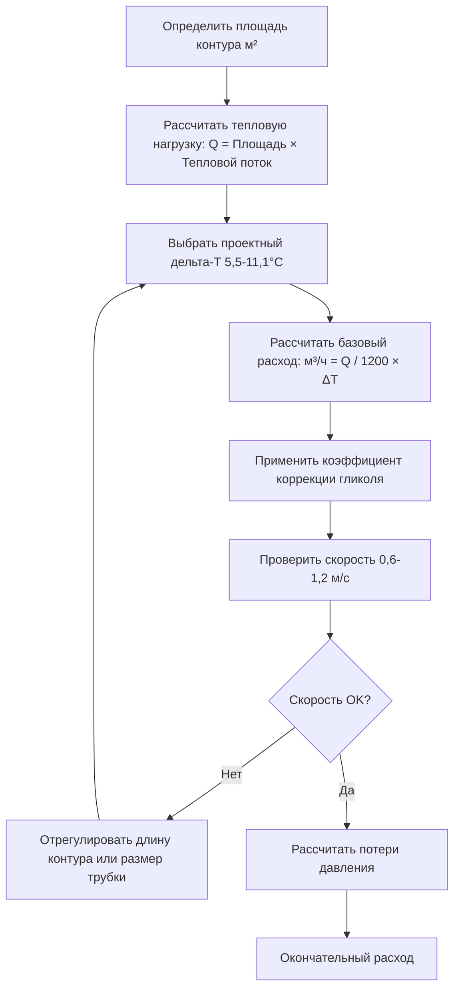
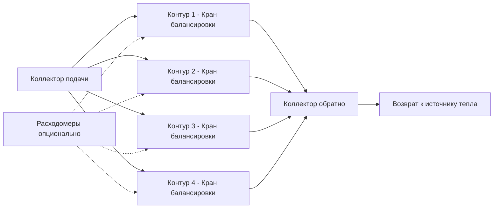

Определение расходов теплоносителя представляет критический параметр проектирования для систем гидравлического снеготаяния, прямо влияющий на эффективность теплопередачи, энергопотребление насосов и надежность системы. Правильные расчеты расходов должны учитывать требования к тепловому потоку, свойства жидкости, геометрию контуров и гидравлические ограничения для достижения равномерной температуры поверхности при минимизации операционных затрат.

## Фундаментальное уравнение расхода

Расход получается из первого закона термодинамики, применяемого к теплоносителю, циркулирующему через встроенные трубки. Уравнение энергетического баланса связывает объемный расход с тепловыделением и изменением температуры:

$$\dot{Q} = \dot{m} \cdot c_p \cdot \Delta T = \rho \cdot \dot{V} \cdot c_p \cdot \Delta T$$

Где:
- $\dot{Q}$ = скорость теплопередачи (кДж/ч)
- $\dot{m}$ = массовый расход (кг/ч)
- $c_p$ = удельная теплоемкость (кДж/кг·°C)
- $\Delta T$ = разность температур подачи и обратно (°C)
- $\rho$ = плотность жидкости (кг/м³)
- $\dot{V}$ = объемный расход (м³/ч)

Преобразование в практические единицы с учетом свойств воды ($\rho \cdot c_p \approx 1200$ кДж/м³·°C):

$$\text{м³/ч} = \frac{\dot{Q}}{1200 \cdot \Delta T}$$

Эта упрощенная форма применяется к чистой воде. Растворы гликоля требуют коэффициентов коррекции в зависимости от концентрации и температуры.

## Выбор дельта-Т

Падение температуры через каждый контур влияет на требуемые расходы, размер насоса и равномерность температуры поверхности. Выбор дельта-Т включает балансировку конкурирующих целей:

### Диапазон проектного дельта-Т

**Низкое дельта-Т (5,5-8,3°C):**
- Обеспечивает превосходную равномерность температуры поверхности
- Снижает вариацию температуры между входом и выходом контура
- Требует более высоких расходов и повышенной мощности насоса
- Минимизирует тепловые напряжения в покрытии
- Предпочтительно для критичных приложений (входы в больницы, мосты)

**Среднее дельта-Т (8,3-11,1°C):**
- Стандартный диапазон проектирования для большинства приложений
- Балансирует производительность и энергопотребление
- Приемлемая равномерность температуры для коммерческих установок
- Снижает размер насоса по сравнению с низкодельта-Т проектами

**Высокое дельта-Т (11,1-16,7°C):**
- Минимизирует расход и энергопотребление насоса
- Увеличивает вариацию температуры поверхности
- Может создавать видимые полосы или холодные пятна
- Риск недостаточной теплопередачи в конце контура
- Обычно избегается, кроме проектов с ограниченным бюджетом

### Анализ равномерности температуры

Вариация температуры поверхности вдоль контура результирует из прогрессирующего охлаждения жидкости. Для змеевидной компоновки трубок с постоянным извлечением тепла:

$$T_{\text{жидкость}}(x) = T_{\text{подача}} - \frac{\dot{q} \cdot A(x)}{\dot{m} \cdot c_p}$$

Где $A(x)$ представляет площадь поверхности, обслуживаемую от входа до позиции $x$. Это линейное падение температуры жидкости вызывает соответствующие градиенты температуры поверхности. Ограничение дельта-Т до 8,3-11,1°C обычно поддерживает вариацию температуры поверхности в пределах 2,8-5,6°C, приемлемую для большинства приложений.

## Расчет расхода на контур

Рассчитайте расход для каждого контура трубок на основе обслуживаемой площади, проектного теплового потока и выбранного дельта-Т:

### Процедура расчета

### Пример расчета

**Дано:**
- Площадь контура: 37,2 м²
- Проектный тепловой поток: 632 Вт/м²
- Дельта-Т: 8,3°C
- Теплоноситель: 30% пропиленгликоль

**Решение:**

Общая тепловая нагрузка:
$$\dot{Q} = 37{,}2 \text{ м}^2 \times 632 \text{ Вт/м}^2 = 23{,}510 \text{ Вт} = 23{,}51 \text{ кВт} = 84{,}638 \text{ кДж/ч}$$

Базовый расход (вода):
$$\text{м³/ч}_{\text{вода}} = \frac{84{,}638}{1200 \times 8{,}3} = 8{,}47 \text{ м³/ч}$$

Коэффициент коррекции гликоля (30% пропиленгликоль при 43°C ≈ 1,08):
$$\text{м³/ч}_{\text{гликоль}} = 8{,}47 \times 1{,}08 = 9{,}15 \text{ м³/ч}$$

## Число Рейнольдса и режим потока

Режим потока значительно влияет на эффективность теплопередачи. Турбулентный поток обеспечивает превосходную конвективную теплопередачу по сравнению с ламинарным потоком через встроенное смешивание и нарушение пограничного слоя.

### Определение числа Рейнольдса

$$\text{Re} = \frac{\rho \cdot v \cdot D}{\mu} = \frac{v \cdot D}{\nu}$$

Где:
- $\rho$ = плотность жидкости (кг/м³)
- $v$ = скорость потока (м/с)
- $D$ = внутренний диаметр трубки (м)
- $\mu$ = динамическая вязкость (Па·с)
- $\nu$ = кинематическая вязкость (м²/с)

### Критерии режима потока

| Число Рейнольдса | Режим потока | Теплопередача | Руководство по проектированию |
|-----------------|-------------|---------------|-----------------|
| Re < 2 300 | Ламинарный | Плохая, избегать | Увеличить расход или уменьшить размер трубки |
| 2 300 < Re < 4 000 | Переходной | Нестабильный | Запас проектирования, не рекомендуется |
| Re > 4 000 | Турбулентный | Отличная | Целевой диапазон проектирования |
| Re > 10 000 | Полностью турбулентный | Оптимальный | Предпочтительно для критичных приложений |

### Требования к скорости

Поддерживайте скорость жидкости 0,6-1,2 м/с во встроенных трубках для обеспечения турбулентного потока:

$$v = \frac{Q}{A} = \frac{1274 \cdot \text{м³/ч}}{D_{\text{вн}}^2}$$

Где $D_{\text{вн}}$ — внутренний диаметр в см.

**Пределы скорости по размерам трубок:**

| Размер трубки | Внутренний диаметр | Расход для 0,6 м/с | Расход для 1,2 м/с |
|-------------|-----------------|---------------------|---------------------|
| 12,7 мм | 12,1 мм | 0,51 м³/ч | 1,03 м³/ч |
| 15,9 мм | 14,6 мм | 0,74 м³/ч | 1,48 м³/ч |
| 19,1 мм | 17,0 мм | 1,03 м³/ч | 2,06 м³/ч |
| 25,4 мм | 22,0 мм | 1,71 м³/ч | 3,43 м³/ч |

### Воздействие гликоля на число Рейнольдса

Пропиленгликоль увеличивает вязкость жидкости, снижая число Рейнольдса для данной скорости. При концентрации 40% гликоля и 37,8°C вязкость увеличивается примерно в 2,5 раза по сравнению с водой, требуя более высоких скоростей для поддержания турбулентного потока.

Учитывайте сниженное число Рейнольдса следующим образом:
1. Увеличьте проектную скорость до 0,9-1,5 м/с для систем с гликолем
2. Выберите трубки большего диаметра для снижения потерь давления
3. Ограничьте длины контуров для поддержания приемлемых потерь давления
4. Проверьте турбулентный поток при минимальной рабочей температуре (максимальная вязкость)

## Методология балансировки контуров

Несколько параллельных контуров требуют балансировки для обеспечения равномерного распределения потока и равномерного теплопередачи по площади снеготаяния.

### Подходы к балансировке

**Ручные краны балансировки:**
- Установите на обратной стороне каждого контура
- Отрегулируйте для выравнивания расхода согласно расчетам проектирования
- Измеряйте перепад давления на каждом контуре во время пусконаладки
- Рассчитывайте расход из перепада давления и характеристик контура

**Коллекторы с интегрированными расходомерами:**
- Прямое указание расхода для каждого контура
- Упрощает процедуру балансировки
- Позволяет непрерывный мониторинг и регулировку
- Более высокие начальные затраты, превосходная долгосрочная производительность

### Расчет балансировки

Для контуров равной длины с идентичным размером трубок и расстояниями, расход распределяется пропорционально перепаду давления:

$$\frac{\text{м³/ч}_1}{\text{м³/ч}_2} = \sqrt{\frac{\Delta P_1}{\Delta P_2}}$$

Отрегулируйте краны балансировки для создания дополнительного перепада давления в контурах с естественно более низким сопротивлением, выравнивая общий перепад давления на все контуры.

## Расчеты потерь давления

Общие потери давления определяют требуемый напор насоса и влияют на эффективность системы. Потери давления возникают во встроенных контурах трубок, коллекторах, теплообменниках и соединительных трубопроводах.

### Потери давления в контурах трубок

Уравнение Дарси-Вайсбаха для потерь на трение в круглых трубопроводах:

$$\Delta P = f \cdot \frac{L}{D} \cdot \frac{\rho \cdot v^2}{2}$$

Где:
- $f$ = коэффициент трения Дарси (безразмерный)
- $L$ = длина контура (м)
- $D$ = внутренний диаметр (м)
- $\rho$ = плотность жидкости (кг/м³)
- $v$ = скорость потока (м/с)

Для турбулентного потока коэффициент трения зависит от числа Рейнольдса и относительной шероховатости. Трубки PEX демонстрируют поведение гладких труб, позволяя использование корреляции Блазиуса для турбулентного потока:

$$f = \frac{0{,}316}{\text{Re}^{0{,}25}} \quad \text{для } 3{,}000 < \text{Re} < 100{,}000$$

### Практическая оценка потерь давления

Для предварительного определения размеров используйте упрощенные потери давления на 30 м:

| Размер трубки | Расход | Потери давления (кПа/30 м) |
|-------------|-----------|----------------------------------|
| 12,7 мм | 0,57 м³/ч | 24,1 |
| 12,7 мм | 1,14 м³/ч | 82,7 |
| 15,9 мм | 1,14 м³/ч | 34,5 |
| 15,9 мм | 1,70 м³/ч | 72,4 |
| 19,1 мм | 1,70 м³/ч | 31,0 |
| 19,1 мм | 2,27 м³/ч | 51,7 |
| 25,4 мм | 2,84 м³/ч | 27,6 |
| 25,4 мм | 3,41 м³/ч | 37,9 |

Эти значения применяются к воде при 43°C. Умножьте на 1,3-1,8 для растворов гликоля в зависимости от концентрации.

### Общие потери давления системы

Суммируйте потери давления из всех компонентов в самом длинном гидравлическом пути:

$$\Delta P_{\text{всего}} = \Delta P_{\text{контур}} + \Delta P_{\text{коллектор}} + \Delta P_{\text{ТО}} + \Delta P_{\text{трубопровод}} + \Delta P_{\text{фитинги}}$$

## Требования к напору насоса

Выберите циркуляционные насосы для преодоления общих потерь давления системы при подаче проектного расхода. Выразите напор насоса в метрах водяного столба эквивалента.

### Процедура выбора насоса

1. **Рассчитайте проектный расход** для всей системы (сумма всех контуров)
2. **Определите критичный контур** (самый длинный путь, максимальные потери давления)
3. **Рассчитайте общие потери давления** включая все компоненты
4. **Добавьте коэффициент безопасности** (15-25%) для учета старения, загрязнения и неопределенностей расчета
5. **Выберите насос** с пропускной способностью в пересечении проектного расхода и напора на кривой насоса

### Уравнение напора насоса

$$H_{\text{насос}} = \frac{\Delta P_{\text{всего}}}{\rho \cdot g} \times 1{,}2$$

Где множитель 1,2 обеспечивает 20% запас безопасности.

### Насосы переменной скорости

Циркуляторы переменной скорости предлагают значительные преимущества:
- Снижают энергопотребление при частичных нагрузках
- Поддерживают постоянный перепад давления на коллекторах
- Автоматически компенсируют изменения сопротивления системы
- Позволяют выбрать более низкий начальный напор насоса с способностью увеличения при необходимости

Проектируйте системы переменной скорости на 75% от максимального расчетного расхода, позволяя скорости насоса модулироваться согласно фактическому спросу.

## Рекомендации по проектированию

**Проектирование расходов:**
- Целевая скорость 0,75-1,05 м/с во встроенных трубках
- Ограничьте дельта-Т до 8,3-11,1°C для коммерческих приложений
- Проверьте турбулентный поток (Re > 4 000) при минимальной рабочей температуре
- Рассчитайте коэффициенты коррекции гликоля при проектных рабочих условиях

**Проектирование контуров:**
- Максимальная длина контура 90-120 м для трубок 12,7 мм
- Выравняйте длины контуров в пределах 10% для упрощенной балансировки
- Установите краны балансировки на все контуры
- Предусмотрите испытательные порты давления/температуры на коллекторах

**Выбор насоса:**
- Выберите для 120% от расчетных потерь давления
- Выберите насосы с плоскими кривыми эффективности в диапазоне рабочей области
- Рассмотрите приводы переменной скорости для систем >5,7 м³/ч
- Проверьте адекватный NPSH (чистый положительный напор всасывания) при рабочей температуре

## Справочные стандарты ASHRAE

ASHRAE Handbook—HVAC Applications, Глава 51 (Snow Melting and Freeze Protection) предоставляет:
- Методология расчета расходов
- Данные свойств растворов гликоля и коэффициенты коррекции
- Таблицы потерь давления для различных размеров трубок и расходов
- Критерии выбора насосов и рекомендации по эффективности

ASHRAE Handbook—Fundamentals, Глава 3 (Fluid Flow) охватывает:
- Расчеты чисел Рейнольдса и определение режима потока
- Корреляции коэффициента трения для гладких и шероховатых труб
- Уравнения потерь давления для трубопроводных сетей
- Законы подобия насосов и анализ кривой системы

---

**Файл:** /Users/evgenygantman/Documents/github/gantmane/hvac/content/specialty-applications-testing/specialty-hvac-applications/snow-melting-freeze-protection-systems/hydronic-snow-melting/flow-rates/_index.md

**Ключевые инженерные точки:**
- Уравнение расхода: м³/ч = Q / (1200 × ΔT) с применяемыми коэффициентами коррекции гликоля
- Проектный дельта-Т обычно 8,3-11,1°C, балансируя равномерность и энергию насоса
- Поддерживайте скорость 0,6-1,2 м/с, обеспечивая число Рейнольдса >4 000 для турбулентного потока
- Балансировка контуров через ручные краны или коллекторы с интегрированными расходомерами
- Общий напор насоса включает контуры трубок, коллекторы, теплообменники и коэффициент безопасности 20%
