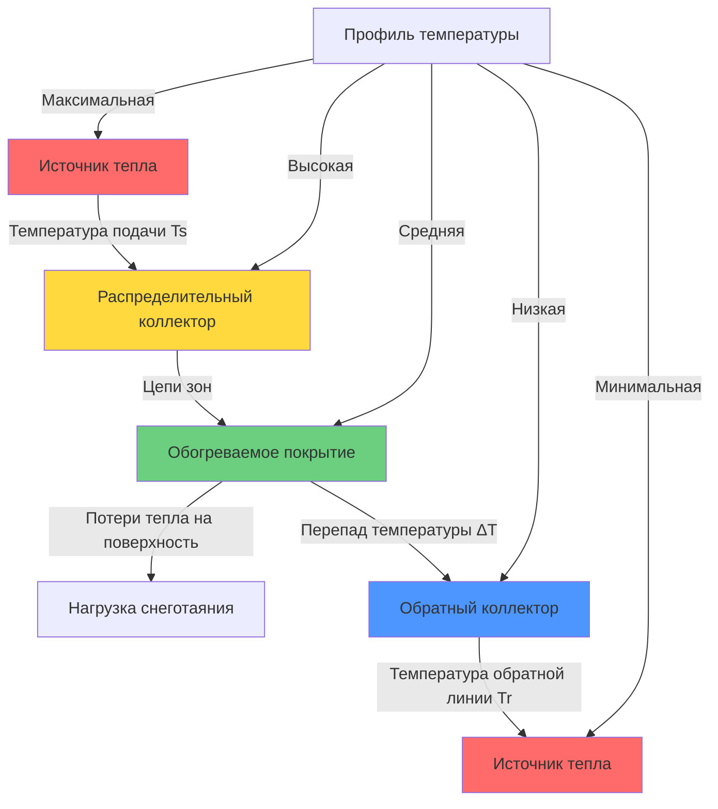

## Основы проектирования температуры жидкости

Выбор температуры жидкости в гидронических системах снеготаяния напрямую определяет мощность теплопередачи, потребление энергии и надежность системы. Температурный перепад между подачей и обратной линией определяет скорость теплоснабжения при заданном расходе в соответствии с фундаментальными принципами теплопередачи.

Теплопередача от жидкости к поверхности покрытия происходит через три последовательных теплового сопротивления: конвективная передача от жидкости к внутренней поверхности трубопровода, кондукция через стенку трубопровода и кондукция через покрытие к поверхности. Более высокие температуры жидкости увеличивают движущую силу теплопередачи через эти сопротивления.

## Расчеты теплопередачи

Теплота, передаваемая гидронической жидкостью, следует уравнению явного тепла:

$$Q = \dot{m} c_p (T_s - T_r)$$

Где:
- $Q$ = скорость теплопередачи (кДж/ч или Вт)
- $\dot{m}$ = массовый расход (кг/ч или кг/с)
- $c_p$ = удельная теплоемкость жидкости (кДж/кг-K)
- $T_s$ = температура подачи жидкости (°C)
- $T_r$ = температура обратной линии жидкости (°C)

Для объемных расходов это преобразуется в:

$$Q = \dot{V} \rho c_p \Delta T$$

Где $\dot{V}$ — объемный расход, а $\rho$ — плотность жидкости. Для воды при стандартных условиях это упрощается до:

$$Q \text{ (кДж/ч)} = 1.163 \times \text{м³/ч} \times \Delta T \text{ (°C)}$$

$$Q \text{ (кВт)} = 1.163 \times \text{м³/ч} \times \Delta T \text{ (°C)} / 3.6$$

Требуемая температура подачи зависит от расчетной нагрузки снеготаяния, расстояния между трубами, глубины заделки и коэффициента теплопроводности покрытия:

$$T_s = T_{surf} + \frac{q_{sm}}{U_{eff}}$$

Где:
- $T_{surf}$ = температура поверхности покрытия во время таяния (обычно 0-2°C)
- $q_{sm}$ = расчетный тепловой поток снеготаяния (Вт/м²)
- $U_{eff}$ = эффективный коэффициент теплопередачи от жидкости к поверхности

## Анализ профиля температуры

Жидкость достигает максимальной температуры на выходе источника тепла и минимальной температуры на обратном коллекторе после прохождения всех длин цепей. Температурная стратификация внутри покрытия создает температурный градиент от глубины трубы до поверхности.

## Критерии температуры подачи и обратной линии

Температура жидкости на подаче должна удовлетворять двум основным требованиям:

1. **Доставка теплового потока**: Достаточный температурный перепад между жидкостью и поверхностью покрытия для передачи расчетной нагрузки снеготаяния
2. **Защита от замерзания**: Температура, поддерживаемая выше точки замерзания во всей системе, включая самые длинные цепи при расчетных расходах

ASHRAE рекомендует температуры подачи от 35°C до 60°C для большинства приложений. Более высокие температуры обеспечивают:

- Уменьшенное расстояние между трубами при заданной мощности теплопередачи
- Более быстрое реагирование на снеготаяние
- Более низкие требуемые расходы
- Меньший диаметр трубопровода

Однако чрезмерные температуры создают тепловой стресс в покрытии, увеличивают потери тепла от распределительного трубопровода и снижают эффективность источника тепла.

Проектирование температуры обратной линии балансирует эффективность системы против первоначальной стоимости:

- Больший $\Delta T$ (11-17°C): Пониженный расход, меньшие размеры трубопровода, более низкая энергия для насоса
- Меньший $\Delta T$ (6-8°C): Более равномерная температура поверхности, уменьшенное изменение расстояния между трубами

## Сравнение температуры по типам источника тепла

| Тип источника тепла | Типичная температура подачи | Температура обратной линии | Перепад T | Тип жидкости | Примечания |
|-------------------|------------------------------|---------------------------|-----------|------------|-----------|
| Газовый котел | 49-71°C | 38-54°C | 11-17°C | Вода или гликоль | Высокая температурная способность |
| Конденсационный котел | 35-60°C | 24-43°C | 11-17°C | Вода или гликоль | Оптимизирован для низких обратных температур |
| Тепловой насос | 35-49°C | 27-40°C | 8-11°C | Вода или гликоль | Температура ограничена хладагентом |
| Солнечная тепловая система | 38-54°C | 27-43°C | 11-17°C | Требуется гликоль | Варьируется в зависимости от солнечной радиации |
| Геотермальная система | 32-43°C | 21-32°C | 8-14°C | Вода или гликоль | Более низкий температурный перепад |
| Электрический котел | 43-66°C | 32-49°C | 11-17°C | Вода или гликоль | Точное регулирование температуры |
| Утилизация отходящего тепла | 38-60°C | 27-43°C | 11-17°C | Зависит от источника | Температура варьируется в зависимости от источника |

## Эффекты растворов гликоля

Растворы антифриза на основе гликоля изменяют тепловые свойства жидкости:

**Пропиленгликоль при концентрации 30%:**
- Удельная теплоемкость: на 15% ниже, чем у воды
- Плотность: на 3% выше, чем у воды
- Вязкость: в 2-3 раза выше, чем у воды
- Точка замерзания: -23°C

Эти изменения свойств требуют более высоких расходов (примерно на 15-20% больше) для обеспечения эквивалентной теплопередачи. Мощность насоса значительно возрастает из-за повышенной вязкости, особенно при более низких температурах.

Модифицированное уравнение теплопередачи для растворов гликоля:

$$Q = 1.163 \times \text{м³/ч} \times \Delta T \times \text{UO} \times \frac{c_{p,glycol}}{c_{p,water}}$$

Где UO — удельный вес раствора гликоля.

## Выбор расчетной температуры

Процесс выбора температуры подачи:

1. Рассчитать расчетный тепловой поток снеготаяния по методологии ASHRAE
2. Определить требуемую скорость теплопередачи от поверхности к окружающей среде
3. Установить расстояние между трубами и глубину заделки на основе ограничений установки
4. Рассчитать требуемую среднюю температуру жидкости, используя сетку теплового сопротивления
5. Добавить коэффициент безопасности (обычно 6-8°C) для времени отклика и изменения нагрузки
6. Выбрать температуру подачи с учетом ограничений источника тепла

Температура обратной линии является результатом расчетного расхода и температуры подачи, ограниченная максимальным допустимым перепадом давления в цепи и минимальной скоростью для удаления воздуха (обычно 0.6-0.9 м/с).

Оптимальное проектирование достигает баланса между стоимостью капитала (на которую влияют расстояние между трубами, диаметр трубопровода и размер источника тепла) и стоимостью эксплуатации (на которую влияют температура подачи, мощность насоса и эффективность источника тепла).

## Операционные соображения

Стратегии регулирования температуры жидкости включают:

- **Постоянная температура подачи**: Самое простое регулирование, варьирует расход в зависимости от спроса
- **Наружный сброс**: Снижает температуру подачи во время более мягких условий для повышения эффективности
- **Модулирующее регулирование**: Регулирует как температуру, так и расход в зависимости от датчиков обнаружения снега и покрытия

Более низкие температуры обратной линии улучшают эффективность конденсационного котла за счет конденсации дымовых газов и восстановления скрытого тепла. Целевые температуры обратной линии ниже 54°C максимизируют работу в режиме конденсации.

Смесительные клапаны предотвращают чрезмерно высокие температуры подачи при запуске или при низких нагрузках, защищая покрытие от теплового удара и снижая потери из-за испарения с поверхности.
