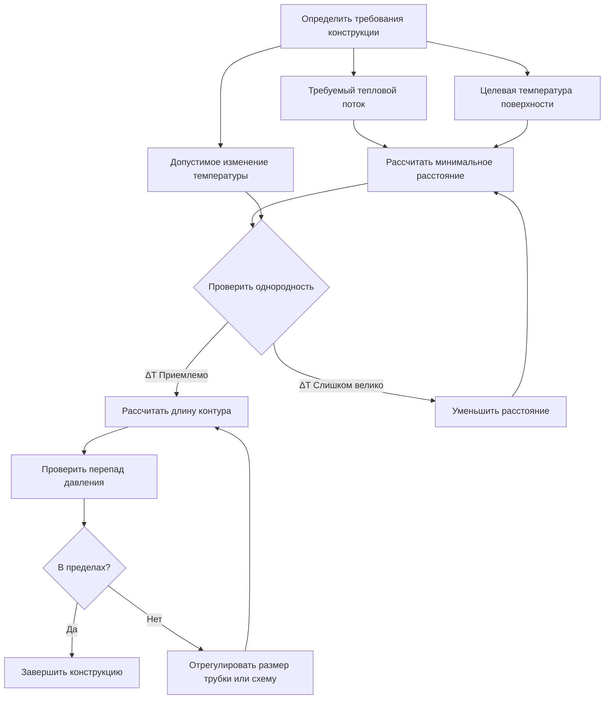
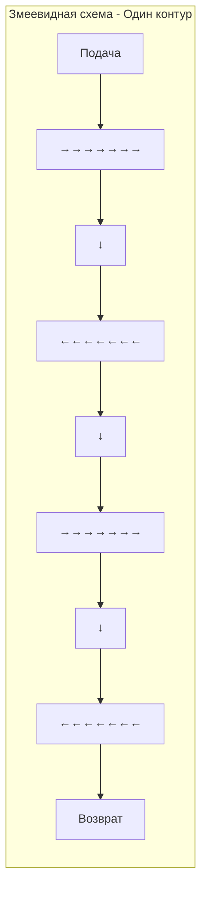
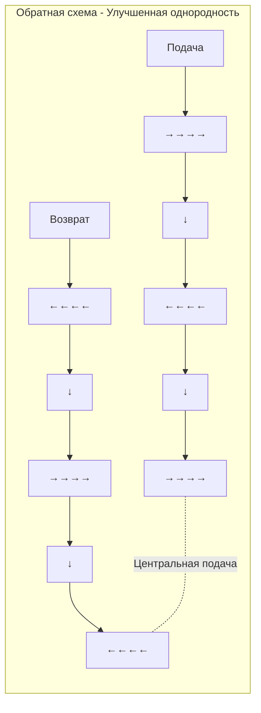

Расстояние между трубками представляет собой фундаментальный параметр конструкции, определяющий производительность системы гидравлического таяния снега. Расстояние между соседними трубопроводами контролирует распределение температуры поверхности, общую емкость теплоотдачи, стоимость установки и однородность температуры. Надлежащее конструирование расстояния уравновешивает требования к тепловой производительности с экономическими ограничениями, обеспечивая полное таяние снега и льда по всей поверхности.

## Основы теплопередачи

Тепло передается от встроенных трубок через конструкцию покрытия к поверхности посредством теплопроводности. Распределение температуры в плите зависит от расстояния между трубками, теплопроводности плиты, глубины трубки и температуры жидкости. Поверхность проявляет максимальную температуру прямо над каждой трубкой и минимальную температуру в точке, расположенной посередине между соседними трубками.

### Физика профиля температуры

Для горизонтальной плоскости, содержащей несколько источников тепла (трубки), температурное поле можно аппроксимировать с помощью суперпозиции эффектов отдельных трубок. В любой точке поверхности температура является результатом вклада всех близлежащих трубок, где более близкие трубки вносят пропорционально большее количество тепла.

Разница температур в установившемся режиме между точкой поверхности непосредственно над трубкой ($T_{max}$) и точкой между трубками ($T_{min}$) зависит от расстояния:

$$\Delta T_{surface} = T_{max} - T_{min} = \frac{q \cdot s}{2k_{eff}} \cdot f(d, s)$$

Где:
- $\Delta T_{surface}$ = изменение поверхностной температуры (°C)
- $q$ = тепловой поток на единицу площади (кДж/ч·м²)
- $s$ = расстояние между трубками (м)
- $k_{eff}$ = эффективная теплопроводность покрытия (кДж/ч·м·°C)
- $f(d, s)$ = геометрическая функция, учитывающая глубину трубки $d$ и расстояние $s$

Эта взаимосвязь показывает, что изменение поверхностной температуры увеличивается линейно с расстоянием и уменьшается при более высокой теплопроводности. Превосходная теплопроводность бетона (50-70 кДж/ч·м·°C) по сравнению с асфальтом (23-35 кДж/ч·м·°C) позволяет большее расстояние между трубками для эквивалентной однородности температуры.

## Взаимосвязь между расстоянием и теплоотдачей

Теплоотдача на единицу площади увеличивается обратно пропорционально расстоянию между трубками при заданной температуре жидкости и конфигурации плиты. Удвоение расстояния между трубками снижает тепловой поток примерно на 50%, хотя взаимосвязь становится нелинейной, когда расстояние приближается к очень большим или очень малым пределам.

### Расчет теплового потока

Средний тепловой поток, поступающий на поверхность, зависит от разности температур между жидкостью и поверхностью, теплового сопротивления покрытия над трубками и расстояния между трубками:

$$q = \frac{T_f - T_s}{R_{total}} = \frac{T_f - T_s}{\frac{s \cdot d}{k_{slab}} + R_{tube} + R_{interface}}$$

Где:
- $T_f$ = средняя температура жидкости (°C)
- $T_s$ = требуемая температура поверхности (°C)
- $R_{total}$ = полное тепловое сопротивление (ч·м²·°C/кДж)
- $d$ = глубина захоронения трубки от поверхности (м)
- $k_{slab}$ = теплопроводность плиты (кДж/ч·м·°C)
- $R_{tube}$ = тепловое сопротивление стенки трубки (обычно пренебрежимо мало для тонкостенного PEX)
- $R_{interface}$ = тепловое сопротивление контакта бетона с трубкой

Для хорошо установленных систем в бетоне сопротивление контакта остается минимальным, когда трубки равномерно соприкасаются с бетоном. Доминирующим членом сопротивления становится путь теплопроводности через бетон от трубки к поверхности.

### Типичные значения расстояния и теплового потока

| Расстояние между трубками (см) | Емкость теплового потока (кДж/ч·м²) | Тип применения | Изменение поверхностной температуры (°C) |
|--------------------------------|--------------------------------------|----------------|-----------------------------------------|
| 10 | 940-1260 | Мосты, экстремальный климат | 2-3 |
| 15 | 630-940 | Критичные области, пандусы | 3-4 |
| 23 | 470-630 | Стандартные коммерческие, проезжие части | 4-7 |
| 30 | 315-470 | Жилые пешеходные дорожки, мягкий климат | 7-10 |
| 38 | 235-390 | Области с малым снежным покровом, резервные системы | 10-14 |

Значения предполагают плиту из бетона толщиной 10 см, глубину трубки 5 см, среднюю температуру жидкости 49°C и требуемую температуру поверхности 0°C.

## Влияние глубины плиты на расстояние

Толщина плиты и глубина размещения трубки значительно влияют на требуемое расстояние между трубками и достижимый тепловой поток. Более глубокое размещение трубки увеличивает тепловое сопротивление между жидкостью и поверхностью, требуя более близкого расстояния или более высокой температуры жидкости для сохранения эквивалентной отдачи.

### Оптимальная глубина трубки

Расположите трубки на глубине 40-50% от общей толщины плиты, измеренной от готовой поверхности. Это место уравновешивает теплоотдачу поверхности от механической защиты во время строительства и эксплуатации. Для стандартных жилых применений:

- **Плита 10 см:** 4-5 см от поверхности
- **Плита 15 см:** 6-8 см от поверхности
- **Плита 20 см:** 8-10 см от поверхности

Более поверхностное размещение улучшает тепловую реакцию и снижает требуемую температуру жидкости, но повышает риск повреждения при строительстве. Более глубокое размещение обеспечивает лучшую защиту, но требует более высоких температур или более близкого расстояния.

### Взаимодействие глубины и расстояния

Взаимосвязь между глубиной трубки и требуемым расстоянием для постоянного теплового потока следует:

$$\frac{s_2}{s_1} = \sqrt{\frac{d_1}{d_2}}$$

Для заданной цели теплоотдачи удвоение глубины трубки требует снижения расстояния в коэффициент $\sqrt{2}$ ≈ 1,41, или примерно на 30% более плотное расстояние. И наоборот, трубки, установленные на половинной глубине, позволяют расстояние на 41% больше.

## Требования к однородности температуры

Изменение поверхностной температуры между трубками создает визуальные полосы при таянии—снег тает сначала над трубками, создавая полосы. Приемлемое изменение зависит от критичности применения и эстетических соображений.

### Критерии однородности

ASHRAE рекомендует ограничивать изменение поверхностной температуры для поддержания согласованной производительности таяния:

- **Критичные применения (входы больниц, аварийный доступ):** ≤ 3°C изменения
- **Коммерческие применения (тротуары, входы в магазины):** ≤ 6°C изменения
- **Жилые применения (проезжие части, пешеходные дорожки):** ≤ 8°C изменения

Достижение более плотной однородности требует более близкого расстояния, более высокой теплопроводности плиты или более поверхностного размещения трубки. Экономический анализ обычно оправдывает изменение на 4-7°C для большинства коммерческих установок.

### Метод расчета однородности

Оцените изменение поверхностной температуры, используя безразмерное отношение расстояния:

$$\Psi = \frac{s}{d}$$

Где $\Psi$ представляет отношение расстояния к глубине. Более низкие отношения производят более однородные температуры:

- $\Psi < 4$: Отличная однородность (< 3°C изменение)
- $\Psi = 4-6$: Хорошая однородность (3-6°C изменение)
- $\Psi = 6-8$: Приемлемая однородность (6-8°C изменение)
- $\Psi > 8$: Плохая однородность (> 8°C изменение)

Для расстояния 23 см и глубины 5 см: $\Psi = 23/5 = 4,6$, предполагая 3-6°C изменение.

## Процедура конструирования расстояния

### Пошаговый процесс конструирования

**Шаг 1: Определить требуемый тепловой поток**

Рассчитайте проектный тепловой поток согласно процедурам ASHRAE Chapter 51, на основе:
- Местной интенсивности и частоты снегопада
- Допустимого накопления снега
- Скорости ветра и температуры воздуха
- Требований к отзывчивости системы

Типичные расчетные значения: 470-780 кДж/ч·м² для большинства применений.

**Шаг 2: Установить температуру жидкости**

Выберите температуру подачи жидкости на основе источника тепла и целей эффективности:
- Системы низкой температуры: 32-43°C (тепловые насосы, конденсационные котлы)
- Стандартные системы: 43-54°C (обычные котлы)
- Системы высокой отдачи: 54-65°C (интенсивный снегопад, быстрый отклик)

**Шаг 3: Рассчитать начальное расстояние**

Используйте упрощенное уравнение расстояния для предварительной оценки:

$$s = \frac{k_{eff}(T_f - T_s)}{q \cdot d} \cdot 100 \text{ (см)}$$

Применить коэффициент эффективности (обычно 0,7-0,9) для учета неидеальной теплопередачи, падения температуры жидкости вдоль контуров и потерь по краям.

**Шаг 4: Проверить однородность температуры**

Рассчитайте отношение расстояния к глубине и оцените изменение поверхностной температуры. Если изменение превышает требования, пропорционально уменьшите расстояние.

**Шаг 5: Оптимизировать для краевых зон**

Уменьшите расстояние на 25-50% в пределах 60-90 см от краев плиты и периметра, где потери тепла увеличиваются из-за открытых краевых условий. Типичное краевое расстояние: 15 см, когда расстояние в поле 23 см.

## Схемы расположения трубопровода

Физическое расположение трубопровода влияет на общую производительность системы, в частности на тепловую однородность и гидравлические характеристики.

### Змеевидная схема

Простая змеевидная схема создает градиент температуры по плите, так как жидкость охлаждается от подачи до возврата. Сторона подачи работает теплее, чем сторона возврата, создавая неравномерную производительность таяния.

### Обратная змеевидная схема

Схема центральной подачи с обратным возвратом обеспечивает превосходную однородность путем уравнивания средней температуры жидкости по всей поверхности. Стороны подачи и возврата чередуются, усредняя температурные разницы.

## Практические соображения при установке

**Крепление трубопровода:** Закрепите трубопровод каждые 60-90 см с помощью пластиковых кабельных стяжек, чтобы предотвратить всплытие во время укладки бетона. Избегайте металлических крепежных элементов, которые создают тепловые мосты и потенциальные точки коррозии.

**Испытание под давлением:** Испытайте контуры под давлением минимум 690 кПа перед укладкой бетона и поддерживайте давление во время укладки, чтобы немедленно обнаружить любые повреждения от пешеходного трафика или оборудования для укладки бетона.

**Последовательность строительства:** Установите трубопровод после пароизоляции и теплоизоляции (если используется), но перед укладкой бетона. Скоординируйте работу с подрядчиком по бетону, чтобы минимизировать риск повреждения трубопровода.

**Компенсационные швы:** Пропустите трубопровод через изоляционные швы с помощью гибких трубных рукавов, чтобы приспособиться к движению плиты без повреждения трубки. Никогда не пропускайте трубку через компенсационные швы жестко.

## Экономическая оптимизация

Общая установленная стоимость увеличивается при более близком расстоянии из-за:
- Более высоких затрат на материал трубки (больше погонных метров на квадратный метр)
- Повышенных затрат на рабочую силу при установке
- Больших коллекторов и оборудования распределения
- Более высокой энергии насоса из-за повышенного перепада давления

Уравновешивайте преимущества производительности против увеличения затрат. Для большинства коммерческих применений расстояние 23 см обеспечивает оптимальное соотношение цены и качества. Жилые проекты часто используют расстояние 30 см, чтобы снизить затраты на установку, принимая несколько сниженную производительность.

Проводите анализ полного жизненного цикла, включая затраты на установку, рабочую энергию и техническое обслуживание при выборе расстояния для критичных применений. Более близкое расстояние увеличивает первоначальные затраты, но может снизить рабочие затраты благодаря более низким требуемым температурам жидкости.

## Справочные материалы по конструированию

ASHRAE Handbook—HVAC Applications, Chapter 51 (Snow Melting and Freeze Protection) содержит полные процедуры расчета, включая:

- Подробную методологию расчета теплового потока
- Диаграммы расстояния между трубками для различных конфигураций плит
- Определение температуры жидкости и расхода
- Рассмотрения конструирования краевых зон
- Рекомендации по стратегии управления

Для точных конструкций используйте процедуры расчета ASHRAE или специализированное программное обеспечение для конструирования систем таяния снега, которое учитывает все переменные системы и местные климатические условия.

---

**Файл:** /Users/evgenygantman/Documents/github/gantmane/hvac/content/specialty-applications-testing/specialty-hvac-applications/snow-melting-freeze-protection-systems/hydronic-snow-melting/tube-spacing/_index.md

**Ключевые технические пункты:**
- Изменение поверхностной температуры увеличивается линейно с расстоянием между трубками и обратно пропорционально теплопроводности плиты
- Емкость теплового потока уменьшается пропорционально более широкому расстоянию; удвоение расстояния снижает отдачу примерно на 50%
- Оптимальная глубина трубки составляет 40-50% толщины плиты, измеренная от поверхности (обычно 5 см для плиты 10 см)
- Отношение расстояния к глубине (Ψ) менее 6 обеспечивает приемлемую однородность температуры для большинства применений
- Краевые зоны требуют на 25-50% более близкого расстояния, чем полевые области, для компенсации повышенных потерь тепла
- Обратные змеевидные схемы обеспечивают превосходную однородность температуры по сравнению с простыми змеевидными схемами
- Стандартные диапазоны расстояния: 15 см (высокая отдача), 23 см (коммерческое), 30 см (жилое)
