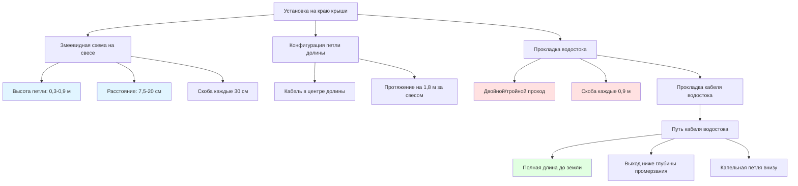

## Физические принципы установки кабеля

Эффективная установка кабелей обогрева крыши и водостоков зависит от стратегического размещения тепла для противодействия трем механизмам теплопередачи: теплопроводности через кровельные материалы, конвекции от движения воздуха и излучению в холодное небо. Схема прокладки кабеля должна устранять тепловые мосты на кромках крыши, где сосредоточены потери тепла, создавая зоны образования ледяных плотин.

Стратегия установки нацелена на критические области потерь тепла: свесы крыши, где теплый воздух из чердака поднимается и плавит снег, который вновь замерзает на холодном свесе, долины, где происходит сосредоточенный поток воды, и водостоки, где стоячая вода замерзает из-за недостаточной скорости дренажа.

## Расчеты расстояния между кабелями

### Схема змеевидного расположения на краю крыши

Расстояние между кабелями на поверхности крыши следует принципам диффузии тепла. Эффективная ширина нагрева на один проход кабеля зависит от теплопроводности кровельного материала и условий окружающей среды.

**Требуемая длина кабеля для змеевидной схемы:**

$$L_{serpentine} = \frac{W_{roof} \cdot D_{loop}}{S_{spacing}} + 2 \cdot H_{vertical}$$

Где:
- $L_{serpentine}$ = общая длина кабеля (м)
- $W_{roof}$ = ширина края крыши (м)
- $D_{loop}$ = глубина змеевидных петель в крышу (м), обычно 0,3–0,9 м
- $S_{spacing}$ = горизонтальное расстояние между проходами кабеля (см), обычно 7,5–20 см
- $H_{vertical}$ = вертикальное падение на водосток плюс прокладка (м)

**Тепловой поток на единицу площади:**

$$q'' = \frac{P_{cable} \cdot L_{effective}}{A_{coverage}}$$

Где:
- $q''$ = тепловой поток (Вт/м²)
- $P_{cable}$ = плотность мощности кабеля (Вт/м)
- $L_{effective}$ = эффективная длина нагревающего кабеля в зоне (м)
- $A_{coverage}$ = площадь, требующая защиты (м²)

Целевой тепловой поток составляет 450–900 Вт/м² в зависимости от климатической зоны и экспозиции крыши.

### Плотность кабеля в водостоке

Водостоки требуют сосредоточенного тепла для поддержания жидкого потока. Плотность кабеля учитывает тепловую массу водостока и потери тепла в окружающий воздух.

**Требование по кабелю водостока:**

$$N_{cables} = \frac{Q_{required}}{P_{cable}}$$

$$Q_{required} = \dot{m}_{melt} \cdot (L_f + c_p \cdot \Delta T) \cdot SF$$

Где:
- $N_{cables}$ = количество кабельных линий в водостоке
- $Q_{required}$ = требуемое тепло (Вт/м)
- $\dot{m}_{melt}$ = скорость плавления (кг/ч–м), обычно 0,9–2,3 кг/ч–м
- $L_f$ = скрытая теплота плавления, 334 кДж/кг
- $c_p$ = удельная теплоемкость воды, 4,18 кДж/(кг·°C)
- $\Delta T$ = требуемое повышение температуры (°C)
- $SF$ = коэффициент безопасности, 1,5–2,0

Стандартная практика предусматривает 1–3 кабельные линии в водостоках в зависимости от ширины и экспозиции.

## Схемы установки

## Сравнение методов установки

| Метод | Применение | Расстояние между кабелями | Плотность тепла | Время установки | Коэффициент стоимости |
|--------|-------------|---------------|--------------|-------------------|-------------|
| **Змеевидный край крыши** | Предотвращение ледяных плотин на свесах | 7,5–20 см | 570–910 Вт/м² | 2–3 ч/30 м | 1,0x |
| **Одиночная линия водостока** | Легкая защита от замерзания | Н/О (1 кабель) | 340–570 Вт/м | 1 ч/15 м | 0,6x |
| **Двойной/тройной проход водостока** | Суровые условия со снегом/льдом | Параллельные линии | 680–1360 Вт/м | 1,5 ч/15 м | 1,2x |
| **Расширенная петля долины** | Области сосредоточенного потока | 15–30 см | 910–1360 Вт/м² | 3–4 ч/30 м | 1,4x |
| **Полный водосток** | Предотвращение блокировки | Внутри водостока | 170–280 Вт/м | 0,5 ч/шт | 0,4x |
| **Только капельный край** | Минимальная защита | 30 см | 280–450 Вт/м² | 1 ч/30 м | 0,5x |

## Методы крепления и оборудование

### Скобы кабеля для поверхностей крыши

**Применение к черепице:**
- Используйте металлические или пластиковые скобы, предназначенные для проникновения сквозь черепицу
- Устанавливайте скобы каждые 30–45 см вдоль кабеля
- Позиционируйте скобы так, чтобы они проникали сквозь язычок черепицы в кровельную палубу
- Загерметизируйте проникновения кровельным цементом или герметиком производителя
- Скобы должны выдерживать минимальное усилие натяжения 90 Н

**Применение к металлической крыше:**
- Магнитные скобы для стоячих фальцевых крыш (без проникновения)
- Саморезные скобы для гофрированного металла
- Расстояние между скобами: 30 см на вертикальных поверхностях, 45 см на горизонтальных
- Используйте нержавеющую сталь или покрытое оборудование для предотвращения гальванической коррозии

### Крепление к водостоку

**Типы скоб:**
- Скобы края водостока, которые зацепляются за край водостока
- Скобы снизу с резиновыми прокладками (герметичное проникновение)
- Расстояние: не менее чем каждые 0,9 м, каждые 0,6 м для тяжелого кабеля

**Рассмотрение теплового расширения:**
Кабель испытывает термические циклы от –40°C до 65°C (рабочий). Используйте гибкие точки крепления или предусмотрите провис каждые 15 м для компенсации расширения:

$$\Delta L = \alpha \cdot L_0 \cdot \Delta T$$

Где:
- $\Delta L$ = расширение (см)
- $\alpha$ = коэффициент теплового расширения, обычно 10,8–14,4 × 10⁻⁶ см/(см·°C) для кабеля
- $L_0$ = исходная длина (м)
- $\Delta T$ = изменение температуры (°C)

## Прокладка кабеля водостока

Кабель должен проходить по всей длине водостока для предотвращения образования ледяной пробки. Блокировка льда в любой точке создает застой и переполнение.

**Протокол установки:**
1. Прокладите кабель внутри водостока полной длины
2. Закрепите сверху скобой или кабельной стяжкой
3. Добавьте провисающую петлю (15–30 см) каждые 3 м
4. Выведите кабель из водостока ниже глубины промерзания или в дренажный блок
5. Создайте капельную петлю на выходе для предотвращения стекания воды обратно вдоль кабеля

**Требование по мощности для водостока:**

$$P_{downspout} = L_{downspout} \cdot P_{cable} + P_{exit}$$

Где $P_{exit}$ учитывает 0,9–1,5 м открытого кабеля на уровне земли.

## Стандарты проникновения и герметизации крыши

Все точки входа кабеля через поверхности крыши создают потенциальные пути протечек. Надлежащая герметизация следует стандартам кровельной промышленности (рекомендации NRCA):

**Материалы герметизации:**
- Силиконовый или полиуретановый кровельный герметик (устойчивый к УФ-излучению)
- Самоклеящаяся резиновая манжета для входа кабеля (рассчитана на наружное использование)
- Металлическое покрытие при основных проникновениях

**Применение:**
1. Создайте плавный переход от поверхности крыши к кабелю
2. Нанесите герметик валиком толщиной 6 мм вокруг проникновения
3. Установите резиновую манжету над кабелем, прижмите в герметик
4. Нанесите второй валик герметика над краем манжеты
5. Ежегодно проверяйте на деградацию

## Электрическая зона подключения

Завершение кабеля должно происходить в герметичной распределительной коробке с рейтингом NEMA 3R минимум. Холодный хвост (неотапливаемый участок кабеля) протяжен от нагревающегося кабеля к точке подключения к электросети.

**Прокладка холодного хвоста:**
- Защитите холодный хвост в кондукторе, если открыт
- Прокладите во избежание пешеходного движения и механического повреждения
- Четко обозначьте "Обогрев крыши – не снимайте"
- Подключите через защиту GFCI (требуется по NEC)

## Факторы качества установки

**Предотвращение повреждения кабеля:**
- Избегайте острых изгибов (минимальный радиус изгиба: 2,5–5 см в зависимости от типа кабеля)
- Не растягивайте кабель при установке
- Защитите острые края защитными профилями
- Проверьте целостность перед и после установки

**Эффективность системы:**
Качество установки напрямую влияет на эффективность теплопередачи. Плохое расстояние между скобами создает провисание кабеля, уменьшая контакт с поверхностью крыши и снижая теплопередачу путем теплопроводности на 30–50%. Чрезмерное расстояние между змеевидными петлями оставляет холодные зоны, где лед еще образуется.

Термическое контактное сопротивление между кабелем и поверхностью крыши:

$$R_{contact} = \frac{1}{h_{contact} \cdot A_{contact}}$$

Хорошая установка (кабель плотно прижат к поверхности) достигает $h_{contact}$ = 28–57 Вт/(м²·°C). Плохая установка (воздушные зазоры) снижает это до 5,7–11,4 Вт/(м²·°C), требуя значительно более высоких температур кабеля и потребления энергии.

## Доступ для обслуживания

Разработайте установки для долгосрочного обслуживания. Ожидаемый срок службы кабеля составляет 10–20 лет в зависимости от качества кабеля и условий установки. Обеспечьте:
- Доступ к распределительным коробкам без необходимости использования крышной лестницы
- Четкую идентификацию цепей на панели автоматических выключателей
- Схему установки, показывающую прокладку кабеля (сфотографируйте перед покрытием)
- Четкую разметку мест расположения кабеля для предотвращения случайного повреждения при кровельных работах
