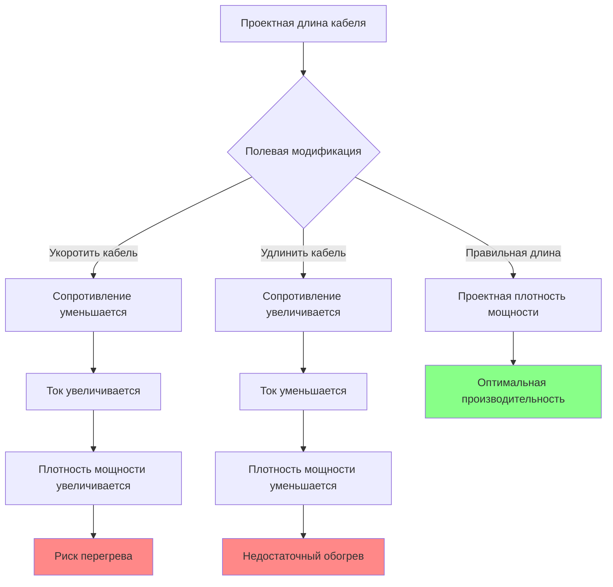

## Принцип работы

Кабели постоянной мощности поддерживают фиксированную выходную мощность на единицу длины независимо от температуры окружающей среды или условий на поверхности. Это стабильное функционирование обусловлено конструкцией нагревательного элемента с последовательным сопротивлением, где электрическое сопротивление остается постоянным во всем диапазоне рабочих температур, обеспечивая предсказуемое тепловыделение, описываемое законом Джоуля:

$$Q = I^2 R = \frac{V^2}{R}$$

где $Q$ представляет тепловыделение (ватты), $I$ — ток (амперы), $R$ — сопротивление (омы), и $V$ — приложенное напряжение (вольты).

В отличие от саморегулирующихся кабелей, которые модулируют выходную мощность на основе температурно-зависимого сопротивления полимера, конструкции с постоянной мощностью обеспечивают идентичный тепловой поток как при экстремально холодных условиях (−40°C и ниже), так и при умеренной погоде (около 10°C). Эта независимая от температуры работа обеспечивает надежное функционирование в экстремально холодном климате, где саморегулирующиеся кабели испытывают снижение эффективности.

## Конструкция с последовательным сопротивлением

Кабели постоянной мощности используют непрерывные элементы резистивного провода, сконфигурированные в специфические схемы для достижения целевой плотности мощности:

**Конфигурация параллельного сопротивления.** Два питающих провода проходят по всей длине кабеля с резистивным нагревательным проводом, переплетенным между ними в непрерывные параллельные цепи. Каждый небольшой участок создает независимую зону нагрева, питаемую основными питающими проводниками. Общая выходная мощность равна сумме всех параллельных сегментов сопротивления.

**Конфигурация последовательного сопротивления.** Один непрерывный нагревательный элемент протяжен на всю длину кабеля между клеммой питания и концом завершения. Полное сопротивление кабеля определяет ток для заданного приложенного напряжения, устанавливая фиксированную выходную мощность. Любое изменение длины кабеля изменяет полное сопротивление и влияет на подачу мощности по всей цепи.

**Минеральный изолированный (MI) кабель.** Проводник(и) нагрева подвешены в уплотненной изоляции из оксида магния внутри бесшовной металлической оболочки. Эта конструкция выдерживает длительное воздействие температур до 230°C и обеспечивает превосходную устойчивость к влаге, продлевая срок службы свыше 25 лет в суровых условиях.

### Соотношение плотности мощности

Для конструкций с последовательным сопротивлением мощность на единицу длины зависит прямо от общей длины кабеля и приложенного напряжения:

$$P_{total} = \frac{V^2}{R_{total}} \quad \text{и} \quad R_{total} = r \times L$$

где $P_{total}$ — полная мощность кабеля (ватты), $R_{total}$ — полное сопротивление кабеля (омы), $r$ — сопротивление на единицу длины (омы/м), и $L$ — общая длина кабеля (метры).

Плотность мощности (ватты на метр) становится:

$$P_{density} = \frac{P_{total}}{L} = \frac{V^2}{r \times L^2}$$

Это обратное квадратичное соотношение с длиной создает фундаментальное ограничение на обрезку: укорочение кабеля с последовательным сопротивлением снижает полное сопротивление, увеличивает ток и повышает плотность мощности выше допустимых пределов. И наоборот, удлинение кабеля снижает плотность мощности ниже эффективных пороговых значений.

## Ограничения на обрезку по длине

Кабели постоянной мощности с последовательным сопротивлением требуют точного определения длины при производстве. Полевые модификации ухудшают производительность и безопасность:

**Последствия укорочения.** Уменьшение длины кабеля от расчетного значения снижает полное сопротивление, увеличивает потребление тока и плотность мощности. Сокращение на 10% от проектной длины увеличивает плотность мощности примерно на 23% за счет объединенного эффекта снижения сопротивления и более короткой длины распределения тепла:

$$\frac{P_{density,short}}{P_{density,design}} = \left(\frac{L_{design}}{L_{short}}\right)^2$$

Эта повышенная плотность мощности вызывает локальный перегрев, ускоряет деградацию изоляции и может превышать пределы роста температуры NEC при контакте со строительными материалами.

**Последствия удлинения.** Увеличение длины кабеля повышает полное сопротивление и снижает плотность мощности. Увеличение на 10% от проектной длины снижает плотность мощности примерно на 17%, что может привести к холодным участкам, где теплового выхода недостаточно для предотвращения обледенения.

**Планирование установки.** Точно измерьте размеры краев крыши, желобов и водостоков перед закупкой кабеля. Закажите кабели в точных длинах, соответствующих требованиям установки плюс 5% припуск на вариации маршрутизации и детали соединения. Кабели с последовательным сопротивлением не допускают полевую регулировку длины.

## Стандартные номинальные мощности

Кабели постоянной мощности доступны с фиксированными плотностями мощности, соответствующими определенным применениям:

| Плотность мощности | Типовое применение | Предел длины цепи | Потребляемый ток (120В) |
|-------|--------|--------|---------|
| 31 Вт/м | Легкий обогрев желобов, мягкий климат | 61 м макс | 8,3 А на 30 м |
| 49 Вт/м | Стандартный обогрев желобов/водостоков | 46 м макс | 10 А на 30 м |
| 62 Вт/м | Краевой обогрев крыши змеевидной схемой | 37 м макс | 12,5 А на 30 м |
| 74 Вт/м | Тяжелые применения, металлические желоба | 30 м макс | 15 А на 30 м |
| 92 Вт/м | Коммерческие применения, суровое воздействие | 24 м макс | 18,75 А на 30 м |

Ограничения длины цепи отражают требования NEC по падению напряжения (максимум 3% для ответвительных цепей) и практическое определение размера автомата. Более высокие плотности мощности обеспечивают более короткие пробеги цепи перед достижением пределов допустимой нагрузки.

## Варианты напряжения и выбор

Кабели постоянной мощности производятся для определенных рабочих напряжений. Применение неправильного напряжения производит выходную мощность, отклоняющуюся от проектных спецификаций согласно:

$$P_{actual} = P_{rated} \times \left(\frac{V_{actual}}{V_{rated}}\right)^2$$

Кабель номиналом 240В, питаемый от 208В, обеспечивает только 75% расчетной выходной мощности. И наоборот, применение 277В к кабелю номиналом 240В производит 33% избыточной мощности, вызывая быстрый отказ изоляции.

**Критерии выбора напряжения:**

- **Системы 120В:** Жилые применения, более короткие пробеги цепей (<30 м), легко доступная защита GFCI
- **Системы 208В:** Коммерческие здания с трехфазным питанием, более длинные цепи, сниженный ток
- **Системы 240В:** Жилое двухфазное питание, оптимизировано для более длинных пробегов цепей, пониженные требования по току
- **Системы 277В:** Коммерческие применения с трехфазным питанием 480В, максимальная возможность длины цепи

Более высокие рабочие напряжения снижают потребление тока при эквивалентной выходной мощности, обеспечивая более длинные пробеги цепей перед достижением пределов допустимой нагрузки проводников или чрезмерным падением напряжения.

## Требования к установке согласно NEC Article 426

NEC Article 426 регулирует установку стационарного наружного электрического оборудования для удаления льда и снега, устанавливая специфические требования для кабелей обогрева крыш и желобов:

**426.10 Общие положения.** Нагревательное оборудование должно быть идентифицировано как подходящее для наружной установки и применений для предотвращения обледенения. Кабели должны иметь соответствующий листинг UL для применений удаления льда.

**426.20 Тепловая защита.** Кабели постоянной мощности требуют внешней тепловой защиты (термостатов или ограничивателей температуры) для предотвращения перегрева при покрытии изолирующим снегом или мусором. Саморегулирование через температурно-зависимое сопротивление не происходит в конструкциях постоянной мощности.

**426.28 Защита от замыканий на землю.** Все цепи требуют защиты от замыканий на землю (GFCI) для безопасности персонала. Защита GFCI должна функционировать при наружных температурах, требуя специальных устройств с холодостойкостью для надежной работы.

**426.50 Допустимая нагрузка проводника.** Питающие проводники должны быть рассчитаны на 125% непрерывной нагрузки нагрева. Для 30-метрового кабеля при 62 Вт/м (186 Вт полной мощности), цепь 120В потребляет 1,55 А, требуя питающих проводников с минимальной оценкой 1,94 А непрерывно.

**426.52 Защита от перегрузки по току.** Устройства защиты ответвительной цепи от перегрузки по току должны быть рассчитаны на 125% непрерывной нагрузки. Та же нагрузка 186 Вт требует минимум 1,94 А защиты от перегрузки по току, обычно обслуживаемой автоматическим выключателем 15 А с адекватным запасом.

## Интеграция управления

Кабели постоянной мощности обеспечивают полную расчетную мощность при каждом включении, делая стратегию управления критической для энергоэффективности и контроля операционных затрат:

### Управление по температуре окружающей среды

Одноступенчатые термостаты активируют нагрев при падении температуры воздуха ниже установки (обычно 3–6°C). Этот простой подход обеспечивает автоматическую работу, но может активировать системы в периоды без осадков, теряя энергию при сухих холодных условиях.

Характеристики отклика следуют простой логике включения/выключения:

$$\text{Состояние нагревателя} = \begin{cases}
\text{ВКЛЮЧЕНО} & T_{ambient} < T_{setpoint} \\
\text{ВЫКЛЮЧЕНО} & T_{ambient} \geq T_{setpoint} + \Delta T_{differential}
\end{cases}$$

где $\Delta T_{differential}$ представляет дифференциал управления (обычно 1–2°C), предотвращая быстрое циклирование.

### Управление по влаге и температуре

Комбинированные датчики влаги и измерение температуры активируют нагрев только при существовании условий образования льда (температура ниже 4°C И обнаружена влага). Это продвинутое управление снижает потребление энергии на 45–60% в сравнении с управлением только по температуре при сохранении эффективного предотвращения обледенения.

Логика объединяет оба входа:

$$\text{Состояние нагревателя} = (T_{ambient} < T_{setpoint}) \land (\text{Влага обнаружена})$$

Методы обнаружения влаги включают датчики осадков, датчики обнаружения льда или усовершенствованные системы, измеряющие наличие воды на нагреваемых поверхностях.

### Ограничение по температуре

Все установки постоянной мощности требуют независимой от первичного управления защиты по высокой температуре. Ограничивающие переключатели, установленные на поверхность кабеля, предотвращают перегрев при накоплении снега, изолирующего кабели, захватывая генерируемое тепло и повышая температуру поверхности выше безопасных пределов.

Типовые установки ограничения:

- Кабели с изоляцией из полимера: 70–80°C
- Минеральные изолированные кабели: 120–150°C
- Контакт со сгораемыми материалами: максимум 32°C согласно NEC 426.20(B)

## Сравнение производительности: постоянная мощность против саморегулирующейся

| Характеристика | Постоянная мощность | Саморегулирующаяся |
|--------|--------|--------|
| Выходная мощность | Фиксирована при всех температурах | Переменная с температурой |
| Производительность при экстремально холодной погоде | Поддерживает полный выход до −50°C | Выход снижается ниже −30°C |
| Энергоэффективность | Требует активное управление для эффективности | Автоматическое снижение мощности при мягкой погоде |
| Возможность перекрытия | Запрещена без термостата | Безопасна благодаря автоматическому снижению мощности |
| Срок службы | 15–20 лет (MI кабель), 10–15 лет (полимер) | 8–12 лет перед деградацией |
| Начальная стоимость | Ниже | Выше (премия 30–50%) |
| Операционная стоимость | Выше без оптимизации | Ниже через автоматическую модуляцию |
| Полевая обрезка | Запрещена для последовательного сопротивления | Разрешена в любой точке |
| Сложность установки | Требует точное планирование длины | Гибкая адаптация при полевых работах |

## Руководящие принципы применения

**Оптимальные применения постоянной мощности:**

- Экстремально холодный климат, где температура окружающей среды регулярно падает ниже −30°C
- Критические системы дренажа, требующие гарантированной выходной мощности независимо от условий
- Установки длительного срока службы, где 20+ лет производительности оправдывают более высокие операционные затраты
- Применения, требующие точного, предсказуемого теплового потока для теплового моделирования
- Переделки, где существующая инфраструктура управления поддерживает эффективную работу

**Применения, отдающие предпочтение саморегулирующимся кабелям:**

- Умеренный климат с температурами обычно выше −10°C
- Устанавливаемые объекты, сосредоточенные на энергосбережении, отдающие предпочтение операционной стоимости над начальной инвестицией
- Сложные геометрии крыши, требующие гибко адаптируемой маршрутизации кабелей в полевых условиях
- Установки без усовершенствованных систем управления

## Пример проектирования цепи

Проектирование системы постоянной мощности для жилого обогрева желобов:

**Требования:**
- Длина желоба: 24 м
- Длина водостока: 6 м
- Климат: Холодный с температурами до −30°C
- Доступное питание: 120В, 20А цепь

**Выбор кабеля:**
- Желоб: 49 Вт/м постоянная мощность
- Водосток: 62 Вт/м постоянная мощность

**Расчет нагрузки:**

$$P_{gutter} = 24 \text{ м} \times 49 \text{ Вт/м} = 1176 \text{ Вт}$$

$$P_{downspout} = 6 \text{ м} \times 62 \text{ Вт/м} = 372 \text{ Вт}$$

$$P_{total} = 1176 + 372 = 1548 \text{ Вт}$$

**Потребляемый ток:**

$$I = \frac{P_{total}}{V} = \frac{1548 \text{ Вт}}{120 \text{ В}} = 12,9 \text{ А}$$

**Требуемый автоматический выключатель (125% непрерывной нагрузки):**

$$I_{breaker} = 12,9 \text{ А} \times 1,25 = 16,1 \text{ А} \rightarrow 20 \text{ А автоматический выключатель}$$

Этот проект обеспечивает адекватный запас на 20А цепи (64% использование) при соответствии требованиям непрерывной нагрузки NEC. Автоматический выключатель 20 А защищает оба кабеля при обеспечении нормальной работы.

**Рекомендация управления:** Датчик температуры окружающей среды с установкой активации 4°C обеспечивает простую автоматическую работу. Добавление обнаружения влаги снижает потребление энергии примерно на 50% при операционной стоимости $155/зима (1548 Вт × $0,12/кВт·ч × 850 часов) без управления влагой, снижаясь до $77/зима с обнаружением влаги.

## Обслуживание и поиск неисправностей

Ежегодная инспекция перед зимним сезоном должна проверить:

1. Физическое состояние кабеля — отсутствие порезов, абразивного износа или повреждений оболочки
2. Целостность концевого уплотнения — водонепроницаемые завершения во всех концах кабеля
3. Безопасность крепления зажима — все монтажные зажимы надежно прикреплены
4. Электрическую целостность — измерение сопротивления, соответствующее спецификациям производителя
5. Защита от замыканий на землю — проверка функции кнопки тестирования GFCI
6. Калибровку управления — точность установки термостата в пределах ±2°C

Обычные режимы отказа включают попадание влаги в поврежденные местоположения оболочки, деградацию концевого уплотнения, позволяющую водопроникновению к ядрам проводника, и отказы холодного вывода сращивания от напряжения термического цикла. Большинство отказов проявляются как замыкания на землю, обнаруживаемые защитой GFCI перед созданием опасных условий.

Ожидаемый срок службы правильно установленных кабелей постоянной мощности варьируется от 10–15 лет для конструкций с полимерной изоляцией до 25+ лет для минеральных изолированных конструкций в некоррозионных условиях.
