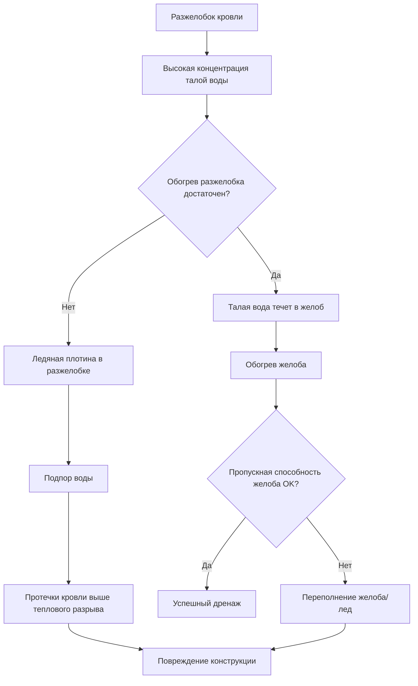

Ледяные плотины образуются, когда тепло, выходящее через кровлю, плавит снег на верхних поверхностях, создавая талую воду, которая замерзает на холодном карнизе. Это создает барьер, который задерживает последующую талую воду, что приводит к протечкам кровли, повреждению желобов и структурным ледяным нагрузкам. Предотвращение требует стратегического применения тепла для поддержания открытых путей дренажа.

## Физика образования ледяных плотин

Градиент температуры по поверхности кровли создает условия для образования ледяных плотин через три отдельные тепловые зоны:

**Верхняя зона кровли**: потеря тепла из помещения разогревает обрешетку кровли выше 0°C, плавя накопленный снег. Поток тепла через конструкцию кровли:

$$q'' = \frac{T_{interior} - T_{roof}}{R_{total}} = \frac{\Delta T}{R_{insulation} + R_{deck} + R_{shingles}}$$

где $q''$ — тепловой поток (Вт/м²) и $R_{total}$ — суммарное тепловое сопротивление конструкции кровли.

**Зона карниза**: карнизный свес, не получающий внутреннее тепло, остается при температуре окружающей среды. Когда талая вода из верхней зоны достигает этой холодной поверхности, она замерзает, образуя ледяную плотину.

**Зона разжелобка**: разжелобки кровли концентрируют поток талой воды, создавая локализованные условия высокообъемного замерзания, что быстро приводит к накоплению льда.

Критический переход происходит в тепловом разрыве между отапливаемыми и неотапливаемыми участками кровли. Скорость замерзания на карнизе зависит от:

$$\dot{m}_{ice} = \frac{q''_{melt} \cdot A_{upper}}{h_{fg}} \cdot \eta_{freeze}$$

где $\dot{m}_{ice}$ — скорость образования льда (кг/ч), $q''_{melt}$ — скорость таяния снега, $A_{upper}$ — площадь отапливаемой кровли, $h_{fg}$ — скрытая теплота плавления (418 кДж/кг), и $\eta_{freeze}$ — доля талой воды, которая замерзает.

## Стратегия размещения кабеля

Эффективное предотвращение ледяных плотин требует применения тепла в критических зонах, где происходит замерзание и где накапливается талая вода.

### Защита края карниза

Первичная защита — непрерывный обогрев вдоль края карниза, простирающийся от края кровли в желоб и вниз по водосточной трубе. Стандартная конфигурация размещает кабель:

- **На первые 0,9 м** от края кровли минимум для стандартных климатов
- **На первые 1,8 м** для суровых климатов или кровель с малым уклоном
- **Зигзагообразная схема** с интервалом 30-45 см, перпендикулярно карнизу

Отапливаемая ширина должна простираться за пределы плоскости наружной стены, чтобы обеспечить обогрев всех участков, лишенных внутреннего тепла. Для стен с тепловым сопротивлением R-30 и внутренней температурой 20°C расстояние проникновения тепла составляет приблизительно:

$$x_{penetration} = \sqrt{\frac{k \cdot R_{wall} \cdot \Delta T}{q''_{surface}}}$$

Типичное проникновение составляет 60-90 см для жилых конструкций.

### Требования к обогреву разжелобков

Разжелобки кровли концентрируют талую воду с прилегающих плоскостей кровли, создавая расходы, в 5-10 раз превышающие расходы на плоских поверхностях. Обогрев разжелобка должен обеспечивать:

$$Q_{valley} = q''_{melt} \cdot A_{tributary} \cdot \cos(\theta)$$

где $A_{tributary}$ — общая площадь кровли, дренирующейся в разжелобок, и $\theta$ — угол уклона кровли.

Размещение кабеля в разжелобке следует линии центра разжелобка от конька до карниза, с дополнительными кабелями, размещенными на расстоянии 30-45 см с каждой стороны для разжелобков, обслуживающих большие площади кровли (>46 м² с каждой стороны).

### Обогрев желобов и водосточных труб

Желоба и водосточные трубы требуют непрерывного обогрева для поддержания пропускной способности дренажа. Расположение кабеля:

| Компонент | Конфигурация кабеля | Типичная мощность |
|-----------|---------------------|-----------------|
| Желоб | Один кабель, в центре дна | 26-31 Вт/м |
| Широкий желоб | Два кабеля в нижних углах | 52-79 Вт/м |
| Водосточная труба | Один кабель по всей высоте | 26-31 Вт/м |
| Большая водосточная труба | Два кабеля с противоположных сторон | 52-79 Вт/м |
| Вход в разжелобок | Петля кабеля у входа в желоб | 66-98 Вт/м |

Кабель желоба проходит через водосточную трубу до точки ниже глубины промерзания или на отапливаемую поверхность (минимум 30 см за последним потенциальным местом замерзания).

## Компенсация потерь тепла

Система обогрева должна компенсировать множественные одновременные потери тепла, сохраняя открытые пути дренажа.

### Кондукция в поверхность кровли

Тепло, проводимое от кабеля в холодный кровельный субстрат:

$$q_{cond} = \frac{k_{eff} \cdot A_{contact}}{L} \cdot (T_{cable} - T_{roof})$$

Для саморегулирующихся нагревательных кабелей при температуре кровли 4°C потери кондукцией составляют 26-31 Вт/м в зависимости от площади контакта кабеля и теплопроводности материала кровли.

### Конвекция в окружающий воздух

Конвективное охлаждение, вызванное ветром, с открытых поверхностей:

$$q_{conv} = h_{conv} \cdot A_{surface} \cdot (T_{surface} - T_{ambient})$$

где $h_{conv}$ варьируется от 28-142 Вт/м²·K в зависимости от скорости ветра. При скорости ветра 24 км/ч и температуре окружающей среды -7°C потери конвекцией достигают 39-52 Вт/м открытого кабеля.

### Нагревание талой воды

Явная и скрытая теплота, необходимая для плавления снега и повышения температуры талой воды:

$$q_{melt} = \dot{m}_{water} \cdot [h_{fg} + c_p \cdot (T_{drain} - T_{initial})]$$

Для снега при -2°C, растопленного до 4°C талой воды:

$$q_{melt} = \dot{m}_{water} \cdot [334 + 4.19 \cdot (4-(-2))] = \dot{m}_{water} \cdot 359 \text{ кДж/кг}$$

## Методология подбора размеров системы

Правильный подбор размеров системы балансирует достаточную емкость обогрева против потребления энергии и стоимости установки.

### Параметры проектирования

| Параметр | Типичное значение | Суровый климат |
|-----------|---------------|----------------|
| Ширина обогрева карниза | 0,9 м | 1,8 м |
| Интервал кабеля | 30-45 см | 20-30 см |
| Линейная плотность мощности | 26-31 Вт/м | 39-59 Вт/м |
| Полная мощность на площадь кровли | 49-82 Вт/м² | 98-147 Вт/м² |
| Множитель мощности разжелобка | 1,5-2,0× | 2,0-2,5× |
| Расчетная температура окружающей среды | -12 до -7°C | -18 до -12°C |

### Расчет требуемой мощности

Полная мощность системы — это сумма всех отапливаемых зон:

$$P_{total} = (L_{eave} \cdot p_{eave}) + (L_{valley} \cdot p_{valley} \cdot m) + (L_{gutter} \cdot p_{gutter}) + (L_{downspout} \cdot p_{downspout})$$

где:
- $L$ — линейная длина каждого компонента (м)
- $p$ — плотность мощности (Вт/м)
- $m$ — множитель для зон с высоким потоком

**Пример расчета**: карниз 15 м, разжелобок 9 м, желоб 15 м, водосточная труба 7,5 м, умеренный климат:

$$P_{total} = (15 \cdot 33) + (9 \cdot 33 \cdot 1.5) + (15 \cdot 33) + (7,5 \cdot 33)$$
$$P_{total} = 495 + 742 + 495 + 248 = 1,980 \text{ Вт} = 2,0 \text{ кВт}$$

### Соображения по монтажу

Метод крепления кабеля влияет на эффективность теплопередачи и долговечность:

- **Крепление с помощью клипс на черепице**: пружинные клипсы фиксируют кабель на язычки черепицы без проникновения в кровлю. Обеспечивает хороший тепловой контакт и позволяет тепловому расширению.
- **Крепление клеем**: высокотемпературный силикон или бутиловый клей приклеивает кабель к поверхности кровли. Лучший тепловой контакт, но менее гибко.
- **Крепление клипсой в желобе**: специализированные клипсы фиксируют кабель в корыте желоба, сохраняя правильное положение.

Маршрут кабеля следует принципу поддержания непрерывного обогрева вдоль всех потенциальных путей замерзания. В критических зонах (край карниза, точки входа в разжелобки) не должны допускаться разрывы, превышающие 15 см.

## Стратегии управления

Эффективная работа требует автоматического управления на основе условий, благоприятствующих образованию ледяных плотин.

### Управление на основе датчиков

**Датчики температуры-влажности** активируют обогрев при наличии:
- Температуры окружающей среды < 3°C И
- Обнаружения осадков ИЛИ
- Наличия снега на кровле

Это предотвращает ненужную работу в течение холодных сухих периодов, обеспечивая защиту во время таяния снега.

**Контроллеры с тепловым моделированием** прогнозируют условия образования ледяных плотин на основе:
- Температуры кровли
- Температуры окружающей среды
- Внутренней температуры (показатель потери тепла)
- Интенсивности осадков

### Ручное управление

Системы включают возможность ручного управления для необычных условий или подготовки к предстоящему снегопаду. Ручная активация за 2-4 часа до ожидаемых морозных осадков повышает эффективность благодаря предотвращению первоначального образования льда.

## Проверка производительности

Эффективность системы проверяется с помощью:

1. **Тепловизионная съемка** во время работы подтверждает непрерывные отапливаемые пути
2. **Наблюдение дренажа** во время таяния снега подтверждает свободный поток воды на землю
3. **Мониторинг образования льда** подтверждает отсутствие образования плотины при расчетных условиях
4. **Отслеживание потребления энергии** подтверждает расчеты размеров и выявляет деградацию системы

Правильно спроектированные и установленные системы предотвращают образование ледяных плотин при температурах окружающей среды до расчетного порога (типично -18 до -7°C в зависимости от климатической зоны) с глубиной снежного покрова до 30-60 см.

## Источники

- ASHRAE Handbook - HVAC Applications, Chapter 51: Snow Melting and Freeze Protection
- IEEE 515: Standard for the Testing, Design, Installation, and Maintenance of Electrical Resistance Trace Heating for Commercial Applications
- NFPA 70 (NEC): Article 426 - Fixed Outdoor Electric Deicing and Snow-Melting Equipment
- Institute for Building Technology and Safety (IBTS): Guidelines for Heat Cable Installation
- Cold Regions Research and Engineering Laboratory: Ice Dam Formation and Prevention Technical Reports
