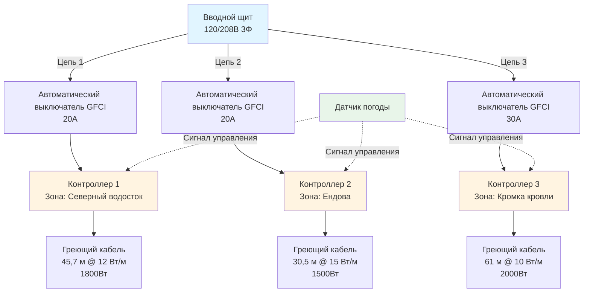

Правильное электрическое проектирование обеспечивает надежную работу систем обогрева кровли и водостоков в экстремальных зимних условиях. Требования к мощности основаны на фундаментальных принципах теплопередачи с учетом механизмов теплопотерь и эксплуатационных параметров, характерных для открытых кровельных конструкций.

## Основы теплопередачи

Требуемая плотность тепловой мощности должна преодолевать три основных механизма теплопотерь:

**Теплопотери за счет теплопроводности** через основание кровли и поверхности крепления рассеивают тепло в строительную оболочку. Для применений по краю кровли теплопроводность обычно составляет 15–25% от общих теплопотерь.

**Теплопотери за счет конвекции** в окружающий воздух резко возрастают с увеличением скорости ветра. Вынужденная конвекция, вызванная ветром, доминирует на открытых кровельных участках, составляя 50–70% от общей тепловой нагрузки при типичных зимних скоростях ветра 16–32 км/ч.

**Теплопотери за счет испарения** в процессе активного таяния снега потребляют значительную энергию за счет фазового перехода. Удельная теплота плавления льда (334 кДж/кг) устанавливает теоретический минимальный энергетический расход, не зависящий от температуры окружающей среды.

## Расчеты плотности мощности

Требуемая линейная плотность тепловой мощности зависит от геометрии водостока, условий эксплуатации и стратегии работы:

$$q_L = \frac{Q_{total}}{L} = q_{conv} + q_{cond} + q_{melt}$$

где:
- $q_L$ = линейная плотность мощности (Вт/м)
- $Q_{total}$ = общая потребность в тепле (Вт)
- $L$ = длина обогрева (м)

**Теплопотери за счет конвекции** подчиняются закону охлаждения Ньютона:

$$q_{conv} = h \cdot P \cdot (T_s - T_a)$$

где:
- $h$ = коэффициент теплоотдачи при конвекции (Вт/м²·К)
- $P$ = открытая периметральная длина (м)
- $T_s$ = температура поверхности (°C)
- $T_a$ = температура окружающего воздуха (°C)

Для вынужденной конвекции при ветре:

$$h = 5.7 + 3.8V$$

где $V$ = скорость ветра (м/с)

**Емкость плавления** определяет скорость переработки снега:

$$q_{melt} = \dot{m} \cdot (L_f + c_p \Delta T)$$

где:
- $\dot{m}$ = скорость плавления снега (кг/с·м)
- $L_f$ = удельная теплота плавления = 334 кДж/кг
- $c_p$ = удельная теплоемкость воды = 4,18 кДж/кг·К
- $\Delta T$ = повышение температуры от 0°C до точки стока

## Стандартные плотности мощности по применению

| Применение | Плотность мощности | Расчетная температура | Ветровая нагрузка |
|------|------------------|------------------|------------------|
| Кромка кровли/карниз | 98–164 Вт/м | -10°C to -20°C | Высокая |
| Обогрев ендовы | 131–197 Вт/м | -10°C to -20°C | Средняя |
| Обогрев водостока | 26–49 Вт/м | -5°C to -15°C | Средняя |
| Обогрев водосточной трубы | 33–66 Вт/м | -5°C to -15°C | Низкая |
| Карнизная планка | 65–113 Вт/м | -10°C to -20°C | Высокая |
| Металлические кровельные панели | 161–269 Вт/м² | -5°C to -15°C | Высокая |

## Проектирование цепей и электрические параметры

**Расчет допустимой токовой нагрузки** для цепей саморегулирующегося греющего кабеля:

$$I = \frac{P_{total}}{V \cdot \sqrt{3} \cdot PF}$$

для трехфазных систем, или:

$$I = \frac{P_{total}}{V \cdot PF}$$

для однофазных систем, где:
- $I$ = ток цепи (А)
- $P_{total}$ = общая подключенная нагрузка (Вт)
- $V$ = напряжение питания (В)
- $PF$ = коэффициент мощности (обычно 0,95–1,0 для резистивного нагрева)

**Ограничения падения напряжения** предотвращают снижение производительности:

$$V_{drop} = \frac{2 \cdot I \cdot L \cdot R}{1000}$$

где:
- $L$ = длина цепи в одну сторону (м)
- $R$ = сопротивление проводника (Ом/км)

Максимально допустимое падение напряжения: 3% для ответвительных цепей, 5% суммарно от вводного щита до нагрузки.

## Архитектура распределения мощности

## Подбор трансформатора

Трансформаторы должны обеспечивать полную подключенную нагрузку с учетом коэффициента запаса:

$$S_{transformer} = \frac{P_{total}}{PF \cdot DF} \cdot SF$$

где:
- $S_{transformer}$ = мощность трансформатора (кВА)
- $DF$ = коэффициент спроса (0,7–1,0 в зависимости от стратегии управления)
- $SF$ = коэффициент запаса (минимум 1,25 согласно NEC)

Для типичной жилой установки с 152 м нагревательного кабеля мощностью 12 Вт/м:
- Подключенная нагрузка = 6000 Вт
- При $DF$ = 0,85, $PF$ = 1,0, $SF$ = 1,25
- Требуемый трансформатор = 8,8 кВА (выбрать стандартный размер 10 кВА)

## Практические соображения проектирования

**Подбор автоматического выключателя** должен учитывать номинал для непрерывного режима работы. Согласно статье 426 NEC, оборудование для обогрева и антиобледенения крыш работает непрерывно в наихудших условиях:

$$I_{breaker} \geq 1.25 \cdot I_{load}$$

**Защита от замыканий на землю** обязательна для всех цепей обогрева крыш и водосточных желобов согласно NEC 426.28. Для защиты персонала используйте УЗО класса A с током срабатывания 4–6 мА.

**Подбор сечения проводников** осуществляется согласно таблице 310.16 NEC с учетом температурных поправок и заполнения труб. Для наружных крышных применений, подверженных солнечному излучению, применяйте поправочный коэффициент 0,71 для проводников с номинальной температурой 75°C при температуре окружающей среды до 40°C.

**Мониторинг мощности** позволяет осуществлять проверку производительности и управление энергопотреблением. Типичные системы обогрева крыш в жилых зданиях потребляют 3–8 кВт·ч в час работы, при этом сезонное энергопотребление варьируется от 500 до 2000 кВт·ч в зависимости от климатической зоны и стратегии управления.

Правильное электротехническое проектирование обеспечивает баланс между достаточной тепловой мощностью, стоимостью монтажа и эксплуатационной эффективностью. Консервативный выбор плотности мощности гарантирует надежность системы в условиях расчетной погоды, в то время как продвинутые системы управления минимизируют неоправданное энергопотребление при умеренных погодных условиях.
