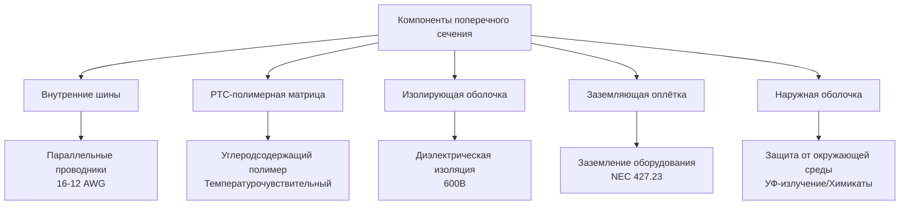
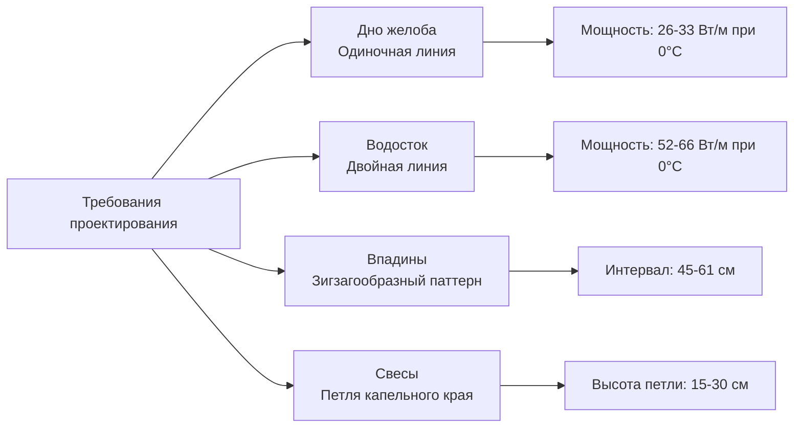

## Физический принцип работы

Саморегулирующиеся нагревательные кабели используют **полимерную технологию с положительным температурным коэффициентом (PTC)** для автоматической регулировки мощности в ответ на локальные условия температуры. Нагревательный элемент состоит из двух параллельных шин, встроенных в матрицу полупроводящего полимера, которая проявляет температурозависимое электрическое сопротивление.

### Поведение PTC-полимера

Фундаментальная физика, определяющая саморегулирующуюся работу:

**Зависимость сопротивления от температуры:**

$$R(T) = R_0 e^{\beta(T - T_0)}$$

Где:
- $R(T)$ = сопротивление при температуре $T$ (Ω/м)
- $R_0$ = опорное сопротивление при $T_0$ (Ω/м)
- $\beta$ = положительный температурный коэффициент (К⁻¹)
- $T$ = температура полимера (К)
- $T_0$ = опорная температура (К)

**Отклик мощности:**

$$P(T) = \frac{V^2}{R(T)} = \frac{V^2}{R_0 e^{\beta(T - T_0)}}$$

По мере увеличения температуры полимера сопротивление увеличивается экспоненциально, вызывая снижение мощности. Это создает автоматическую тепловую регулировку в каждой точке по длине кабеля.

## Конструкция и материалы

### Основные компоненты

1. **Параллельные шины**: Луженые медные проводники (обычно 16-12 AWG)
2. **Проводящая полимерная матрица**: Углеродсодержащий полимер с PTC-характеристиками
3. **Изолирующая оболочка**: Модифицированный полиолефин или фторполимер
4. **Заземляющая оплётка**: Луженая медь с наружной оплёткой для заземления оборудования
5. **Наружная оболочка**: Устойчивая к УФ-излучению, химически стойкий термопласт

## Характеристики выходной мощности

### Зависящая от температуры производительность

Саморегулирующиеся кабели проявляют нелинейный выход мощности:

| Температура (°C) | Выход мощности (Вт/м) | Относительный выход |
|------------------|----------------------|-------------------|
| -40 | 39-49 | 100% |
| -18 | 33-43 | 85% |
| 0 | 26-33 | 70% |
| 10 | 16-23 | 50% |
| 21 | 7-13 | 25% |

**Условие теплового равновесия:**

$$P_{out}(T) = Q_{loss}(T)$$

Где:
- $P_{out}(T)$ = выход мощности кабеля при температуре $T$ (Вт/м)
- $Q_{loss}(T)$ = тепловые потери из трубы/поверхности (Вт/м)

Кабель автоматически стабилизируется при температуре, где выделение тепла равно потерям тепла.

## Механизм автоматической регулировки мощности

### Микроскопический тепловой отклик

PTC-полимер содержит кристаллические области внутри аморфной матрицы. Изменения температуры влияют на молекулярную структуру:

**Ниже пороговой температуры:**
- Сжатые кристаллические области
- Углеродные частицы в непосредственной близости
- Низкое электрическое сопротивление
- Высокий ток
- Максимальная выходная мощность

**Выше пороговой температуры:**
- Расширение полимера разделяет углеродные частицы
- Увеличение сопротивления между путями проводимости
- Сниженный ток
- Пониженная выходная мощность

**Зависимость плотности тока:**

$$J = \sigma(T) \cdot E$$

Где:
- $J$ = плотность тока (А/м²)
- $\sigma(T)$ = зависящая от температуры проводимость (См/м)
- $E$ = напряжённость электрического поля (В/м)

Проводимость $\sigma(T)$ уменьшается экспоненциально с температурой, реализуя автоматическую регулировку.

## Преимущества энергоэффективности

### Сравнительное энергопотребление

Саморегулирующиеся кабели обеспечивают значительную экономию энергии по сравнению с системами постоянной мощности:

**Расчёт годовой энергии:**

$$E_{annual} = \int_0^{8760} P(T_{amb}(t)) \, dt$$

Для типичных установок в северном климате:

| Тип системы | Средняя мощность (Вт/м) | Годовая энергия (кВтч/м) | Относительное потребление |
|-------------|------------------------|--------------------------|--------------------------|
| Саморегулирующийся | 14.8 | 129.5 | 100% (базовая) |
| Постоянная мощность (33 Вт/м) | 33.0 | 289.1 | 223% |
| Постоянная мощность (26 Вт/м) | 26.0 | 227.6 | 176% |

**Доля экономии энергии:**

$$\eta_{savings} = 1 - \frac{E_{self-reg}}{E_{constant}} = 1 - \frac{129.5}{289.1} = 0.55$$

Типичная экономия энергии: **45-60% по сравнению с системами постоянной мощности** при непрерывной работе.

### Возможность перекрытия

Саморегулирующиеся кабели могут перекрываться без перегрева благодаря автоматическому снижению мощности:

**Мощность перекрытого участка:**

Когда два участка кабеля перекрываются, локальная температура повышается, вызывая снижение выходной мощности обоих кабелей. Система достигает равновесия, где:

$$P_{total} < 2 \times P_{single}$$

Это предотвращает тепловой разгон и позволяет гибкую установку без риска повреждения.

## Области применения и руководство по проектированию

### Установка на крышах и желобах

**Покрытие желоба и водостока:**

### Выбор плотности мощности

**Проектная тепловая выходная мощность:**

$$q_{design} = \frac{k \cdot A}{L} \cdot \Delta T + q_{radiation} + q_{convection}$$

Для металлических желобов (алюминий, k = 205 Вт/м·К):
- Стандартные условия: 26-33 Вт/м
- Зоны с интенсивным льдом/снегом: 39-49 Вт/м
- Высокоэкспонированные места: 49-66 Вт/м

### Ограничения длины цепи

**Ограничение падения напряжения:**

$$L_{max} = \frac{V_{drop-max}}{I \cdot R_{cable}}$$

Максимальная длина цепи (120В, однофазная):

| Номинальная мощность кабеля | Размер шины | Макс. длина | Падение напряжения |
|---------------------------|-------------|-------------|--------------------|
| 16 Вт/м при 10°C | 16 AWG | 76 м | 3% |
| 26 Вт/м при 0°C | 14 AWG | 61 м | 3% |
| 39 Вт/м при -18°C | 12 AWG | 46 м | 3% |
| 49 Вт/м при -29°C | 12 AWG | 37 м | 3% |

## Соответствие кодексу NEC

### Требования к установке

**NEC Статья 427 - Стационарное электрическое отопительное оборудование для трубопроводов и сосудов:**

- **427.10**: Общие положения электрического обогрева трассировки
- **427.23**: Требуется заземление оборудования для всех металлических компонентов
- **427.28**: Требуется защита GFCI для цепей 120В во влажных местах
- **427.22**: Средство отключения питания цепи ветвления должно быть видимым или запираемым

**Защита цепи ветвления:**

$$I_{breaker} = 1.25 \times I_{startup}$$

Пусковой ток обычно в 1.5-2.0 раз превышает установившийся ток благодаря холодному сопротивлению полимера.

### Заземление и соединение

Все системы саморегулирующихся кабелей требуют:
- Непрерывный проводник заземления оборудования
- Заземляющая оплётка соединена с обоих концов
- Защита от замыкания на землю (GFCI) для систем 120В
- Металлические кабельные каналы соединены в соответствии с NEC 250.96

## Лучшие практики установки

### Полевое завершение

Саморегулирующиеся кабели можно обрезать до необходимой длины на месте:

1. **Набор торцевого уплотнения**: Герметичное завершение неиспользуемого конца кабеля
2. **Набор электроснабжения**: Соединение шины с цепью ветвления
3. **Набор соединителей**: Полевое соединение участков кабеля
4. **Набор тройника**: Ветвевые соединения для сложных схем

**Минимальный радиус изгиба:**

$$r_{min} = 6 \times d_{cable}$$

Типичный минимальный радиус изгиба: 1.3-2.5 см в зависимости от диаметра кабеля.

### Контроль температуры

Установка термостатов и датчиков:
- **Датчик внешней среды/влажности**: Активирует систему при необходимых условиях
- **Защита GFCI**: Требуется для личной безопасности
- **Мониторинг замыкания на землю**: Непрерывная проверка целостности системы

## Сравнение: саморегулирующийся и постоянной мощности

| Параметр | Саморегулирующийся | Постоянная мощность |
|----------|-------------------|-------------------|
| Регулировка мощности | Автоматическая PTC-полимером | Фиксированный выход |
| Перекрытие | Безопасное, автоматическое снижение | Риск перегрева |
| Энергоэффективность | Высокая (адаптация к условиям) | Низкая (непрерывный выход) |
| Гибкость установки | Обрезка на месте | Заводские длины |
| Максимальная температура | Саморегулируемая (85-102°C) | Требуется термостат |
| Начальная стоимость | Выше | Ниже |
| Эксплуатационные затраты | Ниже | Выше |
| Срок службы | 15-25 лет | 10-20 лет |
| Пусковой ток | Высокий (холодный полимер) | Умеренный |

## Техническое обслуживание и устранение неполадок

### Проверка производительности

**Тестирование сопротивления:**

Измеряйте сопротивление кабеля при известной температуре:

$$R_{expected} = \frac{V^2}{P_{rated} \times L}$$

Сравните измеренное сопротивление со спецификациями производителя, учитывая температуру.

### Типичные проблемы

- **Высокое сопротивление**: Деградация полимера или попадание влаги
- **Низкое сопротивление**: Отказ изоляции или короткое замыкание
- **Отсутствие непрерывности**: Повреждение шины или обрыв цепи
- **Нестабильная работа**: Плохое завершение или соединение

Интервалы регулярной проверки: ежегодно перед отопительным сезоном.

## Заключение

Саморегулирующиеся нагревательные кабели обеспечивают энергоэффективную автоматическую защиту от замерзания благодаря PTC-полимерной технологии. Фундаментальная физика температурозависимого сопротивления позволяет каждому участку кабеля независимо регулировать выходную мощность, обеспечивая максимальную эффективность и гибкость установки. Надлежащее проектирование в соответствии с требованиями NEC и рекомендациями производителя обеспечивает надёжную долгосрочную производительность в приложениях обогрева крыш и желобов.
