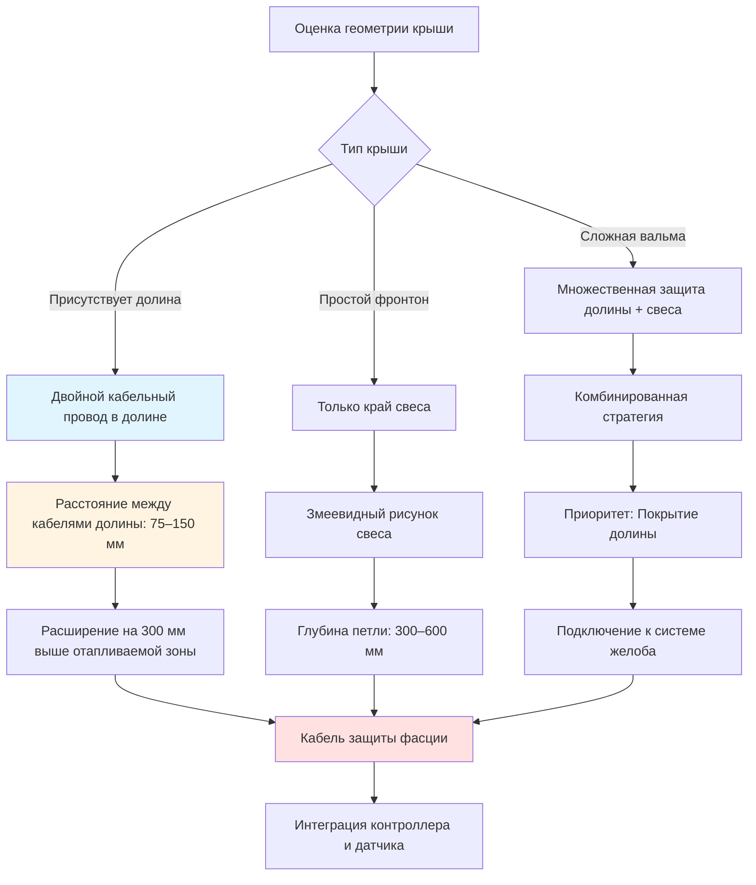

## Физические механизмы образования ледяных дамб

Ледяные дамбы формируются на крышных долинах и свесах через термодинамический процесс, вызванный дифференциальным нагревом. Тепловые потери через кровельный настил плавят снег на верхней поверхности крыши, создавая талую воду, которая стекает вниз. Когда эта вода достигает холодного карнизного выступа или долины, где отсутствует внутреннее тепло, она снова замерзает, образуя ледяной барьер, который задерживает последующую талую воду позади него.

Критический температурный градиент возникает на переходе от отапливаемых к неотапливаемым участкам крыши. Долины концентрируют поток талой воды с соседних плоскостей крыши, создавая локализованные условия высокого потока, которые ускоряют накопление льда. Карнизные выступы выходят за пределы отапливаемой строительной оболочки, обеспечивая холодную поверхность, необходимую для повторного замерзания.

## Требования к передаче тепла для предотвращения льда

Тепловая мощность, необходимая для предотвращения образования льда, должна превышать скорость удаления тепла при охлаждении и замерзании талой воды. Энергетический баланс включает чувствительное охлаждение талой воды от температуры поступления до 0°C и удаление скрытого тепла при фазовом переходе.

### Расчет теплонагрузки талой воды

Для заданного расхода талой воды $\dot{m}$, поступающей при температуре $T_m$, скорость удаления тепла при охлаждении и замерзании составляет:

$$Q_{total} = \dot{m} \left[ c_p (T_m - 0) + L_f \right]$$

где:
- $\dot{m}$ = массовый расход талой воды (кг/с)
- $c_p$ = удельная теплоемкость воды = 4 186 Дж/(кг·К)
- $T_m$ = температура поступления талой воды (°C)
- $L_f$ = скрытая теплота плавления = 334 000 Дж/кг

Чтобы предотвратить образование льда, приложенный тепловой поток должен удовлетворять:

$$q_{applied} \geq \frac{Q_{total}}{A_{heated}} + q_{ambient}$$

где $A_{heated}$ — площадь отапливаемой поверхности, а $q_{ambient}$ представляет потери окружающего тепла холодному воздуху и излучению.

### Расчетный тепловой поток для долин и свесов

Для стандартных жилых приложений в умеренном климате рекомендуемый тепловой поток составляет:

$$q_{design} = 200 \text{ to } 350 \text{ Вт/м}^2$$

Это соответствует выбору расстояния между кабелями и плотности мощности. Более высокие значения применяются к крутым долинам с большими областями дренажа или местам с суровыми зимними условиями.

## Стратегии защиты долин

Долины требуют усиленного отопления из-за концентрированного накопления снега и схождения талой воды с нескольких плоскостей крыши. Площадь дренажа, способствующая потоку в долину, составляет:

$$A_{drainage} = L_{valley} \cdot (W_1 + W_2)$$

где $L_{valley}$ — длина долины, а $W_1$, $W_2$ — горизонтальные ширины соседних плоскостей крыши, дренирующихся в долину.

### Конфигурация с двойным кабельным проводом

Защита долины обычно использует параллельные кабельные проводы с расстоянием 75–150 мм друг от друга, создавая отапливаемый канал вдоль центра долины. Эта конфигурация обеспечивает:

1. **Избыточность** — если один кабель выходит из строя, частичная защита продолжается
2. **Повышенный тепловой поток** — комбинированная выходная мощность превышает установки с одним кабелем
3. **Более широкий путь плавления** — вмещает более высокие объемы потока

Общая выходная мощность долины становится:

$$P_{valley} = 2 \cdot p_{linear} \cdot L_{valley}$$

где $p_{linear}$ — мощность кабеля на единицу длины (Вт/м).

## Принципы защиты свесов

Карнизные выступы требуют отопления для предотвращения замерзания талой воды на капельном крае. Критическая зона простирается от плоскости внешней стены до фасции, обычно 0,6–1,2 м в зависимости от глубины выступа.

### Размещение кабеля на свесах

Эффективная защита свесов использует змеевидный рисунок кабеля с петлями, проходящими вверх по крышному уклону и обратно к капельному краю. Глубина петли $d_{loop}$ должна удовлетворять:

$$d_{loop} \geq 0,3 \text{ м внутри отапливаемой оболочки}$$

Это обеспечивает, что растопленный снег и лед могут полностью соскользнуть с крыши без повторного замерзания.

### Отопление капельного края и фасции

Доска фасции требует защиты от накопления льда, которое может вызвать структурные повреждения и создать опасность падающего льда. Специальный кабельный провод вдоль капельного края обеспечивает:

- Непрерывное тепло на переходе крыша-желоб
- Предотвращение образования сосулек
- Структурную защиту фасции и софита

## Стратегии размещения кабелей по геометрии крыши

## Сравнение стратегий защиты по типу крыши

| Конфигурация крыши | Защита долины | Защита свеса | Плотность кабеля | Тепловой поток (Вт/м²) | Приоритетные зоны |
|-------------------|-------------------|-----------------|---------------|------------------|----------------|
| **Простой фронтон** | Не требуется | Змеевидные петли | 30–50 Вт/м | 200–250 | Капельный край, выступ |
| **Вальмовая крыша** | Одинарный провод долины | Полный периметр | 40–60 Вт/м | 250–300 | Стыки долин, свесы |
| **Сложная многодолинная** | Двойной провод долины | Усиленный свес | 50–80 Вт/м | 300–350 | Все долины, критический дренаж |
| **Низкий уклон (<3:12)** | Тройной провод долины | Удлиненные петли | 60–90 Вт/м | 350–400 | Вся нижняя часть |
| **Металлическая крыша** | Система кабеля с зажимом | Монтаж на шов | 40–70 Вт/м | 250–350 | Долины, швы панелей |
| **Плиточная/сланцевая** | Подтилевые каналы | Дискретный монтаж | 50–80 Вт/м | 300–400 | Кровельные облицовки долин, детали краев |

## Стандарты проектирования и коды установки

Системы защиты долин и свесов должны соответствовать:

- **IEEE 515.1** — Стандарт для испытания, проектирования, установки и обслуживания электрического резистивного нагревательного кабеля для коммерческих приложений
- **NFPA 70 (NEC)** — Статья 426: Стационарное наружное электрическое оборудование для удаления льда и снеготаяния
- **Справочник ASHRAE — Приложения HVAC** — Глава по таянию снега и защите от замерзания
- **Местные строительные коды** — Специальные требования для проникновений в крышу и электромонтажных работ

Ключевые требования кода включают:

1. **Защита GFCI** для всех схем крышного отопления
2. **Указанные компоненты** — кабели и контроллеры, сертифицированные UL или ETL
3. **Надлежащий размер схемы** — расчеты допустимой токоносимости согласно статье NEC 426
4. **Соединение и заземление** — компоненты металлической кровли и экраны кабелей

## Интеграция долины и свеса

Максимальная эффективность достигается, когда системы долины и свеса соединяются беспрепятственно. Талая вода из отапливаемых долин должна течь через отапливаемые свесы в желоба без повторного замерзания. Непрерывный отапливаемый путь требует:

$$L_{total} = L_{valley} + L_{eave} + L_{gutter}$$

где каждый сегмент поддерживает адекватный тепловой поток для ожидаемого расхода.

### Переходы петли к долине

На окончаниях долин петли свесов должны подключаться непосредственно к кабелям долины, исключая холодные пятна. Зона переходов получает усиленное отопление через перекрытие кабеля:

$$P_{transition} = P_{valley} + P_{eave}$$

Эта зона перекрытия простирается на 150–300 мм для компенсации термических мостиков через конструкцию крыши.

## Размещение датчиков для систем долины и свеса

Системы автоматического управления требуют датчиков, расположенных для обнаружения как накопления снега, так и условий таяния:

- **Датчики долины** — датчики влажности/температуры в центральных точках долины
- **Датчики свеса** — датчики, установленные на капельном крае или фасции
- **Датчики окружающей среды** — обнаружение температуры воздуха и осадков

Логика управления активирует отопление при:
1. Температура окружающей среды < 4°C
2. Влага присутствует в местах датчиков
3. Обнаружено накопление снега (дополнительный датчик глубины снега)

## Проверка производительности

Эффективность системы проверяется через:

- **Тепловизионную съемку** во время работы, показывающую непрерывное покрытие теплом
- **Визуальную инспекцию**, подтверждающую отсутствие образования льда во время циклов таяния
- **Тестирование силы тока**, проверяющее доставку расчетной мощности
- **Регистрацию контроллера**, документирующую режимы активации и время работы

Правильно спроектированная защита долины и свеса поддерживает условия без льда в критических областях крыши, предотвращая структурные повреждения и опасности безопасности от ледяных дамб и падающего льда.
