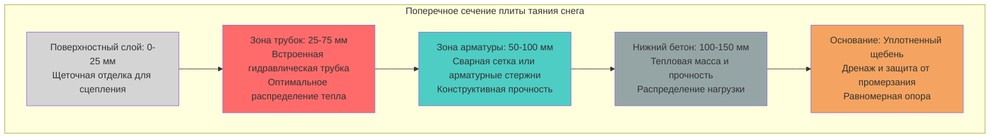

## Конструктивные и тепловые требования

Толщина бетона в системах таяния снега служит двум функциям, которые должны быть одновременно удовлетворены. Плита должна обеспечивать достаточную конструктивную прочность для сопротивления приложенным нагрузкам при сохранении достаточной тепловой массы для эффективного накопления и распределения тепла. Эти требования взаимосвязаны через глубину размещения нагревательных элементов, что влияет как на конструктивную целостность, так и на тепловую производительность.

### Минимальные стандарты толщины

Минимальная толщина плиты зависит от типа применения и условий нагружения:

| Тип применения | Минимальная толщина | Определяющий фактор | Расчетная нагрузка |
|-----------------|-------------------|------------------|-------------|
| Жилые подъездные пути | 100 мм | Тепловая масса | 2,4 кПа живая нагрузка |
| Жилые пешеходные дорожки | 100 мм | Тепловая однородность | 1,9 кПа живая нагрузка |
| Коммерческие парковки | 150 мм | Нагрузки от колес | 12,0 кПа живая нагрузка |
| Погрузочные платформы | 200 мм | Сосредоточенные нагрузки | 19,1 кПа живая нагрузка |
| Промышленные площадки | 250 мм | Тяжелое оборудование | 28,7+ кПа живая нагрузка |
| Стоянки воздушных судов | 300-450 мм | Нагрузки от воздушных судов | По стандартам FAA |

### Расчеты конструктивного проектирования

Толщина плиты для конструктивной прочности следует теории балок, адаптированной для двусторонних бетонных плит на грунте. Требуемая толщина зависит от несущей способности на изгиб:

$$
t = \sqrt{\frac{6M}{f_c' \cdot b}}
$$

Где:
- $t$ = толщина плиты (мм)
- $M$ = максимальный изгибающий момент (кН·м/м)
- $f_c'$ = прочность бетона на сжатие (МПа)
- $b$ = единичная ширина, типично 1 м

Изгибающий момент для равномерно распределенных нагрузок на плитах:

$$
M = \frac{w \cdot L^2}{8}
$$

Где:
- $w$ = приложенная нагрузка (кПа)
- $L$ = эффективный пролет между опорными точками (м)

Для сосредоточенных нагрузок уравнение Вестергаарда определяет угловые и краевые напряжения, определяющие толщину:

$$
\sigma = \frac{3P}{t^2} \left(1 - \left(\frac{a\sqrt{2}}{l}\right)^{0.6}\right)
$$

Где:
- $\sigma$ = напряжение при изгибе (МПа)
- $P$ = сосредоточенная нагрузка (кН)
- $a$ = радиус нагруженной площади (см)
- $l$ = радиус относительной жесткости (см)

### Учет тепловой массы

Тепловая масса бетона буферизирует колебания температуры и обеспечивает эффективное циклирование системы. Теплоемкость на единицу площади увеличивается линейно с толщиной:

$$
C_A = \rho \cdot c_p \cdot t
$$

Где:
- $C_A$ = теплоемкость на единицу площади (кДж/м²·K)
- $\rho$ = плотность бетона (2300 кг/м³ типично)
- $c_p$ = удельная теплоемкость (0,92 кДж/кг·K для бетона)
- $t$ = толщина (м)

Для плиты толщиной 150 мм:
$$
C_A = 2300 \times 0,92 \times 0,15 = 318 \text{ кДж/м²·K}
$$

Эта тепловая масса позволяет плите накапливать примерно 318 кДж на квадратный метр при повышении температуры на один градус Кельвина, обеспечивая тепловую инертность, которая снижает частоту циклирования и пиковые требования к отоплению.

### Требования к глубине размещения трубки

Нагревательная трубка должна быть позиционирована для сбалансирования конструктивных требований и эффективности теплопередачи. Глубина центральной линии трубки влияет на:

**Конструктивная целостность:** Трубка, расположенная в зоне растяжения (нижняя половина плиты под положительным моментом), не должна компрометировать размещение арматуры или требования к защитному слою бетона. ACI 318 требует минимум 20 мм защитного слоя для бетона, подвергаемого воздействию погодных условий.

**Тепловая производительность:** Чрезмерная глубина трубки увеличивает тепловую задержку и снижает отклик температуры поверхности. Одномерная постоянная времени теплопроводности:

$$
\tau = \frac{z^2}{\alpha}
$$

Где:
- $\tau$ = постоянная времени тепловой проводимости (часы)
- $z$ = глубина от поверхности до центральной линии трубки (м)
- $\alpha$ = температуропроводность (3,04 × 10⁻⁵ м²/с для бетона)

Для трубки на глубине 50 мм (0,05 м):
$$
\tau = \frac{(0,05)^2}{3,04 \times 10^{-5}} = 82 \text{ секунды}
$$

Это указывает примерно на 52 секунды для достижения температурой поверхности 63% своего установившегося значения после запуска системы.

### Конфигурация поперечного сечения плиты

### Стратегия оптимизации толщины

Выберите толщину плиты, используя эту иерархию:

1. **Рассчитайте конструктивное требование** на основе ожидаемых нагрузок, используя теорию балок или анализ методом конечных элементов для сложных геометрий
2. **Проверьте адекватность тепловой массы**, обеспечивая минимум 100 мм толщины для жилых помещений, 150 мм для коммерческих приложений
3. **Подтвердите глубину размещения трубки**, что позволяет надлежащий защитный слой бетона (минимум 50 мм выше трубки, 50 мм ниже)
4. **Проверьте размещение арматуры**, обеспечивая достаточное пространство для установки стали в соответствии со строительными чертежами
5. **Рассмотрите возможность строительства** со стандартными глубинами опалубки и логистикой укладки бетона

### Специальные соображения для увеличенной толщины

Плиты, превышающие 200 мм, требуют дополнительного анализа:

**Тепловая стратификация:** Толстые плиты могут развивать температурные градиенты, которые снижают эффективную тепловую массу. Множественные слои трубок на разных глубинах могут быть оправданы.

**Тепло гидратации:** Большие бетонные заливки выделяют значительное тепло во время отверждения, потенциально влияя на целостность трубки. Испытание под давлением до и после укладки бетона необходимо.

**Контроль усадки:** Более толстые плиты испытывают большую дифференциальную усадку между верхней и нижней поверхностями. Компенсационные швы должны быть расположены на расстоянии, типично в 15-20 раз больше толщины плиты.

### Нормативные стандарты

Проектирование нагреваемых бетонных плит должно соответствовать:
- **ACI 318:** Строительный кодекс требований к конструктивному бетону
- **ACI 332:** Жилищный кодекс требований к конструктивному бетону
- **ASHRAE Handbook - HVAC Applications:** Глава 51, Таяние снега и защита от замерзания
- **PCA:** Проектирование толщины для бетонных автомагистралей и уличных покрытий
- **CRSI:** Руководство стандартной практики для детализации арматуры

Надлежащий выбор толщины обеспечивает надежное функционирование нагреваемой плиты под конструктивными нагрузками и тепловым циклированием на протяжении всего проектного срока службы. Координация между конструктивными и механическими инженерами во время проектирования предотвращает конфликты между требованиями несущей способности и оптимизацией системы отопления.
