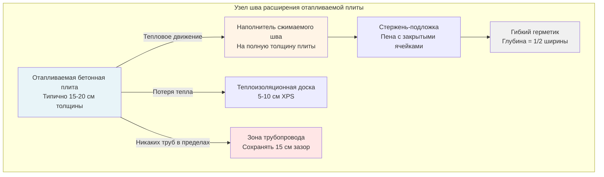

## Физические основы термического расширения в отапливаемых плитах

Бетон претерпевает изменения размеров при воздействии температурных колебаний. В системах снеготаяния плиты испытывают температурные перепады от -29°C до 21°C выше окружающей температуры во время работы. Это температурное колебание создает существенные силы расширения, которые требуют надлежащего размещения через швы расширения.

Фундаментальное соотношение, управляющее термическим расширением:

$$\Delta L = \alpha \cdot L_0 \cdot \Delta T$$

Где:
- $\Delta L$ = изменение длины (см)
- $\alpha$ = коэффициент термического расширения (см/см/°C)
- $L_0$ = исходная длина (м)
- $\Delta T$ = изменение температуры (°C)

Для стандартного бетона $\alpha \approx 9.9 \times 10^{-6}$ см/см/°C. Плита длиной 30,5 м, испытывающая повышение температуры на 33°C, расширится на:

$$\Delta L = 9.9 \times 10^{-6} \times 30.5 \times 33 = 0.01 \text{ м} = 1.0 \text{ см}$$

Это движение примерно на 1 сантиметр должно быть приспособлено, чтобы предотвратить растрескивание, отслаивание и структурное повреждение.

## Типы швов расширения для отапливаемых плит

Применение отапливаемого бетона требует швов, способных выдерживать повторяющиеся тепловые циклы при сохранении структурной целостности и предотвращении проникновения воды.

| Тип шва | Возможность движения | Диапазон температур | Типичное применение | Долговечность |
|---------|---------------------|---------------------|---------------------|---------------|
| Компрессионное уплотнение | ±25% ширины шва | -40°C до 82°C | Изоляция периметра | Отличная |
| Залитое герметиком | ±12,5% ширины шва | -29°C до 71°C | Внутренние швы управления | Хорошая |
| Предформованная пена | До 50% сжатия | -34°C до 60°C | Изоляционные швы | Удовлетворительная |
| Металлические сильфоны | ±5 см | -46°C до 93°C | Тяжелые приложения | Отличная |
| Скользящая пластина | Неограниченно в плоскости | -40°C до 93°C | Большое термическое движение | Отличная |

### Системы компрессионного уплотнения

Швы компрессионного уплотнения используют предформованные эластомерные прокладки, сжатые между поверхностями бетона. Уплотнение поддерживает непрерывный контакт на протяжении всего цикла расширения-сжатия. Проектирование требует:

$$W_{шва} = \frac{\Delta L_{макс}}{0.25}$$

Где $W_{шва}$ — минимальная ширина шва и $\Delta L_{макс}$ — максимальное ожидаемое движение. Для движения на 1 см минимальная ширина шва составляет 4 см.

### Швы с залитым герметиком

Двухкомпонентные полиуретановые или полисульфидные герметики склеиваются с поверхностями бетона и растягиваются при расширении. Коэффициент формы определяет производительность:

$$SF = \frac{W}{D}$$

Где $W$ — ширина шва и $D$ — глубина герметика. Оптимальные коэффициенты формы варьируются от 1:1 до 2:1 для отапливаемых приложений.

## Требования к расстояниям между швами

Максимальное расстояние между швами зависит от допустимого растягивающего напряжения в бетоне и условий ограничения. Основное соотношение:

$$L_{макс} = \sqrt{\frac{2 \cdot f_t \cdot h}{\alpha \cdot E \cdot \Delta T \cdot \mu}}$$

Где:
- $f_t$ = допустимое растягивающее напряжение (кПа)
- $h$ = толщина плиты (см)
- $E$ = модуль упругости (кПа)
- $\mu$ = коэффициент трения подстилающего основания

Для типичных плит снеготаяния (15 см толщины, рабочий дифференциал 18°C):
- Неармированный бетон: максимальное расстояние 3,7-4,6 м
- Армированный бетон: максимальное расстояние 6,1-7,6 м
- Предварительно напряженные плиты: максимальное расстояние 12,2-18,3 м

## Детали швов расширения

## Проектные рассмотрения для отапливаемых плит

### Зазор трубопровода

Гидравлический трубопровод должен поддерживать минимальный зазор 15 см от швов расширения. Более близкое расположение создает концентрации напряжений при движении шва, рискуя повреждением трубы. Трубопроводы проходят перпендикулярно швам, когда это возможно.

### Прерывание армирования

Арматурная сталь должна быть полностью отключена на швах расширения. Непрерывная армировка аннулирует функцию шва, создавая ограничение. Используйте гладкие шпонки для передачи нагрузки без ограничения движения.

### Деталь краевой изоляции

Вертикальная изоляция вдоль краев швов снижает потери тепла и предотвращает проникновение мороза под шов. Минимум 5 см толщины экструдированного полистирола (XPS) простирается на глубину подстилающего основания.

### Время активации шва

Швы должны быть вырезаны или сформированы в течение 12-24 часов после укладки бетона, чтобы контролировать растрескивание. Для отапливаемых плит начальная работа системы должна происходить после 28-дневного отверждения для установления функции шва перед тепловыми циклами.

## Анализ термического напряжения

Ограниченное термическое расширение генерирует напряжение согласно:

$$\sigma = \alpha \cdot E \cdot \Delta T \cdot R$$

Где $R$ — степень ограничения (от 0 до 1). Для полностью ограниченного бетона с $E = 24,8 \times 10^3$ МПа и $\Delta T = 28°C$:

$$\sigma = 9.9 \times 10^{-6} \times 24.8 \times 10^3 \times 28 \times 1 = 6.8 \text{ МПа}$$

Это напряжение превышает растягивающую прочность бетона (2,8-4,1 МПа), требуя швов расширения для снижения ограничения.

## Последовательность установки

1. **Подготовка подстилающего основания** — уплотнение и выравнивание для предотвращения неравномерной осадки
2. **Размещение изоляции** — непрерывный слой со смещенными швами
3. **Установка формирователя швов** — закрепление вертикальных элементов перед укладкой бетона
4. **Укладка бетона** — предотвращение смещения материалов швов
5. **Вырезание швов** (если метод пилы) — в течение 24 часов на глубину одной трети толщины плиты
6. **Период отверждения** — минимум 28 дней перед запуском системы отопления
7. **Установка герметика** — после очистки и грунтовки шва, перед активацией системы

## Факторы производительности в полевых условиях

Производительность шва расширения в отапливаемых плитах зависит от:

- **Величина температурного дифференциала** — большие колебания требуют более широких швов
- **Размеры плиты** — более длинные пролеты накапливают больше полного расширения
- **Условия ограничения** — крепления периметра увеличивают напряжение
- **Частота циклирования** — повторяющееся движение утомляет материалы герметика
- **Воздействие окружающей среды** — циклы замораживания-оттаивания и химические вещества для удаления льда деградируют материалы швов

Надлежащее проектирование швов расширения, детализация и установка обеспечивают долгосрочную производительность систем снеготаяния, приспосабливаясь к тепловому движению при сохранении структурной целостности и гидроизоляции.
