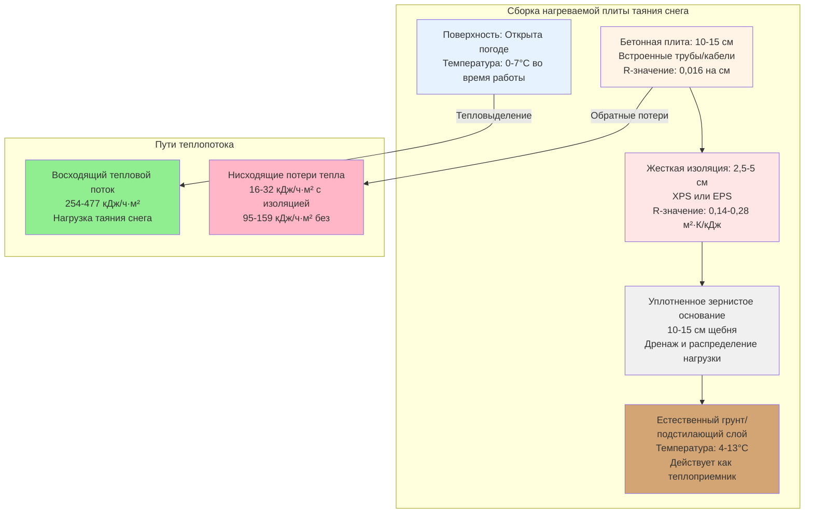

## Тепловая функция подповерхностной изоляции

Подповерхностная изоляция выполняет одну критическую функцию в системах таяния снега: перенаправить тепловой поток вверх через поверхность дорожного покрытия, а не вниз в грунт. Без изоляции грунт под плитой действует как бесконечный теплоприемник, потребляя 30-50% тепловой мощности системы без пользы для производительности поверхностного таяния снега.

Физика, управляющая этим явлением, следует закону теплопроводности Фурье. Тепло течет от высоких к низким температурам со скоростью, пропорциональной температурному градиенту и обратно пропорциональной тепловому сопротивлению. Температура грунта обычно остается в диапазоне 4-13°C на глубине более 2 м, создавая значительный температурный перепад, когда температура плиты достигает 2-7°C во время работы. Этот температурный градиент вызывает непрерывные потери тепла вниз, если их не прерывает тепловое сопротивление.

## Анализ теплопередачи обратных потерь

Нисходящий тепловой поток через неизолированные и изолированные конструкции можно количественно оценить с помощью анализа одномерной установившейся теплопроводности.

**Обратные потери без изоляции:**

$$q_{back,uninsulated} = \frac{T_{slab} - T_{ground}}{R_{concrete} + R_{soil}}$$

Где:
- $q_{back,uninsulated}$ = нисходящий тепловой поток (кДж/ч·м²)
- $T_{slab}$ = температура рабочей плиты (°C)
- $T_{ground}$ = температура глубокого грунта (°C)
- $R_{concrete}$ = тепловое сопротивление бетона (ч·м²·°C/кДж)
- $R_{soil}$ = тепловое сопротивление слоя грунта (ч·м²·°C/кДж)

**Обратные потери с изоляцией:**

$$q_{back,insulated} = \frac{T_{slab} - T_{ground}}{R_{concrete} + R_{insulation} + R_{soil}}$$

Эффективность изоляции, выраженная как снижение теплопотерь, составляет:

$$\eta_{insulation} = \frac{q_{back,uninsulated} - q_{back,insulated}}{q_{back,uninsulated}} \times 100\%$$

**Практический пример:**

Для плиты, работающей при 4°C с температурой грунта 10°C, бетоном толщиной 15 см (R-0,1), и уплотненным грунтом (R-0,03 на 30 см):

Без изоляции:
$$q_{back} = \frac{4 - 10}{0,1 + 0,1} = -30 \text{ кДж/ч·м²}$$

С XPS толщиной 5 см (R-0,28):
$$q_{back} = \frac{4 - 10}{0,1 + 0,28 + 0,1} = -4,1 \text{ кДж/ч·м²}$$

Это представляет 86% снижение обратных потерь, непосредственно улучшающее эффективность системы и снижающее эксплуатационные расходы.

## Сборка подповерхностной изоляции

## Выбор материала жесткой изоляции

Подповерхностная среда имеет специфические требования: устойчивость к сжатию для поддержки нагрузок плиты и движения, влагонепроницаемость и размерную стабильность во влажных условиях. Три типа жесткой пеновой изоляции соответствуют этим критериям.

| Тип изоляции | R-значение на см | Прочность на сжатие | Водопоглощение | Коэффициент стоимости |
|----------------|------------------|---------------------|--------------------|--------------|
| Экструдированный полистирол (XPS) | 0,88 | 172-413 кПа | 0,1% по объему | 1,5x |
| Вспененный полистирол (EPS Тип II) | 0,74 | 103-172 кПа | 2-4% по объему | 1,0x |
| Полиизоцианурат (Polyiso) | 1,14 | 172-276 кПа | 1-3% по объему | 1,8x |
| Ячеистое стекло | 0,51 | 690+ кПа | 0% (непроницаемо) | 3,0x |

**Критерии выбора материала:**

1. **Экструдированный полистирол (XPS):** Промышленный стандарт для приложений таяния снега. Закрытоячеистая структура обеспечивает превосходную влагоустойчивость и сохраняет R-значение во влажных условиях. Прочность на сжатие 172 кПа поддерживает нагрузки от автотранспорта при надлежащем распределении через бетонную плиту. Синий или розовый цвет помогает проверке при установке.

2. **Вспененный полистирол (EPS Тип II):** Более экономичная альтернатива, требующая внимания к дренажу. Марка Тип II (плотность 21,6 кг/м³) обеспечивает адекватную прочность на сжатие. Должен быть защищен от длительного воздействия воды, так как водопоглощение снижает тепловые характеристики на 15-30%.

3. **Полиизоцианурат:** Наибольшее R-значение на единицу толщины, но зависящие от температуры характеристики. R-значение падает до примерно 0,97 м²·К/кДж при средней температуре 4°C. Фольговые облицовки обеспечивают пароизоляцию, но могут усложнить прилипание бетона.

4. **Ячеистое стекло:** Используется в приложениях с высокими нагрузками (тяжелый грузовой транспорт, посадка самолетов). Нулевое водопоглощение и негорючие свойства оправдывают более высокую стоимость в критических установках.

## Требования к толщине изоляции и R-значению

Рекомендации ASHRAE для систем таяния снега предусматривают минимальную подповерхностную изоляцию R-0,14 м²·К/кДж для экономической работы, при этом R-0,28 м²·К/кДж предпочтительна в холодном климате, где температуры грунта сезонно падают ниже 7°C.

**Экономическая оптимизация:**

Оптимальная толщина изоляции возникает, когда дополнительная стоимость изоляции равна приведенной стоимости энергосбережения в течение всего срока службы системы. Этот расчет требует:

$$NPV = \sum_{n=1}^{L} \frac{q_{saved} \times A \times h \times c_{energy}}{(1 + i)^n} - C_{insulation}$$

Где:
- $NPV$ = чистая приведенная стоимость ($)
- $q_{saved}$ = снижение теплопотерь (кДж/ч·м²)
- $A$ = площадь плиты (м²)
- $h$ = годовые часы работы (ч/год)
- $c_{energy}$ = стоимость энергии ($/кДж)
- $i$ = ставка дисконтирования (десятичная)
- $n$ = номер года
- $L$ = срок службы системы (лет)
- $C_{insulation}$ = установленная стоимость изоляции ($)

Для типичных установок с природным газом стоимостью $0,030/кДж и 400 часов годовой работы, XPS толщиной 5 см (R-0,28) обеспечивает окупаемость в течение 3-5 лет по сравнению с неизолированной конструкцией.

## Детали краевой изоляции

Потери тепла периметра через края плиты создают холодные пятна и неравномерные картины таяния. Условие края представляет более низкое тепловое сопротивление из-за более коротких путей теплопотока к окружающему воздуху и воздействия конвекции ветра.

**Конфигурация краевой изоляции:**

- **Вертикальный размер:** Расширьте изоляцию на полную глубину плиты плюс 30-60 см ниже дна плиты
- **Тепловое сопротивление:** Минимум R-0,28 м²·К/кДж, предпочтительно R-0,42 м²·К/кДж в климатических зонах 6-8
- **Материал:** Та же спецификация, что и подповерхностная изоляция для совместимости
- **Защита:** Закройте открытые края металлическим планом или защитным покрытием

Тепловой поток через неизолированный край можно оценить по формуле:

$$q_{edge} = UA(T_{slab} - T_{ambient})$$

Где значение UA края обычно колеблется от 2,85-5,68 кДж/ч·м·°C для неизолированных условий, снижаясь до 0,29-0,57 кДж/ч·м·°C при надлежащей краевой изоляции.

## Требования по установке

Надлежащая установка обеспечивает проектные тепловые характеристики:

1. **Подготовка основания:** Уплотните зернистое основание до 95% по стандартной методике проктора. Выровняйте до 0,6 см на 3 м для предотвращения раскачивания изоляционных плит и точечных нагрузок.

2. **Раскладка плит:** Смещайте швы в коврик-рисунок. Заклейте швы одобренной производителем клейкой лентой для предотвращения попадания бетона во время заливки.

3. **Дренаж:** Установите дренаж периметра для предотвращения накопления воды под изоляцией. Застойная вода создает тепловые короткие замыкания и снижает производительность EPS.

4. **Защита во время строительства:** Накройте изоляцию полиэтиленовой пленкой или строительной бумагой перед заливкой бетона. Это предотвращает прямой контакт между влажным бетоном и изоляцией, который может растворить поверхность пены.

5. **Краевая обработка:** Загерметизируйте периметральную изоляцию к стенам фундамента или поясам класса с совместимым герметиком для устранения путей теплового короткого замыкания.

## Стандарты проектирования и ссылки

Проектирование изоляции системы таяния снега следует этим стандартам:

- **ASHRAE Handbook - HVAC Applications, Chapter 51:** Системы таяния снега и защиты от замерзания, методология теплового проектирования
- **ASTM C578:** Стандартная спецификация для жесткой ячеистой изоляции из полистирола
- **ASTM C1289:** Стандартная спецификация для облицованной жесткой ячеистой изоляционной плиты из полиизоцианурата
- **ACI 332:** Требования строительных норм для конструкционного бетона и комментарий, размещение фундаментной изоляции

Надлежащая подповерхностная изоляция трансформирует системы таяния снега из слабо эффективных потребителей энергии в надежные, эффективные установки, которые поддерживают чистые поверхности на протяжении всех зимних погодных событий. Тепловое сопротивление, обеспечиваемое 2,5-5 см жесткой изоляции, перенаправляет 80-90% нисходящих потерь тепла на продуктивную работу таяния снега, снижая эксплуатационные расходы и улучшая отзывчивость системы во время штормов.
