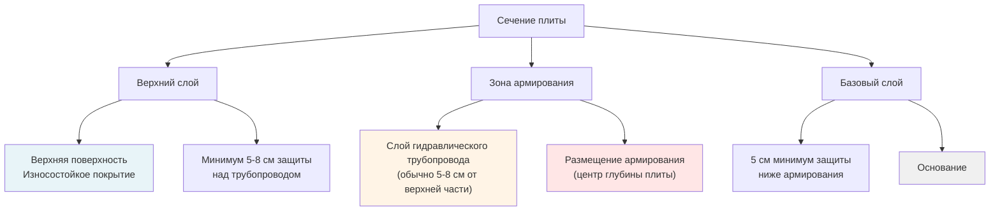
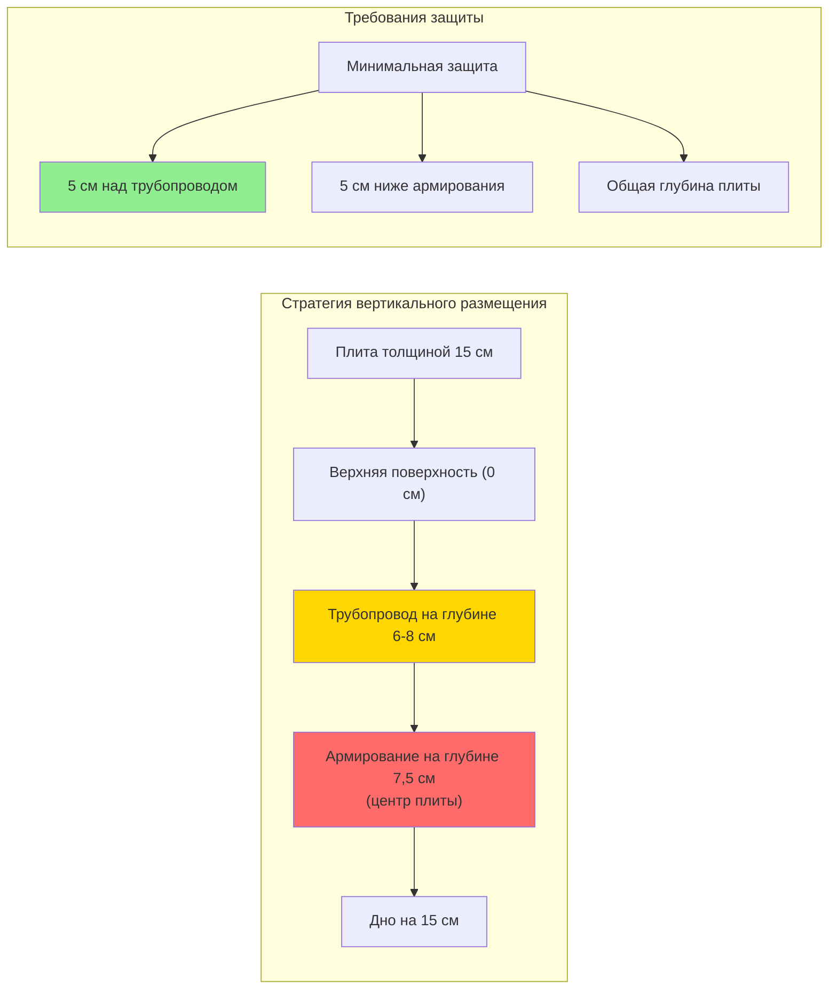

Армирование бетона в нагреваемых плитах снеготаяния выполняет две функции: контролирует растрескивание, вызванное термическими напряжениями, и управляет конструктивными нагрузками. Циклический нагрев создаёт температурные градиенты, генерирующие растягивающие напряжения, требующие тщательного проектирования армирования сверх обычных спецификаций плит.

## Механика термических напряжений в нагреваемых плитах

Когда плита снеготаяния работает, разница температур между нагреваемой поверхностью и основанием создаёт внутренние напряжения. Коэффициент теплового расширения бетона обычно составляет от 5,5 до 7,0 × 10⁻⁶ /°C.

### Расчёт термического напряжения

Термическое напряжение, развивающееся в закреплённой бетонной плите, следует уравнению:

$$\sigma_{\text{thermal}} = \alpha \cdot E \cdot \Delta T \cdot R$$

Где:
- $\sigma_{\text{thermal}}$ = термическое напряжение (МПа)
- $\alpha$ = коэффициент теплового расширения (1/°C)
- $E$ = модуль упругости бетона (обычно 3-5 × 10⁴ МПа)
- $\Delta T$ = разница температур по глубине плиты (°C)
- $R$ = коэффициент закрепления (0 = свободное движение, 1 = полное закрепление)

Для типичной плиты снеготаяния с водой подачи при температуре 43°C (110°F) и основанием при 4°C (40°F), температурный градиент генерирует значительное растягивающее напряжение:

$$\sigma_{\text{thermal}} = 6,5 \times 10^{-6} \times 4 \times 10^4 \times 39 \times 0,6 = 6,1 \text{ МПа}$$

Это напряжение превышает прочность бетона на растяжение (обычно 2,8-4,9 МПа), требуя армирования для контроля ширины и расстояния между трещинами.

### Температурный градиент по глубине плиты

Распределение температуры по глубине плиты следует:

$$T(z) = T_{\text{bottom}} + (T_{\text{surface}} - T_{\text{bottom}}) \cdot \left(\frac{z}{h}\right)$$

Где $z$ — глубина от дна и $h$ — общая толщина плиты.

Максимальный температурный градиент возникает при максимальном нагреве:

$$\frac{dT}{dz} = \frac{T_{\text{surface}} - T_{\text{bottom}}}{h}$$

Для плиты толщиной 15 см (6 дюймов) с разницей 28°C (50°F): градиент = 28°C / 0,15 м = 187°C/м.

## Типы армирования и характеристики производительности

| Тип армирования | Типичная спецификация | Прочность на растяжение | Термическая производительность | Коэффициент стоимости | Применение |
|-------------------|----------------------|------------------|---------------------|-------------|-------------|
| Сварная сетка (WWM) | 150×150 W2,9×W2,9 | 483 МПа | Отличное распределение | 1,0× | Жилые подъезды |
| Сварная сетка (WWM) | 150×150 W4×W4 | 483 МПа | Превосходный контроль | 1,3× | Коммерческие парковки |
| Арматурная сетка | Ø12 @ 30 см в обоих направлениях | 414 МПа | Отличное | 1,5× | Зоны с интенсивным движением |
| Арматурная сетка | Ø16 @ 30 см в обоих направлениях | 414 МПа | Превосходное | 2,0× | Промышленные применения |
| Волокнистое армирование | 3-5 кг/м³ синтетическое | Варьируется | Хороший контроль трещин | 0,8× | Только как дополнение |
| Волокнистое армирование | 30-50 кг/м³ стальное | Варьируется | Улучшенное распределение | 1,2× | В сочетании с WWM |

### Армирование сварной сеткой

Сварная сетка обеспечивает распределённое армирование, идеальное для контроля термических трещин. Обозначение провода (W2,9 = 0,186 см² площади поперечного сечения на фут ширины) определяет несущую способность.

**Минимальное отношение армирования для термического контроля:**

$$\rho_{\text{min}} = \frac{0,0018 \cdot b \cdot h}{A_s} \leq 0,0020$$

Для нагреваемых плит указывайте минимум 150×150 W2,9×W2,9 (0,186 см²/м в каждом направлении). Тяжелые применения требуют 150×150 W4×W4 (0,258 см²/м).

### Армирование арматурной сеткой

Деформированные арматурные стержни обеспечивают более высокую несущую способность для конструктивных нагрузок в сочетании с управлением термическим напряжением. Стандартные конфигурации:

- **Жилые:** стержни Ø12 @ 45 см в обоих направлениях
- **Коммерческие:** стержни Ø12 @ 30 см в обоих направлениях
- **Тяжелые:** стержни Ø16 @ 30 см в обоих направлениях

Требуемая площадь стали уравновешивает термическое напряжение и конструктивную нагрузку:

$$A_s = \frac{\sigma_{\text{thermal}} \cdot A_c}{f_y}$$

Где $f_y$ — предел текучести армирования (414 МПа для стали класса А400).

### Волокнистое армирование

Синтетические или стальные волокна дополняют основное армирование, но не могут его заменить в нагреваемых плитах. Волокна контролируют пластическое усадочное растрескивание и повышают ударостойкость. Типовая дозировка: 3-5 кг/м³ для синтетических, 30-50 кг/м³ для стальных волокон.

## Требования к размещению армирования

Правильное вертикальное позиционирование в сечении плиты критично для управления термическим напряжением и конструктивной производительности.

### Стратегия размещения в центре плиты

Позиционируйте армирование на нейтральной оси (центр глубины) для:

1. **Максимизации сопротивления изгибу** для конструктивных нагрузок
2. **Распределения термических напряжений** равномерно между верхом и низом
3. **Контроля ширины трещин** через оптимальную передачу напряжений
4. **Обеспечения адекватной защиты** для защиты от коррозии

**Расчёт размещения для толщины плиты h:**

$$d_{\text{reinforcement}} = \frac{h}{2} \pm 0,6 \text{ см допуска}$$

Для плиты толщиной 15 см: размещайте армирование на 7,5 см от любой поверхности.

### Требования защиты над трубопроводом

Обеспечивайте минимум 5 см бетонной защиты над гидравлическим трубопроводом для:

- Предотвращения поверхностного растрескивания над путями трубопровода
- Обеспечения адекватного распределения тепла на поверхность
- Обеспечения конструктивной целостности над трубопроводом
- Защиты трубопровода от повреждения при ударе

**Проверка критической размер:**

$$d_{\text{cover}} = d_{\text{total}} - d_{\text{tubing}} - t_{\text{tubing}} \geq 5,0 \text{ см}$$

### Минимальная защита ниже армирования

Обеспечивайте минимум 5 см защиты ниже армирования для:

- Защиты от коррозии (особенно при использовании противогололёдных солей)
- Укрепления бетона под сталью
- Развития прочности сцепления
- Долговечности при циклах замораживания-оттаивания

**Для наружных плит, подверженных воздействию противогололёдных реагентов:** увеличивайте нижнюю защиту до минимум 8 см.

## Последовательность размещения армирования

1. **Подготовьте основание:** уплотните до 95% модифицированной плотности Проктора
2. **Установите пароизоляцию:** 0,25 мм полиэтилен с герметизированными швами
3. **Поместите изоляцию:** жёсткий XPS или EPS согласно тепловому проектированию
4. **Установите опоры трубопровода:** сохраняйте проектируемое расстояние и возвышение
5. **Установите трубопровод:** закрепите для предотвращения всплывания во время бетонирования
6. **Позиционируйте армирование:** используйте опорные блоки для сохранения возвышения в центре плиты
7. **Проверьте размеры защиты:** контролируйте расстояние от трубопровода и нижнюю защиту
8. **Поместите бетон:** вибрируйте адекватно без смещения армирования

## Соображения при проектировании

**Условия закрепления значительно влияют на величину термического напряжения:**

- Свежеуложенные плиты (R ≈ 0,2-0,3): минимальное закрепление, меньшее напряжение
- Затвердевшие плиты (R ≈ 0,5-0,7): увеличенное закрепление от трения основания
- Краевые условия (R ≈ 0,8-1,0): высокое закрепление близ неподвижных границ

**Расстояние между швами должно допускать термическое расширение:**

$$L_{\text{max}} = \frac{\sigma_{\text{allow}}}{\alpha \cdot E \cdot \Delta T \cdot R}$$

Типовое расстояние между швами: 4,5-6 м для нагреваемых плит (ближе, чем для ненагреваемых плит).

**Непрерывность армирования через контрольные швы:** прекращайте армирование на швах или предусмотрите шпонки для передачи нагрузок при допущении термического движения.

## Контрольный список спецификации

- [ ] Тип армирования выбран на основе требований нагрузки и термических параметров
- [ ] Минимальное соотношение стали соответствует 0,0018 для термического контроля
- [ ] Размещение в центре плиты проверено (h/2 ± 0,6 см)
- [ ] Минимум 5 см защиты над трубопроводом подтверждены
- [ ] Минимум 5 см защиты ниже армирования подтверждены (8 см при воздействии противогололёдных реагентов)
- [ ] Опорные блоки или опоры указаны для сохранения позиции во время бетонирования
- [ ] Проектирование бетонной смеси включает вовлечение воздуха (5-7%) для долговечности при замораживании-оттаивании
- [ ] Расстояние между швами учитывает термическое расширение (максимум 4,5-6 м)
- [ ] Краевые условия закрепления оценены для увеличенного термического напряжения

Надлежащее проектирование и размещение армирования обеспечивают, что нагреваемые плиты сопротивляются циклам термического напряжения, сохраняя конструктивную целостность на протяжении десятилетий эксплуатации систем снеготаяния.
