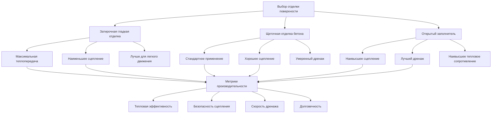

Выбор отделки поверхности напрямую влияет на производительность системы растопления снега через его влияние на тепловое контактное сопротивление, эффективность дренажа талой воды и долговечность при циклах замораживания-оттаивания. Тип отделки определяет высоту шероховатости поверхности, которая влияет как на теплопередачу к интерфейсу снег-плита, так и на скорость эвакуации водяной пленки.

## Физика поверхностной текстуры

Шероховатость поверхности создает тепловое контактное сопротивление между слоем снега и нагреваемым бетоном. Это сопротивление добавляется к общему пути теплового сопротивления от нагревательного элемента к поверхности снега.

Эффективный коэффициент теплопередачи на текстурированном интерфейсе:

$$h_{eff} = \frac{1}{\frac{1}{h_{conv}} + \frac{R_a}{k_{concrete}}}$$

Где:
- $h_{conv}$ = коэффициент конвективной теплопередачи (Вт/м²·K)
- $R_a$ = средняя высота шероховатости поверхности (м)
- $k_{concrete}$ = теплопроводность бетона (1,4–2,0 Вт/м·K)

Для гладких затирочных отделок $R_a$ = 5–20 мкм, в то время как щеточные отделки производят $R_a$ = 50–150 мкм. Это различие создает вариацию эффективности теплопередачи 3–8% при первоначальном контакте со снегом.

## Требования к уклону дренажа

Удаление талой воды предотвращает повторное замерзание и образование льда, когда система выключена. Минимальный уклон обеспечивает, чтобы гравитационный дренаж преодолел силы поверхностного натяжения, которые удерживали бы водяные пленки.

Критический уклон дренажа для полной эвакуации водяной пленки:

$$S_{min} = \frac{\tau_w}{\rho_w g h_f}$$

Где:
- $\tau_w$ = поверхностное напряжение сдвига от вязкости воды (0,001 Па типично)
- $\rho_w$ = плотность воды (1000 кг/м³)
- $g$ = ускорение свободного падения (9,81 м/с²)
- $h_f$ = толщина водяной пленки (1–3 мм)

Это дает теоретический минимальный уклон 0,3–0,5%. Однако, принимая во внимание допуски при строительстве, неправильности поверхности и требования ускоренного дренажа, практический минимальный уклон составляет:

$$S_{practical} = 1,0\% \text{ до } 2,0\%$$

Уклоны ниже 1,0% приводят к скоплению воды и продленным циклам таяния. Уклоны выше 4,0% могут создать проблемы безопасности пешеходов на ледяных поверхностях до полного таяния.

## Выбор типа отделки

## Сравнение отделок поверхности

| Тип отделки | Шероховатость поверхности Ra (мкм) | Тепловая эффективность | Рейтинг сцепления | Скорость дренажа | Долговечность при циклах замораживания-оттаивания |
|-------------|---------------------------|-------------------|-----------------|---------------|------------------------|
| Затирочная гладкая | 5–20 | Отличная (100% базовая) | Плохая | Умеренная | Хорошая |
| Легкая щеточная | 50–100 | Очень хорошая (95–97%) | Хорошая | Хорошая | Очень хорошая |
| Тяжелая щеточная | 100–150 | Хорошая (92–95%) | Очень хорошая | Очень хорошая | Отличная |
| Открытый заполнитель 6 мм | 3000–4000 | Удовлетворительная (85–90%) | Отличная | Отличная | Отличная |
| Открытый заполнитель 10 мм | 5000–7000 | Удовлетворительная (80–88%) | Отличная | Отличная | Отличная |

## Стандарты подготовки поверхности

Надлежащая отделка поверхности для нагреваемых плит требует определенного времени и методов для предотвращения повреждения встроенных нагревательных элементов.

**Критическая последовательность установки:**
1. Укладка бетона и выравнивание до окончательного уровня + допуск на отделку
2. Грубая затирка, когда исчезает вода кровотечения (нагревательные трубы защищены)
3. Применение отделки, когда бетон выдерживает давление ноги с отпечатком 6 мм
4. Избегать чрезмерной затирки над местоположениями нагревательных труб
5. Немедленное твердение после отделки для предотвращения образования трещин на поверхности

**Применение щеточной отделки:**
- Мазки перпендикулярно направлению уклона дренажа
- Поддержание постоянного давления для равномерной текстуры
- Глубина щетки: 1–2 мм для легкой отделки, 2–4 мм для тяжелой отделки
- Время критично: слишком рано вызывает разрывы, слишком поздно препятствует текстурированию

**Процесс открытого заполнителя:**
- Применение замедлителя поверхности 1–2 часа после начального схватывания
- Промывка и чистка щеткой, когда бетон сопротивляется проникновению на 20 мм
- Целевая глубина вскрытия: 1/4 до 1/3 диаметра зерна заполнителя
- Избегать чрезмерной промывки рядом с расположением нагревательных элементов

## Влияние на тепловую производительность

Отделка поверхности влияет на переходную реакцию при начале снегопада. Гладкие поверхности достигают более быстрого начального таяния, в то время как текстурированные поверхности требуют 15–30 минут дольше для установления полных паттернов таяния.

Время достижения полного покрытия поверхности таянием:

$$t_{melt} = \frac{\rho_s L_f h_s}{q_{surface}} \left(1 + \frac{R_a}{h_s}\right)$$

Где:
- $\rho_s$ = плотность снега (50–200 кг/м³)
- $L_f$ = скрытая теплота плавления (334 кДж/кг)
- $h_s$ = глубина накопления снега (м)
- $q_{surface}$ = поверхностный тепловой поток (Вт/м²)

Это уравнение демонстрирует, что высота шероховатости становится пропорционально более значительной при уменьшении глубины снега, особенно влияя на финальную фазу очистки.

## Интеграция конструкции дренажа

Уклон поверхности должен координироваться с деталями края плиты, дренажными входами и переходами периметра. Недостаточный уклон создает зоны стоячей воды, которые замерзают повторно во время цикла выключения системы, увеличивая потребление энергии на 15–25%.

**Конфигурация уклона:**
- Минимум: 1,0% (1/8 дюйма на фут или ~0,83 см/м)
- Типичный: 1,5% (3/16 дюйма на фут или ~1,25 см/м)
- Максимум: 2,5% (5/16 дюйма на фут или ~2,08 см/м)
- Длина пути дренажа: максимум 7,5 м до точки сбора

Создавайте положительный дренаж ко всем краям. Избегайте проектирования паттернов уклона, которые направляют талую воду к входам зданий или создают низкие точки на поле.

## Критерии выбора отделки

Выбирайте отделку поверхности на основе:

**Пешеходные зоны:** Легкая или средняя щеточная отделка (1,5–2 мм глубина текстуры) обеспечивает оптимальный баланс сцепления, тепловой эффективности и дренажа.

**Автомобильные зоны:** Тяжелая щеточная или легкая открытая заполнитель обеспечивает сцепление при разгоне и торможении, сохраняя при этом адекватную теплопередачу.

**Высокоэстетичная архитектура:** Гладкая затирочная отделка с интегральным цветом требует увеличенной тепловой мощности (добавить 10–15% емкости), но обеспечивает превосходный эстетический вид.

**Интенсивное коммерческое движение:** Открытый заполнитель 6–8 мм обеспечивает максимальную долговечность и самый длительный срок службы при повторяющихся циклах замораживания-оттаивания и механическом истирании.

Отделка поверхности представляет финальный интерфейс, где тепловая энергия передается для таяния снега. Надлежащий выбор и установка напрямую определяют эффективность системы, энергетическую эффективность и надежность долгосрочной производительности.
