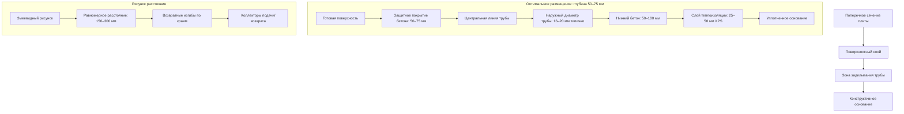

## Физические принципы размещения труб

Размещение гидравлических труб в бетонной плите непосредственно определяет три критических параметра производительности: эффективность теплопередачи на поверхность, время теплового отклика и долговечность конструкции. Передача тепла от встроенных труб следует проводимости через бетон, причем глубина является основной переменной, контролирующей тепловой поток на поверхность.

### Теплопередача от встроенных труб

Тепловой поток от трубы к плите следует закону теплопроводности Фурье. Для центральной линии трубы на глубине $d$ ниже поверхности установившийся тепловой поток на поверхность составляет:

$$q'' = \frac{k_c \cdot (T_{tube} - T_{surf})}{d \cdot R_{eff}}$$

где:
- $k_c$ = коэффициент теплопроводности бетона (1,4–1,7 Вт/м·К)
- $T_{tube}$ = температура поверхности трубы (К)
- $T_{surf}$ = температура поверхности плиты (К)
- $d$ = глубина трубы ниже поверхности (м)
- $R_{eff}$ = эффективное тепловое сопротивление с учетом геометрии

Эффективное тепловое сопротивление включает как путь через бетон, так и цилиндрическую геометрию вокруг трубы. Эта связь демонстрирует, что поверхностное размещение снижает тепловое сопротивление, увеличивая тепловой поток на поверхность при заданной температуре жидкости.

### Анализ времени отклика

Переходный отклик системы зависит от тепловой массы, которая должна быть нагрета перед тем, как на поверхности развивается значительный тепловой поток. Постоянная времени системы составляет:

$$\tau = \frac{\rho_c \cdot c_c \cdot d^2}{\alpha_c}$$

где:
- $\rho_c$ = плотность бетона (2300–2400 кг/м³)
- $c_c$ = удельная теплоемкость бетона (880 Дж/кг·К)
- $\alpha_c$ = коэффициент температурной диффузии бетона ($k_c / \rho_c c_c$)
- $d$ = глубина трубы (м)

Эта квадратичная зависимость от глубины показывает, что время отклика быстро увеличивается по мере углубления размещения трубы. Глубина размещения трубы 50 мм дает примерно одну четвертую времени отклика глубины 100 мм.

## Стандартные глубины размещения

ASHRAE и отраслевые стандарты устанавливают рекомендации по размещению труб на основе балансирования времени отклика, эффективности и конструктивных требований.

| Глубина трубы ниже поверхности | Время отклика | Эффективность теплопередачи | Применение | Конструктивные соображения |
|---------------------------|---------------|-------------------------|-------------|--------------------------|
| 25–38 мм | Быстрое (15–30 мин) | Наивысшая | Жилые подъезды, пешеходные дорожки | Риск растрескивания поверхности, требуется надлежащее защитное покрытие |
| 50–75 мм | Умеренное (30–60 мин) | Хорошая | Коммерческие парковки, стандартные подъезды | Оптимальный баланс, наиболее распространено |
| 75–100 мм | Медленное (60–120 мин) | Пониженная | Зоны интенсивного движения, высокие структурные нагрузки | Максимальная защита конструкции |
| >100 мм | Очень медленное (>120 мин) | Плохая | Не рекомендуется | Чрезмерный штраф тепловой массы |

### Рекомендуемое размещение: 50–75 мм

Оптимальный диапазон размещения для большинства приложений составляет 50–75 мм ниже готовой поверхности. Эта глубина обеспечивает:

- Надлежащее защитное покрытие бетона для предотвращения ледяного повреждения трубы
- Время отклика менее одного часа для инициирования события снегопада
- Приемлемую эффективность теплопередачи (75–85% по сравнению с размещением на поверхности)
- Достаточное заделывание для предотвращения трещин от теплового напряжения
- Совместимость со стандартным размещением армирования

## Расчеты расстояния между трубами

Расстояние между трубами работает в сочетании с глубиной для достижения равномерной температуры поверхности. Требуемое расстояние $s$ для заданного требуемого теплового потока на поверхность $q''_{req}$ составляет:

$$s = \frac{2 \cdot k_c \cdot (T_f - T_{surf})}{\pi \cdot q''_{req}} \cdot \ln\left(\frac{s}{\pi \cdot d}\right)$$

Это трансцендентное уравнение требует итеративного решения. Для практического проектирования ASHRAE предоставляет упрощенные зависимости:

Для труб на глубине 50–75 мм:
- Расстояние 150–200 мм: Высокий выход (400–600 Вт/м²)
- Расстояние 225–300 мм: Стандартный выход (250–400 Вт/м²)
- Расстояние 300–450 мм: Низкий выход (150–250 Вт/м²)

Более близкое расстояние компенсирует большую глубину, поддерживая однородность температуры поверхности в пределах ±2°C.

## Конфигурация размещения труб

### Методология установки

**Требования к опорным стульям:**

Трубы должны быть зафиксированы на проектной высоте с использованием:
- Пластиковых или металлических опорных стульев, рассчитанных на укладку бетона
- Высота стула = толщина плиты – глубина трубы – (наружный диаметр трубы/2)
- Расстояние стульев: 600–900 мм вдоль участков труб
- Дополнительная опора на изгибах и местах изменения направления

**Методы крепления:**

1. Проволочные стяжки к армирующей сетке (основной метод)
2. Пластиковые зажимы, прикрепленные к плите теплоизоляции
3. Специальные системы направляющих труб для точного расстояния
4. Избегайте металлических стяжек, которые создают тепловые мосты

**Критические точки установки:**

- Поддерживайте минимум 75 мм от краев плиты для предотвращения воздействия мороза
- Сохраняйте минимум 150 мм от деформационных швов
- Расположите трубу ниже армирования, где возможно, для предотвращения подъема
- Испытание под давлением 690 кПа перед укладкой бетона
- Поддерживайте давление во время укладки для обнаружения повреждений

## Влияние глубины на производительность

Влияние глубины размещения на ключевые показатели производительности:

**Эффективность теплопередачи (относительно глубины 25 мм):**
$$\eta_d = \frac{25}{d} \cdot \left(1 + \frac{d-25}{100}\right)^{-0.5}$$

| Глубина (мм) | Относительная эффективность | Требуемое увеличение температуры жидкости |
|-----------|-------------------|-----------------------------------|
| 25 | 100% | Базовая |
| 50 | 88% | +3°C |
| 75 | 78% | +6°C |
| 100 | 70% | +9°C |

Более глубокое размещение требует более высоких температур подачи для достижения одного и того же выхода на поверхность, увеличивая эксплуатационные расходы и снижая эффективность котла.

## Соображения по краевым зонам

Края плит испытывают на 40–60% более высокие потери тепла, чем внутренние области. Размещение труб вблизи краев требует:

- Сниженного расстояния (50–75% от внутреннего расстояния)
- Максимально возможной глубины для предотвращения ледяного повреждения трубы
- Минимум 75 мм защитного покрытия от всех краев
- Улучшенной теплоизоляции по периметру

Краевая зона обычно протяженности 600–900 мм от периметра плиты. Этот регион требует особого внимания при проектировании для предотвращения накопления снега на краях дорожек.

## Проверка качества

После установки и перед укладкой бетона:

1. Проверьте глубину трубы мерной палкой в несколько местах (допуск ±10 мм)
2. Подтвердите расстояние измерительной лентой (допуск ±15 мм)
3. Проверьте целостность опорного стула и надежность стяжек
4. Задокументируйте любые полевые модификации проекта
5. Сфотографируйте компоновку трубы для записей по факту исполнения

Надлежащее размещение трубы является постоянным. Исправления после укладки бетона невозможны, что делает проверку установки критической для производительности системы.
