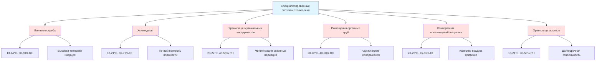

Специализированные системы охлаждения требуют высокоточного контроля микроклимата, существенно превосходящего стандартные комфортные HVAC-системы. Такие приложения требуют одновременного управления температурой, влажностью, скоростью воздуха и качеством воздуха для защиты ценных материалов, обеспечения качества технологических процессов или сохранения культурных ценностей.

## Основные принципы теплопередачи

Специализированные системы охлаждения должны обеспечивать точный контроль трёх механизмов теплопередачи:

**Теплопроводность** через ограждающие конструкции здания влияет на базовую тепловую нагрузку охлаждения:

$$Q_{cond} = \frac{k \cdot A \cdot \Delta T}{L}$$

Где:
- $Q_{cond}$ = теплопередача посредством теплопроводности (Вт)
- $k$ = теплопроводность материала (Вт/м·К)
- $A$ = площадь поверхности (м²)
- $\Delta T$ = разность температур (К)
- $L$ = толщина материала (м)

**Конвекция** от внутреннего движения воздуха должна быть минимизирована для предотвращения локальных колебаний температуры:

$$Q_{conv} = h \cdot A \cdot (T_s - T_\infty)$$

Где:
- $h$ = коэффициент теплопередачи при конвекции (Вт/м²·К)
- $T_s$ = температура поверхности (К)
- $T_\infty$ = температура окружающего воздуха (К)

**Тепловое излучение** от освещения и солнечного излучения требует тщательного управления:

$$Q_{rad} = \epsilon \cdot \sigma \cdot A \cdot (T_1^4 - T_2^4)$$

Где:
- $\epsilon$ = степень чёрноты (безразмерная величина)
- $\sigma$ = постоянная Стефана–Больцмана (5,67 × 10⁻⁸ Вт/м²·К⁴)

## Требования к точности психрометрических параметров

Контроль влажности представляет критическую задачу в специализированном охлаждении. Взаимосвязь между температурой и содержанием влаги определяет стабильность материалов:

$$RH = \frac{P_v}{P_{sat}(T)} \times 100\%$$

Где:
- $RH$ = относительная влажность (%)
- $P_v$ = парциальное давление водяного пара (Па)
- $P_{sat}$ = давление насыщения при температуре T (Па)

Абсолютное содержание влаги остаётся постоянным при чувствительном охлаждении, но относительная влажность увеличивается при снижении температуры:

$$W = 0,622 \cdot \frac{P_v}{P_{atm} - P_v}$$

Где $W$ = влагосодержание (кг воды/кг сухого воздуха).

Эта фундаментальная зависимость объясняет, почему специализированные системы охлаждения требуют скоординированного управления температурой и влажностью. Одно охлаждение повышает относительную влажность, что может привести к конденсации, росту плесени или повреждению материалов.

## Методология расчёта тепловой нагрузки охлаждения

Полная тепловая нагрузка охлаждения для специализированных приложений включает чувствительную и скрытую составляющие:

$$Q_{total} = Q_{sensible} + Q_{latent}$$

**Коэффициент чувствительного охлаждения (SHR)** определяет выбор оборудования:

$$SHR = \frac{Q_{sensible}}{Q_{total}}$$

Специализированные приложения обычно имеют высокий SHR (0,85–0,95), так как внутреннее выделение влаги минимально. Это требует оборудования охлаждения, оптимизированного для чувствительного охлаждения, а не для стандартных комфортных систем.

**Нагрузка вентиляции** должна учитывать инфильтрацию наружного воздуха и требуемый воздухообмен:

$$Q_{vent} = \dot{m} \cdot c_p \cdot \Delta T + \dot{m} \cdot h_{fg} \cdot \Delta W$$

Где:
- $\dot{m}$ = массовый расход воздуха (кг/с)
- $c_p$ = удельная теплоёмкость воздуха (1,006 кДж/кг·К)
- $h_{fg}$ = скрытая теплота испарения (2501 кДж/кг при 0°C)
- $\Delta W$ = разность влагосодержания (кг/кг)

## Стабильность температуры и управление

Высокоточные приложения требуют стабильности температуры в пределах ±0,3–±1,1°C в зависимости от приложения. Это требует:

**Пропорционально-интегрально-дифференциального (PID) управления** для минимизации колебаний температуры. Сигнал управления реагирует на:

$$u(t) = K_p \cdot e(t) + K_i \int_0^t e(\tau)d\tau + K_d \frac{de(t)}{dt}$$

Где:
- $e(t)$ = сигнал ошибки (заданное значение - измеренная температура)
- $K_p$, $K_i$, $K_d$ = константы настройки

**Использование тепловой инерции** смягчает колебания температуры. Скорость изменения температуры зависит от тепловой ёмкости:

$$\frac{dT}{dt} = \frac{Q_{net}}{m \cdot c_p}$$

Помещения с высокой тепловой инерцией (винные погреба с каменными стенами) естественным образом сопротивляются колебаниям температуры, что снижает цикличность включения системы охлаждения.

## Принципы распределения воздуха

Специализированное охлаждение требует ламинарного распределения воздуха с низкой скоростью для предотвращения:
- локальной температурной стратификации
- конденсации влаги на холодных поверхностях
- повреждения материалов от прямого воздействия потока воздуха

**Максимальная рекомендуемая скорость воздуха** около чувствительных материалов: 0,1–0,25 м/с

**Температурный перепад приточного воздуха** должен быть минимальным (1,7–3,3°C) для снижения температурных градиентов и предотвращения переохлаждения.

**Кратность воздухообмена** варьируется в зависимости от приложения, но обычно находится в диапазоне 2–6 ACH для закрытых специализированных помещений.

## Подходы к архитектуре систем

## Сравнение требований к специализированному охлаждению

| Приложение | Температура (°C) | Влажность (%RH) | Стабильность | Воздухообмены/ч | Критический фактор |
|------------|------------------|-----------------|--------------|-----------------|-------------------|
| Винный погреб | 13-14 | 60-70 | ±1,1°C | 2-4 | Без вибраций, темнота |
| Сигарный хьюмидор | 18-21 | 65-72 | ±0,6°C | 3-5 | Точный контроль RH |
| Музыкальные инструменты | 20-22 | 45-55 | ±0,6°C | 4-6 | Сезонная стабильность |
| Помещения органных труб | 20-22 | 40-50 | ±0,3°C | 3-5 | Акустическая изоляция |
| Консервация произведений искусства | 20-22 | 45-55 | ±1,1°C | 4-8 | Фильтрация, контроль UV |
| Хранилище архивов | 18-21 | 30-50 | ±1,7°C | 2-4 | Низкая RH, качество воздуха |
| Музейные экспозиции | 21-22 | 45-55 | ±0,6°C | 6-10 | Микроклимат витрины |
| Хранилище фотографий | 18-20 | 30-40 | ±1,1°C | 2-3 | Очень низкая RH |

## Критерии выбора оборудования

Оборудование специализированного охлаждения должно обеспечивать:

1. **Модулирующий контроль производительности** – предотвращает перерегулирование температуры и чрезмерное включение-выключение
2. **Интегрированный контроль влажности** – одновременное управление температурой и влажностью
3. **Низкошумную работу** – критично для занятых помещений и акустически чувствительных пространств
4. **Минимальные вибрации** – защищает чувствительные материалы и осадки вина
5. **Функции качества воздуха** – фильтрация, активированный уголь, UV-стерилизация
6. **Варианты резервирования** – резервные системы для приложений с высокой стоимостью

Переразмерение оборудования особенно проблематично в специализированном охлаждении потому что:
- Короткие циклы включения увеличивают колебания влажности
- Плохое удаление скрытого тепла при частичной нагрузке
- Перерегулирование температуры от избыточной производительности
- Сокращённый срок службы оборудования

**Рекомендация по правильному расчёту**: оборудование должно работать при 60–80% расчётной нагрузки в пиковых условиях.

## Мониторинг и сигнализация

Высокоточные приложения требуют непрерывного мониторинга с:
- датчики температуры: точность ±0,1°C, несколько точек измерения
- датчики влажности: точность ±2% RH, ежегодная калибровка
- мониторинг точки росы для предотвращения конденсации
- регистрация данных для анализа тенденций
- удалённая сигнализация при отказе оборудования или отклонении условий

Взаимосвязь между контролируемыми условиями и сохранением материалов зависит от кумулятивного воздействия, а не от мгновенных показаний. Средневзвешенные по времени условия более важны, чем кратковременные отклонения.

## Рассмотрение энергоэффективности

Специализированные системы охлаждения обычно потребляют в 2–4 раза больше энергии на единицу площади по сравнению со стандартным HVAC из-за:
- требования непрерывной работы
- отвода высокой влажности наружного воздуха (скрытая нагрузка)
- строгих допусков на поддержание параметров, требующих постоянной корректировки
- необходимости перегрева хладагента для контроля влажности

Стратегии оптимизации энергии включают:
- высокоэффективные компрессоры с регулируемой скоростью привода
- рекуперация тепла для применений с перегревом
- тепловое аккумулирование для смещения нагрузки на внепиковые часы
- улучшенная теплоизоляция ограждающих конструкций
- пароизоляция для минимизации инфильтрации влаги

Эти специализированные системы охлаждения представляют пересечение точного проектирования, термодинамики и материаловедения, требуя опытного проектирования и тщательного ввода в эксплуатацию для достижения целевых показателей производительности.
