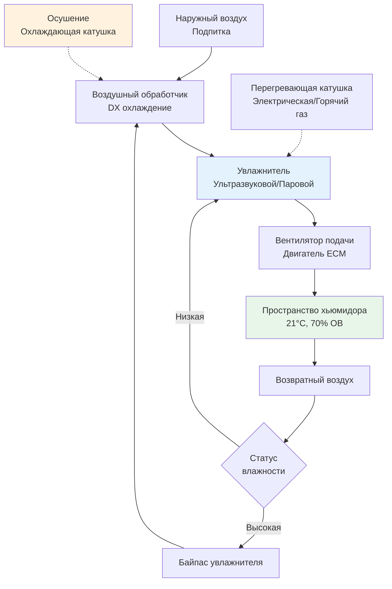

Коммерческие системы HVAC для хьюмидоров поддерживают точные условия окружающей среды, необходимые для надлежащего хранения и выдержки сигар, путем одновременного управления температурой, относительной влажностью и циркуляцией воздуха. Критические параметры—относительная влажность 65-75% и температура 20-22°C—сохраняют влажность табака, предотвращают развитие плесени и обеспечивают оптимальную химию выдержки при одновременной защите запасов стоимостью сотни долларов за коробку.

## Требования к условиям окружающей среды при хранении сигар

Физика равновесия влажности табака диктует условия хьюмидора. Табак сигар сохраняет влажность через изотермы сорбции, которые связывают содержание влаги при равновесии с окружающей относительной влажностью:

$$M_e = f(\text{ОВ}, T)$$

где $M_e$ — содержание влаги при равновесии (% на сухой основе), ОВ — относительная влажность (дробь), и $T$ — температура (°C).

**Стандартные условия хранения:**

| Параметр | Диапазон | Оптимальное значение | Допуск |
|-----------|----------|------------------|-----------|
| Температура | 20-22°C | 21°C | ±0,6°C |
| Относительная влажность | 65-75% | 70% | ±2% ОВ |
| Скорость воздуха | < 0,25 м/с | 0,12-0,15 м/с | Избегать застоя |
| Температурный градиент | N/A | < 1,1°C по вертикали | Минимизировать стратификацию |

Эти условия предотвращают три основных режима отказа:

1. **Заражение жуком-табачным** (Lasioderma serricorne) выше 22°C при достаточной влажности
2. **Развитие плесени** (Aspergillus, Penicillium species) выше 75% ОВ
3. **Высыхание табака** ниже 62% ОВ, вызывающее растрескивание обертки и ухудшение аромата

Активность воды ($a_w$) при 70% ОВ составляет 0,70, что ингибирует большинство микроорганизмов при сохранении гибкой структуры табака.

## Психрометрические соображения

Поддержание стабильной ОВ при колебаниях температуры требует понимания обратной взаимосвязи между температурой и относительной влажностью при постоянном абсолютном содержании влаги.

Коэффициент влажности остается постоянным при чувствительном охлаждении или нагреве:

$$W = 0.622 \cdot \frac{P_v}{P_{atm} - P_v}$$

где $W$ — коэффициент влажности (кг водяного пара/кг сухого воздуха), $P_v$ — парциальное давление водяного пара (кПа), и $P_{atm}$ — атмосферное давление (кПа).

Однако относительная влажность изменяется значительно:

$$\text{ОВ} = \frac{P_v}{P_{sat}(T)} \times 100\%$$

Повышение температуры с 20°C на 22°C при постоянном коэффициенте влажности снижает ОВ с 70% примерно до 62%, что демонстрирует необходимость активного управления увлажнением.

## Конфигурация системы HVAC

Коммерческие хьюмидорные системы используют специализированное оборудование для одновременного управления температурой и влажностью.

### Архитектура системы

**Ключевые компоненты:**

1. **Система прецизионного охлаждения** с переменной производительностью (компрессор с инвертором или байпас горячего газа)
2. **Оборудование увлажнения** (ультразвуковое, испарительное или паровое)
3. **Возможность осушения** через конденсацию на охлаждающей катушке
4. **Система перегрева** для поддержания температуры после осушения
5. **Датчики высокой точности** (±2% ОВ, ±0,3°C)

### Расчет охлаждающей нагрузки

Общая охлаждающая нагрузка включает теплопередачу, инфильтрацию, освещение и наличие людей:

$$Q_{total} = Q_{transmission} + Q_{infiltration} + Q_{internal}$$

**Нагрузка от теплопередачи:**

$$Q_{transmission} = U \cdot A \cdot \Delta T$$

где $U$ — коэффициент теплопередачи (кВт/м²·K), $A$ — площадь поверхности (м²), и $\Delta T$ — разность температур (K).

Для проходного хьюмидора с изолированными стенами (RSI-3,5):

$$U = \frac{1}{RSI} = \frac{1}{3.5} = 0.286 \text{ кВт/м²·K}$$

Хьюмидор 3 м × 3,7 м × 2,4 м при 21°C с наружной температурой 24°C:

$$Q_{transmission} = 0.286 \times 46 \times 3 = 39.5 \text{ кВт}$$

**Нагрузка от инфильтрации:**

$$Q_{infiltration} = \dot{V} \cdot \rho \cdot c_p \cdot \Delta T + \dot{V} \cdot \rho \cdot h_{fg} \cdot \Delta W$$

где $\dot{V}$ — объемная скорость инфильтрации (CFM, м³/ч), $\rho$ — плотность воздуха (1,2 кг/м³), $c_p$ — удельная теплоемкость (1,005 кДж/кг·K), $h_{fg}$ — скрытая теплота (2450 кДж/кг), и $\Delta W$ — разность коэффициентов влажности.

Для коммерческих приложений с контролируемым доступом инфильтрация обычно составляет 0,5-1,0 воздухообмена в час.

## Системы увлажнения и осушения

Поддержание 70% ОВ требует двусторонний контроль влажности.

### Методы увлажнения

**Ультразвуковые увлажнители:**
- Генерируют туманные частицы (диаметр 1-5 микрон) через пьезоэлектрические преобразователи
- Низкое энергопотребление (40-60 Вт на литр/день мощности)
- Требуют деминерализованную воду для предотвращения белого налета
- Время отклика: 30-60 секунд

**Паровые увлажнители:**
- Прямая паровая инъекция или системы электродных котлов
- Стерильное добавление влаги
- Потребление энергии: 2327 кДж на кг испаренной воды
- Время отклика: 2-5 минут

**Испарительные увлажнители:**
- Поглощение воды целлюлозой или синтетическими материалами
- Энергоэффективны, но медленнее реагируют
- Риск микробного загрязнения материала

### Управление осушением

Осушение происходит когда температура поверхности охлаждающей катушки снижается ниже точки росы подаваемого воздуха:

$$T_{coil} < T_{dp}$$

Скорость удаления конденсата:

$$\dot{m}_w = \dot{m}_a \cdot (W_{in} - W_{out})$$

где $\dot{m}_a$ — расход массы воздуха (кг/ч) и значения $W$ — коэффициенты влажности.

**Проблемы:**
- Переохлаждение требует энергоемкого перегрева
- Перегрев горячим газом улучшает эффективность за счет рекуперации тепла конденсатора
- Системы переменной производительности модулируют охлаждение для минимизации температурных колебаний

## Конструкция проходного хьюмидора

Проходные хьюмидоры требуют комплексного дизайна оболочки для минимизации нагрузок теплопередачи и диффузии паров.

**Требования к изоляции:**
- Стены и потолок: RSI-3,5 — RSI-5,3 минимум
- Пол: RSI-1,8 — RSI-2,6 (менее критично с контролируемым подвалом)
- Тепловые разрывы на проходках

**Паровая изоляция:**
Диффузия паров через строительную оболочку подчиняется:

$$\dot{m}_v = \frac{P \cdot A \cdot \Delta p}{d}$$

где $P$ — проницаемость (нг/(Па·с·м²)), $A$ — площадь (м²), $\Delta p$ — разность давлений пара (Па), и $d$ — толщина (м).

Полиэтиленовая паровая изоляция толщиной 0,15 мм (0,06 нанограмм) на теплой стороне изоляции предотвращает миграцию влаги, которая деградирует изоляцию и вызывает плесень.

**Облицовка испанским кедром:**
Испанский кедр (Cedrela odorata) обеспечивает три функции:
1. Буферная емкость по влажности (адсорбция/десорбция)
2. Ароматические соединения, которые улучшают выдержку сигар
3. Естественная устойчивость к вредителям

Гигроскопичные свойства древесины стабилизируют краткосрочные колебания ОВ, действуя как пассивный буфер влажности.

## Системы управления и датчики

Прецизионное управление требует датчиков высокой точности и сложных алгоритмов управления.

**Спецификации датчиков:**

| Тип датчика | Точность | Время отклика | Местоположение |
|-------------|----------|---------------|----------|
| Емкостной ОВ | ±2% ОВ | 8-30 секунд | Несколько зон |
| Сопротивление температуры | ±0,3°C | 15-45 секунд | Подача/возврат/пространство |
| Точка росы | ±1,7°C | 60 секунд | Наружный воздух |

**Стратегия управления:**
- ПИД контуры управления для температуры и влажности
- Мертвые зоны: ±0,6°C температура, ±3% ОВ влажность
- Пропорциональное увлажнение/осушение для предотвращения колебаний
- Ночное снижение противопоказано (нарушает равновесие)

## Техническое обслуживание и мониторинг

Коммерческие хьюмидорные системы требуют регулярного обслуживания:

**Еженедельно:**
- Проверить показания гигрометра в сравнении с откалиброванным эталоном (растворы насыщенной соли)
- Проверить качество воды увлажнителя и уровень заполнения
- Проверить работу дренажа конденсата

**Ежемесячно:**
- Очистить компоненты увлажнителя (удаление накипи, санитизация)
- Проверить испарительную катушку на мороз или грязь
- Протестировать аварийные сигналы высокого/низкого уровня

**Ежеквартально:**
- Откалибровать датчики ОВ с использованием сертифицированных стандартов сравнения
- Очистить/заменить воздушные фильтры
- Проверить последовательность управления

**Ежегодно:**
- Комплексное обслуживание холодильной системы
- Проверить целостность изоляции и паровой изоляции
- Заменить элементы датчиков по мере необходимости

Общая стоимость установки систем HVAC для проходных хьюмидоров составляет 8,000-25,000 долл. США в зависимости от размера (9-93 м²), требований по мощности и сложности управления. Расходы на эксплуатацию определяются энергией увлажнения (0,5-2,0 кВт·ч/день) и охлаждающими нагрузками в летний период (2-5 кВт·ч/день для небольших установок).

## Устранение неполадок общих проблем

**Проблема: ОВ падает ниже 65%**
- Проверить работу увлажнителя и подачу воды
- Проверить целостность паровой изоляции (тепловизионная визуализация)
- Измерить скорость инфильтрации (газ-трассер или тест дверного вентилятора)
- Увеличить мощность увлажнения при недостаточности конструкции

**Проблема: Рост плесени при 70% ОВ заданной точки**
- Проверить фактическую ОВ во всех зонах (градиенты указывают на плохую циркуляцию)
- Проверить конденсацию на холодных поверхностях (тепловые мостики)
- Снизить скорость воздуха до < 0,25 м/с (высокая скорость концентрирует споры)
- Проверить систему HVAC на стоячую воду или влажную изоляцию

**Проблема: Стратификация температуры > 1,7°C**
- Увеличить циркуляцию подаваемого воздуха (вентиляторы дестратификации)
- Переконструировать размещение диффузоров подачи для лучшего перемешивания
- Снизить дифференциал температуры подаваемого воздуха (< 5,6°C)

Коммерческое проектирование HVAC хьюмидоров требует интеграции холодильных, увлажняющих и строительных технологий оболочки для достижения строгой стабильности, необходимой для хранения премиум сигар. Надлежащий размер системы, детали конструкции и протоколы обслуживания обеспечивают долгосрочную производительность и качество продукции.

---

**Ссылки:**
- ASHRAE Handbook—HVAC Applications, глава о розничном хранении продуктов питания
- ASHRAE Standard 55: Thermal Environmental Conditions for Human Occupancy
- Tobacco Merchants Association: Cigar Storage Guidelines
