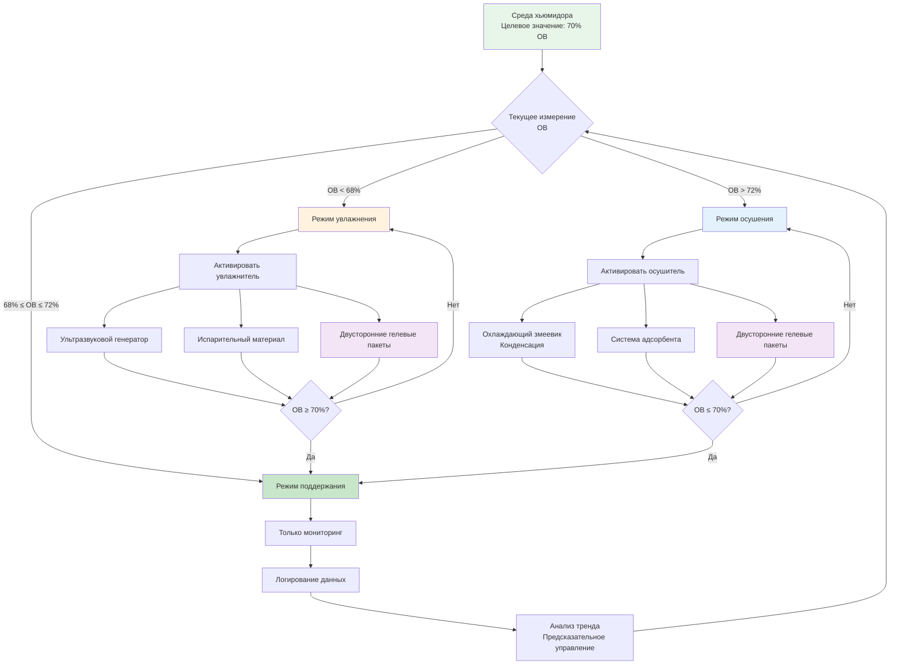

Диапазон относительной влажности 65-75% ОВ представляет критическую полосу управления для коммерческого хранения табака, определяющую влажностное равновесие, микробную стабильность и органолептическое качество через фундаментальные отношения активности воды. Этот узкий диапазон балансирует три конкурирующих требования: поддержание пластичной структуры табака (требующее достаточной влажности), предотвращение развития плесени (требующее ограниченной доступности влаги) и обеспечение надлежащей химии старения (требующее определённых уровней активности воды).

## Основы влажностного равновесия

Материал листа табака проявляет гигроскопичное поведение, поглощая или выделяя влагу до достижения равновесия с окружающей относительной влажностью. Это отношение количественно определяется посредством изотерм сорбции.

### Взаимосвязь изотермы сорбции

Равновесное содержание влаги в табаке следует уравнению Guggenheim-Anderson-de Boer (GAB):

$$M_e = \frac{C \cdot K \cdot M_0 \cdot a_w}{(1 - K \cdot a_w) \cdot (1 - K \cdot a_w + C \cdot K \cdot a_w)}$$

где:
- $M_e$ = равновесное содержание влаги (% на сухой основе)
- $M_0$ = содержание влаги в мономолекулярном слое (обычно 8-12% для табака)
- $C$ = константа Guggenheim (параметр энергии, обычно 5-15)
- $K$ = константа мультислойности (обычно 0,7-0,9)
- $a_w$ = активность воды (безразмерная, равна ОВ/100)

**При 70% ОВ (a_w = 0,70):**

Для типичного табака-обёртки сигар с $M_0 = 10\%$, $C = 8$ и $K = 0,85$:

$$M_e = \frac{8 \times 0,85 \times 10 \times 0,70}{(1 - 0,85 \times 0,70) \times (1 - 0,85 \times 0,70 + 8 \times 0,85 \times 0,70)}$$

$$M_e = \frac{47,6}{0,405 \times 5,165} = \frac{47,6}{2,092} \approx 22,8\%$$

Это равновесное содержание влаги поддерживает гибкость табака при предотвращении избыточной влажности, способствующей развитию плесени.

### Активность воды и микробная стабильность

Активность воды определяет потенциал развития микроорганизмов независимо от общего содержания влаги:

$$a_w = \frac{p}{p_0} = \frac{\text{ОВ}}{100}$$

где $p$ — давление пара воды в продукте, а $p_0$ — давление пара чистой воды при той же температуре.

**Критические пороги активности воды:**

| Тип организма | Минимум $a_w$ | Эквивалент ОВ | Следствие |
|---------------|---------------|---------------|-----------|
| Бактерии (большинство) | 0,90 | 90% ОВ | Без роста при условиях хьюмидора |
| Дрожжи | 0,88 | 88% ОВ | Без роста при условиях хьюмидора |
| Плесень (Aspergillus) | 0,75-0,80 | 75-80% ОВ | Возможен рост выше 75% ОВ |
| Табачные жуки | 0,65+ | 65%+ ОВ | Требуется >22°C температура |

Диапазон 65-75% ОВ поддерживает $a_w$ между 0,65-0,75, что:
1. Предотвращает размножение бактерий и дрожжей
2. Минимизирует риск плесени (особенно при T < 22°C)
3. Обеспечивает достаточную влажность для пластичности табака
4. Обеспечивает контролируемые реакции старения

## Влияние влажности на качество табака

Относительная влажность напрямую влияет на множество параметров качества через механизмы содержания влаги и активности воды.

### Комплексный анализ влияния на качество

| Уровень ОВ | Содержание влаги | Физическое качество | Химическая стабильность | Риск микробов | Характеристики старения |
|----------|------------------|-------------------|----------------------|--------------|------------------------|
| <60% ОВ | <18% сб | Хрупкая обёртка, трещины | Сниженная активность ферментов | Минимальный | Остановленное старение, потеря вкуса |
| 60-65% ОВ | 18-22% сб | Жёсткая, но приемлемая | Низкая скорость старения | Очень низкий | Медленное старение, хорошее сохранение |
| **65-70% ОВ** | **22-25% сб** | **Оптимальная гибкость** | **Умеренное старение** | **Низкий** | **Сбалансированное старение, развитие вкуса** |
| **70-75% ОВ** | **25-28% сб** | **Отличная пластичность** | **Активное старение** | **Умеренный** | **Улучшенное старение, сложные вкусы** |
| 75-80% ОВ | 28-32% сб | Мягкая, губчатая текстура | Ускоренные реакции | Высокий (плесень) | Быстрое старение, риск плесени |
| >80% ОВ | >32% сб | Мокрая, вздутая | Риск ферментации | Очень высокий | Неконтролируемые реакции, порча |

**Примечание:** Содержание влаги на сухой основе (сб) рассчитано с использованием уравнения GAB с типичными параметрами табака для сигар.

### Взаимосвязи физических свойств

Механические свойства листа табака-обёртки зависят от содержания влаги через эффекты пластификации:

**Прочность при растяжении:**

$$\sigma_t = \sigma_0 \cdot e^{-k_m \cdot M}$$

где $\sigma_t$ — прочность при растяжении (кПа), $\sigma_0$ — постоянная прочности в сухом состоянии, $k_m$ — коэффициент влажности (обычно 0,05-0,08), $M$ — содержание влаги (% сб).

При оптимальных 70% ОВ (M ≈ 24% сб):
$$\sigma_t = \sigma_0 \cdot e^{-0,06 \times 24} = \sigma_0 \cdot 0,237$$

Это 76%-ное снижение от прочности в сухом состоянии обеспечивает гибкость, необходимую для скручивания и обработки без разрывов.

**Модуль упругости:**

$$E = E_0 \cdot (1 - k_e \cdot M)$$

где $E$ — модуль упругости (кПа), $E_0$ — модуль в сухом состоянии, $k_e$ — коэффициент упругости.

Содержание влаги выше 20% сб резко снижает жёсткость, предотвращая трещины обёртки при скручивании.

## Системы двустороннего контроля влажности

Поддержание 65-75% ОВ требует как увлажняющих, так и осушающих возможностей для противодействия колебаниям окружающей среды.

### Технологии увлажнения

**Ультразвуковые увлажнители:**

Генерируют микроскопические капли воды посредством пьезоэлектрической вибрации на частоте 1,7 МГц:

$$d_p = \left(\frac{8\pi\sigma}{\rho f^2}\right)^{1/3}$$

где $d_p$ — диаметр частицы (мкм), $\sigma$ — поверхностное натяжение (72 дин/см для воды), $\rho$ — плотность (1 г/см³), $f$ — частота (Гц).

Для $f = 1,7 \times 10^6$ Гц:

$$d_p = \left(\frac{8\pi \times 72}{1 \times (1,7 \times 10^6)^2}\right)^{1/3} = 0,63 \text{ мкм}$$

Эти субмикронные капли быстро испаряются, обеспечивая точный контроль влажности с минимальным влиянием на температуру.

**Испарительные системы:**

Пассивное испарение из насыщенного материала следует:

$$\dot{m}_w = h_m \cdot A \cdot (W_s - W_{\infty})$$

где $\dot{m}_w$ — скорость испарения воды (кг/ч), $h_m$ — коэффициент массопередачи (м/ч), $A$ — площадь поверхности (м²), $W_s$ — коэффициент влажности на насыщенной поверхности, $W_{\infty}$ — коэффициент влажности окружающей среды.

Коэффициент массопередачи связан со скоростью воздуха:

$$h_m = k \cdot v^{0,8}$$

где $v$ — скорость воздуха (м/мин) и $k$ — постоянная в зависимости от геометрии материала.

**Двусторонние пакеты контроля влажности:**

Системы полимерного геля (такие как Boveda) поддерживают определённую ОВ через обратимую сорбцию:

- **Ниже уставки:** Гель выделяет поглощённый водяной пар
- **Выше уставки:** Гель поглощает избыточный водяной пар

Ёмкость ограничена 60-100 г воды на пакет 60 г, требующая периодической замены (3-6 месяцев в зависимости от объёма хьюмидора и частоты воздухообмена).

### Технологии осушения

**Конденсация на охлаждающем змеевике:**

Когда температура поверхности змеевика падает ниже точки росы, конденсация удаляет влагу:

$$T_{змеевик} < T_{точка\_росы}$$

Точка росы при 70% ОВ и 21°C:

$$T_{точка\_росы} \approx 15°C$$

Змеевик должен работать ниже 15°C для осушения, требуя последующего перегрева для поддержания уставки 21°C.

**Скорость удаления влаги:**

$$\dot{m}_{конд} = \dot{m}_a \cdot (W_{вход} - W_{выход})$$

Для потока воздуха $\dot{m}_a = 23$ кг/ч, снижение с 70% до 68% ОВ при 21°C:

- $W_{вход} = 0,0111$ кг воды/кг сухого воздуха (70% ОВ)
- $W_{выход} = 0,0106$ кг воды/кг сухого воздуха (68% ОВ)

$$\dot{m}_{конд} = 23 \times (0,0111 - 0,0106) = 0,0115 \text{ кг/ч} = 0,3 \text{ г/ч}$$

Малые скорости удаления требуют точного управления для избежания перерегулирования.

**Системы адсорбента:**

Материалы силикагеля или молекулярного сита поглощают водяной пар через:

$$q = q_{\max} \cdot \frac{K \cdot P}{1 + K \cdot P}$$

где $q$ — поглощение влаги (кг воды/кг адсорбента), $q_{\max}$ — ёмкость насыщения, $K$ — константа равновесия, $P$ — давление пара.

Адсорбенты требуют регенерации при насыщении, обычно путём нагрева до 93-149°C для удаления поглощённой влаги.

## Эффекты взаимодействия температуры

Относительная влажность варьируется обратно пропорционально температуре при постоянной абсолютной влажности (коэффициент влажности), создавая проблемы управления.

### Связь ОВ-температура

Из психрометрических соотношений:

$$\frac{d(\text{ОВ})}{dT} \approx -\text{ОВ} \cdot \frac{1}{T} \cdot \frac{d \ln(P_{нас})}{dT}$$

Используя уравнение Clausius-Clapeyron:

$$\frac{d \ln(P_{нас})}{dT} = \frac{h_{испар}}{R \cdot T^2}$$

где $h_{испар} = 2456$ кДж/кг, $R = 0,4615$ кДж/(кг·К), $T$ в абсолютной температуре (К).

При 21°C (294 К):

$$\frac{d \ln(P_{нас})}{dT} = \frac{2456}{0,4615 \times 294^2} \approx 0,0056 \text{ К}^{-1}$$

Следовательно:

$$\frac{d(\text{ОВ})}{dT} \approx -70\% \times \frac{1}{294} \times 0,0056 = -0,0013 \text{ или } -0,13\% \text{ ОВ на К}$$

или приблизительно **-0,23% ОВ на °C**

**Практический пример:**

Повышение температуры с 20°C до 22°C (изменение 2°C) при постоянном коэффициенте влажности:

$$\Delta \text{ОВ} \approx -0,23\% \times 2 = -0,46\% \approx -5\% \text{ ОВ (относительное)}$$

Это демонстрирует, почему стабильность температуры (±0,3°C) необходима для поддержания ОВ в диапазоне 65-75%.

### Стратегия комбинированного управления

Эффективное управление хьюмидором требует одновременных контуров управления температурой и влажностью:

**Управление температурой:**
- Основное: Система охлаждения с точностью ±0,3°C
- Уставка: 21°C
- Зона мёртвого времени: 20,7-21,3°C

**Управление влажностью:**
- Основное: Система увлажнения
- Вторичное: Осушение через охлаждение
- Уставка: 70% ОВ
- Зона мёртвого времени: 68-72% ОВ
- Компенсация: Регулировка при отклонениях температуры

**Управление с предварительной компенсацией:**

Предусмотрите изменения влажности от отклонений уставки температуры:

$$\Delta \text{ОВ}_{предсказанная} = -k_T \cdot \Delta T$$

где $k_T \approx 0,23\%$ ОВ/°C вблизи 21°C.

Предварительно активируйте увлажнение/осушение для противодействия предсказанному отклонению ОВ.

## Требования к датчикам и калибровка

Поддержание 65-75% ОВ требует высокоточных датчиков и регулярных протоколов калибровки.

### Спецификации датчиков

**Ёмкостные датчики ОВ:**
- Точность: ±2% ОВ (требуемый минимум)
- Разрешение: 0,1% ОВ
- Время отклика: 8-30 секунд (изменение на 90%)
- Дрейф: <1% ОВ в год
- Диапазон работы: 0-100% ОВ, -10–60°C

**Стратегия размещения:**
- Несколько датчиков в хьюморидорах >2,8 м³ (проверка однородности)
- Расположение: Поток возвратного воздуха для управления, в пространстве для проверки
- Избегайте прямого попадания воздушного потока (вызывает ошибки чтения)
- Защита от прямого впрыска влаги (временно насыщенные показания)

### Методы калибровки

**Эталон раствора насыщенной соли:**

Специальные соли создают известную равновесную ОВ при данных температурах:

| Соль | Химическая формула | ОВ при 20°C | ОВ при 25°C | Точность |
|------|------------------|-------------|-------------|----------|
| Хлорид магния | MgCl₂·6H₂O | 33,0% | 32,8% | ±0,3% |
| Хлорид натрия | NaCl | 75,5% | 75,3% | ±0,1% |
| Хлорид калия | KCl | 85,1% | 84,2% | ±0,2% |

Для приложений хьюмидора хлорид натрия обеспечивает проверку вблизи верхнего предела управления (75% ОВ).

**Процедура калибровки:**
1. Поместите раствор насыщенной соли в герметичный контейнер
2. Позвольте 24 часов на равновесие
3. Поместите датчик в контейнер без касания раствора
4. Запишите показание после 2-4 часов
5. Отрегулируйте смещение датчика, если отклонение превышает ±2% ОВ

**Электронная калибровка:**

Высокоуровневые системы используют гигрометры с охлаждаемым зеркалом (счётчики $a_w$) как лабораторные эталоны:

$$\text{ОВ} = \frac{P_{нас}(T_{зеркало})}{P_{нас}(T_{воздух})} \times 100\%$$

Точность: ±0,5% ОВ, обеспечивающая прослеживаемую калибровку полевых датчиков.

## Долгосрочные соображения по старению

Диапазон 65-75% ОВ обеспечивает контролируемую химию старения, развивающую сложность премиальных сигар в течение месяцев и лет.

### Кинетика реакций старения

Реакции Майяра между восстанавливающими сахарами и аминокислотами следуют:

$$r = k \cdot [S] \cdot [A] \cdot a_w^n$$

где $r$ — скорость реакции, $k$ — константа скорости, зависящая от температуры, $[S]$ — концентрация сахара, $[A]$ — концентрация аминокислоты, $a_w$ — активность воды, $n$ — показатель активности воды (обычно 2-3).

**Оптимальные условия старения:**
- ОВ: 68-72% ($a_w = 0,68-0,72$)
- Температура: 20-21°C (минимизирует риск жуков при допуске реакций)
- Время: 6 месяцев — 5+ лет в зависимости от исходного состояния табака

**Роль активности воды:**
- Слишком низкая (<0,65): Недостаточная подвижность молекул, реакции остановлены
- Оптимальная (0,68-0,72): Умеренные скорости реакций, контролируемое развитие вкуса
- Слишком высокая (>0,75): Чрезмерные скорости, развитие посторонних вкусов, риск плесени

### Эффекты длительности хранения

| Период хранения | Рекомендация ОВ | Температура | Ожидаемые изменения |
|-----------------|-----------------|-------------|-------------------|
| Короткий срок (0-3 месяца) | 70% | 20-22°C | Равновесие, минимальное старение |
| Средний срок (3-12 месяцев) | 68-70% | 20-21°C | Умеренное смягчение, интеграция вкуса |
| Долгий срок (1-5 лет) | 65-68% | 20-21°C | Сложное старение, утонченный характер |
| Архивное (>5 лет) | 65% | 18°C | Сохранение, медленное продолжающееся развитие |

Более низкая ОВ для долгосрочного хранения снижает скорость старения и риск заражения жуками при предотвращении перезрелости.

## Метрики производительности системы

Количественная оценка производительности контроля влажности обеспечивает согласованное качество продукции.

### Индексы производительности управления

**Стандартное отклонение:**

$$\sigma_{ОВ} = \sqrt{\frac{1}{N-1} \sum_{i=1}^{N} (\text{ОВ}_i - \overline{\text{ОВ}})^2}$$

Целевое значение: $\sigma_{ОВ} < 2\%$ для коммерческих хьюмидоров.

**Время в диапазоне:**

$$\text{ВД} = \frac{\text{Время когда } 65\% \leq \text{ОВ} \leq 75\%}{\text{Общее время}} \times 100\%$$

Целевое значение: ВД > 95% для коммерческих приложений.

**Время восстановления:**

Время возврата в диапазон управления после возмущения (открытие двери):

$$t_{восстановления} < 15 \text{ минут (предпочтительно)}$$

### Анализ энергопотребления

**Энергия увлажнения:**

Для ультразвуковых увлажнителей, добавляющих 0,23 кг воды/день при 70% ОВ:

$$E_{увлажнение} = 0,23 \text{ кг/день} \times 0,14 \text{ кВт·ч/кг} = 0,032 \text{ кВт·ч/день}$$

**Энергия осушения:**

Удаление 0,14 кг воды/день через охлаждение (включая перегрев):

$$E_{осушение} = 0,14 \text{ кг/день} \times 5,6 \text{ кВт·ч/кг} = 0,78 \text{ кВт·ч/день}$$

Осушение доминирует потребление энергии из-за требования охлаждение + перегрев.

**Годовая стоимость эксплуатации:**

Для смешанного климата с 60% дней увлажнения, 40% дней осушения:

$$\text{Стоимость} = (0,60 \times 0,032 + 0,40 \times 0,78) \times 365 \times 4,5 \text{ руб./кВт·ч}$$
$$\text{Стоимость} = (0,0192 + 0,312) \times 365 \times 4,5 = 5 101 \text{ руб./год}$$

Затраты на эксплуатацию небольшого хьюмидора минимальны; оборудование точного управления представляет основную инвестицию.

## Устранение неисправностей при отклонениях влажности

**ОВ постоянно ниже 65%:**
- Проверьте работу увлажнителя и подачу воды
- Проверьте целостность паровой преграды (термография для обнаружения утечек)
- Измерьте скорость инфильтрации (должна быть <0,5 воздухообмена в час)
- Увеличьте ёмкость увлажнения или уменьшите воздухообмен
- Проверьте тепловые мосты, создающие локальные холодные точки

**ОВ постоянно выше 75%:**
- Проверьте работу системы осушения
- Проверьте дренаж конденсата охлаждающего змеевика
- Уменьшите выход увлажнителя (может быть избыточным)
- Увеличьте скорость вентиляции (контролируемый свежий воздух)
- Проверьте внешние источники влаги (влажные стены, утечки труб)

**Колебания ОВ >±5% в течение 24 часов:**
- Уменьшите колебания температуры (улучшите управление охлаждением)
- Увеличьте скорость отклика системы (уменьшьте зоны мёртвого времени)
- Добавьте тепловую массу (контейнеры с водой) для буферизации температурных скачков
- Улучшите циркуляцию воздуха (уменьшьте стратификацию)
- Рассмотрите пропорциональное управление вместо включения/выключения

Диапазон управления 65-75% ОВ представляет фундаментальное требование для коммерческого хранения табака, балансируя физику влажностного равновесия, микробную стабильность и химию старения. Достижение согласованной производительности требует интегрированного управления температурой и влажностью, высокоточных датчиков и надлежащего размера системы на основе расчётов нагрузки и скоростей инфильтрации.

---

**Источники:**
- ASHRAE Handbook—Fundamentals, Chapter 19: Sorbents and Desiccants
- Brunauer, S., et al. "Adsorption of Gases in Multimolecular Layers." Journal of the American Chemical Society (1938)
- Labuza, T.P. "Sorption Phenomena in Foods." Food Technology (1968)
- Tobacco Merchants Association: Proper Cigar Storage Guidelines
