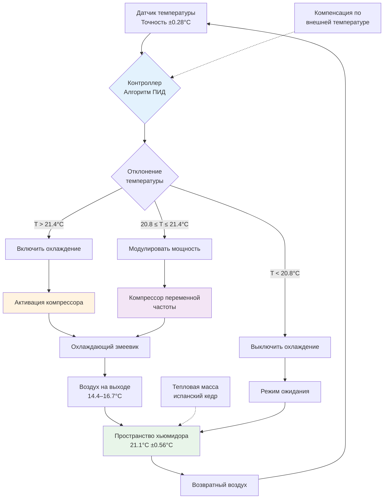

Контроль температуры в узком диапазоне 20-22.2°C (68-72°F) представляет фундаментальный параметр коммерческой эксплуатации хьюмидора, управляющий тремя критическими физическими процессами: профилактикой инвазии табачного жучка (Lasioderma serricorne), оптимизацией ферментативных реакций выдержки и поддержанием стабильного равновесного содержания влаги в хранящихся сигарах. Этот диапазон температур обеспечивает баланс между подавлением биологических вредителей и ускорением желаемых химических преобразований при минимизации энергопотребления для климатического контроля.

## Термодинамическое обоснование выбора температуры

Спецификация температуры 20-22.2°C основана на эмпирических наблюдениях пороговых значений активности табачного жучка и кинетики табачной химии, а не на соображениях комфорта человека.

### Зависимость активности табачного жучка от температуры

Табачный жучок (Lasioderma serricorne) демонстрирует экспоненциальный рост популяции выше определённых температурных порогов. Скорость развития жучка следует кинетике Аррениуса:

$$r(T) = A \cdot e^{-\frac{E_a}{R \cdot T}}$$

где $r(T)$ — скорость развития (дни⁻¹), $A$ — предэкспоненциальный множитель (дни⁻¹), $E_a$ — энергия активации (кал/моль), $R$ — газовая постоянная (1.987 кал/моль·К), и $T$ — абсолютная температура (К).

Эмпирические данные показывают, что развитие жучка практически прекращается ниже 18°C, значительно ускоряется выше 22°C и достигает максимальной репродуктивной активности при 30°C.

**Зависимость продолжительности жизненного цикла жучка от температуры:**

$$t_{lifecycle}(T) = \frac{1}{r(T)} = \frac{1}{A \cdot e^{-\frac{E_a}{R \cdot T}}}$$

Для Lasioderma serricorne с экспериментальными параметрами $E_a \approx 12000$ кал/моль и $A \approx 0.15$ дни⁻¹:

| Температура | Жизненный цикл (дни) | Относительная активность | Уровень риска |
|-------------|----------------------|--------------------------|----------------|
| 17.8°C | >180 | <0.01 | Пренебрежимо малый |
| 20.0°C | 125 | 0.08 | Очень низкий |
| 21.1°C | 95 | 0.15 | Низкий |
| 22.2°C | 72 | 0.28 | Пороговый |
| 23.9°C | 48 | 0.65 | Умеренный |
| 26.7°C | 28 | 1.00 | Высокий |
| 29.4°C | 18 | 1.85 | Очень высокий |

Верхний предел 22.2°C обеспечивает защитный запас ниже зоны быстрого ускорения, одновременно поддерживая условия, благоприятные для выдержки табака.

### Скорости ферментативных реакций выдержки

Желаемая выдержка табака предполагает ферментативное расщепление хлорофилла, деградацию аммиачных соединений и полимеризацию сахаров. Эти реакции также следуют температурозависимой кинетике:

$$k(T) = k_0 \cdot e^{-\frac{E_a}{R \cdot T}}$$

где $k(T)$ — константа скорости реакции при температуре $T$.

Температурный коэффициент (Q₁₀) для реакций выдержки табака обычно находится в диапазоне 2.0–2.5, означая, что скорости реакций удваиваются при каждом увеличении температуры на 10°C:

$$\frac{k(T + 10°C)}{k(T)} = Q_{10}$$

При 21.1°C выдержка происходит с умеренной скоростью, развивая сложность вкусовых характеристик в течение месяцев-лет. Более высокие температуры (>23.9°C) ускоряют выдержку, но производят жёсткие вкусовые характеристики через чрезмерную деградацию.

## Требования к стабильности температуры

Поддержание уставки в пределах ±0.56°C требует понимания механизмов теплопередачи и характеристик отклика системы управления.

### Компоненты теплового нагрузки

Общее тепловыделение в пространстве хьюмидора составляет:

$$Q_{total} = Q_{conduction} + Q_{infiltration} + Q_{equipment} + Q_{occupancy}$$

**Кондуктивная передача через оболочку:**

$$Q_{conduction} = U \cdot A \cdot (T_{ambient} - T_{humidor})$$

где $U$ — коэффициент теплопередачи (Вт/м²·К), $A$ — площадь поверхности (м²).

Для стен с теплоизоляцией RSI 3.5 при внешней температуре 23.9°C и уставке хьюмидора 21.1°C:

$$Q_{conduction} = \frac{1}{3.5} \times A \times 2.8 = 0.8A \text{ Вт}$$

**Тепловой прирост от инфильтрации:**

$$Q_{infiltration,sensible} = 0.338 \cdot \text{м³/ч} \cdot \Delta T$$

где м³/ч — объёмный расход инфильтрационного воздуха и $\Delta T$ — разность температур (°C).

Для хьюмидора размером 3.05 × 3.66 × 2.44 м с инфильтрацией 0.5 ACH:

$$\text{м³/ч} = 3.05 \times 3.66 \times 2.44 \times 0.5 = 13.6 \text{ м³/ч}$$

$$Q_{infiltration,sensible} = 0.338 \times 13.6 \times 2.8 = 12.8 \text{ Вт}$$

### Архитектура системы управления температурой

**Элементы стратегии управления:**

1. **Мёртвая зона**: ±0.28°C предотвращает чрезмерные циклы
2. **Пропорциональное управление**: Модулирует частоту вращения компрессора между 20.8–21.4°C
3. **Интегральный член**: Устраняет установившуюся ошибку смещения
4. **Дифференциальный член**: Гасит колебания от открытия дверей

### Характеристики теплового отклика

Постоянная времени восстановления температуры после возмущения составляет:

$$\tau = \frac{m \cdot c_p}{UA + \dot{m}_a \cdot c_{p,air}}$$

где $m$ — тепловая масса (кг), $c_p$ — удельная теплоёмкость (кДж/кг·К), $UA$ — общая теплопроводность (Вт/К), и $\dot{m}_a$ — массовый расход инфильтрационного воздуха (кг/ч).

Для хьюмидора с 900 кг облицовки из испанского кедра ($c_p = 1.67$ кДж/кг·К):

$$\tau = \frac{900 \times 1.67}{2.5 + 13.6 \times 0.075 \times 1.01} \approx 18800 \text{ сек} \approx 5.2 \text{ часа}$$

Эта большая постоянная времени обеспечивает значительную тепловую инерцию, которая буферирует кратковременные возмущения.

## Влияние температуры на качество хранения табака

Температура напрямую влияет на многие параметры качества через различные физические и химические механизмы.

### Равновесное содержание влаги

Содержание влаги в табаке при равновесии зависит как от температуры, так и от относительной влажности через изотермы сорбции. Даже при постоянной ОВ более высокие температуры снижают равновесное содержание влаги:

$$\text{EMC}(T, \text{ОВ}) = f_1(\text{ОВ}) + f_2(T) + f_3(\text{ОВ} \times T)$$

где EMC — равновесное содержание влаги (% на сухую основу).

**Влияние температуры на влажность (при 70% ОВ):**

| Температура | EMC (%) | Состояние обёртки | Лёгкость затяга |
|-------------|---------|-------------------|-----------------|
| 17.8°C | 14.2% | Слегка хрупкая | Нормальная |
| 20.0°C | 13.8% | Оптимальная пластичность | Оптимальная |
| 21.1°C | 13.5% | Отличная | Отличная |
| 22.2°C | 13.2% | Хорошая | Хорошая |
| 23.9°C | 12.7% | Тенденция размягчения | Слегка слабый |
| 26.7°C | 11.8% | Слишком мягкая | Слабый |

### Сохранение летучих соединений

Ароматические соединения демонстрируют температурозависимые давления насыщенного пара в соответствии с уравнением Клаузиуса–Клапейрона:

$$\ln\left(\frac{P_2}{P_1}\right) = -\frac{\Delta H_{vap}}{R} \left(\frac{1}{T_2} - \frac{1}{T_1}\right)$$

где $P$ — давление насыщенного пара, $\Delta H_{vap}$ — энтальпия испарения, и $T$ — абсолютная температура.

Эфирные масла и ароматические соединения испаряются быстрее при повышенных температурах. Диапазон 20-22.2°C минимизирует потери летучих при одновременном поддержании достаточной молекулярной подвижности для реакций выдержки.

### Кинетика роста плесени

Рост грибов на табаке требует как достаточной влаги (активность воды $a_w > 0.70$), так и благоприятной температуры. Распространённые виды плесени (Aspergillus, Penicillium) демонстрируют оптимальный рост при 25–30°C, но могут медленно размножаться при 20-22.2°C, если ОВ превышает 75%.

$$\text{Growth Rate} = k_{max} \cdot \frac{a_w - a_{w,min}}{a_{w,opt} - a_{w,min}} \cdot \frac{T - T_{min}}{T_{opt} - T_{min}}$$

При 21.1°C и 70% ОВ ($a_w = 0.70$) рост плесени подавляется комбинацией пограничной активности воды и субоптимальной температуры.

## Проектирование систем точного охлаждения

Достижение стабильности ±0.56°C требует специализированного холодильного оборудования и стратегий управления.

### Холодильная система переменной мощности

Традиционное циклическое включение/выключение создаёт температурные колебания. Три технологии обеспечивают модулированное охлаждение:

**1. Компрессор с инверторным приводом:**

Частота вращения компрессора изменяется в соответствии с потребностью охлаждения:

$$\text{Мощность}(\%) = \left(\frac{\text{об./мин.}}{\text{об./мин.}_{max}}\right)^{0.7} \times 100\%$$

Диапазон работы обычно 30–100% номинальной мощности.

**2. Байпас горячего газа:**

Отводит газ нагнетания вокруг конденсатора для снижения чистого охлаждения:

$$Q_{net} = Q_{evap} - Q_{bypass}$$

Менее эффективно, чем переменная частота, но обеспечивает непрерывную работу.

**3. Ступенчатое управление мощностью:**

Несколько компрессоров или разгрузчиков обеспечивают пошаговое управление мощностью.

### Разница температур воздуха на выходе

Минимизация разницы температур между воздухом на выходе и возвратом снижает стратификацию:

$$\Delta T_{supply} = \frac{Q_{total}}{0.338 \times \text{м³/ч}}$$

Для нагрузки 1.463 кВт:

$$\text{м³/ч} = \frac{1463}{0.338 \times \Delta T_{supply}}$$

При $\Delta T_{supply} = 5.56°C$:

$$\text{м³/ч} = \frac{1463}{0.338 \times 5.56} = 78.5 \text{ м³/ч}$$

Этот умеренный расход воздуха обеспечивает адекватную циркуляцию без чрезмерной скорости воздуха, которая могла бы высушивать сигары.

## Мониторинг и сигнализация по температуре

Коммерческие установки требуют непрерывного мониторинга с уведомлением о сигналах тревоги при отклонениях.

**Размещение датчиков:**

- **Воздух на выходе**: Проверка выхода системы охлаждения
- **Возвратный воздух**: Измерение фактической температуры пространства
- **Несколько зон**: Обнаружение стратификации в больших хьюмидорах
- **Наружный воздух**: Включение компенсации по температуре в управление

**Пороги сигнализации:**

| Параметр | Предупреждение | Критическое значение |
|----------|----------------|----------------------|
| Высокая температура | 22.8°C | 23.9°C |
| Низкая температура | 19.4°C | 18.3°C |
| Отказ датчика | 2 минуты | Немедленно |
| Время работы компрессора | >20 мин/ч | >40 мин/ч |

**Требования к регистрации данных:**

Запись температуры каждые 1–5 минут с минимальным сохранением на 30 дней. Эти исторические данные позволяют:

- Проверку производительности системы управления
- Выявление ухудшающегося состояния оборудования
- Подтверждение претензий гарантии за повреждённый инвентарь
- Документирование для целей страховки

## Соображения энергоэффективности

Поддержание 20-22.2°C круглый год требует энергии на охлаждение (лето), отопление (зима) и увлажнение (оба сезона).

### Энергия охлаждения

Годовая энергия охлаждения в смешанных климатах:

$$E_{cooling} = \frac{Q_{avg,cooling} \times \text{HDD}_{18} \times 24}{\text{COP}}$$

где HDD₁₈ — градусодни охлаждения база 18°C (используется в метрической системе).

Для Майами (HDD₁₈ ≈ 2222) с средней нагрузкой 3.51 кВт и COP = 3.0:

$$E_{cooling} = \frac{3.51 \times 2222 \times 24}{3.0} \approx 62500 \text{ кВт·ч/год}$$

### Значение теплоизоляции

Более высокие значения RSI снижают тепловой поток, вызванный разностью температур:

**Сравнение передачи через оболочку:**

| Теплоизоляция | U-значение | Тепловой прирост (Вт) | Годовая энергия (кВт·ч) |
|---|---|---|---|
| RSI 1.76 | 0.568 | 733 | 2365 |
| RSI 2.64 | 0.379 | 490 | 1581 |
| RSI 3.52 | 0.284 | 367 | 1185 |
| RSI 5.28 | 0.189 | 245 | 790 |

Дополнительная стоимость теплоизоляции RSI 5.28 в сравнении с RSI 3.52 обычно окупается за 3–5 лет за счёт снижения затрат на эксплуатацию.

## Режимы отказа, связанные с температурой

Понимание распространённых отказов системы управления температурой позволяет быстро диагностировать и исправлять проблемы.

### Недостаточная холодопроизводительность

**Признаки**: Температура постоянно выше 22.2°C с непрерывной работой компрессора.

**Причины**:
- Холодильная система недостаточной мощности (ошибка проектирования)
- Деградированный заряд хладагента (утечка)
- Грязная конденсационная катушка (снижение отвода тепла)
- Неисправный вентилятор конденсатора

**Диагностика**:

Измерьте давления на всасывании и нагнетании компрессора. Сравните с кривыми производительности производителя при фактических условиях работы.

### Чрезмерные температурные колебания

**Признаки**: Температура колеблется ±1.1–1.7°C вокруг уставки.

**Причины**:
- Избыточная холодопроизводительность (короткий цикл)
- Недостаточная тепловая масса
- Плохо настроенный контроллер ПИД
- Мёртвая зона слишком узкая

**Исправление**:

Расширьте мёртвую зону до ±0.56°C и реализуйте управление переменной мощностью.

### Стратификация температуры

**Признаки**: Вертикальный градиент температуры >1.7°C от пола до потолка.

**Причины**:
- Недостаточная циркуляция воздуха
- Скорость воздуха на выходе слишком низкая
- Плохое размещение диффузорных решёток
- Чрезмерная высота потолка

**Решение**:

Увеличьте расход воздуха на выходе или добавьте вентиляторы дестратификации (потолочные, низкоскоростная циркуляция).

## Интеграция с системой контроля влажности

Системы управления температурой и влажностью взаимодействуют через психрометрические соотношения.

### Вызовы одновременного управления

Охлаждение для контроля температуры удаляет влагу (осушение), в то время как поддержание 70% ОВ требует добавления влаги. Это создаёт конкурирующие нагрузки:

$$Q_{latent,removal} = 2454 \times \dot{m}_a \times (W_{in} - W_{out})$$

где $W$ — влагосодержание (кг воды/кг сухого воздуха).

Чрезмерное охлаждение для встречи чувствительной нагрузки с последующим переподогревом расходует энергию:

$$\text{COP}_{effective} = \frac{\text{COP}_{cooling}}{1 + \frac{Q_{reheat}}{Q_{cooling}}}$$

### Оптимальная стратегия управления

Последовательность охлаждения и увлажнения для минимизации штрафа за энергию:

1. **Приоритет температуры**: Сначала поддерживайте 20-22.2°C
2. **Модулированное охлаждение**: Изменяйте мощность, чтобы минимизировать чрезмерное охлаждение
3. **Переподогрев горячим газом**: Восстанавливайте тепло конденсатора, когда требуется переподогрев
4. **Управление по точке росы**: Поддерживайте температуру катушки выше точки росы, когда возможно

## Сравнительный анализ уставок температуры

Хотя 21.1°C является стандартом, некоторые операторы используют альтернативные уставки.

| Уставка | Риск жучка | Скорость выдержки | Энергопотребление | Применение |
|---------|-----------|------------------|-------------------|------------|
| 18.3°C | Нет | 0.75× | Низкое | Долгосрочный архив |
| 20.0°C | Очень низкий | 0.90× | Среднее-низкое | Премиум-выдержка |
| 21.1°C | Низкий | 1.00× | Среднее | Стандарт коммерч. |
| 22.2°C | Пороговый | 1.15× | Среднее-высокое | Быстрая оборачиваемость |
| 23.9°C | Умеренный | 1.35× | Высокое | Не рекомендуется |

**Скорость выдержки относительно 21.1°C:**

На основе Q₁₀ = 2.2 для табачной химии:

$$\text{Относительная скорость} = 2.2^{(T - 21.1)/10}$$

Для 20.0°C: $2.2^{-0.11} \approx 0.90$

Для 22.2°C: $2.2^{0.11} \approx 1.15$

Уставка 21.1°C обеспечивает баланс между химией выдержки, риском вредителей и энергопотреблением, делая её оптимальным выбором для большинства коммерческих применений.

## Продвинутые темы: Анализ переходных тепловых процессов

Отклонения температуры от открытия дверей или отказов оборудования распространяются через пространство хьюмидора в соответствии с принципами переходной теплопередачи.

### Тепловой импульс от открытия двери

При открытии двери тёплый наружный воздух входит:

$$Q_{door} = \rho \cdot V \cdot c_p \cdot (T_{ambient} - T_{humidor})$$

Для площади двери 2.79 м² × высота 2.44 м, открытой в течение 30 секунд со скоростью входа 0.152 м/сек:

$$V = 2.79 \times 0.152 \times 30 = 12.7 \text{ м}^3$$

$$Q_{door} = 1.18 \times 12.7 \times 1.01 \times 2.8 = 42.4 \text{ Вт}$$

Этот импульс повышает температуру пространства на:

$$\Delta T = \frac{Q_{door}}{m_{air} \cdot c_p + m_{cedar} \cdot c_{p,cedar}}$$

С объёмом воздуха 27.2 м³ и 900 кг облицовки кедром:

$$\Delta T = \frac{42.4}{(27.2 \times 1.18 \times 1.01) + (900 \times 1.67)} \approx 0.027°C$$

Это незначительное воздействие демонстрирует буферирующую способность тепловой массы.

## Заключение

Контроль температуры при 20-22.2°C со стабильностью ±0.56°C представляет тщательно спроектированный компромисс между подавлением биологических вредителей (профилактика табачного жучка ниже 22.2°C), оптимизацией ферментативной химии выдержки и практической энергоэффективностью. Достижение этого узкого температурного диапазона требует теплоизолированной конструкции (RSI 3.5 минимум), холодильных систем переменной мощности, прецизионных датчиков температуры (±0.28°C) и алгоритмов управления ПИД с надлежащими мёртвыми зонами. Значительная тепловая масса облицовки из испанского кедра обеспечивает ценный буфер против кратковременных возмущений, в то время как непрерывный мониторинг обеспечивает быстрый отклик на отказы оборудования или экологические отклонения, которые могли бы повредить ценный инвентарь сигар.
