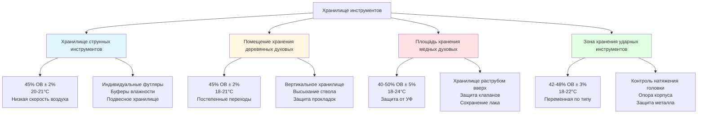

Различные семейства инструментов демонстрируют отчётливые реакции на условия окружающей среды в зависимости от состава материалов, методов конструирования и акустического проектирования. Понимание физических механизмов, управляющих стабильностью размеров, деградацией материалов и сохранением звучания, обеспечивает точное определение систем HVAC для каждой категории инструментов.

## Поведение гигроскопических материалов

Деревянные инструменты реагируют на изменения относительной влажности через адсорбцию и десорбцию влаги. Содержание влаги в равновесии (EMC) древесины прямо связано с относительной влажностью окружающей среды через изотерму адсорбции Хейлвуда-Хорробина:

$$EMC = \frac{1800}{W} \cdot \frac{K_1 \cdot h}{1 - K_1 \cdot h} + \frac{1800}{W} \cdot \frac{K_1 \cdot K_2 \cdot h}{1 + K_1 \cdot K_2 \cdot h}$$

Где:
- $EMC$ = содержание влаги в равновесии (%)
- $h$ = относительная влажность (десятичная дробь)
- $W$ = содержание влаги при точке насыщения волокон (примерно 1800% для большинства пород дерева)
- $K_1$, $K_2$ = температурозависимые константы

Для практического хранения инструментов изменение размеров подчиняется:

$$\Delta L = L_0 \cdot \alpha_t \cdot \Delta EMC$$

Где:
- $\Delta L$ = изменение размера
- $L_0$ = первоначальный размер
- $\alpha_t$ = коэффициент тангенциального или радиального усадки (0,15–0,35 для пород тонверка)
- $\Delta EMC$ = изменение содержания влаги в равновесии

Снижение относительной влажности на 10% (с 50% до 40%) снижает EMC примерно на 2%, вызывая усадку размеров на 0,3–0,7% в тангенциальном направлении. Для верхней деки скрипки длиной 41 см это представляет сжатие на 1,2–2,8 см, достаточное, чтобы открыть клеевые швы, спроектированные с минимальным зазором.

## Сравнение категорий инструментов

| Семейство инструментов | Температура (°C) | Диапазон ОВ (%) | Макс. суточное изменение ОВ | Критические материалы | Основной режим отказа |
|-------------------|------------------|--------------|---------------------|-------------------|----------------------|
| **Струнные инструменты** | 20-22 | 42-48 | ±2% | Ель, клён, скрывающий клей | Расхождение швов, трещины дек |
| **Деревянные духовые** | 18-22 | 40-50 | ±3% | Палисандр, самшит, прокладки | Трещины в стволе, разрушение прокладок |
| **Медные духовые** | 15-24 | 35-55 | ±5% | Латунные сплавы, войлоки клапанов | Деградация лака, коррозия клапанов |
| **Ударные инструменты** | 18-22 | 40-50 | ±3% | Кожа, клён | Трещины головки, расслоение корпуса |

## Требования для струнных инструментов

Струнные инструменты, сконструированные из вырезанных деревянных компонентов, проявляют экстремальную чувствительность к колебаниям влажности. Скрипичное семейство (скрипка, альт, виолончель, контрабас) и классические гитары обладают общими уязвимостями:

**Физика дек:**

Дека работает под давлением натяжения струн (примерно 222–400 Н для скрипок, >890 Н для виолончелей). Потеря влаги снижает жёсткость древесины в соответствии с:

$$E_{moisture} = E_0 \cdot e^{-\beta \cdot \Delta EMC}$$

Где $E_{moisture}$ представляет модуль упругости при изменённом содержании влаги, $E_0$ — базовый модуль, а $\beta$ составляет примерно 0,04 для ели. Снижение EMC на 3% снижает жёсткость на 11%, изменяя резонансные частоты и нарушая звукопроекцию.

**Целостность клеевых швов:**

Швы со скрывающим клеем зависят от механического зацепления с волокнами древесины. Дифференциальное расширение между четвертьпиленными и сквозными сечениями создаёт сдвиговое напряжение:

$$\tau = \frac{F}{A} = \frac{\Delta L \cdot E \cdot A}{L_0 \cdot A} = \frac{E \cdot \alpha_t \cdot \Delta EMC}{1}$$

Когда сдвиговое напряжение превышает прочность клеевого шва (5,5–8,3 МПа для горячего скрывающего клея), швы открываются вдоль периметра деки.

**Спецификации зоны хранения:**

- Поддерживать 45% ОВ ±2% для баланса предотвращения трещин и избежания вздутия
- Ограничить температуру до 20–21°C для предотвращения ускоренного старения лака
- Ограничить скорость воздуха до <0,13 м/с на поверхностях инструментов, предотвращая локальное высыхание
- Предусмотреть хранение в футляре с внутренними буферами влажности (системы Dampit, увлажняющие пакеты)

## Требования для деревянных духовых инструментов

Деревянные кларнеты, гобои и фаготы, построенные из африканского чёрного дерева (Dalbergia melanoxylon), испытывают изменения размеров ствола, влияющие на настройку и интонацию.

**Стабильность ствола:**

Диаметр цилиндрического или конического ствола определяет акустический импеданс и резонансную частоту. Радиальная усадка от потери влаги повышает высоту звука:

$$f = \frac{c}{2L} \cdot \sqrt{1 + \left(\frac{d}{2L}\right)^2}$$

Для цилиндрических стволов, где $f$ = частота, $c$ = скорость звука, $L$ = эффективная длина, $d$ = диаметр ствола. Снижение ствола на 0,5% повышает высоту примерно на 3–5 центов (0,03–0,05 полутонов), требуя компенсации амбошюра.

**Критические параметры контроля:**

- Диапазон ОВ 42–50% предотвращает как растрескивание ствола (низкая ОВ), так и вздутие прокладок (высокая ОВ)
- Температура 18–21°C уравновешивает стабильность древесины с долговечностью прокладок
- Постепенные сезонные переходы (<3% изменение ОВ в неделю) предотвращают растрескивание от теплового удара
- Период прогрева инструмента: 15–30 минут перед исполнением предотвращает конденсацию

Компоненты прокладок и пробки требуют немного более высокой влажности (48–52%), чем деревянные корпуса, создавая конфликт конструкции, решаемый через условия компромисса и частое техническое обслуживание.

## Требования для медных духовых инструментов

Медные духовые инструменты допускают более широкие диапазоны окружающей среды, но испытывают коррозию и механическую деградацию в экстремальных условиях.

**Сохранение лака:**

Покрытия из целлюлозонитратного лака деградируют через:
1. Тепловые циклы, вызывающие несоответствие коэффициентов расширения с латунной подложкой
2. Облучение ультрафиолетом, разрушающее полимерные цепи
3. Высокая влажность, обеспечивающая подповерхностное окисление

Оптимальное хранение поддерживает 40–50% ОВ при 18–21°C с УФ-фильтрованным освещением (<540 лк).

**Защита механизма клапанов:**

Поршневые и роторные клапаны требуют:
- <60% ОВ для предотвращения конденсации в кожухах клапанов при колебаниях температуры
- >35% ОВ для поддержания целостности войлочных и пробковых прокладок
- Стабильную температуру, предотвращающую изменения зазоров клапанов, превышающие 0,025 мм

**Стабильность материалов:**

Латунь (сплав Cu-Zn) проявляет незначительное изменение размеров при нормальных диапазонах окружающей среды. Основные проблемы включают:
- Обезцинкование в условиях высокой влажности с конденсацией
- Образование зелёной патины от воздействия органических кислот
- Ускорение усталости пружин при повышенных температурах (>27°C)

## Требования для ударных инструментов

Ударные инструменты охватывают огромное разнообразие материалов, требующих специфического для каждой категории контроля:

**Литавры и барабанные головки:**

Головки из кожи животных и синтетические головки по-разному реагируют на влажность. Натуральные кожаные головки:

$$T_{head} = k \cdot \frac{1}{1 + \alpha_{skin} \cdot \Delta RH}$$

Где натяжение головки $T_{head}$ снижается с увеличением ОВ. Увеличение ОВ на 10% снижает натяжение натуральной головки на 15–20%, снижая высоту примерно на один полутон. Оптимальное хранение при 42–48% ОВ обеспечивает стабильность настройки.

**Деревянные корпусные инструменты:**

Маримба, ксилофон и корпуса барабанов требуют 40–50% ОВ, аналогично струнным инструментам. Многослойные корпуса допускают более широкие диапазоны (35–55%), чем конструкция из массива дерева.

**Металлические ударные инструменты:**

Тарелки, гонги и колокола требуют:
- <50% ОВ, предотвращая потускнение и окисление
- Контроль температуры, предотвращающий тепловое расширение, влияющее на монтажное оборудование
- Изоляцию от вибрации при хранении, предотвращающую усталость металла

## Стратегия проектирования зоны хранения

## Многозонная реализация HVAC

Хранилища разнообразных инструментальных коллекций используют многозонный контроль окружающей среды:

**Зона 1 – Струнные инструменты:** Точный контроль (45% ОВ ±2%, 20–21°C ±0,5°C) для скрипок, альтов, виолончелей, гитар. Выделенные увлажнение и осушение с управлением обходом поддерживают точность независимо от колебаний нагрузки.

**Зона 2 – Деревянные духовые инструменты:** Умеренный контроль (45% ОВ ±3%, 18–21°C ±1°C) для кларнетов, гобоев, фаготов, флейт. Немного более низкая температура снижает деградацию прокладок при сохранении стабильности ствола.

**Зона 3 – Медные духовые/ударные инструменты:** Ослабленный контроль (45% ОВ ±5%, 18–24°C ±1,5°C) обеспечивает адекватную защиту без систем высокой точности. Стандартный коммерческий HVAC с хорошей фильтрацией достаточен.

Этот стратифицированный подход оптимизирует капитальные и эксплуатационные затраты при обеспечении надлежащего качества окружающей среды для чувствительности материалов и стоимости замены каждой категории инструментов.

## Мониторинг и документирование

Контроль окружающей среды, специфичный для инструментов, требует постоянной проверки:

- **Распределённые датчики:** Минимум один датчик на 46 м² на высоте инструментов (0,9–1,2 м над полом)
- **Интервалы регистрации данных:** Выборка каждые 5 минут для хранилищ струнных, каждые 15 минут для других зон
- **Пороги тревоги:** ±3% ОВ от заданного значения для струнных, ±5% для деревянных/медных духовых
- **Частота калибровки:** Ежеквартальная проверка датчиков по стандартам, поддерживаемым NIST

Логи окружающей среды предоставляют документацию для претензий страховщикам, демонстрируя надлежащий уход и определяя причину повреждений при превышениях влажности или отказах оборудования.
