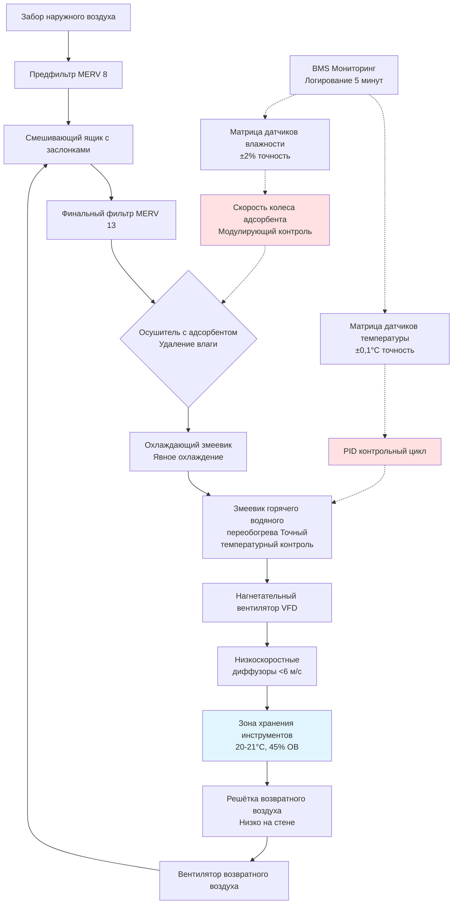

Стабильность температуры в диапазоне 18-24°C представляет критический параметр окружающей среды для сохранения музыкальных инструментов. Этот узкий диапазон уравновешивает человеческий комфорт при периодах доступа с термодинамическими требованиями древесины, металла и композитных материалов при механическом напряжении. Колебания температуры вызывают изменения размеров через тепловое расширение, изменяют свойства материалов и ускоряют процессы химической деградации, которые нарушают структурную целостность и акустические характеристики.

## Физическая основа для температурного контроля

Музыкальные инструменты испытывают тепловое расширение и сжатие, определяемые коэффициентом линейного теплового расширения (α), который количественно характеризует изменение размеров на единицу изменения температуры:

$$
\Delta L = L_0 \cdot \alpha \cdot \Delta T
$$

где:
- $\Delta L$ = изменение длины (мм)
- $L_0$ = исходная длина при эталонной температуре
- $\alpha$ = коэффициент линейного теплового расширения (мм/мм·°C)
- $\Delta T$ = изменение температуры от эталона (°C)

**Коэффициенты теплового расширения для конкретных материалов при 21°C:**

| Материал | α (×10⁻⁶ мм/мм·°C) |
|----------|---------------------|
| Ель (продольная) | 3,8 |
| Ель (тангенциальная) | 34,0 |
| Клён (продольная) | 6,5 |
| Клён (тангенциальная) | 25,6 |
| Чёрное дерево (тангенциальная) | 20,7 |
| Сталь (рояльная струна) | 11,7 |
| Латунь (механизм клапанов) | 18,7 |
| Нейлон (гитарные струны) | 81,0 |

Анизотропное расширение древесины создаёт дифференциальное напряжение на склеенных соединениях между перпендикулярными ориентациями волокон. Для верхней деки скрипки шириной 356 мм (тангенциальное волокно), увеличение температуры на 5,6°C вызывает:

$$
\Delta L = 356 \text{ мм} \times 34,0 \times 10^{-6} \text{ мм/мм·°C} \times 5,6°C = 0,066 \text{ мм}
$$

Хотя 0,066 мм кажется незначительным, это расширение происходит против продольной стабильности обечайки и задней деки, генерируя внутреннее напряжение, которое может разделить склеенные соединения скрытого клея или вызвать растрескивание отделки.

## Влияние температуры на натяжение струн

Струнные инструменты сохраняют акустические свойства через точное натяжение через подставку и дека. Стальные и нейлоновые струны демонстрируют зависящие от температуры изменения натяжения, описываемые:

$$
\frac{\Delta T_s}{T_{s0}} = -\alpha \cdot \Delta T
$$

где:
- $T_s$ = натяжение струны
- $T_{s0}$ = эталонное натяжение струны при $T_0$
- $\alpha$ = коэффициент линейного теплового расширения
- $\Delta T$ = изменение температуры

Для рояля с 200 струнами при среднем натяжении 734 кН на струну, снижение температуры на 2,8°C увеличивает общее напряжение деки на:

$$
\Delta T_{total} = 200 \times 734 \text{ кН} \times 6,5 \times 10^{-6} \text{/°C} \times 2,8°C = 2,67 \text{ кН}
$$

Это увеличение 2,67 кН добавляется к существующему общему натяжению струны 146 МН, вызывая изменения формы деки и нестабильность высоты тона. Колебания температуры, превышающие ±2,8°C от эталонной температуры настройки, производят слышимые вариации высоты тона по диапазону инструмента.

## Тепловое напряжение в композитных конструкциях

Музыкальные инструменты объединяют материалы с различными коэффициентами теплового расширения, создавая межслойное напряжение во время изменений температуры. Тепловое напряжение (σ) на биметаллическом интерфейсе следует:

$$
\sigma = \frac{E \cdot \Delta \alpha \cdot \Delta T}{1 - \nu}
$$

где:
- $E$ = модуль упругости (МПа)
- $\Delta \alpha$ = разница коэффициентов теплового расширения
- $\Delta T$ = изменение температуры
- $\nu$ = коэффициент Пуассона

Для верхней деки из ели (тангенциальная) склеенной с кленовой обечайкой (продольная):
- $\Delta \alpha = (34,0 - 6,5) \times 10^{-6}$ = 27,5 × 10⁻⁶ мм/мм·°C
- $E_{ель}$ = 11,0 МПа (тангенциальная)
- $\nu$ = 0,37 (ель)

Колебание температуры на 5,6°C генерирует межслойное напряжение:

$$
\sigma = \frac{11,0 \text{ МПа} \times 27,5 \times 10^{-6} \text{/°C} \times 5,6°C}{1 - 0,37} = 2,67 \text{ МПа}
$$

Это напряжение 2,67 МПа приближается к прочности на сдвиг скрытого клея (3,4-5,5 МПа), объясняя, почему термические циклы вызывают разделение соединений в исторически построенных инструментах.

## Сравнение температурной чувствительности по типам инструментов

Различные семейства инструментов демонстрируют различную восприимчивость к колебаниям температуры на основе материалов конструкции, структурного натяжения и тепловой инерции:

| Тип инструмента | Критические компоненты | Температурный допуск | Постоянная времени | Основной режим отказа |
|-----------------|--------------------|-----------------------|----------------------|----------------------|
| Концертный рояль | Дека, колковый блок, струны | ±1,7°C | 8-12 часов | Нестабильность настройки, напряжение деки |
| Скрипка | Соединения скрытого клея, лак | ±2,2°C | 20-30 минут | Разделение соединений, трещины отделки |
| Акустическая гитара | Соединение грифа, подставка, распорки | ±2,8°C | 1-2 часа | Изменение угла грифа, подъём подставки |
| Деревянные духовые | Звукоотверстия, адгезия прокладок, канал | ±3,3°C | 10-15 минут | Отказ герметизации прокладок, растрескивание канала |
| Медные духовые | Совмещение клапанов, посадка кулисы | ±4,4°C | 5-10 минут | Вялость клапанов, заклинивание кулисы |
| Клавесин | Дека, натяжение струн | ±1,1°C | 4-6 часов | Нестабильность настройки, изменения голоса |

Концертные рояли демонстрируют самый низкий температурный допуск из-за большой площади деки под постоянным натяжением, в то время как медные духовые допускают более широкие колебания, потому что металлические компоненты расширяются равномерно без склеенных соединений.

## Требования к температурному контролю музейного качества

Хранилища инструментов консервационного класса внедряют протоколы стабильности температуры, полученные из музейных стандартов (ASHRAE Chapter 24, AIC Guidelines):

**Основные параметры температуры:**
- **Диапазон установки:** 20-21°C для круглогодичной стабильности
- **Дневное изменение:** ±1,1°C максимум для предотвращения напряжения от термических циклов
- **Сезонный дрейф:** ±1,7°C общее годовое изменение приемлемо
- **Скорость изменения:** <1,1°C в час при переходах HVAC
- **Пространственная однородность:** ±0,6°C между точками измерения в помещении хранения

Выбор установки 20-21°C уравновешивает:
1. **Стабильность материала** при умеренных температурах, снижающих скорости химических реакций
2. **Человеческий комфорт** при обработке и осмотре инструментов
3. **Энергоэффективность**, минимизирующую нагрузки отопления/охлаждения
4. **Контроль влажности**, позволяющий поддерживать стабильную относительную влажность в диапазоне 40-50%

## Проектирование систем HVAC для стабильности температуры

Поддержание стабильности температуры ±1,1°C требует стратегий HVAC, которые исключают циклирование, предотвращают перерегулирование температуры и обеспечивают непрерывную установившуюся работу:

**Критические элементы проектирования:**

1. **Подача воздуха постоянного объёма** исключает колебания температуры от поведения охотничья VAV и сохраняет постоянные скорости удаления тепла.

2. **Модулирующие змеевики переобогрева горячей воды** обеспечивают точный температурный контроль через пропорционально-интегрально-дифференциальные (PID) циклы с полосой нечувствительности ±0,28°C. Мощность переобогрева рассчитана на 125% явного охлаждения для обеспечения независимого контроля влажности и температуры.

3. **Конструкция с высокой тепловой инерцией** с использованием внутренней изоляции, массивных стен и герметичных оболочек снижает колебания внешних нагрузок. Постоянная времени >12 часов затухает колебания наружной температуры.

4. **Система выделенного наружного воздуха (DOAS)** с рекуперацией энергии обрабатывает нагрузки вентиляции отдельно от кондиционирования помещения, предотвращая изменения температуры подаваемого воздуха при изменениях занятости.

5. **Резервные датчики температуры** (минимум 3 на зону) с точностью ±0,1°C обеспечивают алгоритмы усреднения, которые фильтруют ложные показания и предотвращают ненужные ответы системы.

6. **Запрет ночной переустановки** сохраняет 24/7 стабильные условия. Восстановление температуры после переустановки вызывает 4-8 часовые периоды повышенного теплового напряжения по мере равновесия инструментов.

## Соображения по расчёту тепловой нагрузки

Хранилища инструментов требуют детального анализа нагрузки, учитывающего эффекты тепловой инерции и переходный теплопередачу:

**Теплопередача оболочки:**
$$
Q_{envelope} = U \cdot A \cdot \Delta T
$$

**Солнечный прирост тепла через окна:**
$$
Q_{solar} = A_{window} \cdot SHGC \cdot I_{solar}
$$

**Внутреннее производство тепла:**
$$
Q_{internal} = Q_{lighting} + Q_{occupants} + Q_{equipment}
$$

Целевые значения U для компонентов оболочки:
- Стены: U ≤ 0,28 Вт/м²·K (R-3,6 непрерывная изоляция)
- Крыша: U ≤ 0,17 Вт/м²·K (R-5,8 непрерывная изоляция)
- Окна: U ≤ 1,4 Вт/м²·K с SHGC ≤ 0,25
- Плита: R-2,7 изоляция периметра, проходящая 1,2 м

Высокопроизводительные оболочки снижают связь с наружной температурой, позволяя системам HVAC поддерживать более плотную внутреннюю стабильность температуры с нижней частотой циклирования оборудования.

## Мониторинг температуры и документирование

Сохранение инструментов музейного стандарта требует непрерывной документации окружающей среды, предоставляющей доказательства стабильных условий:

**Параметры сбора данных:**
- **Интервал выборки:** 5-15 минут для анализа тенденций
- **Точность датчика:** ±0,1°C для документирования исследовательского класса
- **Частота калибровки:** Ежегодная проверка по стандартам NIST
- **Пороги тревоги:** ±1,7°C от установки срабатывает немедленное уведомление
- **Сохранение данных:** Минимальный архив на 5 лет для страхования и консервационных записей

Данные температуры выявляют деградацию производительности системы HVAC до возникновения повреждения инструмента. Постепенное увеличение дневного диапазона температур указывает на отказ приводов заслонок, загрязненные змеевики или потерю хладагента, требующие вмешательства при техническом обслуживании.

## Долгосрочная стабильность материалов

Стабильность температуры продлевает срок службы инструмента, снижая кумулятивные циклы теплового напряжения. Соотношение Coffin-Manson из материаловедения предсказывает усталостную долговечность при термических циклах:

$$
N_f = C \cdot (\Delta T)^{-m}
$$

где:
- $N_f$ = циклы до отказа
- $C$ = материалоспецифическая константа
- $\Delta T$ = диапазон температур на цикл
- $m$ = показатель усталости (типично 2-3 для полимеров и адгезивов)

Снижение дневного изменения температуры с ±2,8°C до ±1,1°C увеличивает долговечность соединений на коэффициент 4-8, демонстрируя ценность сохранения точного температурного контроля.

## Заключение

Стабильность температуры в диапазоне 18-24°C, поддерживаемая при дневном изменении ±1,1°C, предотвращает напряжение от теплового расширения, стабилизирует натяжение струн и сохраняет склеенные соединения в коллекциях музыкальных инструментов. Физика теплового расширения, дифференциальные свойства материалов и накопление напряжения обоснуют системы HVAC музейного класса с модулирующими элементами управления, резервными датчиками и непрерывным мониторингом. Инструменты представляют незаменимые культурные артефакты и значительные финансовые инвестиции; точный контроль окружающей среды защищает эти активы от кумулятивной деградации, вызванной термическими циклами.

Надлежащая реализация условий хранения с устойчивой температурой требует интеграции высокопроизводительных строительных оболочек, выделенного оборудования HVAC и комплексных систем мониторинга. Установка 20-21°C уравновешивает требования консервации материалов с практическими потребностями доступа, в то время как стабильность ±1,1°C предотвращает механическое напряжение, которое ускоряет старение и повреждение в деревянной, металлической и композитной конструкции инструментов.
