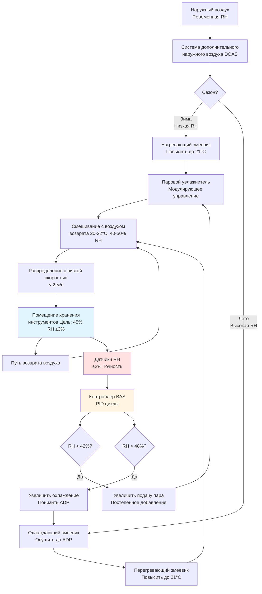

Деревянные музыкальные инструменты—скрипки, виолончели, гитары, деревянные духовые инструменты и акустические пианино—требуют точного контроля относительной влажности в диапазоне 40-50% для предотвращения размерной нестабильности, структурного повреждения и акустической деградации. Этот узкий диапазон балансирует гигроскопическую природу дерева с структурными требованиями инструментов, находящихся под постоянным механическим напряжением от натяжения струн, давления воздуха и клеевых соединений.

## Физика влаговлажностного равновесия дерева

Дерево ведет себя как гигроскопический материал, непрерывно обмениваясь влагой с окружающим воздухом до достижения равновесного содержания влаги (EMC). Взаимосвязь между относительной влажностью, температурой и EMC определяет размерную стабильность в деревянных инструментах.

**Изотерма сорбции Хэйлвуда-Хорробина** для EMC дерева:

$$
\text{EMC} = \frac{1800}{W} \cdot \frac{K_1 \cdot h}{1 - K_1 \cdot h} + \frac{K_1 \cdot K_2 \cdot h + 2 \cdot K_1 \cdot K_2^2 \cdot h^2}{1 + K_1 \cdot K_2 \cdot h + K_1 \cdot K_2^2 \cdot h^2}
$$

Где:
- EMC = равновесное содержание влаги (%)
- h = относительная влажность (в дробях, 0,40-0,50 для инструментов)
- W = молярная масса воды (18,02 г/моль)
- K₁, K₂ = зависящие от температуры константы

**Упрощенное приближение EMC** (действительно для 30-70% RH, 15-27°C):

$$
\text{EMC} \approx 0.04 + 0.16 \cdot h + 0.10 \cdot h^2 - 0.0027 \cdot (T - 21)
$$

Где:
- EMC = равновесное содержание влаги (% по сухому основанию)
- h = относительная влажность (в дробях)
- T = температура (°C)

**При 45% RH и 21°C:**

$$
\text{EMC} = 0.04 + 0.16(0.45) + 0.10(0.45)^2 - 0.0027(0) = 0.132 = 8.3\%
$$

Это содержание влаги 8,3% представляет устойчивое равновесие для большинства пород древесины инструментов. Отклонения от этой RH вызывают миграцию влаги и размерные изменения.

## Гигроскопические размерные изменения

Дерево расширяется и сжимается перпендикулярно направлению волокон по мере изменения содержания влаги. Коэффициент гигроскопического расширения варьируется в зависимости от породы дерева и ориентации волокон.

**Линейное размерное изменение:**

$$
\frac{\Delta L}{L_0} = \alpha_h \cdot \Delta(\text{EMC})
$$

Где:
- ΔL/L₀ = относительное размерное изменение
- αₕ = коэффициент гигроскопического расширения
- ΔEMC = изменение равновесного содержания влаги (%)

**Типичные коэффициенты гигроскопического расширения:**

| Порода дерева | Тангенциальная (%) | Радиальная (%) | Продольная (%) |
|---|---|---|---|
| Ель (деки) | 0,32 на 1% MC | 0,16 на 1% MC | 0,01 на 1% MC |
| Клен (спинки, грифы) | 0,37 на 1% MC | 0,19 на 1% MC | 0,01 на 1% MC |
| Палисандр (накладки) | 0,42 на 1% MC | 0,22 на 1% MC | 0,01 на 1% MC |
| Эбеновое дерево (гриф) | 0,38 на 1% MC | 0,18 на 1% MC | 0,01 на 1% MC |

**Пример расчета для верхней деки скрипки:**

Дека скрипки: ель, тангенциальный размер = 200 мм

RH падает с 45% на 35%:
- ΔEMC = 8,3% - 6,8% = 1,5% изменение содержания влаги
- ΔL = 200 мм × 0,32%/1%MC × 1,5% = 0,96 мм сжатие

Это сжатие на 0,96 мм создает достаточное напряжение для открытия клеевых соединений вдоль шва верхней деки, требующее профессионального восстановления.

## Критический диапазон RH: 40-50%

Спецификация 40-50% RH вытекает из балансирования противоположных механизмов отказа:

**Нижний предел (40% RH минимум):**
- Ниже 40% RH содержание влаги в дереве падает ниже 7,5%
- Напряжения сжатия превышают прочность на растяжение клеевого соединения (500-800 psi для клея из шкуры животных)
- Инициирование трещин в тонких деках под натяжением струн
- Покоробление грифа и отслаивание накладки на гитарах

**Верхний предел (50% RH максимум):**
- Выше 50% RH содержание влаги в дереве превышает 9,5%
- Набухание повышает высоту струн, ухудшая играбельность
- Снижение акустической скорости в деках (скорость ∝ 1/√плотность)
- Повышенная восприимчивость к плесени (>65% RH на поверхности дерева)

**Оптимальная цель: 45% RH** обеспечивает максимальный запас от обоих режимов отказа.

## Сравнение типов дерева: чувствительность к RH

Различные породы дерева проявляют различную чувствительность к колебаниям влажности в зависимости от анатомической структуры, плотности и ориентации волокон.

| Тип дерева | Плотность (кг/м³) | Тангенциальное движение | Чувствительность к RH | Обычное использование |
|---|---|---|---|---|
| Ель | 432-480 | Высокая (0,32%/1%MC) | Очень высокая | Деки, верхние части |
| Клен | 640-720 | Высокая (0,37%/1%MC) | Высокая | Спинки, грифы, боки |
| Палисандр | 800-1040 | Очень высокая (0,42%/1%MC) | Очень высокая | Спинки, накладки |
| Эбеновое дерево | 960-1120 | Высокая (0,38%/1%MC) | Высокая | Гриф, подставка |
| Махагони | 560-640 | Умеренная (0,28%/1%MC) | Умеренная | Грифы, корпусы |
| Кедр | 400-448 | Высокая (0,35%/1%MC) | Очень высокая | Деки классических гитар |

**Рейтинг чувствительности к RH:**
- Очень высокая: >0,015% размерное изменение на 1% изменение RH
- Высокая: 0,010-0,015% изменение на 1% RH
- Умеренная: <0,010% изменение на 1% RH

Инструменты, объединяющие несколько пород дерева (скрипка: ель сверху, клен снизу), сталкиваются с дополнительным напряжением от **дифференциального расширения**, где различные материалы расширяются с разными скоростями, концентрируя напряжение в клеевых соединениях.

## Кинетика переноса влаги

Содержание влаги в дереве не изменяется мгновенно с окружающей RH. Диффузия влаги следует второму закону Фика:

$$
\frac{\partial C}{\partial t} = D \cdot \frac{\partial^2 C}{\partial x^2}
$$

Где:
- C = концентрация влаги
- t = время
- D = коэффициент диффузии влаги (обычно 10⁻⁶ до 10⁻⁷ см²/с для дерева)
- x = расстояние через толщину дерева

**Характеристическое время диффузии:**

$$
\tau = \frac{L^2}{D}
$$

Для верхней деки скрипки (L = 3 мм толщина, D = 2×10⁻⁷ см²/с):

$$
\tau = \frac{(0.3 \text{ см})^2}{2 \times 10^{-7} \text{ см}^2/\text{с}} = 450,000 \text{ с} = 5.2 \text{ дня}
$$

Это время уравновешивания 5 дней означает, что резкие изменения RH создают **градиенты влаги** через толщину дерева, вызывая внутреннее напряжение еще до полного размерного изменения. HVAC-системы должны ограничить скорость изменения RH до <5% за 24 часа для предотвращения трещин, вызванных градиентом.

## Стратегия управления HVAC для 40-50% RH

## Взаимодействие температуры и RH

Абсолютная влажность (содержание влаги в воздухе) определяет EMC дерева более прямым образом, чем относительная влажность, но RH обеспечивает практический параметр управления.

**Психрометрическая зависимость:**

$$
\text{RH} = \frac{P_v}{P_{vs}} \times 100\%
$$

Где:
- RH = относительная влажность (%)
- Pᵥ = фактическое парциальное давление водяного пара
- Pᵥₛ = давление насыщенного пара при температуре воздуха

**Давление насыщения (уравнение Антуана):**

$$
\log_{10}(P_{vs}) = A - \frac{B}{C + T}
$$

Для водяного пара (T в °C, Pᵥₛ в кПа):
- A = 7.196, B = 1750.3, C = 235.0

**При 21°C:**

$$
P_{vs} = 10^{7.196 - \frac{1750.3}{235 + 21}} = 2.505 \text{ кПа}
$$

**При 45% RH и 21°C:**

$$
P_v = 0.45 \times 2.505 = 1.127 \text{ кПа}
$$

Колебания температуры влияют на RH даже при постоянной абсолютной влажности. Снижение на 3°C с 21°C до 18°C с постоянной влажностью:

$$
P_{vs,18} = 2.063 \text{ кПа}
$$

$$
\text{RH}_{18} = \frac{1.127}{2.063} \times 100\% = 54.6\%
$$

Это **9,6% увеличение RH** от снижения температуры демонстрирует, почему стабильность температуры (±1°C) необходима наряду с управлением RH.

## Особые соображения для скрипок

Скрипки представляют наиболее жесткие требования к влажности из-за тонких дек (2,5-3,5 мм ель) под высоким изгибающимся напряжением от давления подставки и внутреннего изгиба.

**Анализ напряжения в деке:**

Подставка оказывает примерно 89 Н силы вниз на контактную площадь 1,3 см²:

$$
\sigma = \frac{F}{A} = \frac{89 \text{ Н}}{1.3 \text{ см}^2} = \frac{89 \text{ Н}}{0.00013 \text{ м}^2} = 685 \text{ кПа}
$$

Это постоянное сжимающее напряжение вместе с изгибом от изгиба деки создает поле напряжения, приближающееся к 3450 кПа в деке. Когда RH падает:

1. Дерево сжимается тангенциально (в направлении ширины)
2. Внутреннее растягивающее напряжение добавляется к существующему полю напряжения
3. Общее напряжение превышает прочность дерева на растяжение перпендикулярно волокнам (~4140 кПа для ели)
4. Инициирование распространения трещины, обычно вдоль линий волокон

**Критический порог RH для трещин в скрипке:**

Исследования показывают, что деки скрипок треснут, когда RH падает ниже 35% на продолжительный период (>2 недели), или когда RH уменьшается >15% в течение 48 часов. Спецификация 40-50% RH обеспечивает:
- 5% запас от порога инициирования трещин (40% минимум)
- Постепенная скорость изменения, предотвращающая шоковые повреждения
- Допуск для незначительных отклонений управления HVAC

## Требования по влажности для гитар

Классические и стальнострунные акустические гитары сталкиваются с аналогичными проблемами с дополнительной чувствительностью в:

**Геометрия грифа:**
- Натяжение стальных струн: 667-889 Н всего на грифе
- Рельеф грифа (кривизна) изменяется на 0,25-0,51 мм на 10% изменение RH
- Высота струн зависит от рельефа грифа и набухания деки

**Система распорок:**
- Распорки X-образной или веерной конфигурации приклеены к нижней части деки
- Дифференциальное расширение между распорками и декой
- Отслаивание распорок наблюдается ниже 38% RH в старых инструментах

**Целевая RH для гитар:** 45-50% (немного выше, чем для скрипок)
- Более широкий допуск отражает более толстые деки (2,5-3,5 мм типично)
- Более низкое натяжение струн на единицу площади по сравнению со скрипками
- Современные клеи PVA более влагостойки, чем клей из шкуры животных

## Требования к реализации

**Спецификации HVAC-системы для хранения деревянных инструментов:**

**Оборудование для контроля влажности:**
- Осушение адсорбентом: требуется для управления <50% RH во влажном климате
- Паровое увлажнение: электродное или газовое, модулирующее 0-100%
- Точность управления: ±2% RH через высокоточные датчики влажности
- Время отклика: <15 минут для 50% коррекции отклонения

**Распределение воздуха:**
- Скорость подачи воздуха у инструментов: <0,15 м/с для предотвращения локального высушивания
- Воздухообмены в час: 4-6 ACH для адекватного перемешивания
- Выбор диффузора: панели с отверстиями потолка или низкоскоростное вытеснение
- Температурная стратификация: <1°C пол-потолок

**Мониторинг и тревоги:**
- Несколько датчиков RH (минимум 3 на зону) с непрерывной записью данных
- Пороги тревоги: 38% RH низкая, 52% RH высокая
- Тревога температуры: ±2°C от установки 21°C
- Автоматическое уведомление: Email/SMS менеджеру объекта и подрядчику HVAC

**Сезонные регулировки:**

| Сезон | Условия снаружи | Основная нагрузка | Стратегия управления |
|---|---|---|---|
| Зима | 0°C, 40% RH | Увлажнение | Добавление пара после нагрева |
| Весна | 13°C, 60% RH | Осушение | Охлаждающий змеевик + перегрев |
| Лето | 29°C, 70% RH | Охлаждение + Осушение | Низкий ADP + помощь адсорбентом |
| Осень | 16°C, 50% RH | Минимальная | Поддержать установку 45% RH |

## Экономическое обоснование

Высокоценные коллекции инструментов оправдывают точное управление влажностью на основе предотвращения повреждений:

**Анализ стоимости ремонта:**
- Ремонт трещины деки скрипки: 1055-3520 USD
- Переклеивание подставки гитары: 210-560 USD
- Восстановление деки пианино: 2110-10560 USD
- Полная девальвация инструмента от трещин: 30-70% рыночной стоимости

**Дополнительная стоимость HVAC-системы:**
- Осушение адсорбентом: +5620-8410 USD для системы 2360 CFM (м³/ч)
- Прецизионный паровой увлажнитель: +2110-4220 USD против испарительного
- Улучшенное управление и мониторинг: +1410-2810 USD
- **Общая надбавка: 9140-15610 USD**

Для коллекции стоимостью $70560+, инвестиция в HVAC представляет 13-25% стоимости активов, предотвращая необратимое повреждение. Профессиональные консерваторы повсеместно рекомендуют диапазон 40-50% RH для деревянных инструментов, делая точное управление окружающей средой отраслевым стандартом для серьезных коллекций.

Физика влаговлажностного равновесия дерева, гигроскопического расширения и концентрации напряжения в инструментах под натяжением требуют HVAC-систем, способных поддерживать стабильность в течение года в узких допусках. Правильная реализация сохраняет стоимость инструмента, поддерживает акустическое совершенство и предотвращает дорогостоящие структурные повреждения.
