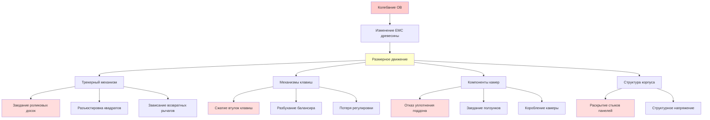
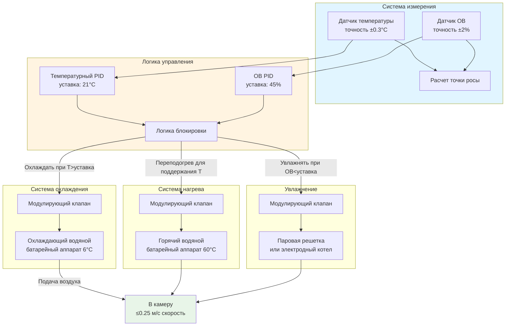

# Стабилизация ОВ 40-50% в камерах органов

Механические системы органов труб содержат обширные гигроскопические материалы—деревянные механизмы, войлочные втулки и кожаные пневматические компоненты—которые претерпевают размерные изменения в ответ на колебания относительной влажности. Диапазон управления 40-50% ОВ представляет точку равновесия, где влагосодержание древесины стабилизируется на 8-10%, минимизируя размерное движение при предотвращении деградации материала от чрезмерной сухости или влажности. Выходы влажности за пределы этого диапазона вызывают заедание трекерного механизма, потерю регулировки клавиш и деградацию кожи, требуя точного управления HVAC для поддержания механической надежности на протяжении всего срока службы органа.

## Влажностное равновесие древесины

### Соотношение равновесного влагосодержания

Деревянные компоненты в органных механизмах обмениваются водяным паром с окружающим воздухом до достижения равновесного влагосодержания (EMC). Это соотношение следует изотерме сорбции Hailwood-Horrobin:

**EMC как функция относительной влажности:**

$$EMC = \frac{1800}{W} \cdot \frac{K \cdot h}{1 - K \cdot h} + \frac{K_1 \cdot K \cdot h + 2 \cdot K_1 \cdot K_2 \cdot K^2 \cdot h^2}{1 + K_1 \cdot K \cdot h + K_1 \cdot K_2 \cdot K^2 \cdot h^2}$$

Где:
- $EMC$ = Равновесное влагосодержание (%)
- $h$ = Относительная влажность (десятичная дробь)
- $W$ = 349 для большинства пород древесины
- $K$, $K_1$, $K_2$ = Температурно-зависимые коэффициенты

**Упрощенное приближение EMC для органной древесины при 20-22°C:**

$$EMC \approx 0.00867 + 0.0684 \cdot h + 0.114 \cdot h^2$$

Для ОВ в процентах:

$$EMC \approx 0.00867 + 0.0000684 \cdot ОВ + 0.0000114 \cdot ОВ^2$$

**Целевой диапазон ОВ и соответствующее EMC:**

| Относительная влажность | EMC (мягкая древесина) | EMC (твердая древесина) | Размерная стабильность |
|-------------------------|------------------------|------------------------|------------------------|
| 35% | 7.0% | 6.8% | Риск растрескивания при усадке |
| 40% | 8.0% | 7.8% | Нижний допустимый предел |
| 45% | 8.9% | 8.7% | **Оптимальная уставка** |
| 50% | 9.8% | 9.6% | Верхний допустимый предел |
| 55% | 10.6% | 10.4% | Риск разбухания и заедания |
| 60% | 11.4% | 11.2% | Чрезмерная влага, риск коррозии |

Диапазон 40-50% ОВ поддерживает EMC между 8-10%, зоной стабильности для размерной консистентности и механической производительности.

## Гигроскопические размерные изменения

### Движение древесины поперек волокон

Древесина проявляет анизотропное расширение при изменении влагосодержания, с минимальным продольным движением, но значительным радиальным и тангенциальным расширением:

**Соотношение размерного изменения:**

$$\frac{\Delta W}{W} = \alpha_{влага} \cdot \Delta EMC$$

Где:
- $\Delta W/W$ = Дробное размерное изменение (%)
- $\alpha_{влага}$ = Коэффициент влажностного расширения
- $\Delta EMC$ = Изменение равновесного влагосодержания (%)

**Коэффициенты влажностного расширения (на 1% изменения EMC):**

| Тип древесины | Радиальное направление | Тангенциальное направление | Применение |
|---------------|------------------------|---------------------------|-----------|
| Ель ситхинская | 0.34% | 0.67% | Резонансные доски, поддоны |
| Сосна сахарная | 0.36% | 0.50% | Компоненты ветровых камер |
| Дуб белый | 0.51% | 0.95% | Рамы клавиш, скамьи |
| Клен твердый | 0.43% | 0.83% | Рычаги клавиш, части тракеров |
| Липа | 0.62% | 0.92% | Стопперы труб, направляющие ящиков |

**Пример расчета заедания трекерного механизма:**

Рассмотрим стоп-механизм из липы шириной 305 мм (тангенциальная ориентация), испытывающий изменение ОВ с 45% на 60%:

Изменение EMC:
$$\Delta EMC = 11.4\% - 8.9\% = 2.5\%$$

Размерное расширение:
$$\Delta W = 305 \text{ мм} \times 0.0092 \times 2.5 = 7.0 \text{ мм}$$

Это расширение на 7.0 мм в узком механизме скольжения вызывает полный отказ функции.

**Критические компоненты органа и чувствительность к ОВ:**

### Скорость изменения EMC

Влагосодержание древесины реагирует на изменения ОВ с временной задержкой, определяемой физикой диффузии:

**Второй закон диффузии Фика:**

$$\frac{\partial MC}{\partial t} = D \frac{\partial^2 MC}{\partial x^2}$$

Где:
- $MC$ = Влагосодержание в позиции и времени
- $t$ = Время
- $D$ = Коэффициент диффузии влаги (м²/день)
- $x$ = Расстояние от поверхности

**Постоянная времени влажностного выравнивания:**

$$\tau \approx \frac{L^2}{D}$$

Для типичных компонентов органной древесины (толщина 12-25 мм) с D ≈ 0.0009-0.0028 м²/день:

$$\tau \approx 2-20 \text{ дней для выравнивания на 63\%}$$

**Практические последствия:**

- Резкие изменения ОВ создают градиенты влаги, вызывающие внутреннее напряжение
- Быстрая сушка (запуск зимнего отопления) вызывает растрескивание поверхности
- Быстрое увлажнение (лето) вызывает набухание поверхности и коробление
- Постепенные переходы ОВ (< 5% в неделю) минимизируют развитие напряжения

## Эффекты ОВ для конкретных материалов

### Сравнение материалов органа

Различные материалы органа уникально реагируют на колебания относительной влажности:

| Материал | Оптимальный диапазон ОВ | Эффекты при <40% ОВ | Эффекты при >50% ОВ | Критический режим отказа |
|----------|-------------------------|---------------------|---------------------|--------------------------|
| **Древесина (механизмы)** | 40-50% | Усадка, разделение суставов, растрескивание | Разбухание, заедание, коробление | Заедание трекерного механизма |
| **Кожа (пневматика)** | 35-50% | Затвердевание, растрескивание, огрубение | Размягчение, растяжение, плесень | Потеря пневматического уплотнения |
| **Войлок (втулки)** | 40-55% | Установка сжатия, потеря амортизации | Расширение, чрезмерное трение | Потеря регулировки клавиш |
| **Клей (клей животный)** | 40-50% | Хрупкость, отказ суставов | Размягчение, ползучесть, проскальзывание | Разборка конструкции |
| **Металлические трубы** | Некритично | Минимальный эффект | Окисление поверхности, малахит | Только косметический при <65% |
| **Деревянные трубы** | 40-50% | Растрескивание при усадке, утечка воздуха | Разбухание, закупорка труб | Потеря герметичности воздуха |

### Консервация кожаных компонентов

Кожаные пневматические компоненты и клапанные уплотнения проявляют сложное гигроскопическое поведение:

**Соотношение влагосодержания кожи:**

$$MC_{кожа} = a + b \cdot ОВ + c \cdot ОВ^2$$

Для растительного дубления кожи органов:
- a ≈ 4.5
- b ≈ 0.095
- c ≈ 0.0008

При ОВ = 45%:
$$MC_{кожа} = 4.5 + 0.095(45) + 0.0008(45)^2 = 10.4\%$$

**Механические свойства кожи в зависимости от ОВ:**

| Уровень ОВ | MC кожи | Прочность на разрыв | Жесткость | Качество уплотнения |
|------------|---------|---------------------|-----------|---------------------|
| 30% | 7.3% | Высокая | Хрупкая/жесткая | Растрескивание, плохое уплотнение |
| 40% | 8.8% | Оптимальная | Гибкая | Хорошее удержание уплотнения |
| 45% | 10.4% | Оптимальная | Идеальная гибкость | Превосходное уплотнение |
| 50% | 12.1% | Снижена | Начало размягчения | Хорошее, контролировать плесень |
| 60% | 15.4% | Ослаблена | Чрезмерная мягкость | Деформация уплотнения, плесень |

Консервация кожи требует:
- Минимум 35% ОВ для предотвращения растрескивания высыхания
- Максимум 55% ОВ для предотвращения роста плесени (Aspergillus при >60% ОВ)
- Стабильная ОВ для минимизации усталости от циклов расширения/сжатия

## Стратегии управления влажностью

### Проектирование систем HVAC для стабильности ±3% ОВ

Достижение управления ±3% ОВ требует развязанного регулирования температуры-влажности:

**Последовательность управления для стабильности ОВ:**

1. **Режим осушения (ОВ > 48%):**
   - Охлаждение подаваемого воздуха ниже точки росы для конденсации влаги
   - Переподогрев для поддержания температуры подачи 21°C
   - Сокращение вывода увлажнителя до нуля

2. **Режим увлажнения (ОВ < 42%):**
   - Поддержание охлаждения для управления температурой
   - Впрыск пара в поток подаваемого воздуха
   - Мониторинг ОВ подаваемого воздуха для предотвращения конденсации

3. **Стабильный режим (42% < ОВ < 48%):**
   - Минимальная регулировка охлаждения/переподогрева для температуры
   - Увлажнитель неактивен или минимальный выход
   - Плавание в мертвой зоне

**Анализ психрометрического процесса:**

Для камеры, требующей 944 м³/ч (2000 CFM) при 21°C, 45% ОВ:

Точка росы камеры при уставке:
$$T_{dp} = 8.7°C$$

Состояние выхода охлаждающего аппарата для осушения:
$$T_{аппарата} = 5.6°C \text{ (ниже точки росы)}$$

Требование переподогрева:
$$\dot{Q}_{переподогрев} = 944 \times \frac{1.2}{3.6} \times 1005 \times (21 - 5.6) = 63.8 \text{ кВт}$$

Требование увлажнения (зима, 20% ОВ снаружи):
$$\Delta W = 0.0077 - 0.0029 = 0.0048 \text{ кг воды/кг сухого воздуха}$$

$$\dot{m}_{пар} = 944 \times \frac{1.2}{3.6} \times 0.0048 = 1.5 \text{ кг/ч}$$

### Выбор уставки: 45% ОВ оптимально

Уставка 45% ОВ уравновешивает конкурирующие требования материалов:

**Матрица решений для уставки ОВ:**

| Рассмотрение | Благоприятствует более низкой ОВ (40%) | Благоприятствует более высокой ОВ (50%) | Оптимальный компромисс |
|--------------|----------------------------------------|----------------------------------------|------------------------|
| Размерная стабильность древесины | ✓ Меньше риска разбухания | Выше вариация EMC | 45% (середина) |
| Гибкость кожи | ✗ Повышенная хрупкость | ✓ Поддержание гибкости | 45-48% |
| Прочность суставов клея | ✓ Выше прочность | ✗ Риск ползучести | 42-45% |
| Коррозия металла | ✓ Ниже окисление | ✗ Начало потускнения | <48% |
| Притяжение пыли/войлока | ✓ Меньше статики | ✗ Больше влаги | 45% |
| Энергопотребление | ✓ Меньше увлажнения | ✗ Выше стоимость пара | 45% |
| **Рекомендуемая уставка** | — | — | **45% ±3%** |

**Стратегия сезонной регулировки:**

Некоторые строители органов рекомендуют постепенный сезонный сдвиг в пределах диапазона 40-50%:

- Зимняя уставка: 42% ОВ (сниженная нагрузка увлажнения, ниже инфильтрационная влага)
- Летняя уставка: 48% ОВ (сниженное охлаждение для осушения, использование наружной влаги)
- Скорость переходов: Максимум 1% ОВ в неделю для постепенной адаптации древесины

Этот подход снижает энергопотребление при сохранении EMC древесины в пределах 8-10% в течение всего года.

## Мониторинг и верификация

### Размещение датчиков и точность

Правильное измерение ОВ требует стратегического расположения датчика:

**Критерии размещения датчика:**

| Расположение | Расстояние от источника | Высота монтажа | Обоснование |
|--------------|-------------------------|-----------------|-----------|
| Основной датчик управления | >2.4 м от дефлекторов | На уровне середины камеры | Избежать расслоения подаваемого воздуха |
| Датчик проверки | На противоположной стене | Та же высота | Подтверждение равномерного распределения |
| У кожаных пневматиков | Внутри корпуса органа | Смежный чувствительным частям | Мониторинг фактических условий материала |
| Воздуховод подачи | После увлажнителя | Середина воздуховода | Предотвращение конденсации подачи |

**Требования точности датчика:**

Высокоточное измерение ОВ необходимо для управления ±3%:

- Точность датчика: ±2% ОВ или лучше
- Дрейф: <1% ОВ в год
- Время отклика: <30 секунд на 90% переходного процесса
- Калибровка: Годовая проверка по стандарту NIST

**Расчет мертвой зоны управления:**

С точностью датчика ±2% и допуском управления ±3%:

$$\text{Полная неопределенность} = \sqrt{(\pm 2\%)^2 + (\pm 1\%)^2} = \pm 2.24\%$$

Установка мертвой зоны:
$$\text{Мертвая зона} = 45\% \pm 1.5\% \text{ (срабатывание при 43.5% и 46.5%)}$$

Это предотвращает колебание управления при поддержании диапазона ±3% операционной деятельности.

### Верификация долгосрочной стабильности

**Протокол логирования данных:**

Непрерывный мониторинг минимум за 12-месячный период:

1. **Сбор данных:**
   - Температура и ОВ: интервалы 5 минут
   - Дифференциальное давление камеры: интервалы 1 минута
   - Статус оборудования HVAC: изменения состояния
   - Наружные условия: усреднение почасово

2. **Статистический анализ:**
   - Суточный диапазон: Макс - Мин для каждого 24-часового периода
   - Почасовой темп изменения: °C/час и %ОВ/час
   - Сезонный сдвиг: Среднемесячная уставка
   - Соответствие управлению: Процент времени в пределах ±3% ОВ

3. **Критерии приемки:**
   - 95% времени в диапазоне 42-48% ОВ
   - Максимальное почасовое изменение: 2% ОВ
   - Максимальный суточный диапазон: 6% ОВ (крайние пределы 43.5-49.5%)
   - Нет выходов ниже 38% или выше 52% ОВ

**Корреляция с производительностью органа:**

Документирование стабильности настройки параллельно с данными окружающей среды:

- Требуемая частота настройки (интервалы между регулировками)
- Конкретные механические отказы и соответствующие выходы ОВ
- Сезонные закономерности сдвига тона
- Журнал обслуживания строителем органа с корреляцией окружающей среды

Установление этой корреляции валидирует производительность HVAC и выявляет возможности совершенствования для долгосрочной консервации органа.

## Рекомендации по проектированию

**Конфигурация системы HVAC для стабильности ОВ 40-50%:**

1. **Выделенная система:** Изолированный агрегат, обслуживающий только камеру органа
2. **Охлаждающая способность:** Рассчитана на управление точкой росы, не только на ощутимую нагрузку
3. **Переподогрев:** Горячий водяной аппарат с модулирующим управлением, 60-80% охлаждающей способности
4. **Увлажнение:** Паровая решетка или электродный котел, типичная производительность 15-23 кг/ч
5. **Система управления:** DDC с независимыми температурой и ОВ PID
6. **Мониторинг:** Двойные датчики ОВ с автоматическим переключением при отказе
7. **Сигнализация:** Уведомление в нерабочее время для выходов ОВ за пределы 38-52%

**Контрольный список верификации наладки:**

- [ ] Калибровка датчика ОВ проверена по эталонному гигрометру
- [ ] Последовательность управления протестирована во всех рабочих режимах
- [ ] Способность осушения проверена (возможность достижения 40% ОВ в влажный день)
- [ ] Способность увлажнения проверена (возможность достижения 50% ОВ в сухие условия)
- [ ] Проверка конденсации подаваемого воздуха (нет влаги на внутренней поверхности воздуховода)
- [ ] 48-часовой тест стабильности с непрерывным логированием данных
- [ ] Подтверждение приемки строителем органа по окружающей среде

Правильное управление ОВ между 40-50% с стабильностью ±3% сохраняет механическую целостность органа, минимизирует техническое обслуживание настройки и обеспечивает надежную производительность на протяжении многодесятилетнего срока службы инструмента.
