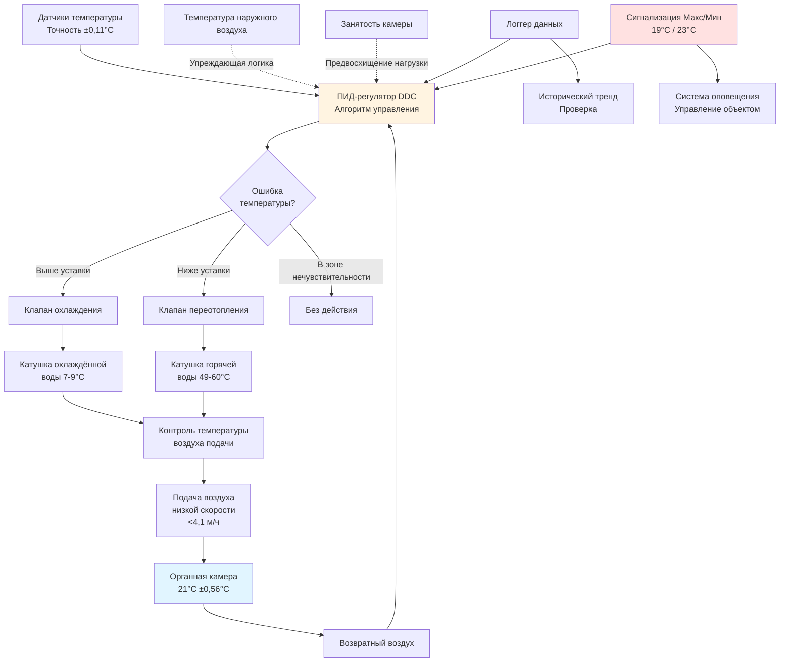

# Контроль температуры органной камеры: 20-22°C

Настройка органных труб демонстрирует экстремальную чувствительность к температуре благодаря фундаментальным термоакустическим отношениям между температурой воздуха, скоростью звука и частотой резонанса трубы. Стандартный диапазон температур 20-22°C представляет компромисс между комфортом человека, стабильностью настройки и сохранением материалов. Отклонения свыше ±1,1°C производят слышимые изменения высоты тона, нарушающие музыкальное исполнение, тогда как долгосрочные колебания температуры вызывают дифференциальное тепловое расширение в многоматериальной конструкции труб.

## Термоакустические соотношения

### Температурная зависимость скорости звука

Фундаментальная частота органной трубы зависит непосредственно от скорости звука в воздухе, которая изменяется с абсолютной температурой в соответствии с кинетической теорией:

$$c = \sqrt{\gamma \frac{R T}{M}}$$

Где:
- $c$ = Скорость звука (м/с)
- $\gamma$ = Коэффициент удельных теплоёмкостей для воздуха = 1,4 (безразмерный)
- $R$ = Универсальная газовая постоянная = 287 Дж/(кг·К)
- $T$ = Абсолютная температура (К)
- $M$ = Молярная масса воздуха = 28,97 г/моль

**Упрощённое температурное соотношение:**

$$c = 20,05 \sqrt{T_C + 273,15}$$

При стандартной температуре органной камеры (21°C = 294,15 K):

$$c_{21°C} = 20,05 \sqrt{294,15} = 344,0 \text{ м/с}$$

### Уравнение частоты трубы

Фундаментальная частота открытой трубы выводится из условия стоячей волны, где длина трубы равна половине длины волны:

$$f = \frac{c}{2L_{eff}}$$

Где:
- $f$ = Фундаментальная частота (Гц)
- $L_{eff}$ = Эффективная длина трубы, включая торцевую коррекцию (м)

**Торцевая коррекция для открытой цилиндрической трубы:**

$$L_{eff} = L_{физ} + 0,183d$$

Где $d$ = диаметр трубы (м)

### Чувствительность настройки к температуре

Дифференцируя частоту по температуре:

$$\frac{df}{dT} = \frac{\partial}{\partial T}\left(\frac{c}{2L}\right) = \frac{1}{2L} \frac{dc}{dT}$$

Из уравнения скорости звука:

$$\frac{dc}{dT} = \frac{10,025}{\sqrt{T_{abs}}} = \frac{c}{2T_{abs}}$$

Следовательно:

$$\frac{df}{dT} = \frac{f}{2T_{abs}}$$

**Относительное изменение частоты на градус:**

$$\frac{1}{f}\frac{df}{dT} = \frac{1}{2T_{abs}}$$

При 21°C (294,15 K):

$$\frac{1}{f}\frac{df}{dT} = \frac{1}{588,30} = 1,700 \times 10^{-3} \text{ на °C} = 0,170\% \text{ на °C}$$

**Преобразование в музыкальные центы:**

Музыкальная высота тона измеряется логарифмически в центах, где 100 центов = 1 полутон:

$$\text{Центы} = 1200 \log_2\left(\frac{f_2}{f_1}\right)$$

Для малых изменений частоты:

$$\Delta\text{Центы} \approx 1731 \times \frac{\Delta f}{f}$$

Следовательно, изменение высоты тона, вызванное температурой:

$$\frac{\Delta\text{Центы}}{\Delta T} = 1731 \times 0,001700 = 2,94 \text{ цента на °C}$$

### Пороги восприятия

| Изменение температуры | Сдвиг частоты | Изменение высоты (центы) | Музыкальное восприятие |
|----------------------|---------------|--------------------------|------------------------|
| ±0,28°C | ±0,048% | ±0,8 цента | Ниже порога обнаружения |
| ±0,56°C | ±0,095% | ±1,6 цента | Обученные музыканты обнаруживают |
| ±1,1°C | ±0,187% | ±3,2 цента | Чётко слышимые биения |
| ±1,7°C | ±0,289% | ±5,0 центов | Неприемлемо для аудитории |
| ±2,2°C | ±0,374% | ±6,5 центов | Явно не в строе |
| ±2,8°C | ±0,476% | ±8,2 цента | Неиграбельно с другими инструментами |

**Критические пороги:**
- **5 центов:** Универсально признано как "не в строе"
- **3 цента:** Профессиональные музыканты находят неприемлемым
- **2 цента:** Обнаруживаемые биения между рядами органа

**Вывод проектирования:** Максимальное суточное колебание ±1,1°C сохраняет настройку в пределах ±3,2 цента, приближаясь к порогу профессиональной приемлемости.

## Эффекты теплового расширения

### Тепловое расширение металлических труб

Органные трубы из свинцово-оловянных сплавов демонстрируют линейное тепловое расширение:

$$\Delta L = L_0 \alpha \Delta T$$

Где:
- $\Delta L$ = Изменение длины (см)
- $L_0$ = Исходная длина (см)
- $\alpha$ = Коэффициент линейного расширения (см/см/°C)
- $\Delta T$ = Изменение температуры (°C)

**Распространённые органные металлы:**

| Состав сплава | Коэффициент линейного расширения α | Типичное применение |
|--------------|--------------------------------------|---------------------|
| Обычный металл (75% Pb, 25% Sn) | 28,8 × 10⁻⁶ на °C | Principale, флейты |
| Пёстрый металл (50% Pb, 50% Sn) | 26,1 × 10⁻⁶ на °C | Фасадные трубы, язычки |
| Чистое олово (100% Sn) | 22,1 × 10⁻⁶ на °C | Язычковые трубы высокого давления |
| Цинк | 31,3 × 10⁻⁶ на °C | Большие педальные трубы |
| Медь (язычковые резонаторы) | 16,9 × 10⁻⁶ на °C | Резонаторы язычковых труб |

**Пример расчёта для трубы principale 2,4 м:**

Дано:
- Длина трубы: $L_0 = 240$ см (2,4 м)
- Материал: Обычный металл, $\alpha = 28,8 \times 10^{-6}$ на °C
- Изменение температуры: $\Delta T = 2,2°C$

$$\Delta L = 240 \times 28,8 \times 10^{-6} \times 2,2 = 0,0152 \text{ см}$$

**Относительное изменение длины:**

$$\frac{\Delta L}{L_0} = 28,8 \times 10^{-6} \times 2,2 = 63,4 \times 10^{-6} = 0,0063\%$$

### Комбинированные температурные эффекты

Полный сдвиг частоты объединяет два противоположных механизма:

1. **Эффект плотности воздуха** (увеличивает частоту): $+0,170\%$ на °C
2. **Расширение трубы** (снижает частоту): $-0,0029\%$ на °C

**Чистое изменение частоты:**

$$\frac{\Delta f}{f} = \left(\frac{1}{2T_{abs}} - \alpha\right) \Delta T$$

$$\frac{\Delta f}{f} = (0,001700 - 0,000029) \times \Delta T = 0,001671 \times \Delta T$$

В практических целях эффект плотности воздуха доминирует (98% от суммарного), а расширение трубы вносит только 2% коррекции.

### Температурная реакция деревянных труб

Деревянные органные трубы (типично 4,9 м и 9,8 м педальные ряды) демонстрируют более сложное поведение:

**Расширение вдоль волокон:**

$$\alpha_{||} = 3,6-5,4 \times 10^{-6} \text{ на °C}$$

Расширение древесины вдоль волокон незначительно влияет на длину трубы.

**Расширение поперёк волокон:**

$$\alpha_{\perp} = 36-72 \times 10^{-6} \text{ на °C}$$

Поперечное расширение влияет на сечение трубы, изменяя акустический импеданс и частоту сложным образом, выходящим за пределы простого масштабирования длины.

## Стратегии контроля температуры

### Выбор уставки

**Стандартная уставка: 21°C**

Обоснование:
1. **Музыкальная традиция:** Историческая температура настройки (20°C в Европе, 21°C в Северной Америке)
2. **Комфорт человека:** Комфорт органистов и персонала при длительном нахождении в помещении
3. **Совместимость со зданием:** Согласуется с температурой соседних помещений исполнения, снижая теплопередачу инфильтрацией
4. **Энергоэффективность:** Умеренная уставка минимизирует нагрузки на отопление и охлаждение

**Альтернативные уставки:**

| Температура | Применение | Соображения |
|------------|-----------|------------|
| 20°C | Европейская практика | Соответствует настройке A=440 Гц при более низкой температуре |
| 21°C | Североамериканский стандарт | Лучший комфорт человека |
| 22°C | Театральные органы | Системы повышенного давления, большое окружающее тепло |
| 18°C | Хранение/законсервированные органы | Сниженные энергетические затраты, требуется переастройка при исполнении |

### Требования к допускам управления

**Почасовая стабильность:** ±0,28°C максимум

Предотвращает заметный уход настройки во время одного исполнения (обычно 1-2 часа).

**Суточная стабильность:** ±1,1°C максимум

Сохраняет настройку в пределах 3,2 цента, приближаясь к пределу профессиональной приемлемости.

**Сезонные колебания:** ±2,2°C приемлемо

Постепенный сезонный уход (в течение недель) позволяет настройщикам переастроить инструмент. Резкие изменения вызывают материальный стресс.

### Время отклика HVAC системы

Система контроля температуры должна балансировать отзывчивость и перерегулирование:

**Тепловая постоянная времени органной камеры:**

$$\tau = \frac{mC}{UA}$$

Где:
- $m$ = Суммарная масса воздуха и компонентов органа (кг)
- $C$ = Удельная теплоёмкость (кДж/кг·°C)
- $U$ = Общий коэффициент теплопередачи (кДж/ч·м²·°C)
- $A$ = Площадь поверхности теплообмена (м²)

**Типичная камера:** $\tau = 2-4$ часа

**Последствия управления:**

1. ПИД-регулятор с медленным интегральным временем (15-30 минут) предотвращает колебания
2. Пропорциональная полоса: 2,2-3,3°C (позволяет постепенный подход к уставке)
3. Избегайте быстрых циклов переотопления (тепловой удар по трубам)

### Равномерность распределения температуры

Вертикальная стратификация создаёт проблемы настройки в многоуровневых органных камерах:

**Вертикальный градиент естественной конвекции:**

$$\frac{dT}{dz} \approx 0,28-0,56 \text{ °C на 3 метра высоты}$$

Для камеры высотой 9 м:
- Уровень пола: 20,5°C
- Средний уровень (4,5 м): 21°C
- Уровень потолка: 21,6°C

**Вертикальный сдвиг настройки:**

Трубы на разных высотах испытывают разные температуры, создавая относительные сдвиги высоты между рядами.

**Стратегии смягчения:**
1. **Вентиляторы дестратификации:** Потолочные вентиляторы низкой скорости (50-100 об/мин) создают мягкое перемешивание
2. **Несколько зон подачи:** Раздельное управление температурой для верхней/нижней частей камеры
3. **Вентиляция вытеснением:** Подача прохладного воздуха в пол, возврат через потолок, естественное перемешивание снижает градиент

## Проектирование системы управления

### Размещение датчиков

**Основной датчик управления:**
- Место расположения: Геометрический центр камеры на среднюю высоту основного трубопровода (типично 2,4-3,6 м над полом)
- Крепление: Защитный кожух с естественной вентиляцией для предотвращения эффектов радиации
- Точность: ±0,11°C или лучше
- Время отклика: < 30 секунд

**Датчики проверки:**
- Верхняя камера: Близко к потолку, контроль стратификации
- Нижняя камера: Близко к полу, контроль эффективности вентиляции вытеснением
- На уровне труб: Несколько местоположений по всей камере, документирование пространственной равномерности

### Координация охлаждения и переотопления

Независимые катушки охлаждения и переотопления обеспечивают одновременный контроль влажности и температуры:

**Летняя эксплуатация:**

1. Катушка охлаждения: Охладить воздух подачи до 13-16°C (ниже точки росы камеры для осушения)
2. Катушка переотопления: Поднять воздух подачи до 20-20,5°C (немного ниже уставки)
3. Воздух подачи поглощает явное тепло в камере, достигая уставки 21°C

**Расчёт температуры воздуха подачи:**

$$T_{подачи} = T_{уставка} - \frac{\dot{Q}_{явное}}{\dot{m}_{воздуха} c_p}$$

Где:
- $\dot{Q}_{явное}$ = Поток явного тепла (кДж/ч)
- $\dot{m}_{воздуха}$ = Поток массы воздуха (кг/ч)
- $c_p$ = Удельная теплоёмкость воздуха = 1,006 кДж/кг·°C

**Зимняя эксплуатация:**

1. Катушка охлаждения: Минимальное или без охлаждения
2. Катушка переотопления: Основной контроль температуры
3. Увлажнение: Паровые инъекции для сохранения уставки RH

### Расчёты нагрузок

**Потоки явного тепла:**

| Источник тепла | Типичная величина | Примечания |
|----------------|------------------|-----------|
| Теплопроводность оболочки | 1,76-5,27 кДж/ч | Зависит от изоляции камеры, температуры соседних помещений |
| Инфильтрация | 0,70-2,81 кДж/ч | Снижена, если камера находится под положительным давлением |
| Освещение | 0,35-1,05 кДж/ч | Минимально в камере, в основном освещение входа |
| Тепло воздуходувки органа | 1,05-3,51 кДж/ч | Зависит от размера двигателя воздуходувки (3,7-11,2 кВт обычно) |
| Занятость (настройка/обслуживание) | 0,18-0,53 кДж/ч | Периодические, максимум 2-4 человека |

**Суммарная явная нагрузка:** 4,04-13,17 кДж/ч (0,35-1,05 кВт охлаждения)

**Скрытая нагрузка:** В основном осушение в влажные месяцы, 1,76-5,27 кДж/ч

**Размер системы:** Типично 0,5-1,2 кВт охлаждающей АВУ для большинства органных камер

## Протокол проверки температуры

### Измерения при пусконаладке

**Обследование пространственной температуры:**

Развернуть откалиброванные логгеры данных (точность ±0,11°C) минимум в 12 местах по всей камере:

1. **Вертикальный профиль:** Пол, 2,4 м, 4,9 м, 7,3 м, потолок (документирование стратификации)
2. **Горизонтальное распределение:** Четыре угла, центр, на уровне основных труб (документирование равномерности)
3. **Интервал записи:** 5 минут
4. **Длительность:** Минимум 7 последовательных дней, включая полную неделю работы

**Критерии приёмки:**
- Все места расположения в пределах ±0,83°C от уставки при установившемся режиме
- Вертикальный градиент < 0,28°C на 3 метра
- Временное колебание < ±1,1°C в течение 24 часов в любом одном месте

### Долгосрочный мониторинг

**Система постоянного мониторинга:**

Установить специальный датчик температуры с непрерывной регистрацией данных:
- Доступная в веб-браузере приборная панель для управления объектом
- Исторический тренд с хранением данных за 1 год
- Автоматизированные сигнализации для выходящих за пределы условий
- Способность экспорта для проверки создателем органа

**Уставки сигнализации:**
- Сигнализация низкой температуры: 19°C (1,7°C ниже уставки)
- Сигнализация высокой температуры: 23°C (1,7°C выше уставки)
- Сигнализация скорости изменения: > 1,1°C в час (указывает на неисправность HVAC)

### Корреляция со стабильностью настройки

**Проверка создателем органа:**

При посещениях для настройки мастера органа документируют:
1. Общий уровень высоты по сравнению с предыдущей настройкой (указывает на сезонный уход)
2. Дифференциальная высота между рядами (указывает на неравномерную температуру)
3. Стабильность во время сеанса настройки (указывает на качество почасового управления)

**Пример документации:**

Лог температуры показывает колебание 1,1°C в сутки → Мастер органа сообщает о минимальной переастройке (приемлемо).

Лог температуры показывает колебание 2,8°C в сутки → Мастер органа сообщает об обширной переастройке, рекомендует улучшение HVAC (неприемлемо).

## Специфические соображения по материалам

### Сводка эффектов температуры на материалы труб

| Материал | Коэффициент расширения | Доминирующий эффект | Температурная чувствительность |
|----------|----------------------|-------------------|-------------------------------|
| Свинцово-оловянный сплав (75/25) | 28,8 × 10⁻⁶ /°C | Плотность воздуха | 0,170% на °C |
| Пёстрый металл (50/50) | 26,1 × 10⁻⁶ /°C | Плотность воздуха | 0,170% на °C |
| Чистое олово | 22,1 × 10⁻⁶ /°C | Плотность воздуха | 0,170% на °C |
| Цинк | 31,3 × 10⁻⁶ /°C | Плотность воздуха + расширение | 0,167% на °C |
| Древесина (вдоль волокна) | 3,6-5,4 × 10⁻⁶ /°C | Плотность воздуха | 0,170% на °C |
| Древесина (поперёк волокна) | 36-72 × 10⁻⁶ /°C | Сложные эффекты акустического импеданса | Переменная |
| Медь (язычковые резонаторы) | 16,9 × 10⁻⁶ /°C | Плотность воздуха | 0,170% на °C |

**Ключевой вывод:** Плотность воздуха доминирует в отклике настройки для всех металлических труб. Физическое расширение вносит < 2% сдвига частоты.

### Температурная реакция язычковых труб

Язычковые трубы демонстрируют дополнительную температурную чувствительность через жёсткость язычка:

**Эффективная жёсткость язычка:**

$$k_{eff}(T) = k_0 \left[1 + \beta(T - T_0)\right]$$

Где:
- $k_0$ = Жёсткость при эталонной температуре
- $\beta$ = Температурный коэффициент (отрицательный для большинства латунь/бронзовых сплавов)
- Типично: $\beta \approx -3,6 \times 10^{-4}$ на °C

**Температурная зависимость частоты язычка:**

$$f_{язычок} = \frac{1}{2\pi}\sqrt{\frac{k_{eff}}{m_{eff}}}$$

Температура влияет как на резонанс воздушного столба (в резонаторе), так и на частоту вибрации язычка, создавая сложное поведение настройки, требующее отдельных соображений при озвучивании.

## Соображения энергоэффективности

### Годовое потребление энергии

**Типичная органная камера (42 м³, уставка 21°C):**

Энергия охлаждения (годовая): 2,3-4,2 МВтч
Энергия отопления (годовая): 4,2-8,3 МВтч (зависит от климата)
Энергия увлажнения (годовая): 1,4-2,8 МВтч

**Итого:** 7,9-15,3 МВтч/год = 1 040-2 000 EUR/год при 0,12 EUR/кВтч

### Оптимизация эффективности

**Улучшения оболочки:**

Изоляция стен органной камеры до RSI 3,5 и выше снижает теплопередачу конвекцией на 40-60%, пропорционально снижая нагрузки отопления/охлаждения.

**Утилизация тепла:**

Установка рекуператора энергии (ERV) на вентиляционный воздух камеры снижает нагрузку на кондиционирование путём восстановления 60-80% явной и скрытой энергии из выходящего воздуха.

**Оптимизация уставки:**

Каждое увеличение уставки охлаждения на 1°C снижает энергию охлаждения примерно на 3-5%. Однако требования стабильности настройки ограничивают гибкость — сохраняйте диапазон 20-22°C независимо от энергетической стоимости.

**Проблемы ночного снижения:**

Допущение плавающей температуры в неиспользуемые часы экономит энергию, но создаёт термический цикл стресса на материалы органа и требует периода повторной стабилизации перед исполнением. Обычно не рекомендуется для исполнительских инструментов; приемлемо для практических органов с более низкими требованиями стабильности.

## Заключение

Сохранение температуры органной камеры в пределах 20-22°C с суточной стабильностью ±1,1°C сохраняет настройку в пределах профессионально приемлемых значений посредством термоакустических соотношений, управляющих скоростью звука и частотой резонанса труб. Доминирующий эффект температуры — сдвиг частоты 0,170% на °C — выводится из изменений плотности воздуха, тогда как физическое расширение трубы вносит минимальный вклад. Проектирование HVAC системы должно обеспечивать точный контроль температуры посредством подачи воздуха низкой скорости, специальной способности охлаждения-переотопления и скоординированного осушения, оправданного экстремальной чувствительностью настройки органных труб к условиям окружающей среды и требованием к долгосрочной стабильности настройки в этих специализированных музыкальных инструментах.
