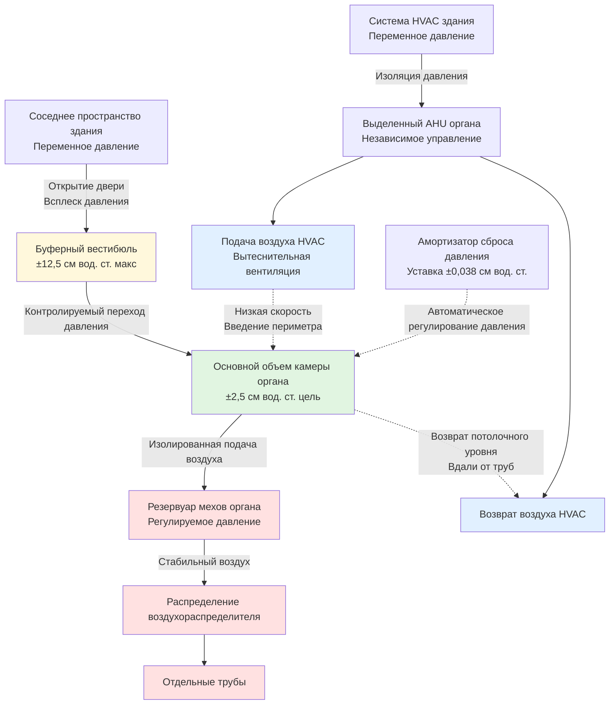

# Влияние давления воздуха HVAC на подачу воздуха органа

Органные трубы работают на тщательно отрегулированных системах низкого давления, где статические перепады давления всего 0,05 см вод. ст. могут нарушить стабильность строя и звучание труб. Системы HVAC создают поля давления через импульс подаваемого воздуха, всасывание возвращаемого воздуха и давление в камере, которые мешают системам регулирования воздуха органа. Фундаментальная проблема заключается в расхождении между давлениями воздуха органа (обычно 75-375 Па) и колебаниями давления, вызванными HVAC (25-750 Па)—соотношение, при котором даже 1-2% помехи от HVAC вызывают заметное ухудшение звучания. Надлежащее проектирование требует стратегий изоляции давления, стратегического расположения распределения воздуха и понимания механики жидкостей, управляющей как подачей воздуха органа, так и движением воздуха HVAC.

## Принципы работы системы подачи воздуха органа

### Диапазоны давления воздуха и чувствительность

Органные регистры работают в диапазоне статических давлений, определяемых масштабированием труб и требованиями к звучанию:

**Типичное давление воздуха по регистрам:**

| Регистр органа | Статическое давление (см вод. ст.) | Статическое давление (Па) | Класс давления |
|----------------|-----------------------------------|----------------------|----------------|
| Great (principales) | 75-100 | 747-996 | Низкое давление |
| Swell (закрытый) | 87-112 | 871-1121 | Низко-среднее |
| Choir (аккомпанемент) | 75-87 | 747-871 | Низкое давление |
| Pedal (крупные флейты) | 100-150 | 996-1494 | Среднее давление |
| Solo (оркестровые язычки) | 200-375 | 1992-3735 | Высокое давление |
| Theater organ | 250-625 | 2490-6225 | Очень высокое давление |
| Tuba ranks | 375-1250 | 3735-12450 | Экстремальное давление |

**Требования к допуску регулирования давления:**

Органные регуляторы воздуха (меха/плавающие клапаны) поддерживают стабильное давление с жесткими допусками:

$$\Delta P_{допуск} = \pm 0,013 \text{ см вод. ст.} = \pm 1,25\% \text{ до } \pm 2,5\%$$

Это представляет ±1,25% до ±2,5% вариации при 100 Па—пороге для слышимого колебания высоты звука.

**Зависимость частоты от давления воздуха:**

Высота тона трубы увеличивается с квадратным корнем давления:

$$f = k\sqrt{P}$$

Где:
- $f$ = Частота (Гц)
- $k$ = Константа трубы (зависит от геометрии)
- $P$ = Давление воздуха (см вод. ст. или Па)

**Расчет чувствительности:**

$$\frac{df}{dP} = \frac{k}{2\sqrt{P}} = \frac{f}{2P}$$

При номинальном давлении 100 Па:

$$\frac{df}{dP} = \frac{f}{2P}$$

Изменение давления на 12,5 Па вызывает:

$$\frac{\Delta f}{f} = \frac{12,5}{2 \times 100} = 0,0625 \approx 10,8 \text{ центов}$$

**Порог музыкального восприятия:** 3-5 центов заметны, 10+ центов явно фальшиво.

### Системы мехов и резервуаров

Системы регулирования воздуха буферизируют колебания давления через механическую упругость:

**Механика регулятора с пружинной нагрузкой:**

Взвешенные меха поддерживают постоянное давление через баланс сил:

$$P_{регулируемое} = \frac{W_{меха} + F_{пружина}}{A_{меха}}$$

Где:
- $P_{регулируемое}$ = Выходное давление (кПа или см вод. ст.)
- $W_{меха}$ = Вес рамы мехов
- $F_{пружина}$ = Сила пружины в рабочей позиции
- $A_{меха}$ = Эффективная площадь мехов

**Динамический отклик:**

Меха выявляют ответ второго порядка на возмущения давления:

$$M\frac{d^2x}{dt^2} + C\frac{dx}{dt} + Kx = A(P_{вход} - P_{выход})$$

Где:
- $M$ = Масса мехов
- $C$ = Коэффициент затухания (вязкие потери)
- $K$ = Жесткость пружины
- $x$ = Смещение мехов
- $A$ = Площадь мехов

Типичная собственная частота мехов: 0,5-2 Гц, обеспечивая низкочастотную фильтрацию быстрых колебаний давления.

**Механизм помехи от HVAC:**

Внешнее давление в камере суммируется с регулируемым давлением воздуха:

$$P_{эффективное} = P_{меха} + P_{HVAC}$$

Если HVAC создает +12,5 Па давления в камере, это добавляется непосредственно к давлению воздуха органа, заставляя трубы звучать выше на ~10 центов.

### Распределение давления в воздухораспределителе

Воздухораспределители распределяют регулируемый воздух к органным регистрам:

**Падение давления через воздухораспределитель:**

От резервуара до патрубка трубы:

$$P_{труба} = P_{распределитель} - \Delta P_{клапан} - \Delta P_{канал}$$

**Падение давления клапана:**

$$\Delta P_{клапан} = \frac{\rho V^2}{2} \left(\frac{1}{C_d^2 A_{отверстие}^2} - \frac{1}{A_{канал}^2}\right)$$

Где:
- $\rho$ = Плотность воздуха
- $V$ = Объемный расход
- $C_d$ = Коэффициент расхода (≈0,6-0,8)
- $A_{отверстие}$ = Площадь отверстия клапана
- $A_{канал}$ = Площадь канала воздухораспределителя

**Требование однородности:**

Во всем распределителе вариация давления должна оставаться ниже:

$$\Delta P_{распределитель} < 0,05 \text{ см вод. ст.}$$

Перепады давления от HVAC могут создать неоднородную нагрузку по распределителю, вызывая непоследовательное звучание между трубами.

## Проблемы перепада давления, вызванные HVAC

### Эффекты импульса подаваемого воздуха

Подаваемый воздух создает локализованное положительное давление через передачу импульса:

**Давление напора при попадании струи:**

Струя подаваемого воздуха, ударяющая по поверхностям камеры органа, создает давление торможения:

$$P_{торможения} = \frac{\rho V_{струя}^2}{2}$$

Преобразование в сантиметры водяного столба:

$$P_{торможения}(\text{см вод. ст.}) = \frac{V^2}{163000}$$

**Пример расчета:**

Скорость струи подачи 152 м/мин:

$$P_{торможения} = \frac{152^2}{163000} = 0,142 \text{ см вод. ст.} \approx 14 \text{ Па}$$

Это давление 14 Па представляет 1,4% от давления воздуха органа 100 Па—кажущееся малым, но достаточным, чтобы вызвать примерно 7 центов повышение строя.

**Затухание скорости от диффузора:**

Скорость струи затухает с расстоянием от подачи:

$$\frac{V_x}{V_0} = \frac{6,2 d_0}{x}$$

Где:
- $V_x$ = Скорость на расстоянии $x$
- $V_0$ = Начальная скорость диффузора
- $d_0$ = Диаметр диффузора
- $x$ = Расстояние от диффузора

**Минимальное расстояние разделения:**

Чтобы снизить скорость 152 м/мин до приемлемых 6 м/мин вблизи трубопровода:

$$x = 6,2 d_0 \frac{V_0}{V_x} = 6,2 d_0 \frac{152}{6} = 157 d_0$$

Для диффузора диаметром 20 см: минимум 3,1 метра разделения.

### Эффекты всасывания возвращаемого воздуха

Возвратные решетки создают зоны отрицательного давления через локальное ускорение воздуха:

**Падение давления при подходе к возвратной решетке:**

$$\Delta P_{возврат} = \frac{\rho V_{подход}^2}{2} + K_{решетка}\frac{\rho V_{решетка}^2}{2}$$

Где:
- $V_{подход}$ = Скорость подхода в камере
- $V_{решетка}$ = Скорость лицевой стороны через решетку
- $K_{решетка}$ = Коэффициент потерь давления (0,5-1,5)

**Поле давления возвратной решетки:**

Отрицательное давление простирается приблизительно на 1,5-2 размера решетки:

$$\Delta P(r) = \Delta P_{макс} \left(\frac{r_0}{r}\right)^2$$

Где:
- $r$ = Расстояние от центра решетки
- $r_0$ = Характеристический размер решетки

**Требование проектирования:**

Возвратные решетки должны располагаться на расстоянии от трубопровода таким образом, чтобы индуцированное отрицательное давление оставалось ниже:

$$|\Delta P_{возврат}| < 0,025 \text{ см вод. ст.} \text{ в местах труб}$$

### Эффекты давления в камере

Закрытые камеры органа развивают статическое давление относительно соседних пространств:

**Уравнение баланса давления:**

$$P_{камера} - P_{соседнее} = \frac{\rho}{2}(V_{подача}^2 - V_{выпуск}^2) + \Delta P_{утечка}$$

**Поток инфильтрации/экфильтрации:**

Перепад давления вызывает поток воздуха через щели в конструкции:

$$Q_{утечка} = C_{утечка}\sqrt{\Delta P}$$

Где:
- $Q_{утечка}$ = Поток утечки (м³/ч)
- $C_{утечка}$ = Коэффициент утечки (зависит от герметичности конструкции)

**Приемлемый перепад давления в камере:**

$$|\Delta P_{камера}| < 0,05 \text{ см вод. ст.}$$

**Стратегии давления в камере:**

| Стратегия | Эффект давления | Применение |
|----------|----------------|-------------|
| Сбалансированная подача/возврат | ±0,013 см вод. ст. | Предпочтительно для всех органов |
| Слегка положительное (предотвращение инфильтрации) | +0,025 до +0,038 см вод. ст. | Театральные органы, запыленные среды |
| Слегка отрицательное (звукоизоляция) | -0,025 до -0,038 см вод. ст. | Концертные залы, минимально если требуется |
| Неконтролируемое давление | ±0,125 до ±0,75 см вод. ст. | Неприемлемо—вызывает нестабильность строя |

## Проблемы перепада давления и решения

### Полная сравнительная таблица

| Проблема | Величина давления | Музыкальный эффект | Первичная причина | Решение HVAC | Критерий проектирования |
|---------|-------------------|----------------|---------------|---------------|------------------|
| Прямое попадание струи подачи | +12,5 до +50 см вод. ст. | 25-56 центов выше, нестабильное звучание | Высокоскоростной диффузор направлен на трубы | Переместить диффузор, снизить скорость, использовать вытеснительную вентиляцию | Разделение диффузора >3,6 м, скорость <6 м/мин при трубах |
| Всасывание возвратной решетки вблизи труб | -7,5 до -38 см вод. ст. | 10-44 цента ниже, слабое звучание | Близость возвратной решетки к трубам | Переместить возврат, увеличить площадь решетки, снизить скорость лица | Разделение возврата >4,5 м, скорость лица <2 м/с |
| Положительное давление в камере | +5 до +25 см вод. ст. | 6-31 центов выше по всему органу | Избыток подачи против возврата | Сбалансировать м³/ч подачи/возврата, добавить путь сброса давления | Перепад давления в камере <0,05 см вод. ст. |
| Отрицательное давление в камере | -5 до -20 см вод. ст. | 6-25 центов ниже, пониженная мощность | Избыток возврата против подачи | Увеличить м³/ч подачи, снизить емкость возврата | Перепад давления в камере <0,05 см вод. ст. |
| Всплеск при открытии двери | ±25 до ±75 см вод. ст. | Временный серьезный сдвиг высоты | Перепад давления в соседнем пространстве | Установить буферный вестибюль с уравновешенным давлением, механизмы медленного закрытия | Буферная зона вестибюля |
| Пульсация турбулентности воздуховода | ±2,5 до ±12,5 см вод. ст. циклическая | Эффект тремоло, колебание высоты | Частота проходимости лопасти вентилятора, отделение вихря | Увеличить размер воздуховода, снизить скорость, добавить глушители/амортизаторы | Скорость воздуховода <366 м/мин около камеры |
| Воздушный поток над устьями труб | 0 давление (эффект скорости) | Нестабильное звучание, звук, отказ говорить | Высокая скорость воздуха на уровне труб | Вытеснительная вентиляция, тканевые воздуховоды, потолочный плеум | Скорость воздуха <6 м/мин при устьях труб |
| Сезонный стек-эффект | ±5 до ±38 см вод. ст. | Дрейф строя с наружной температурой | Вертикальное положение камеры, перепад температур | Герметизировать проникновения, сбалансировать вентиляцию, стабильность температуры | Минимизировать вертикальные температурные градиенты |

### Отклик мехов на возмущения от HVAC

**Емкость буферизации давления:**

Меха с надлежащей регулировкой ослабляют быстрые колебания давления от HVAC:

**Передаточная функция:**

$$\frac{P_{выход}}{P_{вход}} = \frac{1}{1 + \frac{s^2}{\omega_n^2} + \frac{2\zeta s}{\omega_n}}$$

Где:
- $s$ = Переменная Лапласа
- $\omega_n$ = Собственная частота (рад/с)
- $\zeta$ = Коэффициент затухания

**Ослабление при частотах колебания давления от HVAC:**

Колебания давления от HVAC обычно происходят на:
- Циклирование вентилятора: 0,01-0,1 Гц (очень медленно)
- Турбулентность воздуховода: 2-20 Гц (быстро)
- Операции с дверями: 0,1-1 Гц (переходное)

Меха с $\omega_n = 1$ Гц (6,28 рад/с) обеспечивают:
- Хорошее ослабление выше 2 Гц (турбулентность)
- Минимальное ослабление ниже 0,5 Гц (медленное давление)

**Критический вывод:** Меха не могут компенсировать стационарное давление в камере—проектирование HVAC должно предотвращать устойчивые перепады давления.

### Стабильность регулирования воздухораспределителя

Многоступенчатые системы подачи каскадируют регулирование:

**Двухступенчатое регулирование:**

$$P_{финальное} = P_{основной\,резервуар} - \Delta P_{регулятор\,1} - \Delta P_{регулятор\,2}$$

Каждая ступень фильтрует возмущения давления:

**Каскадное ослабление:**

$$Ослабление_{всего} = Ослабление_1 \times Ослабление_2$$

Два регулятора с ослаблением 3:1 каждый обеспечивают полное подавление вариаций от HVAC в 9:1.

**Характеристики плавающего регулятора:**

Современные плавающие регуляторы реагируют на изменения давления в течение миллисекунд, но не могут устранить стационарное смещение от давления в камере.

## Стратегии изоляции давления

### Архитектурная буферизация давления

### Проектирование буферного вестибюля давления

**Двухдверная буферная система вестибюля:**

$$\Delta P_{всего} = \Delta P_{вестибюль\,1} + \Delta P_{вестибюль\,2}$$

Открытие одной двери создает всплеск давления:

$$\Delta P_{всплеск} = \frac{\rho}{2}(V_{устремление}^2)$$

Для типичного перепада давления 25 Па в соседнем пространстве, скорость потока:

$$V_{устремление} = \sqrt{\frac{2\Delta P}{\rho}} = \sqrt{\frac{2 \times 249\,\text{Па}}{1,2\,\text{кг/м}^3}} = 20,3\,\text{м/с} = 1218\,\text{м/мин}$$

**Определение размера объема вестибюля:**

Буферный объем позволяет уравниванию давления перед открытием второй двери:

$$V_{вестибюль} > 10 \times V_{дверь} \times \frac{\Delta P_{приемлемое}}{\Delta P_{соседнее}}$$

Для перепада 25 Па в соседнем пространстве и допуска камеры 2,5 см вод. ст.:

$$V_{вестибюль} > 100 \times V_{дверь}$$

**Амортизатор сброса давления:**

Автоматический амортизатор поддерживает давление в камере:

$$A_{амортизатор} = \frac{Q_{дисбаланс}}{2,5\sqrt{\Delta P_{уставка}}}$$

Где:
- $Q_{дисбаланс}$ = Максимальный дисбаланс подачи/возврата (м³/ч)
- $\Delta P_{уставка}$ = Активация сброса давления (см вод. ст. или Па)

### Изоляция выделенной системы HVAC

**Причины для выделенной системы камеры органа:**

1. **Независимое управление давлением:** Изолировано от переходных процессов давления здания
2. **Непрерывная работа:** 24/7 кондиционирование независимо от графика здания
3. **Точное управление:** Более жесткие допуски, чем комфортные системы
4. **Распределение низкой скорости:** Несовместимо с VAV или высокоскоростными системами

**Балансирование давления в системе:**

$$Q_{подача} = Q_{возврат} \pm Q_{контролируемый\,дисбаланс}$$

Типичный баланс: точно равные м³/ч ± 5% максимального отклонения.

**Мониторинг и управление давлением:**

Датчик перепада давления между камерой и соседним пространством:

$$P_{камера} - P_{соседнее} = 0 \pm 0,025 \text{ см вод. ст.}$$

Последовательность управления регулирует скорости вентиляторов подачи/возврата или положения амортизаторов для поддержания нейтрального давления.

## Проектирование распределения воздуха для минимального влияния на давление

### Применение вытеснительной вентиляции

**Принцип:** Подача охлажденного воздуха на уровне пола с минимальным импульсом, позволяя естественной конвекции распределять воздух без создания перепадов давления на уровне труб.

**Снижение температуры подаваемого воздуха:**

$$\Delta T_{подача} = T_{камера} - T_{подача} = 1-2°C$$

**Поток, обусловленный плавучестью:**

Охлажденный подаваемый воздух распространяется по полу, постепенно поглощая тепло и поднимаясь:

$$\rho_{подача} = \rho_{камера}\left(1 + \beta\Delta T\right)$$

Где $\beta = \frac{1}{T_{абс}} \approx \frac{1}{290}$ на °C

**Профиль вертикальной скорости:**

На уровне труб (обычно 2-6 метров над полом), движение воздуха преимущественно вертикальная конвекция с минимальным горизонтальным компонентом:

$$V_{горизонтальная}(z) < 6 \text{ м/мин на уровне труб}$$

**Определение размера диффузора подачи:**

$$A_{диффузор} = \frac{Q_{подача}}{60 \times V_{лицо}}$$

Для максимальной скорости лица 15 м/мин:

$$A_{диффузор} = \frac{Q_{м³/ч}}{900} \text{ м}^2$$

Камера 24 м³/ч требует площади диффузора 0,027 м² = 270 см².

### Распределение через перфорированный потолок плеум

**Весь потолок как низкоскоростная подача:**

$$V_{потолок} = \frac{Q_{всего}}{A_{потолок} \times 60}$$

Целевая скорость через отверстие потолка: 3-5 м/мин.

**Пример:**

- Камера: 6 м × 9 м = 54 м²
- Воздушный поток: 23 м³/мин
- Скорость потолка: 23/(54 × 60) = 0,007 м/с = 0,42 м/мин

Чрезвычайно низкая скорость устраняет эффекты перепада давления.

**Схема перфорации:**

$$P_{перфорация} = \frac{A_{отверстия}}{A_{всего}} = 2-5\%$$

Падение давления через потолок:

$$\Delta P_{потолок} = K\frac{\rho V^2}{2}$$

При 5 м/мин через 3% перфорацию (152 м/мин через отверстия):

$$\Delta P_{потолок} \approx 0,038 \text{ см вод. ст.}$$

Приемлемо для давления в камере, если возврат распределен подобно.

### Стратегическое размещение оборудования и решеток

**Минимальные расстояния разделения от трубопровода:**

Получено из уравнений затухания поля давления:

| Компонент HVAC | Минимальное разделение | Основание |
|----------------|-------------------|-------|
| Диффузоры подачи (стандартные) | 3,6 м | Затухание струи до <6 м/мин |
| Возвратные решетки (стандартные) | 4,5 м | Поле всасывания до <0,025 см вод. ст. |
| Двери доступа в камеру | Требуется вестибюль | Изоляция всплеска давления |
| Механическое оборудование | Отдельное помещение, 15+ м | Изоляция вибрации и шума |
| Высокоскоростной воздуховод | Вне камеры, изолированные проникновения | Предотвращение пульсации давления |

**Оптимальная конфигурация:**

- Подача: Напольная вытеснительная вентиляция или потолочный плеум
- Возврат: Потолочный уровень, периметр камеры, вдали от органа
- Механическое оборудование: Удаленное местоположение с изоляцией вибрации
- Воздуховод: Увеличенный размер (низкая скорость <366 м/мин) с акустической обработкой

### Контроль скорости воздуховода и турбулентности

**Пульсация давления от турбулентности:**

Турбулентный поток в воздуховоде создает циклические вариации давления:

$$\Delta P_{турбулентность} \approx 0,1 \times \Delta P_{скорость}$$

Где:

$$\Delta P_{скорость} = \frac{\rho V_{воздуховод}^2}{2}$$

**При скорости воздуховода 610 м/мин:**

$$\Delta P_{скорость} = \frac{610^2}{163000} = 0,229 \text{ см вод. ст.}$$

Пульсация турбулентности: ±0,023 см вод. ст.—превышает допуск органа.

**Рекомендуемая скорость воздуховода вблизи камер органа:**

$$V_{воздуховод} < 366 \text{ м/мин}$$

При 366 м/мин:

$$\Delta P_{скорость} = 0,082 \text{ см вод. ст.}$$

Турбулентность: ±0,008 см вод. ст.—приемлемо при надлежащем демпфировании.

**Определение размера воздуховода для низкой скорости:**

$$A_{воздуховод} = \frac{Q_{м³/ч}}{V_{м/мин} \times 60}$$

24 м³/мин при максимум 366 м/мин:

$$A_{воздуховод} = \frac{24}{366/60} = 3,9 \text{ м}^2 = 39000 \text{ см}^2$$

Эквивалент диаметра 223 мм или воздуховода 200×200 мм.

## Протоколы измерения и проверки

### Мониторинг перепада давления

**Требования к приборостроению:**

- Датчик перепада давления: диапазон ±1,25 см вод. ст., точность ±0,0125 см вод. ст.
- Точки отбора: центр камеры, указано соседнее пространство
- Логирование данных: минимум 1-минутные интервалы
- Уставки сигнализации: ±0,05 см вод. ст.

**Критерии приемки:**

Во время наладки продемонстрировать:

$$|\Delta P_{камера}| < 0,05 \text{ см вод. ст. для 95\% измерений}$$

Во всех режимах работы HVAC:
- Нормальная работа
- Ночной режим пониженной нагрузки/восстановления
- Операции с дверями соседнего пространства
- Изменения давления здания (наружный ветер, стек-эффект)

### Обследования скорости воздуха

**Измерение с горячей проволокой на уровне труб:**

Измерение мгновенной скорости воздуха в 5+ местоположениях в камере органа на уровне устья трубы:

$$V_{измеренная} < 6 \text{ м/мин во всех точках измерения}$$

**Протокол измерения:**

1. Система HVAC при расходе проектирования
2. Минимум 60-секундный период отбора на локацию
3. Запись пиковых скоростей (не только среднее)
4. Картирование контуров скорости по всей камере

### Тестирование стабильности строя

**Метод окончательной проверки:**

Электронное устройство контроля строя мониторит частоту трубы в течение периода 24-48 часов:

$$\Delta f_{измеренная} < 12,5 \text{ центов вариация}$$

**Процедура тестирования:**

1. Мониторинг представительных труб из нескольких регистров
2. Логирование частоты на 5-минутные интервалы
3. Корреляция с температурой, влажностью и работой HVAC
4. Изоляция вклада HVAC от эффектов температуры

**Приемлемая вариация строя, вызванная HVAC:**

После коррекции эффектов температуры:

$$\Delta f_{HVAC} < 7,5 \text{ центов}$$

## Специальные соображения для театральных органов

Театральные органы представляют уникальные проблемы из-за практики давления в камере и более высоких давлений воздуха:

**Давление в камере театрального органа:**

Историческая практика: поддерживать слегка положительное давление (0,025-0,05 см вод. ст.) для уменьшения инфильтрации и попадания пыли.

**Конфликт современного HVAC:**

Преднамеренное давление в камере конфликтует с принципом минимизации перепада давления.

**Стратегия разрешения:**

1. Поддерживать контролируемое положительное давление через амортизатор сброса давления точной регулировки
2. Подача HVAC превышает возврат на рассчитанную сумму:
   $$Q_{избыток} = C\sqrt{P_{целевое}}$$
3. Избыточный воздух выходит через калиброванный амортизатор сброса, поддерживая уставку
4. Изоляция от переходных процессов давления здания сохранена

**Чувствительность тремоланта:**

Театральные органные тремоланты (преднамеренные генераторы пульсации давления) особенно чувствительны к помехам от HVAC—любое внешнее колебание давления усугубляется пульсацией тремоланта, создавая нерегулярный вибрато-эффект.

## Интеграция с требованиями строителя органов

**Рецензирование проекта HVAC строителем органов:**

Контракты органа обычно требуют:

1. Планы HVAC предоставлены строителю органов на рецензирование перед строительством
2. Расчеты перепада давления и прогнозы
3. Моделирование распределения воздуха или CFD анализ для сложных камер
4. Данные наладки, демонстрирующие соответствие

**Требования документирования:**

- Перепад давления: Непрерывная 30-дневная базовая линия
- Обследование скорости воздуха: Полное картирование при существенном завершении
- Стабильность строя: 48-часовой мониторинг с проверкой строителя органов

**Координация обслуживания:**

- Замена фильтров: Процедура для минимизации возмущения камеры
- Регулировка уставок: Документированный протокол с одобрением строителя органов
- Модификации системы: Требуют консультации строителя органов

Надлежащее проектирование HVAC для установок органов требует признания того, что системы регулирования давления воздуха работают на уровнях точности, где типичные эффекты давления HVAC представляют значительные помехи. Физические принципы, управляющие звучанием органа—точное регулирование давления, стабильная подача воздуха и неустойчивые воздушные столбы—требуют подходов HVAC, принципиально отличающихся от обычного кондиционирования комфорта. Вытеснительная вентиляция, изоляция давления, выделенные системы и комплексные протоколы проверки обеспечивают, что система HVAC поддерживает, а не компрометирует музыкальную миссию этих специализированных установок.
