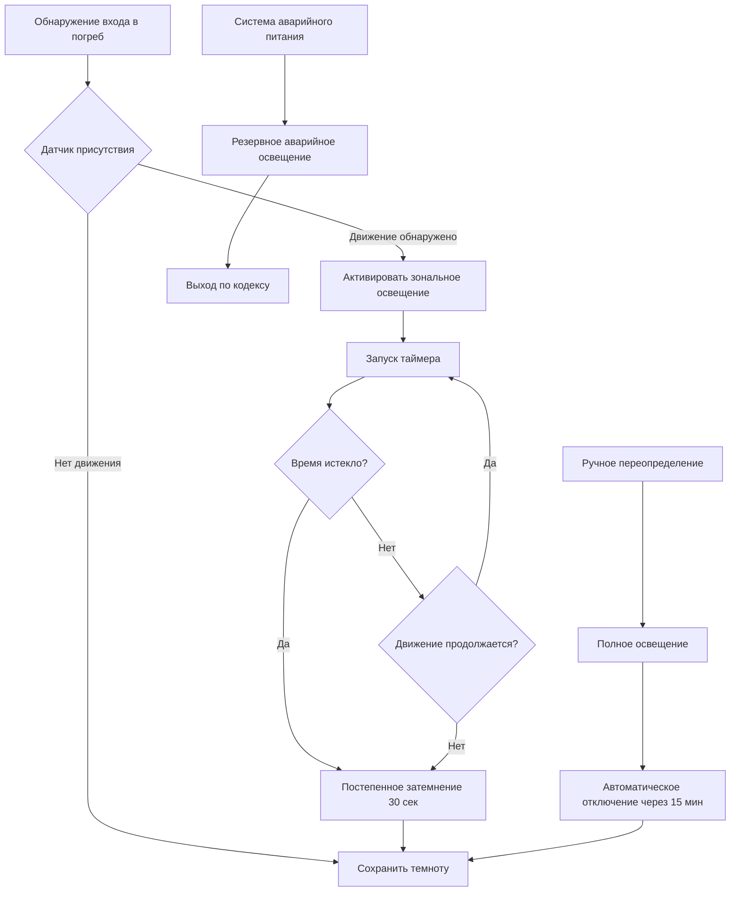

## Управление освещением при хранении вина

Проектирование освещения винного погреба представляет критический конфликт между требованиями эксплуатации и наукой консервации. Хотя полная темнота оптимизирует условия старения вина, доступ человека требует достаточного освещения для управления запасами, выбора бутылок и безопасности. Фотохимия светоиндуцированного окисления вина сосредоточена на УФ-излучении, катализирующем окислительные реакции и генерирующем нежелательные вкусовые соединения — особенно в белых винах и шампанских, хранящихся в прозрачных или светлых стеклянных бутылках.

Взаимодействие электромагнитного спектра с соединениями вина происходит в основном в ультрафиолетовой (280–400 нм) и короткой волне видимого (400–500 нм) диапазонах. Энергия фотонов в этих длинах волн превышает энергию диссоциации связи ключевых молекул вкуса, инициируя каскады свободных радикалов, которые деградируют качество вина. Профессиональные объекты хранения вина поддерживают темноту как условие по умолчанию, активируя освещение только во время присутствия человека через датчики движения или ручное управление.

## УФ-излучение и фотохимическая деградация

Квантовая механика фотохимической деградации вина включает поглощение света рибофлавином (витамин B2) и другими фотоактивными соединениями, естественно присутствующими в вине. Когда фотоны с энергией $E = h\nu$ (где $h$ — постоянная Планка и $\nu$ — частота) взаимодействуют с этими молекулами, электронные переходы в возбужденные состояния инициируют окислительные реакции:

$$E_{photon} = \frac{hc}{\lambda}$$

где $c$ — скорость света и $\lambda$ — длина волны. Для УФ-А излучения на 365 нм:

$$E = \frac{(6.626 \times 10^{-34}\text{ Дж·с})(3.0 \times 10^8\text{ м/с})}{365 \times 10^{-9}\text{ м}} = 5.44 \times 10^{-19}\text{ Дж/фотон}$$

Эта энергия (3,4 эВ на фотон) превышает типичные энергии С-Н связей (3,2–4,3 эВ), обеспечивая прямой фотолиз органических молекул. Полученные свободные радикалы реагируют с растворенным кислородом, производя альдегиды, серу содержащие соединения и другие неприятные привкусы, которые в совокупности называются "световой" или "светозависимой" характеристикой.

### Спектральная чувствительность соединений вина

Фотодеградация вина демонстрирует зависимую от длины волны чувствительность, с максимальным повреждением в конкретных спектральных полосах:

| Диапазон длин волн | Область | Основные эффекты | Относительная скорость повреждения |
|------------------|--------|-----------------|---------------------|
| 280–315 нм | УФ-B | Прямое повреждение органических соединений | 100% |
| 315–400 нм | УФ-A | Возбуждение рибофлавина, образование серо содержащих соединений | 60–80% |
| 400–450 нм | Фиолетово-синий | Вторичные окислительные реакции | 20–30% |
| 450–500 нм | Синий | Минимальные прямые фотохимические эффекты | 5–10% |
| 500–700 нм | Зелено-красный | Незначительное фотохимическое воздействие | <1% |

Цвет стеклянной бутылки обеспечивает первую защиту от фотодеградации. Темно-зеленое и коричневое стекло эффективно блокируют УФ-B излучение (>95% ослабления) при одновременной передаче 15–30% УФ-A. Прозрачное стекло (флинт) обеспечивает минимальную защиту от УФ, объясняя его ограниченное использование, кроме вин, потребляемых вскоре после розлива.

## Выбор системы освещения для винных погребов

Искусственное освещение для хранения вина должно сбалансировать требования видимости с фотохимической безопасностью. Требуемые уровни освещенности для задач в погребе варьируются по применению:

- **Общее движение**: 50–100 люкс
- **Идентификация бутылок**: 150–250 люкс
- **Подробная инвентаризационная работа**: 300–500 люкс

Эти уровни представляют минимальную приемлемую видимость; коммерческая практика часто обеспечивает более высокую освещенность для эксплуатационной эффективности, несмотря на повышенный риск фотодеградации.

### Преимущества светодиодной технологии

Светодиодные (LED) светильники обеспечивают превосходную производительность для приложений винного погреба по сравнению с лампами накаливания или люминесцентными альтернативами. Спектральное распределение мощности светодиодных источников может быть спроектировано так, чтобы минимизировать УФ и короткую волну видимого выходного сигнала, сохраняя при этом адекватную передачу цвета для читаемости этикеток бутылок.

**Сравнение технологий источников света:**

| Параметр | Накаливание | Люминесцентная | LED (теплый белый) | LED (янтарный) |
|-----------|-------------|-------------|------------------|-------------|
| УФ-выход (% от общего) | 3–5% | 5–8% | <0,5% | <0,1% |
| Синий свет (400–450 нм) | Умеренный | Высокий | Низко-умеренный | Минимальный |
| Эффективность (лм/Вт) | 15–20 | 60–80 | 80–120 | 60–90 |
| Индекс передачи цвета | 100 | 70–85 | 80–95 | 60–75 |
| Тепловыделение (% электрической) | 85–90% | 70–75% | 60–70% | 55–65% |
| Управляемость | Плохая | Удовлетворительная | Отличная | Отличная |

LED-светильники с коррелированной цветовой температурой (CCT) 2700–3000 K и минимальным выходом ниже 450 нм обеспечивают оптимальную производительность. Специализированные продукты LED "для винного погреба" полностью фильтруют короткие волны, исключая риск фотодеградации ценой снижения точности цветопередачи.

## Системы автоматического управления освещением

Профессиональные объекты хранения вина используют автоматическое управление освещением, которое обеспечивает темноту как состояние по умолчанию. Датчики движения, детекторы присутствия и временное планирование минимизируют совокупное воздействие света при сохранении безопасности доступа для человека.

### Компоненты стратегии управления освещением

**Активация на основе присутствия**: Пассивные инфракрасные (PIR) или микроволновые датчики обнаруживают присутствие человека и активируют освещение в течение 0,5–1,0 секунды. Размещение датчиков должно учитывать закупорку винных стеллажей — несколько датчиков обеспечивают полное покрытие в больших погребах.

**Зональное освещение**: Большие винные погреба выигрывают от разделенных цепей освещения, которые освещают только занятые области. Погреб площадью 185 м² может включать 6–8 зон освещения, снижая общее воздействие света на 70–85% по сравнению с освещением всего погреба.

**Автоматический таймер отключения**: Программируемые таймеры гасят свет через установленные интервалы (обычно 5–15 минут) после последнего обнаруженного движения. Постепенное затемнение (20–30 секундное затухание) обеспечивает визуальное предупреждение перед полной темнотой.

**Ручное переопределение**: Настенные переключатели позволяют временно включить полное освещение для инвентаризационных задач с автоматическим отключением, предотвращающим длительное воздействие от забытых переключателей.

**Аварийное освещение выхода**: Требуемые кодексом системы аварийного освещения обеспечивают минимальную освещенность 10 люкс вдоль путей выхода во время отказов электропитания, используя резервные LED-светильники.

## Архитектурное управление темнотой

Проектирование оболочки здания принципиально определяет эффективность темноты винного погреба. Проникновение естественного света — даже косвенный дневной свет — обеспечивает достаточное УФ-воздействие для ускорения окисления вина в течение месяцев и лет хранения.

### Стратегии герметизации оболочки от света

**Исключение окон**: Профессиональные винные погреба предусматривают конструкцию без окон. Когда окна существуют в переоборудованных помещениях, требуется полная блокировка с использованием непрозрачных панелей, черных штор или УФ-фильтрующей пленки для окон.

**Герметизация дверей**: Уплотнение и пороги, разработанные для исключения света, предотвращают просачивание вокруг дверей погреба. Испытание на герметизацию света с использованием фонарика, осмотренного изнутри темного погреба, выявляет дефекты герметизации.

**Герметизация проходов**: Вентиляционные воздуховоды HVAC, электрические кабель-каналы и водопроводные проходы требуют герметизированных выходов, предотвращающих просачивание света из соседних помещений.

**Непрозрачность конструкции стены**: Стандартная конструкция с гипсокартоном (половина дюйма гипсовая плита) полностью блокирует видимый свет, но может пропускать УФ-излучение. Внутренние отделки погреба должны включать непрозрачные барьеры — алюминиевую фольгу на изоляции, несколько слоев гипсокартона или УФ-непрозрачные мембраны.

### Модель накопления светового воздействия

Совокупное фотохимическое повреждение вина следует кинетике реакции первого порядка, где скорость деградации зависит как от интенсивности света, так и от продолжительности воздействия:

$$\frac{dC}{dt} = -k \cdot I \cdot C$$

где $C$ — концентрация светочувствительных соединений, $t$ — время, $I$ — освещенность и $k$ — зависимая от длины волны константа скорости. Интегрируя это выражение, получаем:

$$C(t) = C_0 \cdot e^{-k \cdot I \cdot t}$$

Характеристическое время для 50% деградации (период полураспада) становится:

$$t_{1/2} = \frac{\ln(2)}{k \cdot I}$$

Для белого вина при 100 люкс люминесцентного освещения с значительным УФ-содержанием экспериментальные данные предполагают $k \approx 0.02$ люкс$^{-1}$·день$^{-1}$, обеспечивая $t_{1/2} \approx 350$ дней. Снижение освещенности до 10 люкс (надлежащее освещение винного погреба) продлевает период полураспада до почти 10 лет. Полная темнота полностью исключает фотохимическую деградацию.

## Коэффициенты защиты от УФ для стеклянных бутылок

Хотя управление освещением погреба решает проблему искусственного освещения, выбор стеклянной бутылки обеспечивает первичную защиту от фотодеградации. Пропускание УФ-излучения через стекло следует закону Бера–Ламберта:

$$T = e^{-\alpha \cdot d}$$

где $T$ — доля пропускания, $\alpha$ — коэффициент поглощения (зависит от длины волны) и $d$ — толщина стекла. Измеренное УФ-пропускание для обычного стекла бутылок:

| Цвет стекла | УФ-B (280–315 нм) | УФ-A (315–400 нм) | Видимый (400–700 нм) |
|-------------|-------------------|-------------------|---------------------|
| Флинт (прозрачный) | 20–30% | 45–60% | 90–95% |
| Светло-зеленый | <1% | 15–25% | 70–80% |
| Темно-зеленый | <0,5% | 5–10% | 40–50% |
| Янтарный/коричневый | <0,1% | 2–5% | 30–40% |

Темные стеклянные бутылки снижают риск фотохимической деградации в 10–50 раз по сравнению с прозрачным стеклом при идентичном освещении. Эта защита остается неполной — хранящиеся вина в темных бутылках все еще выигрывают от минимального воздействия света.

## Рекомендации по проектированию освещения винного погреба

Проектирование профессионального объекта хранения вина включает эти основанные на фактических данных спецификации освещения:

1. **Темнота по умолчанию**: Сохранять полную темноту, кроме случаев присутствия человека
2. **Исключительно светодиодные светильники**: Указывать 2700–3000 K CCT с <1% УФ-выходом
3. **Управление присутствием**: Датчики движения с таймаутом 5–15 минут на всех цепях
4. **Зональное освещение**: Разделить погреба на зоны освещения 18–37 м²
5. **Пределы освещенности**: Максимум 300 люкс на рабочей плоскости
6. **Исключение естественного света**: Исключить окна; герметизировать утечки света на проходах
7. **Аварийное освещение**: Резервные LED-светильники выхода в соответствии с требованиями кодекса
8. **Интеграция управления**: Интерфейс BMS для регистрации общего количества часов светового воздействия

Жилые винные погреба часто идут на компромисс с этими идеалами по эстетическим соображениям — декоративные светильники, осветительные светильники и смотровые окна. Такие установки принимают ускоренное старение (5–10 лет вместо 20–30+ лет профессионального хранения) как разумный компромисс между зрительной привлекательностью.

Физика фотохимического окисления вина требует темноту как оптимальное условие хранения. Практические системы освещения минимизируют УФ-воздействие через светодиодную технологию, автоматическое управление и архитектурное исключение света при сохранении безопасного доступа для человека. Установки, приоритизирующие долгосрочный потенциал старения, применяют строгие протоколы темноты, принимая эксплуатационные неудобства для сохранения качества вина в течение десятилетий хранения.
