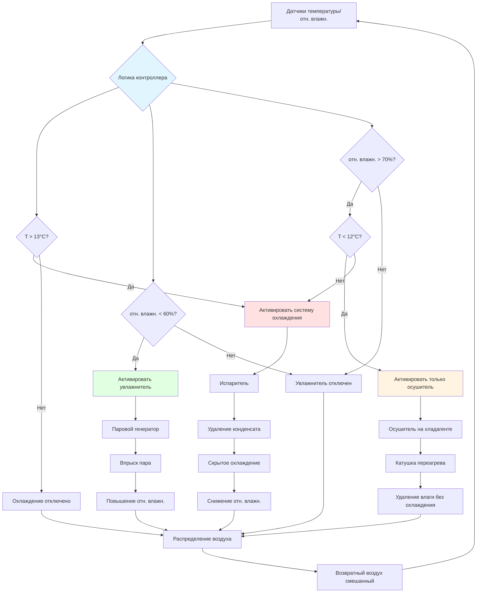

## Контроль влажности винотеки: 60-70% отн. влажн.

Поддержание относительной влажности в диапазоне **60-70% отн. влажн.** в винотеках представляет критическую точку баланса между двумя конкурирующими механизмами отказа: высыханием пробки ниже 50% отн. влажн., приводящим к ускоренному окислению, и распространением плесени выше 75% отн. влажн., вызывающим деградацию этикеток и неприятными запахами. Это узкое окно эксплуатации требует интегрированного контроля влажности, сочетающего активное увлажнение, осушение, вызванное охлаждением, и непрерывный мониторинг. Базирующаяся на физике основа сосредоточена на гигроскопическом равновесии через полупроницаемые мембраны пробки, кинетике диффузии кислорода через клеточные структуры пробки и термодинамике поверхностной конденсации, управляющей микробным ростом.

## Основы влагоравновесия пробки

Натуральная пробка функционирует как гигроскопический клеточный материал, демонстрирующий изменения размеров, пропорциональные давлению водяного пара окружающей среды. Микроструктура пробки состоит из 40 миллионов ячеек на кубический сантиметр, каждая представляет собой 14-гранный многогранник с заполненными газом полостями, заключенными в суберизированные клеточные стенки. Эти стенки содержат 45% суберина (гидрофобный липидный полимер), 27% лигнина, 12% целлюлозы и 6% дубильных веществ по массе. Водяной пар адсорбируется на гидроксильных группах целлюлозы и диффундирует через межклеточные пути, устанавливая равновесие влагосодержания с условиями окружающей среды.

### Анализ изотермы сорбции пробки

Влагосодержание пробки $M_c$ (кг воды на кг сухой пробки) связано с относительной влажностью через трёхпараметровое уравнение сорбции Guggenheim-Anderson-de Boer (GAB):

$$M_c = \frac{M_0 C K \phi}{[1 - K\phi][1 + (C-1)K\phi]}$$

Где:
- $M_0$ = влагосодержание монослоя = 0,062 кг/кг для натуральной пробки
- $C$ = константа энергии Guggenheim = 10,5 при 13°C (зависит от температуры)
- $K$ = константа многослойной сорбции = 0,92
- $\phi$ = относительная влажность, выраженная десятичной дробью (отн. влажн./100)

При 65% отн. влажн. ($\phi = 0,65$) это уравнение дает:

$$M_c = \frac{0,062 \times 10,5 \times 0,92 \times 0,65}{[1 - 0,92 \times 0,65][1 + (10,5-1) \times 0,92 \times 0,65]} = \frac{0,388}{[0,402][6,70]} = 0,144 \text{ кг/кг}$$

Это соответствует **9,2% влагосодержанию по весу**, достаточному для поддержания упругих восстанавливающих свойств пробки и радиального сжатия печати против стекла горлышка бутылки.

### Изменение размеров пробки в зависимости от отн. влажн.

Пробка проявляет анизотропное гигроскопическое расширение с коэффициентами, различающимися по анатомическому направлению. Радиальный коэффициент гигроскопического расширения (перпендикулярный чечевичкам) управляет целостностью печати бутылки:

$$\alpha_r = \frac{1}{D_0}\frac{\partial D}{\partial M_c} = 0,042 \text{ мм/мм на единицу изменения } M_c$$

Для стандартной пробки диаметром 24 мм при 65% отн. влажн. (9,2% $M_c$), снижение влажности до 45% отн. влажн. уменьшает влагосодержание до:

$$M_c(45\%) = \frac{0,062 \times 10,5 \times 0,92 \times 0,45}{[1 - 0,92 \times 0,45][1 + 9,5 \times 0,92 \times 0,45]} = 0,072 \text{ кг/кг}$$

Изменение влагосодержания: $\Delta M_c = 0,092 - 0,072 = 0,020$ (2,0 процентных пункта)

Радиальное сжатие:

$$\Delta D = D_0 \alpha_r \Delta M_c = 24,0 \times 0,042 \times 0,020 = 0,020 \text{ мм}$$

Этот **20-микронный радиальный зазор** между пробкой и стеклом горлышка бутылки принципиально нарушает герметичную печать, увеличивая скорость поступления кислорода на 300-500% по сравнению с должным образом увлажненными условиями.

### Скорость передачи кислорода через пробку

Поток кислорода через пробку следует первому закону диффузии Фика, модифицированному для геометрии кольцевого зазора:

$$\dot{n}_{O_2} = \frac{D_{eff} A}{L}(C_{ext} - C_{int})$$

Где:
- $\dot{n}_{O_2}$ = молярный поток кислорода (моль/с)
- $D_{eff}$ = эффективный коэффициент диффузии = $2,1 \times 10^{-10}$ м²/с при 13°C
- $A$ = площадь поперечного сечения пробки = $\pi D_0 t$, где $t$ = толщина пробки
- $L$ = длина пути диффузии ≈ длина пробки = 45 мм
- $C_{ext}$ = внешняя концентрация O₂ = 0,0089 моль/л (21% O₂ при 1 атм)
- $C_{int}$ = внутренняя концентрация O₂ ≈ 0 (растворенный O₂ потребляется вином)

Для должным образом увлажненной пробки (без зазора) скорость передачи кислорода:

$$\dot{n}_{O_2} = \frac{2,1 \times 10^{-10} \times \pi \times 0,024 \times 0,045}{0,045} \times 8 900 = 6,3 \times 10^{-10} \text{ моль/с}$$

Преобразование в массовый поток: $\dot{m}_{O_2} = 6,3 \times 10^{-10} \times 32 \times 3,154 \times 10^7 = 0,63$ мг O₂/год

Когда высушенная пробка создает 20-микронный кольцевой зазор, диффузия в заполненный воздухом зазор преобладает:

$$\dot{n}_{O_2,gap} = \frac{D_{air} \pi D_0 \delta}{L}(C_{ext} - C_{int})$$

Где $D_{air} = 2,0 \times 10^{-5}$ м²/с и $\delta$ = ширина зазора = 20 мкм:

$$\dot{n}_{O_2,gap} = \frac{2,0 \times 10^{-5} \times \pi \times 0,024 \times 0,00002}{0,045} \times 8 900 = 2,1 \times 10^{-9} \text{ моль/с}$$

Это соответствует **2,1 мг O₂/год**, увеличению на 330% по сравнению с интактной пробкой. Накопление растворенного кислорода способствует окислительным реакциям, которые превращают этанол в ацетальдегид, производя окисленные дефекты вкуса, заметные выше 50 мг/л концентрации ацетальдегида.

### Критический порог отн. влажн. для целостности печати пробки

Пробка поддерживает стабильность размеров в пределах ±3% изменения влагосодержания. Определяя целостность печати по максимально допустимому 10-микронному радиальному зазору:

$$\Delta M_{c,max} = \frac{\Delta D_{max}}{D_0 \alpha_r} = \frac{0,010}{24,0 \times 0,042} = 0,010$$

Используя обратное уравнение GAB для нахождения пределов отн. влажн.:

**Нижний предел**: Из $M_c = 0,092 - 0,010 = 0,082$, решение дает **отн. влажн. = 58%**

**Верхний предел**: Из $M_c = 0,092 + 0,010 = 0,102$, решение дает **отн. влажн. = 72%**

Спецификация **60-70% отн. влажн.** обеспечивает 2-процентный запас безопасности ниже критического порога 72% отн. влажн. прорастания плесени при сохранении влагосодержания пробки в допустимых пределах.

## Термодинамика роста плесени и предотвращение

Споры грибов, повсеместные в окружающем воздухе, остаются неактивными до тех пор, пока активность воды на поверхности $a_w$ не превышает специфичные для вида пороги прорастания. Поверхности винотеки—этикетки, деревянные стеллажи, пробка и гипсокартон—обеспечивают органические источники углерода, поддерживающие метаболизм плесени при влажных условиях.

### Активность воды и равновесная отн. влажн. поверхности

Активность воды на поверхности прямо равна равновесной относительной влажности:

$$a_w = \frac{p_{surf}}{p_{sat}(T)} = \frac{\text{отн. влажн.}}{100}$$

Где $p_{surf}$ — давление пара на поверхности и $p_{sat}(T)$ — давление насыщенного пара при температуре поверхности.

Кинетика прорастания плесени зависит как от $a_w$, так и от температуры. При 13°C в условиях винотеки:

| Вид плесени | Мин $a_w$ | Мин отн. влажн. | Время прорастания | Скорость роста колонии |
|-------------|-----------|---------|------------------|-------------------|
| Aspergillus restrictus | 0,70 | 70% | 10-14 дней | 0,3 мм/день |
| Aspergillus versicolor | 0,75 | 75% | 6-8 дней | 0,5 мм/день |
| Penicillium chrysogenum | 0,78 | 78% | 5-7 дней | 0,8 мм/день |
| Cladosporium cladosporioides | 0,80 | 80% | 3-5 дней | 1,2 мм/день |
| Stachybotrys chartarum | 0,90 | 90% | 2-3 дня | 2,0 мм/день |

Поддержание отн. влажн. винотеки на уровне 65% номинально производит поверхностную $a_w = 0,65$, обеспечивая **7% запас безопасности** ниже порога прорастания Aspergillus restrictus. Этот запас компенсирует кратковременные колебания отн. влажн. во время входа в помещение или неисправности оборудования без инициирования роста плесени.

### Локальная влажность, индуцированная конденсацией

Конденсация поверхности создает локальные микро-среды $a_w = 1,0$, обеспечивающие быстрое колонизирование плесени независимо от объемной отн. влажн. воздуха. Конденсация происходит, когда температура поверхности $T_s$ падает ниже температуры точки росы воздуха $T_{dp}$.

Расчет точки росы из температуры по сухому термометру $T_{db}$ и отн. влажн. использует приближение Magnus-Tetens:

$$T_{dp} = \frac{b \gamma(T_{db}, \text{отн. влажн.})}{a - \gamma(T_{db}, \text{отн. влажн.})}$$

Где:

$$\gamma(T_{db}, \text{отн. влажн.}) = \frac{a T_{db}}{b + T_{db}} + \ln(\text{отн. влажн.}/100)$$

Константы: $a = 17,27$ и $b = 237,7$°C (требует температуру в Цельсиях)

Для винотеки при 13°C (55°F) и 65% отн. влажн.:

$$\gamma = \frac{17,27 \times 13}{237,7 + 13} + \ln(0,65) = 0,882 - 0,431 = 0,451$$

$$T_{dp} = \frac{237,7 \times 0,451}{17,27 - 0,451} = 6,4°C = 43,5°F$$

Любая поверхность винотеки ниже **6,4°C вызывает конденсацию**, создавая условия благоприятные для плесени. Наружные стены требуют теплового сопротивления, предотвращающего падение внутренней температуры поверхности ниже точки росы.

### Расчет минимальной изоляции стены

Передача тепла через стены производит внутреннюю температуру поверхности:

$$T_{s,i} = T_i - \frac{T_i - T_o}{R_{total} \cdot h_i + 1}$$

Где:
- $T_i$ = температура внутреннего воздуха = 13°C
- $T_o$ = наружная температура (условие проектирования зимы = 0°C)
- $R_{total}$ = тепловое сопротивление стены (м²·°C/Вт)
- $h_i$ = коэффициент внутренней пленки = 8,3 Вт/(м²·°C)

Установка $T_{s,i} = T_{dp} = 6,4°C$ и решение для минимального R-значения:

$$6,4 = 13 - \frac{13 - 0}{R_{total} \times 8,3 + 1}$$

$$6,6 = \frac{13}{R_{total} \times 8,3 + 1}$$

$$R_{total} \times 8,3 + 1 = 1,97$$

$$R_{total} = 0,117 \text{ м}^2\text{·°C/Вт}$$

Однако это представляет установившееся минимум. При учете теплового моста через стойки (предполагая 15% доли обрамления) и запаса безопасности для колебаний влажности до 70% отн. влажн. (точка росы = 7,8°C):

$$R_{effective} = \frac{1}{\frac{0,85}{R_{cavity}} + \frac{0,15}{R_{stud}}} \geq \text{RSI } 3,5$$

**RSI 3,5 изоляции** (эквивалентно R-20 в имперской системе) в сочетании с полиэтиленовой парозащитной пленкой толщиной 150 микрон на теплой стороне предотвращает конденсацию при всех нормальных условиях эксплуатации.

## Влияние влажности на качество хранения вина

Различные режимы влажности производят отличающиеся механизмы деградации, влияющие на качество вина, целостность пробки и сохранение этикеток в течение многолетних периодов выдержки.

| Диапазон отн. влажн. | Состояние пробки | Передача O₂ | Влияние на качество вина | Состояние этикетки | Риск плесени |
|----------|---------------|-----------------|---------------------|-----------------|-----------|
| <50% | Тяжелое высыхание | 3-5 мг/год | Быстрое окисление, ацетальдегид >80 мг/л в течение 5 лет | Хрупкость, скручивание краев | Минимальный |
| 50-55% | Умеренное высыхание | 1,5-2,5 мг/год | Ускоренная выдержка, потемнение, окислительные ноты | Интактна, но сухая | Минимальный |
| 55-60% | Легкое высыхание | 0,8-1,2 мг/год | Нормальная траектория выдержки, оптимально для хранения >10 лет | Превосходное сохранение | Минимальный |
| 60-70% | **Оптимальное равновесие** | **0,5-0,8 мг/год** | **Идеальная выдержка, развитие сложности вкуса** | **Оптимальная производительность адгезива** | **Очень низкий** |
| 70-75% | Легкое набухание | 0,4-0,6 мг/год | Минимальное окисление, но возможны плесневые ароматы | Поднятие краев на старых этикетках | Умеренный |
| 75-80% | Умеренное набухание | 0,3-0,5 мг/год | Риск винного окрашивания (образование ТСА), затхлые ароматы | Расслаивание, отказ адгезива | Высокий |
| >80% | Чрезмерное набухание | 0,2-0,4 мг/год | Тяжелое плесневое загрязнение, непригодное вино | Полная потеря этикетки | Тяжелый |

Диапазон **60-70% отн. влажн.** оптимизирует компромисс между минимизацией передачи кислорода (требующей более высокой влажности) и предотвращением роста плесени (требующей более низкой влажности). В пределах этого окна изменения ±3% отн. влажн. производят пренебрежимые эффекты на химию выдержки вина в течение типичных периодов выдержки 5-20 лет.

## Архитектура системы контроля влажности винотеки

Достижение стабильной 60-70% отн. влажн. требует интегрированного управления осушением, вызванным охлаждением, и активным увлажнением паром. Архитектура системы координирует множественные подсистемы, реагирующие как на требования температуры, так и влажности.

### Компоненты системы контроля и интеграция

**Датчики температуры/отн. влажн.**: Емкостные датчики отн. влажн. с точностью ±2% (откалиброванные по стандартам, прослеживаемым к NIST), расположенные на половине высоты на внутренней стене, вдали от выходного потока подаваемого воздуха для измерения представительных условий в помещении. Датчики требуют ежегодной калибровки с использованием растворов насыщенной соли: LiCl (11% отн. влажн.), MgCl₂ (33% отн. влажн.), NaCl (75% отн. влажн.).

**Система охлаждения с контролем скрытого охлаждения**: Увеличенный испаритель, работающий при сниженной производительности, обеспечивает непрерывное охлаждение с минимальными циклами. Температура поверхности испарителя $T_{coil}$ поддерживается на уровне 3-6°C для балансирования явного охлаждения против чрезмерного удаления влаги:

$$SHR = \frac{\dot{Q}_{sensible}}{\dot{Q}_{total}} = \frac{1,08 \times \text{CFM} \times \Delta T}{4,5 \times \text{CFM} \times \Delta h}$$

Целевое значение SHR = 0,80-0,85 для винотек по сравнению с 0,65-0,75 для комфортного охлаждения.

**Увлажнение паром**: Паровые генераторы с электродами впрыскивают стерильный пар в поток подаваемого воздуха. Требуемая производительность:

$$\dot{m}_{steam} = \frac{\text{CFM} \times \rho_{air} \times (W_{target} - W_{supply})}{60}$$

Где $W$ = коэффициент влажности (кг воды на кг сухого воздуха). Для подачи 200 CFM (339 м³/ч) при 13°C, увеличение с 60% отн. влажн. ($W = 0,0066$) до 70% отн. влажн. ($W = 0,0077$):

$$\dot{m}_{steam} = \frac{200 \times 0,075 \times (0,0077 - 0,0066)}{60} = 0,00028 \text{ фунта/с} = 1,0 \text{ фунт/ч}$$

Скромная производительность увлажнения 0,9-1,4 кг/ч достаточна для жилых винотек объемом до 56 м³.

**Выделенное осушение**: Когда наружная точка росы превышает точку росы винотеки (летние условия), влагонагрузка инфильтрации превышает способность системы охлаждения к осушению без переохлаждения. Осушители на хладагенте с катушками переагрева удаляют влагу при сохранении температурного задания.

### Пропорционально-интегральный алгоритм управления влажностью

Передовые контроллеры реализуют управление PI для поддержания стабильной влажности без чрезмерных циклов оборудования:

$$u_{hum}(t) = K_{p,h} e_h(t) + K_{i,h} \int_0^t e_h(\tau) d\tau$$

$$u_{dehum}(t) = K_{p,d} e_d(t) + K_{i,d} \int_0^t e_d(\tau) d\tau$$

Где:
- $u(t)$ = выходной сигнал управления (0-100% производительности)
- $e_h(t)$ = ошибка влажности = 65% - измеренная отн. влажн. (для увлажнения)
- $e_d(t)$ = ошибка влажности = измеренная отн. влажн. - 65% (для осушения)
- $K_{p,h}$ = пропорциональный коэффициент увлажнителя = 4,0% выхода на 1% ошибки отн. влажн.
- $K_{i,h}$ = интегральный коэффициент увлажнителя = 0,2% выхода на 1% отн. влажн.·минуту
- $K_{p,d}$ = пропорциональный коэффициент осушителя = 3,0% выхода на 1% ошибки отн. влажн.
- $K_{i,d}$ = интегральный коэффициент осушителя = 0,15% выхода на 1% отн. влажн.·минуту

Управление PI поддерживает отн. влажн. на уровне 65% ± 2% без колебаний или охоты, типичных для простого термостатического управления включением-отключением.

## Выбор технологии увлажнения

Различные технологии увлажнения демонстрируют отличающиеся характеристики производительности, влияющие на пригодность для приложений винотеки, где чистота воды, потребление энергии и риски микробного загрязнения существенно различаются.

| Технология | Выход влаги | Потребление энергии | Требование качества воды | Интервал обслуживания | Риск бактерий | Капитальная стоимость |
|------------|----------------|-------------------|---------------------------|---------------------|----------------|--------------|
| Паровой электродный | 2,3-7,1 кг/ч | 3,0 кВт на кг/ч | Любой (минералы проводят) | Ежемесячное удаление накипи | Отсутствует (стерильный) | $1500-3000 |
| Паровой резистивный | 0,9-4,5 кг/ч | 3,3 кВт на кг/ч | Любой питьевой | Ежеквартальная замена элемента | Отсутствует (стерильный) | $1000-2300 |
| Испарительный носитель | 0,45-2,3 кг/ч | 50-150 Вт | Отфильтрованный <100 млн/л TDS | Еженедельный осмотр прокладки | Умеренный | $500-1100 |
| Ультразвуковой | 0,23-1,4 кг/ч | 40-100 Вт | Деминерализованный <50 млн/л | Ежедневная очистка резервуара | Высокий при застое | $250-750 |
| Распыляющее сопло | 0,9-3,6 кг/ч | 100-300 Вт | Вода RO <10 млн/л | Еженедельная очистка сопла | Низкий | $750-1700 |

**Паровые электродные увлажнители** представляют оптимальный выбор для винотек несмотря на более высокие эксплуатационные расходы ($0,30-0,40 на кг испаренной воды при $0,10/кВт·ч). Увлажнение паром производит стерильный пар, устраняя риски бактериального загрязнения, допускает любое качество воды (минералы улучшают электродную проводимость) и требует только ежемесячное обслуживание по удалению накипи.

Испарительные и ультразвуковые технологии вводят риски бактериального загрязнения—особенно Legionella pneumophila в стоячей воде—неприемлемые при хранении пищевых продуктов.

## Расчеты сезонной влажностной нагрузки

Влажностные нагрузки винотеки варьируются сезонно в зависимости от содержания влаги наружного воздуха и диффузии пара через оболочку. Точный расчет нагрузки обеспечивает надлежащий размер оборудования и прогнозирует эксплуатационные расходы.

### Летняя влажностная нагрузка на увлажнение

Летний наружный воздух при 29°C/65% отн. влажн. содержит коэффициент влажности:

$$W_{outdoor} = 0,622 \frac{\phi p_{sat}(T)}{p_{atm} - \phi p_{sat}(T)}$$

Где $p_{sat}(29°C) = 4,11$ кПа:

$$W_{outdoor} = 0,622 \frac{0,65 \times 4,11}{101,3 - 0,65 \times 4,11} = 0,0166 \text{ кг/кг}$$

Этот воздух, инфильтрирующийся в винотеку при 13°C, становится перенасыщенным (точка росы = 19°C превышает температуру винотеки), осаждая влагу на поверхности. Система охлаждения удаляет как явное, так и скрытое охлаждение:

$$\dot{Q}_{latent} = \dot{m}_{air} (W_{outdoor} - W_{cellar}) h_{fg}$$

Для 0,1 воздухообмена в час в винотеке объемом 28 м³:

$$\dot{m}_{air} = 0,1 \times 28 \times 1,2 / 60 = 0,056 \text{ кг/мин}$$

$$\dot{Q}_{latent} = 0,056 \times (0,0166 - 0,0077) \times 2450 = 0,122 \text{ кВт} = 122 \text{ Вт}$$

Эта скрытая нагрузка **благоприятна** летом—система охлаждения удаляет избыток влаги при удовлетворении явной охлаждающей нагрузки. Дополнительное осушение не требуется.

### Зимняя нагрузка на осушение

Зимний наружный воздух при 0°C/70% отн. влажн. содержит коэффициент влажности:

$$W_{outdoor} = 0,622 \frac{0,70 \times 0,61}{101,3 - 0,70 \times 0,61} = 0,0041 \text{ кг/кг}$$

Целевая влажность в винотеке при 13°C/65% отн. влажн.:

$$W_{cellar} = 0,622 \frac{0,65 \times 1,50}{101,3 - 0,65 \times 1,50} = 0,0093 \text{ кг/кг}$$

Инфильтрация сухого наружного воздуха требует увлажнения:

$$\dot{m}_{water} = 0,056 \times (0,0093 - 0,0041) \times 60 = 0,174 \text{ кг/ч}$$

Работа 16 часов в день (при учете сниженной инфильтрации в ночное время, когда здание герметизировано):

$$m_{daily} = 0,174 \times 16 = 2,78 \text{ кг/день}$$

**Непрерывное увлажнение при 0,174 кг/ч** поддерживает 65% отн. влажн. при зимних условиях. Эта скромная нагрузка объясняет, почему в жилых винотеках обычно указывается производительность увлажнителя 0,45-0,9 кг/ч.

## Интеграция парозащиты и миграция влаги

Винотеки функционируют как пространства низкой температуры относительно окружающих областей здания, создавая градиенты давления пара, которые направляют миграцию влаги в сборки стен и потолков. Неправильная установка парозащиты вызывает межслойную конденсацию, скрытый рост плесени и деградацию конструкции.

### Анализ градиента давления пара

Разность давления пара через оболочку винотеки:

$$\Delta p_v = p_{v,interior} - p_{v,exterior}$$

Давление пара внутри при 13°C/65% отн. влажн.:

$$p_{v,i} = \phi \times p_{sat}(13°C) = 0,65 \times 1,50 = 0,975 \text{ кПа}$$

Примыкающее кондиционированное помещение при 21°C/45% отн. влажн.:

$$p_{v,adj} = 0,45 \times 2,50 = 1,125 \text{ кПа}$$

Градиент давления пара направляет влагу **в винотеку** через сборки стен, противодействуя типичному градиенту сезона отопления. Этот обратный градиент требует размещения парозащиты на **внешней (теплой) стороне** изоляции—противоположная стандартной строительной практике.

### Скорость передачи пара через сборки

Поток влаги через строительные сборки следует:

$$\dot{m}_v = \frac{A \Delta p_v}{R_{v,total}}$$

Где $R_{v,total}$ = полное сопротивление пара (проницаемость-дюймы, преобразованное в метрическую систему):

$$R_{v,total} = R_{v,interior} + R_{v,insulation} + R_{v,sheathing} + R_{v,exterior}$$

Для сборки без парозащиты:
- Внутренняя отделка (окрашенный гипсокартон): 90 метрических проницаемости-миллиметров
- Изоляция RSI 3,5 из стекловолокна: 18 м·пр·мм
- Обшивка из OSB: 180 м·пр·мм
- Итого: $R_{v,total} = 288$ м·пр·мм

Передача влаги в винотеку площадью 93 м²:

$$\dot{m}_v = \frac{93 \times (1,125 - 0,975)}{288} = 0,048 \text{ кг/ч}$$

Добавление 150-микронной полиэтиленовой парозащиты (0,3 проницаемости) на теплой стороне:

$$R_{v,barrier} = \frac{1}{0,3} = 3,33 \text{ м·пр·мм}$$

Новое полное сопротивление: $R_{v,total} = 288 + 300 = 588$ м·пр·мм

Сниженная передача пара: $\dot{m}_v = 93 \times 0,15 / 588 = 0,024$ кг/ч (50% снижение)

**150-микронные полиэтиленовые парозащиты** обязательны для строительства винотеки, установлены на всех шести поверхностях (стены, потолок, пол) с герметичными швами и проникновениями.

## Сохранение этикеток и химия адгезива

Винные этикетки используют различные адгезивные технологии, демонстрирующие разные диапазоны толерантности влажности. Оптимальная отн. влажн. для сохранения этикеток зависит от типа адгезива, качества бумаги и рецептуры чернил.

### Производительность адгезива по отн. влажн.

**Скрытый клей (животный белок, до 1980)**: Желатинные адгезивы абсорбируют влагу выше 65% отн. влажн., размягчаясь и теряя липкость. Плесень легко колонизирует белковые подложи выше 70% отн. влажн. Оптимальный диапазон: **58-65% отн. влажн.**.

**Холодный клей (декстрин крахмала, 1980-2000)**: Крахмальные адгезивы допускают более высокую влажность, но демонстрируют поднятие краев выше 70% отн. влажн., так как бумага набухает дифференциально. Оптимальный диапазон: **60-70% отн. влажн.**.

**Чувствительный к давлению (акриловый, современный)**: Синтетические акриловые адгезивы показывают минимальную зависимость влажности между 40-80% отн. влажн. Однако, длительное воздействие выше 75% отн. влажн. вызывает ползучесть адгезива и соскальзывание этикетки на конденсирующихся бутылках. Оптимальный диапазон: **60-75% отн. влажн.**.

Поддержание **65% отн. влажн. номинально** приспосабливает все типы адгезивов, обеспечивая запас безопасности ниже порога прорастания плесени, предотвращая высыхание-индуцированную хрупкость старых этикеток.

### Стабильность размеров бумаги

Бумага этикеток проявляет гигроскопические изменения размеров, подобно пробке. Коэффициент гигроскопического расширения для неглазированной бумаги:

$$\alpha_{paper} \approx 0,12\% \text{ на 10% изменение отн. влажн.}$$

Циклирование отн. влажн. между 55-75% производит изменения размеров ±1,2%, вызывая морщинки и расслаивание на краях этикеток. Стабильная влажность в пределах ±3% отн. влажн. устраняет эти эффекты циклирования размеров, сохраняя внешний вид этикеток в течение десятков лет хранения.

## Мониторинг, сигнализация и логирование данных

Профессиональные установки винотеки требуют систем непрерывного мониторинга, обеспечивающих логирование исторических данных и уведомление оповещения в реальном времени, когда условия отклоняются от спецификации.

### Точность датчиков и требования к калибровке

**Датчики температуры**: Термистор или датчики RTD с точностью ±0,3°C в диапазоне 10-18°C. Ежегодная калибровка против прослеживаемой к NIST точки льда (0,0°C) и точки кипения (100,0°C).

**Датчики отн. влажн.**: Датчики емкостные тонкопленочные с точностью ±2% отн. влажн. между 40-80% отн. влажн. Калибровка каждые шесть месяцев с использованием растворов насыщенной соли, устанавливающих фиксированные точки отн. влажн.:

- Хлорид лития (LiCl): 11,3% отн. влажн. при 25°C
- Хлорид магния (MgCl₂): 33,1% отн. влажн. при 25°C
- Хлорид натрия (NaCl): 75,3% отн. влажн. при 25°C

Двухточечная калибровка при 33% и 75% отн. влажн. проверяет линейность по диапазону эксплуатации винотеки.

### Пороги сигнализации и протоколы реагирования

Консервативные заданные значения сигнализации предотвращают повреждение вина при минимизации ложных срабатываний:

| Параметр | Предупреждение | Критический | Протокол реагирования |
|-----------|---------|----------|-------------------|
| Температура низкая | <12°C в течение 4 ч | <10°C в течение 1 ч | Проверить неисправность системы охлаждения |
| Температура высокая | >14°C в течение 2 ч | >17°C в течение 30 мин | Проверить работу компрессора, заряд хладагента |
| Отн. влажн. низкая | <58% в течение 4 ч | <55% в течение 2 ч | Проверить работу увлажнителя, подачу воды |
| Отн. влажн. высокая | >72% в течение 4 ч | >78% в течение 2 ч | Проверить осушение, инспектировать на утечки воды |
| Точка росы | $T_{dp}$ в пределах 4°C от холоднейшей поверхности | $T_{dp}$ в пределах 3°C от холоднейшей поверхности | Увеличить вентиляцию, инспектировать конденсацию |

Дистанционный мониторинг через сотовую или интернет-связь обеспечивает уведомление об оповещении вне сайта, критическое для безнадзорных коммерческих винотек или домов отпуска.

### Анализ исторических данных

Логирование данных с интервалом 5 минут фиксирует поведение циклирования оборудования и выявляет тренды деградации до отказа:

- Увеличение времени работы компрессора указывает на потерю хладагента или загрязнение конденсатора
- Повышение влажности во время циклов охлаждения предполагает недостаточную производительность осушения
- Колебание температуры указывает на адекватную тепловую массу или мертвую зону управления
- Колебания влажности, коррелирующие со входом в помещение, количественно определяют нагрузки инфильтрации

Двенадцатимесячные исторические записи демонстрируют соответствие кодексу для коммерческих приложений хранения пищи и валидируют производительность системы для целей страхования.

## Пуск в эксплуатацию и проверка производительности

Надлежащий пуск в эксплуатацию систем контроля влажности винотеки проверяет достижение спецификации при полных нагрузках перед размещением инвентаря вина.

### 72-часовое тестирование стабильности

С пустой винотекой и всем работающим оборудованием:

1. Установить контроллер на 13°C/65% отн. влажн.
2. Моделировать нагрузку инфильтрации двери: открывать дверь на 30 секунд каждые 4 часа
3. Записывать температуру и отн. влажн. с интервалом 5 минут в течение 72 часов
4. Проверить:
   - Температура остается в пределах 12,8-14,2°C (±0,7°C от задания)
   - Отн. влажн. остается в пределах 63-67% (±2% от задания)
   - Восстановление до задания в течение 30 минут после входа в помещение
   - Отсутствие видимой конденсации на каких-либо поверхностях

### Тестирование отклика нагрузки

Введите пошаговые изменения нагрузок, проверяющие мощность системы:

- Временно повысить задание до 14°C, измерить время установки (должно стабилизироваться в течение 2 часов)
- Отключить увлажнитель, измерить скорость спада отн. влажн. (должна оставаться >60% в течение минимум 8 часов)
- Впрыснуть нагрузку влаги (мокрые полотенца), проверить реакцию осушения (вернуться к 65% в течение 4 часов)

Проверка производительности подтверждает, что мощность оборудования соответствует фактическим нагрузкам и система управления надлежащим образом реагирует на возмущения.

## Заключение

Поддержание 60-70% отн. влажн. в винотеках уравновешивает конкурирующие требования для сохранения пробки (требующей 55-75% отн. влажн. для стабильности размеров), предотвращения плесени (требующей <70% отн. влажн. для предотвращения прорастания) и сохранения этикеток (требующей 58-75% отн. влажн. в зависимости от типа адгезива). Основанный на физике анализ влагоравновесия пробки через уравнения сорбции GAB устанавливает, что 65% отн. влажн. поддерживает оптимальное 9,2% влагосодержание пробки, минимизируя передачу кислорода до 0,5-0,8 мг/год—уровень, требуемый для надлежащей выдержки вина в течение периодов 10-20 лет.

Интегрированные системы управления влажностью координируют осушение, вызванное охлаждением, с активным увлажнением паром, используя алгоритмы управления PI для поддержания стабильности ±2% отн. влажн. Надлежащая установка парозащиты на всех поверхностях предотвращает межслойную конденсацию и миграцию влаги, в то время как непрерывный мониторинг обеспечивает уведомление об оповещении и историческую документацию условий окружающей среды. Профессиональная установка, следующая этим инженерным принципам, обеспечивает долгосрочное сохранение вина без деградации пробки, плесневого загрязнения или повреждения этикеток.
