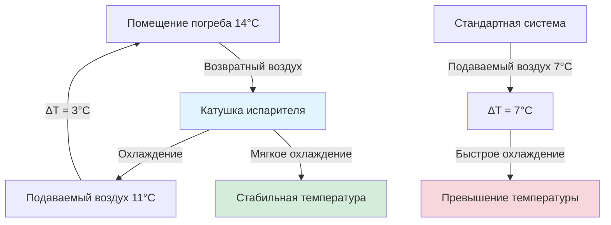

## Оптимальный диапазон температуры хранения вина

Универсально признанный идеальный диапазон температуры для хранения и старения вина составляет **13-16°C**, где 13°C является золотым стандартом для долгосрочного хранения в погребе. Этот температурный диапазон представляет точку термодинамического равновесия, которая минимизирует нежелательные химические реакции, позволяя контролируемым процессам старения протекать с оптимальными скоростями. Физика, лежащая в основе этого выбора температуры, включает кинетику реакций, стабильность фаз и явления переноса, которые управляют эволюцией вина на протяжении месяцев и десятилетий.

Контроль температуры в винных погребах требует точности, значительно превышающей типичные приложения HVAC. В то время как обычное комфортное охлаждение допускает вариации ±1,7-2,8°C, хранение вина требует стабильности в пределах **±0,6°C** или более узких пределов для предотвращения деградации сложных органических соединений и летучих ароматических веществ, определяющих качество вина.

## Химия старения вина и зависимость от температуры

Старение вина включает сотни одновременных химических реакций, включая образование эфиров, полимеризацию танинов, стабилизацию антоцианов и контролируемое окисление. Эти реакции следуют кинетике Аррениуса, где скорость реакции зависит экспоненциально от температуры:

$$k = A e^{-E_a/(RT)}$$

Где:
- $k$ = константа скорости реакции (с⁻¹)
- $A$ = предэкспоненциальный множитель (с⁻¹)
- $E_a$ = энергия активации (Дж/моль)
- $R$ = универсальная газовая постоянная (8,314 Дж/моль·К)
- $T$ = абсолютная температура (К)

Для реакций старения вина с типичной энергией активации 50-80 кДж/моль скорость реакции приблизительно **удваивается при каждом увеличении температуры на 10°C**. Эта чувствительность к температуре объясняет, почему вино, хранящееся при 24°C, стареет примерно в 2-4 раза быстрее, чем вино при 13°C, что приводит к преждевременному созреванию, потере свежести и развитию горелых вкусов.

### Критические температурные пороги

| Температура | Скорость старения | Последствия для хранения |
|-------------|-------------------|-------------------------|
| 4-7°C | 0,3-0,5× нормальная | Чрезмерно медленное старение; риск осадка тартратов |
| 10-11°C | 0,7-0,9× нормальная | Медленнее идеального, но приемлемо краткосрочно |
| **13-16°C** | **1,0× нормальная** | **Оптимальный диапазон долгосрочного хранения** |
| 18-21°C | 1,5-2,0× нормальная | Ускоренное старение; приемлемо только краткосрочно |
| 24-27°C | 2,5-4,0× нормальная | Быстрая деградация; неприемлемо для качественного хранения |

Диапазон 13-16°C обеспечивает оптимальный баланс между прогрессией старения и сохранением деликатных летучих соединений. Температуры ниже 10°C риск кристаллизации тартратов (осаждение битартрата калия) и развития серистых посторонних вкусов. Температуры выше 18°C ускоряют окисление, способствуют росту бактерий и испаряют желаемые ароматические эфиры.

## Стабильность температуры: влияние колебаний

Температурные колебания представляют большую угрозу качеству вина, чем небольшие отклонения от идеальной уставки. Тепловые циклы создают три деструктивных механизма:

**1. Расширение и сжатие жидкости**

Вино проявляет объемное тепловое расширение согласно:

$$\Delta V = V_0 \beta \Delta T$$

Где:
- $\Delta V$ = изменение объема (мл)
- $V_0$ = начальный объем (мл)
- $\beta$ = коэффициент объемного расширения для вина ≈ 0,0010 K⁻¹
- $\Delta T$ = изменение температуры (K)

Для стандартной бутылки 750 мл, испытывающей колебание температуры 5,6°C (5,6 K):

$$\Delta V = 750 \text{ мл} \times 0,0010 \text{ K}^{-1} \times 5,6 \text{ K} = 4,2 \text{ мл}$$

Это расширение на 4,2 мл выталкивает вино мимо пробки, потенциально нарушая герметичность и позволяя кислороду проникать. Последующее сжатие втягивает воздух обратно через поры пробки, создавая цикл «дыхания», который ускоряет окисление.

**2. Конвективное перемешивание**

Температурные градиенты внутри бутылок создают естественную конвекцию со скоростью:

$$v \approx \sqrt{g \beta L \Delta T}$$

Где:
- $v$ = скорость конвекции (м/с)
- $g$ = ускорение свободного падения (9,81 м/с²)
- $\beta$ = коэффициент теплового расширения (K⁻¹)
- $L$ = высота бутылки (м)
- $\Delta T$ = вертикальная разница температур (K)

Для бутылки с градиентом 1,1°C сверху вниз:

$$v \approx \sqrt{9,81 \times 0,0010 \times 0,30 \times 1,1} \approx 0,057 \text{ м/с}$$

Эта конвекция постоянно циркулирует вино мимо интерфейса пробки, ускоряя растворение кислорода и скорости реакции.

**3. Нарушение стабильности фаз**

Температурные циклы дестабилизируют коллоидные суспензии танинов и пигментов, способствуя преждевременному осаждению и потере цвета. Быстрые изменения температуры (>1,1°C/час) могут шокировать оставшиеся в бутылке дрожжи, вызывая автолиз и развитие посторонних вкусов.

## Требования к системам HVAC для прецизионного контроля температуры

Достижение стабильности температуры ±0,6°C требует специализированных подходов к проектированию HVAC:

### Непрерывная модуляция мощности

Традиционное цикличное включение-выключение создает колебания температуры по мере чередования системы между полным охлаждением и отсутствием охлаждения. Величина колебания температуры зависит от мощности системы и тепловой массы пространства:

$$\Delta T_{cycle} = \frac{Q_{cool} \times t_{off}}{m \times c_p}$$

Где:
- $\Delta T_{cycle}$ = колебание температуры во время цикла (°C)
- $Q_{cool}$ = мощность охлаждения (кДж/ч)
- $t_{off}$ = длительность выключения (ч)
- $m$ = тепловая масса (кг)
- $c_p$ = удельная теплоемкость (кДж/кг·°C)

Компрессоры с переменной скоростью исключают циклы путем непрерывного регулирования мощности от 25-100%, поддерживая почти постоянную температуру. Инверторные спиральные компрессоры обеспечивают лучшую производительность для приложений винных погребов.

### Увеличенные теплообменники

Большие испарительные катушки снижают температурный дифференциал между хладагентом и воздухом, уменьшая интенсивность охлаждения, которая вызывает быстрое падение температуры. Правильно рассчитанный испаритель винного погреба работает с:

- Дифференциал температуры испарителя (ETD): 4,4-6,7°C (vs. 8,3-11,1°C для комфортного охлаждения)
- Температура подаваемого воздуха: 10-11°C (vs. 13-16°C для комфортного охлаждения)
- Скорость воздушного потока: 5,08-6,77 м³/ч на кВт охлаждения (vs. 6,77-7,63 м³/ч на кВт)

Такой более мягкий подход к охлаждению минимизирует превышение температуры во время цикла охлаждения.

### Многоступенчатый контроль температуры

Современные системы винных погребов используют каскадные стратегии управления:

**Первичный этап**: Компрессор с переменной скоростью, поддерживающий базовую мощность охлаждения

**Вторичный этап**: Модулирующий байпас горячего газа или электрический дорев, точно доводящий итоговую температуру до ±0,3°C

**Третичный этап**: Буферизация тепловой массы через изолированную оболочку и опциональные материалы с фазовым переходом

Этот трехуровневый подход разделяет грубое охлаждение (первичное) от прецизионного управления (вторичного) и тепловой стабилизации (третичное).

## Контроль температуры и зонирование

Большие винные погреба проявляют температурную стратификацию из-за:
- Теплопроводности через поверхности оболочки
- Различий в тепловой массе между зонами хранения бутылок
- Характеристик циркуляции воздуха
- Вариаций воздействия внешних стен

Профессиональные установки требуют нескольких точек измерения температуры:

| Зона | Местоположение датчика | Назначение |
|------|------------------------|-----------|
| Контрольная | Центр погреба, уровень бутылки | Первичная точка управления |
| Верхняя стойка | Наивысший уровень хранения | Обнаружение стратификации |
| Нижняя стойка | Наинизший уровень хранения | Проверка скопления холодного воздуха |
| Оболочка | Рядом с внешними стенами | Оценка влияния инфильтрации |
| Подаваемый воздух | Выпуск испарителя | Контроль производительности системы |

Спецификации однородности температуры для премиум-класса винных погребов ограничивают пространственное варьирование **±1,1°C максимум** между любыми двумя местами хранения. Это требует тщательного проектирования распределения воздуха с низкоскоростными диффузорами (61-122 м/ч скорость на лице) для обеспечения мягкого перемешивания без создания сквозняков, которые нарушают осадок бутылки.

## Тепловая масса и проектирование оболочки

Тепловое сопротивление оболочки погреба напрямую влияет на стабильность температуры. Теплопередача через стены, потолок и пол следует:

$$Q_{envelope} = U \times A \times \Delta T$$

Где:
- $Q_{envelope}$ = скорость теплопередачи (кДж/ч)
- $U$ = общий коэффициент теплопередачи (кДж/ч·м²·°C)
- $A$ = площадь поверхности (м²)
- $\Delta T$ = разница температур между помещением и наружным (°C)

Для погреба, поддерживаемого при 14°C в окружающей среде 24°C:

| Конструкция | U-значение | Теплопрограмма (9,3 м²) |
|------------|-----------|------------------------|
| R-2,3 стены | 0,44 | 93 кДж/ч |
| R-3,3 стены | 0,30 | 64 кДж/ч |
| R-5,3 стены | 0,19 | 40 кДж/ч |
| R-6,7 потолок | 0,15 | 25 кДж/ч |

Более высокое термическое сопротивление (R-5,3+ стены, R-6,7+ потолок) снижает нагрузку охлаждения и улучшает стабильность температуры, замедляя тепловую реакцию на внешние колебания температуры. Непрерывные пароизоляционные барьеры (полиэтилен минимум 0,15 мм) предотвращают миграцию влаги, которая деградирует производительность изоляции.

Тепловая масса стабилизирует температуру путем поглощения и выделения тепла во время цикла системы. Сами винные бутылки обеспечивают существенную тепловую массу:

$$m_{thermal} = n_{bottles} \times V_{bottle} \times \rho_{wine} \times c_{p,wine}$$

Для погреба на 1000 бутылок:

$$m_{thermal} = 1000 \times 0,75 \text{ л} \times 0,99 \text{ кг/л} \times 3,9 \text{ кДж/кг·K} = 2893 \text{ кДж/K}$$

Эта тепловая масса смягчает температурные колебания, обеспечивая естественную буферизацию от цикличности системы и отключений электроэнергии.

## Протоколы постепенного изменения температуры

Когда первичный запуск погреба или сезонные корректировки требуют изменения температуры, постепенные переходы предотвращают тепловой шок. Рекомендуемые пределы скорости:

- **Максимальная скорость**: 0,6°C в день для повышения температуры
- **Максимальная скорость**: 0,3°C в день для снижения температуры (более критично)
- **Никогда не превышать**: 1,1°C изменения в любой 24-часовой период

Быстрое охлаждение (>1,1°C/день) риск осаждения тартратов и сжатия пробки, нарушающего герметичность бутылки. Постепенные корректировки позволяют химии вина достичь равновесия без фазовых переходов или давления дифференциалов.

## Ввод в эксплуатацию системы контроля температуры

Проверка производительности температуры требует многодневного тестирования в репрезентативных условиях:

1. **Первоначальная стабилизация**: Работать систему 48 часов для достижения теплового равновесия
2. **Регистрация температуры**: Записывать температуры во всех точках датчика каждые 15 минут в течение 7 дней
3. **Анализ цикла**: Проверить колебание температуры остается в пределах ±0,6°C во время нормальных циклов
4. **Пространственная однородность**: Подтвердить, что варьирование температуры между зонами остается в пределах ±1,1°C
5. **Тестирование восстановления**: Имитировать открытие дверцы и проверить возврат к уставке в течение 30 минут

Правильно введенные в эксплуатацию системы HVAC винных погребов демонстрируют замечательную стабильность — премиум-установки достигают управления ±0,3°C на протяжении годовых сезонных колебаний, обеспечивая оптимальные условия для вин, стареющих в течение десятилетий.

Диапазон температуры 13-16°C, поддерживаемый с прецизионным контролем и минимальными колебаниями, представляет фундаментальное требование для качественного хранения вина. Этот температурный режим замедляет химию старения до надлежащих скоростей, сохраняет летучие ароматические вещества, поддерживает целостность пробки и гарантирует, что вина развивают сложность, а не деградацию с течением времени.
