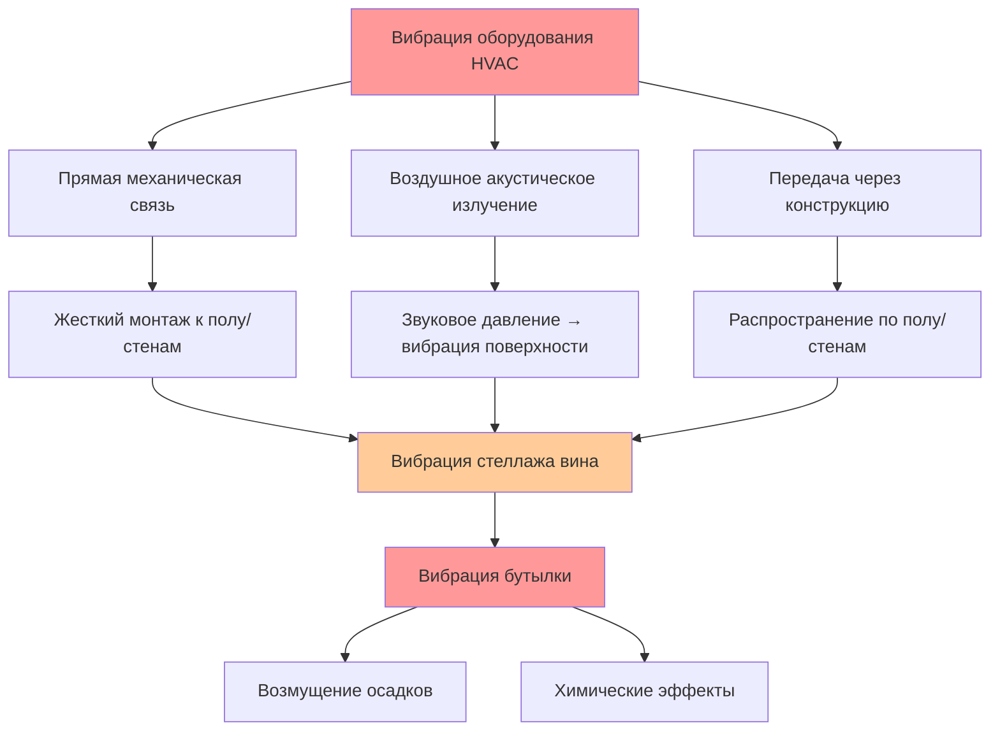

## Контроль вибрации систем HVAC винных погребов

Контроль вибрации представляет собой критически важный, но часто упускаемый из виду аспект проектирования HVAC винных погребов. Механическая вибрация от компрессоров, вентиляторов и систем распределения воздуха передается через конструктивные элементы на стеллажи хранения вина, где нарушает осаждение осадков и потенциально ускоряет процессы старения. Физика передачи вибрации включает передачу энергии по нескольким путям—прямая механическая связь, акустическое излучение и усиление резонанса—каждый из которых требует специфических стратегий снижения.

Премиальные винные погреба требуют уровней вибрации ниже **0,002 g (0,02 м/с²)** в местах расположения стеллажей хранения, сравнимые с фоновым сейсмическим шумом. Достижение этого строгого критерия требует тщательного выбора оборудования, проектирования системы изоляции и структурного развязывания всех компонентов HVAC от зон хранения вина.

## Физика воздействия вибрации на вино

Старение вина включает постепенные химические преобразования и осаждение осадков. Вибрация влияет на оба процесса через различные механизмы:

**Возмущение осадков**: Твердые частицы (кристаллы винного камня, фенольные соединения, комплексы белок-танин) осаждаются под действием силы тяжести со скоростями, определяемыми законом Стокса:

$$v = \frac{2r^2(\rho_p - \rho_f)g}{9\mu}$$

где $v$ — скорость осаждения, $r$ — радиус частицы, $\rho_p$ — плотность частицы, $\rho_f$ — плотность жидкости, $g$ — ускорение свободного падения, и $\mu$ — динамическая вязкость. Виброускорения, превышающие 0,01g, генерируют движение жидкости, которое ресуспендирует осевшие частицы, препятствуя осветлению и потенциально создавая постоянную муть.

**Скорости химических реакций**: Механическое перемешивание увеличивает частоту столкновений молекул, потенциально ускоряя реакции окисления и этерификации. Хотя величина этого эффекта остается предметом дискуссии среди энологов, контролируемые исследования демонстрируют измеримые различия в эволюции фенольных соединений между взбалтанным и неподвижным вином в течение многолетних периодов старения.

**Целостность пробки**: Циклическая вибрация на резонансных частотах (обычно 10-50 Гц для винных бутылок) вызывает усталость в интерфейсе пробка-бутылка, потенциально нарушая герметичность и ускоряя окисление.

## Пути передачи вибрации

Вибрация, генерируемая HVAC, достигает хранилища вина через три основных пути:

Эффективный контроль вибрации требует одновременного воздействия на все три пути. Прямая механическая связь, как правило, доминирует на низких частотах (5-30 Гц), где рабочие скорости компрессора и вентилятора генерируют основное возбуждение. Передача через конструкцию становится значительной, когда оборудование жестко монтируется на стены или полы подвала. Воздушное акустическое излучение имеет значение в основном на более высоких частотах (100-500 Гц), связанных с прохождением лопатей вентилятора и турбулентностью воздуха.

## Выбор оборудования с низкой вибрацией

Выбор оборудования формирует первую линию защиты от чрезмерной вибрации. Технология компрессора в принципе определяет базовые характеристики вибрации:

| Тип компрессора | Уровень вибрации | Диапазон частот | Пригодность для винного погреба |
|-----------------|-----------------|-----------------|-------------------------|
| Поршневой | 0,2-0,5 g | 10-30 Гц | Плохая (избегать) |
| Ротационный | 0,05-0,15 g | 20-60 Гц | Приемлемая |
| **Спиральный** | **0,01-0,03 g** | **40-120 Гц** | **Отличная** |
| Инвертерный спиральный | 0,005-0,02 g | Переменная | Оптимальная |

**Спиральные компрессоры** доминируют в приложениях премиальных винных погребов благодаря изначально сбалансированному вращательному движению. В отличие от поршневых компрессоров с линейным движением поршня, создающих циклические инерционные силы, спиральное сжатие включает два взаимозацепляющихся спиральных элемента—один неподвижный, один орбитирующий—генерирующих гладкое, непрерывное сжатие с минимальной генерацией вибрации.

Фундаментальный дисбаланс силы в поршневых компрессорах следует:

$$F = mr\omega^2\cos(\omega t)$$

где $m$ — масса возвратно-поступательного движения, $r$ — радиус кривошипа, и $\omega$ — угловая скорость. Эта синусоидальная сила прямо возбуждает структурные резонансы. Спиральные компрессоры исключают этот первичный источник возбуждения, снижая вибрацию на порядок.

**Компрессоры переменной скорости (инвертерные) спиральные** обеспечивают дополнительные преимущества в отношении вибрации, избегая повторяющегося цикла пуск-стоп. Непрерывная работа при модулируемой производительности исключает переходные скачки вибрации при запуске и остановке компрессора, которые могут достигать 5-10 кратных значений стационарного уровня.

## Выбор вентилятора и распределение воздуха

Компоненты воздухоподачи вносят вторичную вибрацию через частоты прохождения лопаток и турбулентность, индуцируемую потоком воздуха. Рекомендации по проектированию включают:

- **Центробежные вентиляторы** вместо осевых вентиляторов (изначально сбалансированное вращение, меньшие силы прохождения лопаток)
- **Прямой привод двигателя** исключающий вибрацию ременного привода и смещение
- **Максимальная скорость на входе 1,2 м/с** при змеевиках испарителя, снижая турбулентные пульсации давления
- **Звукопоглощающая облицовка воздуховодов** (минимум 25 мм стекловолокна) ослабляющая передачу воздушной вибрации
- **Гибкие разъемы воздуховодов** (минимальная длина 305 мм) предотвращающие вибросвязь с воздуховодом

Частота прохождения лопаток для центробежных вентиляторов составляет:

$$f_{bp} = \frac{nN}{60}$$

где $n$ — количество лопаток, и $N$ — скорость вращения (об/мин). Выбор конструкций с низким числом лопаток (6-8 лопаток), работающих на более низких скоростях (≤1200 об/мин), минимизирует возбуждение на частотах, где винные бутылки проявляют резонансный отклик.

## Проектирование системы виброизоляции

Даже при использовании оборудования с низкой вибрацией системы изоляции остаются необходимыми для предотвращения передачи на зоны хранения вина. Эффективность изоляции зависит от отношения собственной частоты:

$$TR = \frac{1}{\sqrt{1-\left(\frac{f}{f_n}\right)^2}}$$

где $TR$ — коэффициент передачи, $f$ — частота возбуждения, и $f_n$ — собственная частота изолятора. Эффективная изоляция требует $f_n < f/\sqrt{2}$, означая, что собственная частота изолятора должна быть менее чем 0,707 от самой низкой частоты возбуждения.

Для спиральных компрессоров, работающих на 3600 об/мин (60 Гц), самое низкое значительное возбуждение происходит на рабочей скорости:

$$f_n < \frac{60}{\sqrt{2}} \approx 42 \text{ Гц}$$

Достижение этой собственной частоты требует изоляторов с достаточным прогибом под весом оборудования.

### Типы крепежей виброизоляции

**Пружинные изоляторы**: Стальные спиральные пружины обеспечивают стабильную производительность в широком диапазоне температур. Требуемый статический прогиб:

$$\delta_{static} = \frac{1}{(2\pi f_n)^2 g}$$

Для $f_n = 10$ Гц (обеспечивающего отличную изоляцию на 60 Гц), требуемый прогиб составляет примерно 25 мм. Пружинные изоляторы выдерживают вес оборудования от 23 кг до 2270 кг с минимальным изменением жесткости.

**Прокладки из неопрена**: Эластомерная изоляция, подходящая для более легкого оборудования (менее 91 кг). Собственные частоты обычно 15-25 Гц, обеспечивающие умеренную изоляцию. Зависимость жесткости от температуры ограничивает производительность в условиях переменного окружающего воздуха. Рекомендуется минимальная толщина прокладки 25 мм; более толстые прокладки (до 50 мм) улучшают изоляцию, но снижают боковую стабильность.

**Комбинированные изоляторы**: Пружинные элементы с акустическими барьерами из неопрена оптимизируют как низкочастотную изоляцию (пружина), так и высокочастотное затухание (эластомер). Эти узлы обеспечивают превосходную производительность во всем спектре вибрации, релевантном для хранения вина.

## Лучшие практики установки

Правильная установка определяет эффективность системы изоляции:

**Расположение оборудования**: Разместите блоки конденсатора-компрессора на **минимальном расстоянии 6 метров** от стеллажей хранения вина, если возможно. Амплитуда вибрации ослабляется на расстояние в соответствии с:

$$A = \frac{A_0}{r}$$

для поверхностных волн в конструктивных элементах, где $A$ — амплитуда на расстоянии $r$ и $A_0$ — амплитуда источника.

**Подготовка монтажной поверхности**: Установите оборудование на **бетонные плиты минимальной толщиной 100 мм**, обеспечивающие массу и жесткость для минимизации вторичной вибрации. Подвесные деревянные полы усиливают вибрацию через резонанс и должны быть избегнуты. Когда монтаж на полу неизбежен, усилить каркас дополнительными балками, чтобы поднять собственную частоту выше диапазона возбуждения.

**Конфигурация раздельной системы**: Разделите конденсатор-компрессор от испарителя на максимально практическое расстояние. Разместите блоки компрессора:
- Вне винного погреба в механических помещениях
- На наружных площадках, изолированных от конструкции здания
- На чердаках с изолированными платформами оборудования
- Никогда не монтируйте прямо на стены подвала

**Гибкие соединения**: Установите гибкие хладагентные линии и электрические кабелепроводы, предотвращающие вибросвязь через коммунальные системы. Минимум 305 мм гибких участков во всех жестких соединениях с изолированным оборудованием.

**Развязывание конструкции**: Избегайте жестких соединений воздуховодов со стенами подвала. Используйте гибкие холщовые разъемы или установите опоры воздуховода на отдельные изолированные рамы.

## Мониторинг вибрации и проверка

Измерение вибрации после установки проверяет производительность системы. Процедуры оценки включают:

**Места измерения**: Конструкции стеллажей вина на характерных высотах хранения бутылок (0,9-1,5 м над полом). Минимум три места, распределенные по всему погребу.

**Параметры измерения**:
- Пиковое ускорение (g)
- RMS-скорость (мм/с)
- Спектр частот (0-500 Гц)

**Критерии приемки**:
- Пиковое ускорение: <0,002 g на всех частотах
- RMS-скорость: <0,013 мм/с
- Отсутствие дискретных тональных компонентов выше фона

**Процедура измерения**: Запишите вибрацию со всем оборудованием HVAC, работающим в условиях проектирования. Сравните с базовыми измерениями при отключенном оборудовании, чтобы определить вклад HVAC.

Портативные анализаторы вибрации с трехосевыми акселерометрами обеспечивают адекватное разрешение для проверки винного погреба. Профессиональная наладка должна документировать уровни вибрации во всех местах хранения с сертификацией, предоставляемой владельцам винного погреба.

## Требования коммерческого хранения вина

Коммерческие хранилища вина, содержащие высокостоимостные запасы, требуют усиленного контроля вибрации:

- **Сейсмическая изоляция**: Установите стеллажи вина на изолированные платформы, развязанные от конструкции здания
- **Резервные HVAC системы**: Несколько более мелких компрессоров вместо одного большого, снижая вибрацию на единицу
- **Удаленные расположения оборудования**: Специализированные механические помещения, изолированные от зон хранения структурными расширительными швами
- **Непрерывный мониторинг**: Постоянные датчики вибрации с уведомлением тревоги при аномальных условиях

Для больших коммерческих погребов может потребоваться вычислительный анализ вибрации на этапе проектирования, моделирование путей передачи и прогнозирование производительности до строительства. Моделирование методом конечных элементов идентифицирует структурные резонансы и оптимизирует параметры системы изоляции для конкретных условий установки.

Надлежащий контроль вибрации обеспечивает оптимальные условия старения вина путем поддержания стабильности осадков, предотвращения механического возмущения и создания спокойной среды, необходимой для развития сложных вкусовых профилей в течение десятилетий созревания. Интеграция выбора оборудования с низкой вибрацией, комплексных систем изоляции и осторожной установки достигает уровней вибрации, неотличимых от естественного фона, сохраняя качество вина на протяжении продленных периодов старения.
