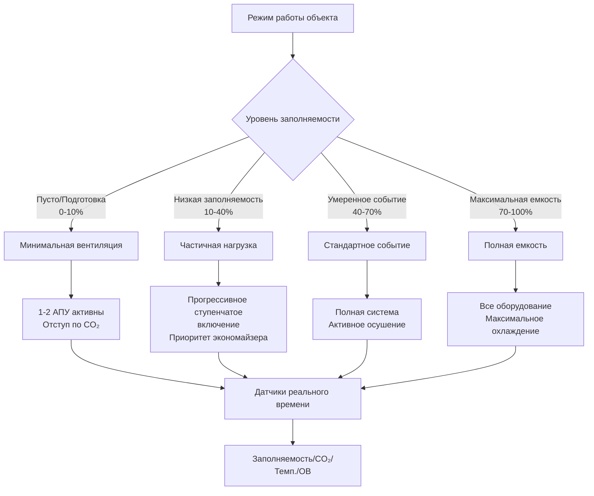

## Тепловая динамика помещений с переменной заполняемостью

Специализированные объекты представляют уникальные тепловые проблемы из-за экстремальной изменчивости внутреннего тепловыделения и колебаний плотности заполнения в диапазоне нескольких порядков величины. Мгновенная охлаждающая нагрузка для многофункционального объекта следует:

$$Q_{total}(t) = Q_{envelope} + Q_{occupants}(t) + Q_{lighting}(t) + Q_{equipment}(t) + Q_{infiltration}(t)$$

где зависящие от времени члены могут варьироваться в 10-50 раз между минимальными и пиковыми условиями, создавая термодинамические проблемы при поддержании комфорта и одновременном избежании чрезмерной избыточности во время периодов низкого использования.

## Профили нагрузок, управляемые заполняемостью

Вклады явного и скрытого тепла от занимающих помещение людей доминируют в тепловой динамике специализированных объектов. Каждый человек генерирует тепло со скоростью, зависящей от уровня метаболической активности:

| Уровень активности | Явное тепло (Вт) | Скрытое тепло (Вт) | Всего (Вт) |
|-------------------|------------------|-------------------|-----------|
| Сидя, спокойно | 60 | 40 | 100 |
| Стоя, легкая активность | 70 | 60 | 130 |
| Ходьба, умеренная | 75 | 85 | 160 |
| Танцы, интенсивные | 85 | 215 | 300 |
| Спортивная активность | 115 | 385 | 500 |

Для объекта, переходящего из пустого состояния (50 человек) в полную емкость (2000 человек) во время события, нагрузка только от людей увеличивается:

$$\Delta Q_{occupants} = (N_{peak} - N_{base}) \times q_{person} = (2000 - 50) \times 130 = 253,500 \text{ Вт}$$

Это изменение на 253,5 кВт должно быть поглощено системой HVAC за время, достаточно короткое, чтобы предотвратить дрейф температуры в помещении, превышающий пороги комфорта.

## Требования к времени отклика системы

Отклик температуры помещения на скачкообразное изменение нагрузки следует:

$$T_{space}(t) = T_{initial} + \Delta T_{ss}(1 - e^{-t/\tau})$$

где $\tau = \frac{mC_p}{\dot{m}_{air}C_{p,air}}$ представляет тепловую постоянную времени. Системы должны достичь 90% отклика в течение $t_{90} = 2.3\tau < 15-20$ минут, вынуждая воздухообмен в 8-15 ACH в сравнении с типичными значениями 4-6 ACH.

## Архитектура многорежимной системы

Специализированные объекты требуют систем HVAC, работающих в различных режимах нагрузки без чрезмерного энергетического штрафа при частичных нагрузках.

## Проблемы вентиляции в управляемых событиями помещениях

ASHRAE Standard 62.1 требует показателей наружного воздуха для вентиляции на основе плотности заполняемости. Для специализированных объектов требование вентиляции варьируется в большой степени:

$$\dot{V}_{OA} = R_p \times P + R_a \times A$$

где $R_p$ (CFM/человек) и $R_a$ (CFM/м²) указываются в зависимости от типа помещения. Для помещений собрания типичные значения составляют $R_p = 5$ CFM/человек и $R_a = 0.645$ CFM/м².

| Состояние объекта | Заполняемость | Площадь (м²) | Требуемый наружный воздух (м³/ч) | Подаваемый воздух (м³/ч) |
|------------------|---------------|--------------|----------------------------------|------------------------|
| Пусто | 50 | 1,858 | 246 | 1,359 |
| Частичная | 500 | 1,858 | 628 | 3,398 |
| Умеренная | 1,200 | 1,858 | 1,223 | 6,797 |
| Полная | 2,000 | 1,858 | 1,903 | 10,195 |

Диапазон требований к наружному воздуху 7,7× создает значительные энергетические последствия и требует стратегий вентиляции, управляемой спросом (DCV), с использованием датчиков CO₂ или прямого подсчета заполняемости.

## Управление тепловой стратификацией

Объекты большого объема испытывают тепловую стратификацию, где $\frac{dT}{dz} \approx \frac{Q_{internal}}{A \times k_{effective}}$. Без активной дестратификации разница температур между полом и потолком в 5,6-8,3°C снижает эффективность охлаждения. Смягчение включает высокоскоростное распределение воздуха (коэффициенты захвата 5-8:1), циркуляционные вентиляторы 0,25-0,50 м/с или системы вытесняющей вентиляции.

## Гибкие подходы зонирования помещений

Многофункциональные объекты требуют переконфигурируемого зонирования HVAC для размещения подвижных стен, одновременных событий с разными тепловыми требованиями и пространственно перемещающихся нагрузок. Эффективные стратегии включают модульную воздухообработку с 3-5 независимо управляемыми зонами на переконфигурируемое помещение, периферийные VAV коробки, обслуживающие внешние 4,6-6,1 м, и дополнительные вентиляторно-конвекторные установки для локальной гибкости мощности.

## Контроль влажности в нестационарных условиях

Проблемы управления скрытой нагрузкой возникают при быстрых скачках заполняемости. Баланс влагоcодержания в помещении $\frac{dm_{water}}{dt} = \dot{m}_{latent,generation} - \dot{m}_{latent,removal}$ показывает, что в течение первых 30-60 минут события относительная влажность может подняться на 15-25 процентных пункта перед ответом осушающего теплообменника. Смягчение включает предварительное охлаждение помещений на 1,1-2,2°C ниже уставки, системы выделенного наружного воздуха (DOAS) с независимым контролем скрытого тепла или дополнения осушением на основе адсорбентов.

## Рассмотрения рекуперации энергии

Экстремальные объемы наружного воздуха при пиковой заполняемости делают рекуперацию энергии экономически привлекательной. Колеса энтальпии восстанавливают 60-80% кондиционирующей энергии, но рискуют передачей загрязнения и деградацией эффективности при быстро меняющихся расходах воздуха. Замкнутые контуры с гликолевой теплопередачей обеспечивают разделение воздушных потоков при поддержании эффективности 50-65%, что делает их предпочтительными для объектов со строгими требованиями к качеству внутреннего воздуха.

## Архитектура системы управления

HVAC специализированного объекта требует передовых систем управления, интегрирующих прогностические алгоритмы (расписания событий управляют предварительным охлаждением за 2-4 часа), датчики реального времени (CO₂, счетчики заполняемости, тепловизионное исследование), адаптивные уставки на основе измеренной плотности заполняемости, приоритизированное снижение нагрузок при превышении спроса, и быстрое обнаружение неисправностей. Система должна плавно переходить между режимами работы при минимизации энергии во время 85-95% часов, когда объекты работают ниже 50% емкости.

## Определение проектной нагрузки

Традиционная методология проектного дня ASHRAE доказала свою неадекватность для специализированных объектов. Вероятностный подход использует:

$$Q_{design} = Q_{base} + f_{diversity} \times Q_{peak,occupant} + Q_{peak,other}$$

где $f_{diversity}$ отражает статистическую вероятность одновременного максимума заполняемости и нагрузки оболочки. Значения 0,7-0,85 лучше представляют фактические совпадающие условия, чем $f_{diversity} = 1.0$, предотвращая грубую избыточность при обеспечении адекватной производительности во время фактических пиковых событий.
