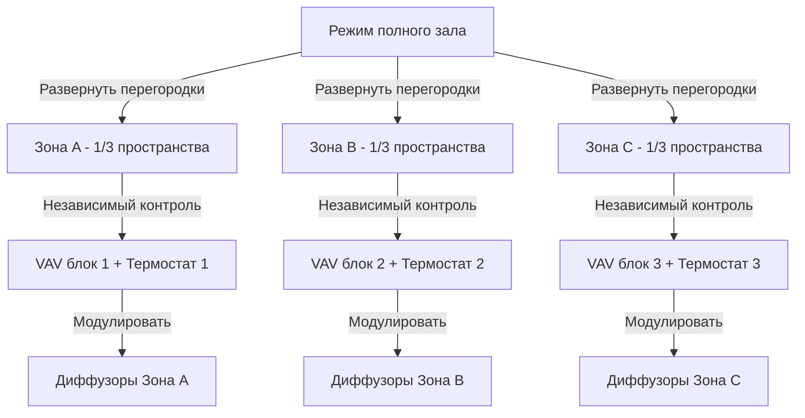

Залы и банкетные помещения представляют уникальные проблемы HVAC из-за экстремальных колебаний занятости, делимых архитектурных решений, эстетических ограничений люстр и высоких потолков, а также одновременных требований к комфорту гостей и операциям пищевого обслуживания. Эти многофункциональные пространства требуют гибких систем климат-контроля, способных реагировать на изменения нагрузок от 5 человек во время подготовки до 500 и более во время пиковых мероприятий, при этом сохраняя невидимую интеграцию с архитектурными элементами.

## Физика изменчивости нагрузок

Явная и скрытая нагрузки на залы демонстрируют наиболее значительные колебания среди всех типов коммерческих помещений. Общий теплогаз следует уравнению:

$$Q_{total} = Q_{occupants} + Q_{lighting} + Q_{equipment} + Q_{envelope} + Q_{infiltration}$$

Во время сидячего ужина на 400 человек, метаболическое тепловыделение преобладает:

$$Q_{occupants} = N \times q_{sensible} + N \times q_{latent}$$

Где $N$ = 400 человек, $q_{sensible}$ = 73 кДж/ч на человека (сидя), $q_{latent}$ = 58 кДж/ч на человека. Это дает 29,200 кДж/ч явного тепла и 23,200 кДж/ч скрытого тепла только от людей—эквивалентно мгновенному добавлению нагрузки охлаждения 8,3 кВт при входе гостей.

Коэффициент явного тепла (SHR) при высокой занятости снижается до:

$$SHR = \frac{Q_{sensible}}{Q_{sensible} + Q_{latent}} = \frac{29,200}{52,400} = 0.56$$

Этот низкий SHR требует значительной емкости осушения сверх стандартных коммерческих помещений (SHR обычно 0,70-0,80).

## Координация делимых помещений

Раздвижные перегородки подразделяют залы на меньшие секции, каждая требует независимого зонального контроля. Задача состоит в обеспечении непрерывности распределения воздуха при движении перегородок.

Каждая зона требует выделенных VAV терминалов с независимым от давления управлением для предотвращения помех потокам воздуха между активными и неактивными секциями. Воздух возврата должен быть протоколирован выше перегородок для сохранения надлежащего баланса воздуха независимо от конфигурации перегородок.

## Высота потолка и стратификация

Залы обычно имеют высоту потолков 4,9-7,3 м, создавая значительный потенциал тепловой стратификации. Градиент температуры в неподвижном воздухе следует:

$$\frac{dT}{dz} = -\frac{g}{c_p} \approx -0.034°C/м$$

На практике с источниками тепла на уровне пола (люди) градиент обращается вспять, и теплый воздух поднимается. Без надлежащей циркуляции воздуха температуры потолка могут превышать уровень пола на 5,6-8,3°C, отходя охлаждающей энергией и создавая дискомфортные сквозняки при спуске воздуха.

Надлежащее распределение воздуха требует высокоимпульсных струй подачи для прерывания стратификации:

$$X = \frac{V_x}{V_0} = e^{-K\frac{x}{d_0}}$$

Где расстояние выброса $x$ должно достигать зоны пребывания с конечной скоростью $V_x$ 0,25-0,38 м/с. Для потолков высотой 6,1 м, диффузоры подачи требуют дальности выброса 6,1-9,1 м, требующей тщательного выбора сопла и скоростей подачи 3,0-4,1 м/с на лице диффузора.

## Интеграция люстр

Орнаментальные люстры служат центральными элементами залов, но препятствуют распределению воздуха. Существуют три стратегии координации:

| Стратегия | Место подачи | Место возврата | Преимущества | Ограничения |
|----------|----------------|-----------------|------------|-------------|
| Периферийные верхние стенные регистры | Верхние стенные регистры | Потолок между люстрами | Сохраняет видимость люстры | Требуются дальние выбросы |
| Потолочные щелевые диффузоры | Линейные щели параллельно люстрам | Низкие боковые стены или под платформой | Архитектурная интеграция | Сложная маршрутизация воздуховодов |
| Интеграция в люстру | Воздух подачи через конструкцию люстры | Распределенный потолок | Максимальное управление выбросом | Требует пользовательского дизайна люстры |

Воздух подачи, направленный через конструкции крепления люстры, обеспечивает наиболее эффективное распределение, со струями направленными вниз по периметру приспособления. Этот подход использует центральное расположение люстры, избегая прямого потока воздуха на декоративные элементы.

## Интеграция обслуживания и кейтеринга

Операции пищевого обслуживания вводят дополнительные нагрузки тепла и влаги в смежные предварительные помещения и служебные коридоры. Приток воздуха подпитки вытяжки кухни не должен компрометировать условия в зале. Каскад давления требует:

$$P_{corridor} > P_{ballroom} > P_{kitchen}$$

Поддержание давления в зале на 5-7,6 Па выше коридоров предотвращает инфильтрацию запахов, оставаясь ниже давления кухни для сдерживания варочных выбросов. Это требует точного управления наружным воздухом:

$$OA_{required} = MAX(V_{ventilation}, V_{pressurization})$$

Где $V_{ventilation}$ следует ASHRAE 62.1 (2,1 м³/ч на человека для помещений собраний) и $V_{pressurization}$ учитывает утечки конверта и инфильтрацию дверей.

## Контроль на основе занятости

Современные системы залов используют датчики CO₂ и обнаружение занятости для модуляции скоростей вентиляции в реальном времени. Во время подготовки (5 человек) наружный воздух может снизиться до минимальных кодовых требований (типично 0,0028 м³/(с·м²)), в то время как при полной занятости мероприятия возрастает до 1,4+ м³/с.

Метод эффективности вентиляции из ASHRAE 62.1 применяется:

$$V_{ot} = \frac{V_{oz}}{E_z}$$

Где эффективность распределения воздуха в зоне $E_z$ = 1,0 для потолочных систем подачи с воздухом возврата у пола или 0,8 для вытеснения воздуха—редко используется в залах из-за высоких потолков.

## Акустические соображения

Низкие уровни фонового шума (NC 30-35) критичны для выступлений и презентаций. Скорости в воздуховодах должны оставаться ниже 6,1 м/с в магистралях и 3,0 м/с в боковых воздуховодах. VAV терминалы требуют звукоизолированных корпусов, добавляющих потерю вставки 10-15 дБ.

Пути возврата воздуха через потолочные плены выше раздвижных перегородок должны включать акустические экраны для предотвращения передачи звука между зонами—минимум 50 STC обеспечивает приватность речи при независимой работе зон.

## Рекомендации систем

Высокопроизводительные системы HVAC залов включают:

- **Двухпутевое распределение воздуха**: Отдельные потоки явного охлаждения и осушения позволяют независимый контроль SHR
- **Поэтапная емкость**: Несколько меньших воздухоприемов вместо одного большого устройства обеспечивают эффективную работу при частичной нагрузке
- **Подпольное распределение воздуха**: Где эстетика потолка первична, системы UFAD исключают надземные воздуховоды, обеспечивая отличное управление стратификацией
- **Радиационные охлаждающие панели**: Периферийные радиационные панели обрабатывают базовые нагрузки, снижая требования к потокам воздуха и шуму
- **Вентиляция по требованию**: Модуляция на основе CO₂ снижает потребление энергии на 30-40% в сравнении с постоянными системами наружного воздуха

Надлежащим образом спроектированные системы HVAC залов балансируют архитектурную интеграцию, комфорт жителей при экстремальных колебаниях нагрузок и операционную гибкость для разнообразных типов мероприятий—все при невидимой работе, поддерживающей опыт вместо отвлечения от него.

---

**Файл**: `/Users/evgenygantman/Documents/github/gantmane/hvac/content/specialty-applications-testing/specialty-hvac-applications/specialized-venue-requirements/ballrooms-banquet/_index.md`
