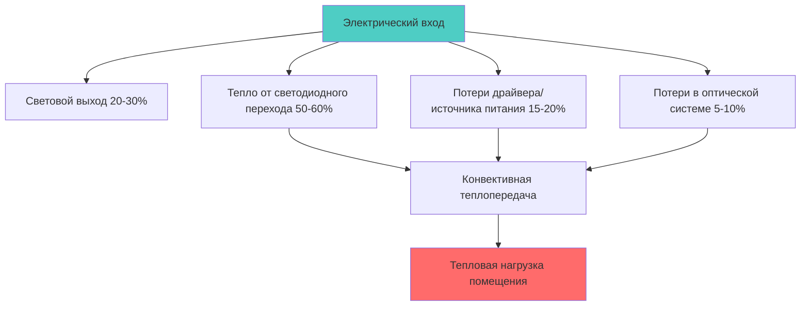
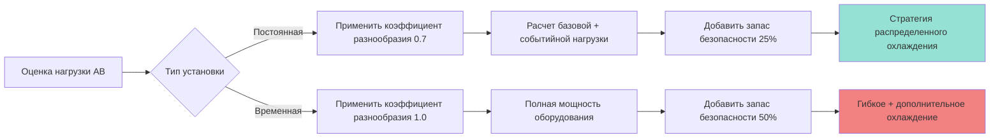

## Физические основы генерации тепла в АВ оборудовании

Аудиовизуальное оборудование преобразует электрическую энергию в свет, звук и значительное количество тепловой энергии через резистивный нагрев и электромагнитные процессы. Первый закон термодинамики устанавливает, что энергия входа равна полезному выходу плюс потери тепла:

$$Q_{total} = P_{input} - (P_{acoustic} + P_{optical}) \approx P_{input} \times (1 - \eta)$$

Где $\eta$ представляет эффективность оборудования (обычно 0,15-0,40 для систем проекции, 0,50-0,70 для усилителей). Большинство электрической энергии преобразуется в явное тепло, которое должно быть удалено системой HVAC.

## Анализ тепловых нагрузок оборудования по типам

### Системы проекции

Современные цифровые проекторы рассеивают 400-2000 Вт в зависимости от выходной яркости, измеряемой в люменах. Высокопроизводительные проекторы для площадок (10 000+ люмен) генерируют значительное локализованное тепло:

$$Q_{projector} = \frac{P_{lamp}}{\eta_{optical}} + P_{electronics}$$

Для лазерного проектора мощностью 15 000 люмен:
- Ламповый/лазерный блок: 1200 Вт
- Электроника и охлаждающие вентиляторы: 300 Вт
- Общее тепловыделение: **1500 Вт (5,100 кДж/ч)**

Проекторы, монтируемые на потолке, создают тепловые потоки, которые поднимаются и расслаиваются, если не обеспечено специальное локальное охлаждение или возвратные воздушные решетки, расположенные над оборудованием.

### Силовые усилители

Профессиональные звуковые усилители работают с эффективностью 50-70% при типовых условиях нагрузки. Рассеивание тепла следует формуле:

$$Q_{amp} = P_{output} \times \left(\frac{1}{\eta} - 1\right) + P_{idle}$$

| Класс усилителя | Эффективность | Мощность в режиме ожидания | Полное тепловыделение (на 1000 Вт выхода) |
|-----------------|------------|------------|-----------------------------------|
| Class AB | 50-60% | 100-200 Вт | 800-1000 Вт |
| Class D | 65-75% | 30-80 Вт | 350-500 Вт |
| Class H | 60-70% | 80-150 Вт | 450-700 Вт |

Типичная звуковая система банкетного зала с мощностью усилителя 10 кВт генерирует **6000-8000 Вт** (21,600-28,800 кДж/ч) при умеренных рабочих уровнях (60-70% использования).

### Тепловые нагрузки сценического освещения

Тепловые нагрузки от освещения варьируются значительно между традиционными и светодиодными технологиями:

**Традиционные галогенно-вольфрамовые:**
- Par 64 (1000 Вт): 3,400 кДж/ч каждый
- ERS Ellipsoidal (750 Вт): 2,560 кДж/ч каждый
- Эффективность преобразования: ~5-8% в видимый свет

**Светодиодные движущиеся головки:**
- Светодиодный прибор 300 Вт: 1,080 кДж/ч
- Эффективность: 20-30% в видимый свет
- Потери блока питания: 15-20%

Полная система освещения банкетного зала может включать:
- 40 светодиодных движущихся головок (300 Вт каждый): 12 000 Вт
- 20 светодиодных заливочных приборов (200 Вт каждый): 4000 Вт
- Потери диммера/управления (10%): 1600 Вт
- **Итого: 17 600 Вт (63,360 кДж/ч)**

### Дисплеи и видеостены

Светодиодные видеостены и крупноформатные дисплеи генерируют значительное тепло в зависимости от расстояния между пикселями и яркости:

$$Q_{display} = A_{screen} \times \rho_{pixel} \times P_{pixel} \times B_{factor}$$

Где:
- $A_{screen}$ = площадь экрана (м²)
- $\rho_{pixel}$ = плотность пикселей (пиксели/м²)
- $P_{pixel}$ = мощность на пиксель (Вт)
- $B_{factor}$ = коэффициент использования яркости (0,3-0,8)

Видеостена 4 м × 2 м (шаг 3,9 мм) при яркости 70%:
- Количество пикселей: ~500 000 пикселей
- Плотность мощности: 800 Вт/м²
- Общее тепловыделение: **6400 Вт (23 040 кДж/ч)**

ЖК/OLED дисплеи рассеивают 150-400 Вт на 85" экран в зависимости от параметров яркости и технологии подсветки.

## Требования к охлаждению серверных стоек оборудования

Серверные стойки с АВ оборудованием концентрируют тепло в ограниченном пространстве, создавая экстремальную тепловую плотность. Охлаждение стойки требует:

**Конвективная теплопередача:**
$$Q = h \times A \times \Delta T$$

Где достаточная вентиляция поддерживает $\Delta T$ ниже 8°C для предотвращения дросселирования оборудования или отказа.

### Стратегии охлаждения стойки

| Метод | Холодопроизводительность | Применение | Уровень шума |
|--------|------------------|-------------|-------------|
| Естественная конвекция | 2-3 кВт | Малые стойки, открытая конструкция | Без шума |
| Принудительная вентиляция | 5-8 кВт | Стандартные стойки | Умеренный |
| Теплообменники в стойке | 10-15 кВт | Высокоплотное оборудование | Низкий |
| Охлаждение задней двери | 15-25 кВт | Экстремальная плотность | Очень низкий |
| Локальное кондиционирование | 8,8-17,6 кВт | Управляющие помещения | Умеренный |

Критические серверные стойки должны поддерживать внутреннюю температуру ниже 29°C с резервными путями охлаждения.

## Профили временных и постоянных установок с нагрузками

### Постоянные установки

Фиксированные АВ системы работают предсказуемо с:
- Базовая нагрузка: 30-40% максимальной мощности
- Нагрузка на события: 60-80% максимальной мощности
- Пиковая продолжительность: 2-6 часов
- Коэффициент разнообразия: 0,60-0,75

Проектировать охлаждение на 75% одновременной работы с запасом безопасности 25%.

### Временные производства

Мобильное АВ оборудование вводит переменные:
- Неизвестные характеристики оборудования
- Переменное позиционирование, влияющее на распределение воздуха
- Сконцентрированные нагрузки во временных местах
- Периоды установки/демонтажа с необычными нагрузками

**Подход к проектированию:** Обеспечить 150-200% ожидаемой постоянной мощности системы через гибкое распределение (доступные люки в полу, точки крепления с ближайшими возвратами, дополнительная мобильная холодопроизводительность).

## Интеграция с системой HVAC

### Рассмотрения распределения воздуха

Тепловые нагрузки АВ создают проблемы для обычной вентиляции вытеснением:
1. **Тепловое расслоение** от приподнятого оборудования требует размещения возврата воздуха над источниками тепла
2. **Акустические требования** ограничивают скорость диффузора <2 м/с
3. **Эстетические ограничения** требуют скрытых решеток и воздуховодов

**Решение:** Верхняя подача с низкоскоростными радиальными диффузорами (NC 25-30) в сочетании с высокоиндукционными возвратами, расположенными 60-90 см выше сцены/АВ оборудования.

### Расчет нагрузки в соответствии с ASHRAE

ASHRAE Fundamentals Chapter 18 предоставляет руководство:

$$Q_{AV} = 3.41 \times P_{nameplate} \times F_{use} \times F_{diversity}$$

Где:
- $P_{nameplate}$ = номинальное потребление мощности (Вт)
- $F_{use}$ = коэффициент использования (0,5-0,8)
- $F_{diversity}$ = коэффициент разнообразия (0,6-1,0)
- Результат в кДж/ч

Для проектных нагрузок банкетного зала:
- **Постоянные системы:** Использовать $F_{diversity}$ = 0,70
- **Временные предусмотрения:** Использовать $F_{diversity}$ = 0,90
- **Управляющие помещения:** Использовать $F_{diversity}$ = 1,00 (непрерывная работа)

### Дополнительное охлаждение

Когда нагрузки АВ превышают мощность базового здания, развернуть:
- **Мобильные локальные охладители** (холодопроизводительность 7-17,6 кВт), подключенные к серверным стойкам
- **Встроенные в стойку охладители** для плотности управляющих помещений >5 кВт/стойка
- **Выделенная механическая система АВ** с независимым управлением
- **Быстроразъемные соединения холодной воды** для временного производственного охлаждения

Убедиться, что электроснабжение поддерживает охлаждающее оборудование плюс нагрузки АВ одновременно.

## Рекомендации по проектированию

1. **Проверить фактические характеристики оборудования** вместо предположения общих нагрузок
2. **Контролировать существующие события** с помощью временных датчиков для проверки предположений
3. **Обеспечить доступную охлаждающую инфраструктуру** в типовых местах расположения АВ оборудования
4. **Поддерживать внутреннюю температуру серверной стойки** ниже 29°C при всех рабочих условиях
5. **Спланировать миграцию технологии** в сторону более эффективного оборудования (прогнозируется снижение на 40% в течение 10 лет)
6. **Согласовать с консультантами АВ** требования питания и охлаждения на этапах проектирования

Аудиовизуальное оборудование составляет 25-40% общей холодопроизводительности банкетного зала во время мероприятий, что делает точную оценку критической для комфорта в помещении и надежности оборудования.
