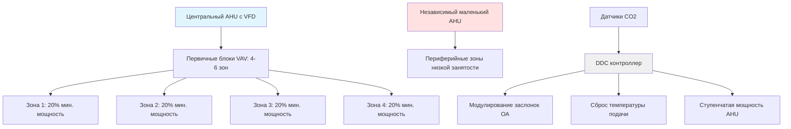
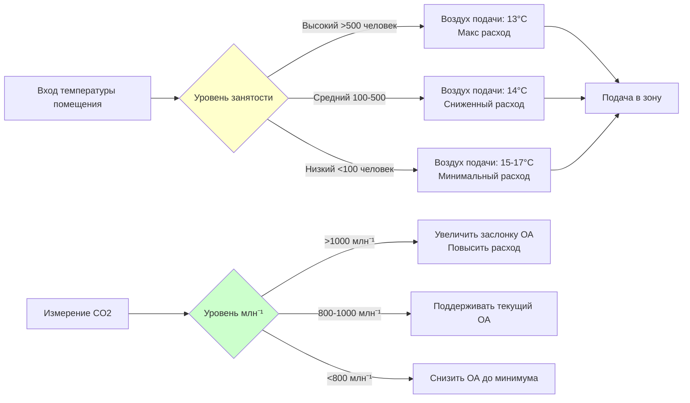

## Инженерная задача: вариативность нагрузки 100:1

Банкетные залы и выставочные помещения представляют одну из самых сложных задач в проектировании HVAC: поддержание комфорта при колебаниях занятости от 10 человек во время подготовки до 1000 человек во время пиковых мероприятий. Это 100-кратное изменение создает экстремальные колебания явной и скрытой холодильной нагрузки, требований к вентиляции и давлению в зоне.

Фундаментальная трудность заключается в нелинейной зависимости между занятостью и нагрузкой. Хотя явная тепловыделение от людей масштабируется линейно примерно 73 кДж/ч на человека, скрытые нагрузки от дыхания и испарения увеличиваются непропорционально при высокой плотности людей. Проектирование системы должно предотвратить переохлаждение при низкой занятости и при этом обеспечить мощность для пиковых нагрузок.

## Динамика вентиляционной нагрузки

Требование наружного воздуха доминирует при определении размера системы для помещений с переменной занятостью. ASHRAE Standard 62.1 предписывает вентиляцию как:

$$V_{oz} = R_p \times P_z + R_a \times A_z$$

Где:
- $V_{oz}$ = требуемый наружный воздух зоны (м³/ч)
- $R_p$ = норма наружного воздуха на человека (0.85-1.28 м³/ч на человека для помещений общественного назначения)
- $P_z$ = численность населения зоны
- $R_a$ = норма наружного воздуха на площадь (0.065 м³/(ч·м²))
- $A_z$ = площадь пола зоны (м²)

Для банкетного зала площадью 930 м² с максимальной вместимостью 1000 человек:

**Максимальная занятость:** $V_{oz} = 1.28 \times 1000 + 0.065 \times 930 = 1341$ м³/ч

**Минимальная занятость (10 человек):** $V_{oz} = 1.28 \times 10 + 0.065 \times 930 = 73$ м³/ч

Это соотношение 18:1 в требованиях вентиляции обосновывает необходимость использования управления вентиляцией по требованию на основе CO2 вместо фиксированной подачи наружного воздуха.

## Стратегия управления вентиляцией на основе CO2

Управляемая вентиляция (DCV) модулирует поступление наружного воздуха на основе измеренной концентрации CO2, которая служит показателем занятости. Стратегия управления использует уравнение массового баланса:

$$\frac{dC}{dt} = \frac{G - Q(C - C_o)}{V}$$

Где:
- $C$ = концентрация CO2 в помещении (млн⁻¹)
- $G$ = скорость выделения CO2 от людей (0.0085 м³/ч на человека)
- $Q$ = скорость вентиляции (м³/ч)
- $C_o$ = концентрация CO2 на улице (~400 млн⁻¹)
- $V$ = объем помещения (м³)

**Требования системы DCV:**

| Компонент | Спецификация | Назначение |
|-----------|--------------|-----------|
| Датчики CO2 | Точность ±50 млн⁻¹, 3-5 датчиков | Несколько зон предотвращают ошибки стратификации |
| Время отклика | <2 минут датчик + задержка управления | Соответствие скорости изменения занятости |
| Уставка | 1000 млн⁻¹ проектная, 1200 млн⁻¹ сигнал | Баланс качества воздуха и расходов энергии |
| Минимум ОА | 25-30% от проектной вентиляции | Предотвращение чрезмерного снижения |

Алгоритм управления регулирует заслонки наружного воздуха для поддержания уставки, при этом требуемый расход наружного воздуха рассчитывается как:

$$Q_{required} = \frac{N \times G \times 10^6}{C_{setpoint} - C_o}$$

Где $N$ = расчетная численность населения на основе скорости роста CO2.

## Размерование системы VAV для экстремального снижения мощности

Традиционные системы VAV испытывают трудности с соотношениями 10:1-20:1, требуемыми для приложений с банкетными залами. Минимальные настройки расхода воздуха терминальных блоков, обычно 30% для блоков только с охлаждением, приводили бы к чрезмерной подаче воздуха при низкой занятости.

**Оптимизированная архитектура VAV:**

**Стратегия проектирования:**

1. **Несколько обработчиков воздуха:** Развертывание базовой установки (30% мощности) для низкой занятости и больших установок для пиковых событий
2. **Серийные вентиляторные коробки:** Снижение минимальных расходов (15-20%) при поддержании циркуляции воздуха
3. **Управление независимое от давления:** Обеспечение точной подачи воздуха во всем диапазоне работы
4. **Деление на зоны:** Разделение больших банкетных залов на 4-6 зон управления вместо одной зоны

## Оптимизация эффективности при частичной нагрузке

Эффективность системы деградирует при частичной нагрузке из-за кривых производительности компонентов, фиксированных потерь и компромиссов управления. Связь между поставляемым охлаждением и потребляемой энергией следует:

$$EER_{part} = EER_{rated} \times PLF \times \frac{1}{1 + CD \times (1-PLR)}$$

Где:
- $PLF$ = коэффициент частичной нагрузки из данных производителя
- $PLR$ = отношение частичной нагрузки (фактическая нагрузка / номинальная нагрузка)
- $CD$ = коэффициент деградации (0.1-0.25 для современного оборудования)

**Меры улучшения эффективности:**

| Стратегия | Механизм | Типовая экономия |
|-----------|----------|-----------------|
| VFD на вентиляторах подачи | Кубическая зависимость: мощность ∝ скорость³ | 40-60% энергии вентилятора при 50% расходе |
| Сброс температуры конденсатора | Снижение перепада при уменьшенной нагрузке | 15-25% энергии холодильника |
| Несколько меньших холодильников | Избегание одного большого при <30% | 20-30% при низких нагрузках |
| Интеграция экономайзера | Бесплатное охлаждение при $T_{OA} < T_{RA} - 2.8°C$ | 30-100% в переходные сезоны |
| Сброс температуры подачи | Повышение с 13°C до 15-17°C при низкой нагрузке | 10-15% энергии охлаждения |

Связь энергии вентилятора особенно мощна:

$$P_{fan} = \frac{Q \times \Delta P}{\eta_{fan} \times \eta_{motor}} \propto Q^3$$

Снижение расхода воздуха до 50% от проектного (283 м³/ч против 566 м³/ч на эквивалент человека) сокращает мощность вентилятора до 12.5% от полной нагрузки.

## Предотвращение переохлаждения при низкой занятости

Переохлаждение во время подготовки или небольших мероприятий создает жалобы на комфорт и тратит энергию. Это явление происходит, когда:

1. **Минимальный расход превышает требуемое охлаждение:** Блоки VAV на минимуме подают больше холодопроизводительности, чем требуется помещению
2. **Температура подачи слишком низкая:** Температура подачи, рассчитанная для пиковых скрытых нагрузок, переохлаждает при низких явных нагрузках
3. **Ошибки расположения датчика:** Датчики рядом с дверями или в мертвых зонах неправильно представляют условия в помещении

**Решения управления:**

**Последовательность внедрения:**

1. **Обнаружение занятости:** Развертывание датчиков CO2 + система расписания для определения режима работы
2. **Сброс температуры подачи:** Повышение температуры подачи с 13°C до 15-17°C при CO2 < 800 млн⁻¹
3. **Сниженные минимальные расходы:** Снижение минимумов VAV до 15-20% или использование вентиляторных коробок с нулевой способностью первичного воздуха
4. **Усреднение температуры в зоне:** Использование нескольких датчиков (3-5 на большой банкетный зал) для предотвращения ошибок управления по одной точке
5. **Расписание по времени суток:** Предварительное кондиционирование помещений за 2 часа до мероприятий, отключение во время подготовки

Влияние на энергию значительно. Банкетный зал площадью 930 м², работающий при низкой занятости 60% годовых часов, может снизить энергопотребление на 40-50% с правильным управлением по сравнению с фиксированным объемом и фиксированной температурой.

## Требования быстрого отклика управления

Помещения для мероприятий быстро переходят между состояниями занятости. Банкетный зал может заполниться от 50 до 800 человек в течение 30 минут по мере прибытия гостей на ужин. Тепловая инерция воздуха минимальна:

$$\tau = \frac{\rho \times V \times c_p}{Q \times \rho \times c_p} = \frac{V}{Q}$$

Для банкетного зала 930 м² высотой 6 м с расходом 680 м³/ч: $\tau = \frac{5580}{680} = 8.2$ минут.

Эта 8-минутная постоянная времени означает, что условия в помещении быстро реагируют на изменения занятости, но задержка отклика системы управления создает проблемы:

**Требуемые характеристики отклика:**

- **Скорость обновления датчика:** интервалы 1 минуты для CO2, 30 секунд для температуры
- **Приводы заслонок/клапанов:** максимальное время хода 60-90 секунд
- **Настройка PID контроллера:** агрессивная с минимальным интегральным действием для предотвращения перерегулирования
- **Упреждающее управление:** интеграция с системой управления зданием для предварительного кондиционирования на основе расписания мероприятий

## Компоненты

- Малый банкетный зал 100-300 человек
- Средний банкетный зал 300-700 человек
- Большой банкетный зал 700-1500 человек
- Гранд банкетный зал свыше 1500 человек
- Проектирование делимого помещения
- Интеграция разделительной стены
