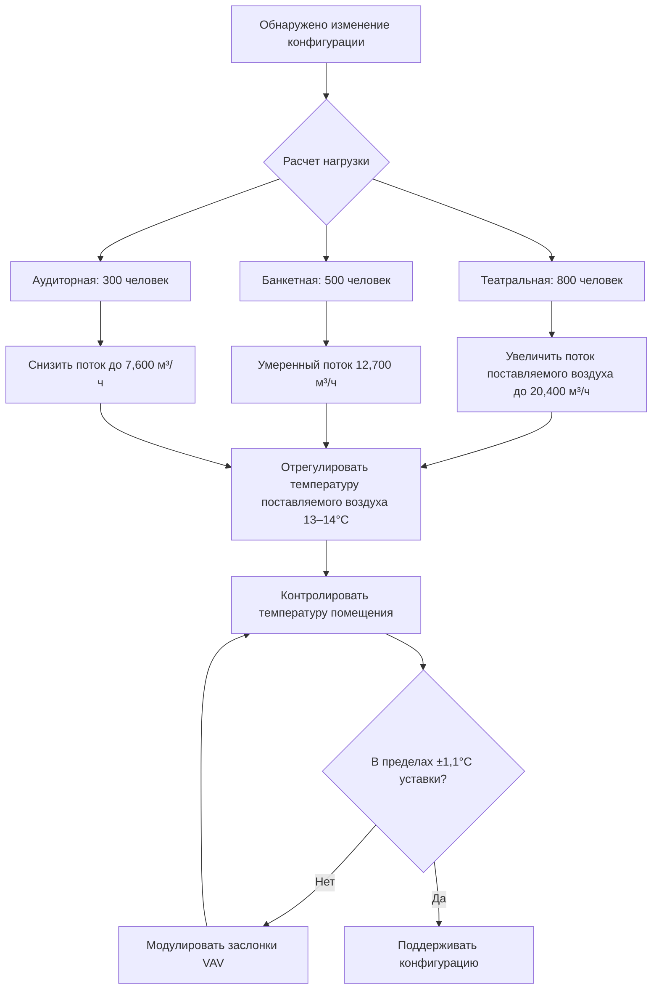

Гибкие помещения с переменной планировкой представляют уникальные проблемы для HVAC из-за быстро меняющейся плотности занятости, тепловых нагрузок и требований к распределению воздуха при различных конфигурациях. Банкетный зал, сконфигурированный для театральной планировки, может вместить 800 человек из расчета 0,56 м²/чел., в то время как в банкетной конфигурации тот же зал вмещает 400 человек из расчета 1,11 м²/чел.—это изменение на 100% в чувствительной и скрытой нагрузках, требующее немедленного отклика системы.

## Вариативность нагрузок при различных планировках мест

Фундаментальная проблема вытекает из связи между плотностью занятости и генерированием тепловой нагрузки. Каждый занимающий место генерирует примерно 73 кДж/ч чувствительного тепла и 58 кДж/ч скрытого тепла при сидячей деятельности, с уравнениями нагрузок:

**Чувствительная нагрузка:**
$$Q_s = N \cdot q_s \cdot CLF$$

**Скрытая нагрузка:**
$$Q_l = N \cdot q_l$$

Где $N$ — количество занимающих места, $q_s$ — чувствительное тепло на одного человека (73 кДж/ч), $q_l$ — скрытое тепло на одного человека (58 кДж/ч), и $CLF$ — коэффициент охлаждающей нагрузки (типично 0,85–0,95 для банкетных залов).

### Анализ нагрузок для конкретных конфигураций

| Конфигурация | Плотность (м²/чел.) | Типовая вместимость | Чувствительная нагрузка (кДж/ч) | Скрытая нагрузка (кДж/ч) | Вентиляция (м³/ч) |
|---------------|---------------------|------------------|------------------------|---------------------|-------------------|
| Театральная | 0,56–0,65 | 800–900 | 224,400 | 179,400 | 20,400–22,900 |
| Аудиторная | 1,39–1,86 | 300–400 | 89,700 | 71,800 | 7,600–10,200 |
| Банкетные столы | 0,93–1,11 | 500–600 | 134,600 | 107,700 | 12,700–15,300 |
| Приемная (стоя) | 0,74–0,93 | 600–750 | 161,500 | 129,200 | 15,300–19,100 |
| Танцпол | 1,11–1,39 | 400–500 | 112,100 | 89,700 | 10,200–12,700 |

*На основе банкетного зала 557 м² в соответствии со стандартом ASHRAE 62.1*

## Стратегии распределения воздуха

Эффективное распределение воздуха должно учитывать три критических параметра: расстояние выброса, скорость в концевой точке и характер диффузии. Связь между скоростью поставляемого воздуха и расстоянием следует:

$$V_x = V_0 \cdot K \cdot \sqrt{\frac{A_0}{x}}$$

Где $V_x$ — скорость на расстоянии $x$, $V_0$ — начальная скорость выброса, $K$ — коэффициент диффузора (0,8–1,2), и $A_0$ — эффективная площадь выброса.

### Театральная конфигурация

Театральная планировка мест создает линейные зоны с высокой плотностью. Потолочные диффузоры, расположенные над проходами, обеспечивают вертикальное распределение воздуха без риска сквозняков. Разница температур поставляемого воздуха 8–11 °C поддерживает комфорт при соответствии высоким требованиям охлаждения.

**Параметры проектирования:**
- Воздухообмены: 8–12 ACH
- Скорость поставляемого воздуха в зоне занятости: <0,25 м/с
- Расстояние выброса: 4,6–7,6 м от потолочных диффузоров
- Расположение возвратного воздуха: низкие стеновые или напольные решетки для захвата теплового шлейфа

### Банкетная конфигурация

Круглые столы создают отдельные зоны занятости со значительными мертвыми зонами между столами. Эта геометрия требует высоких коэффициентов индукции для обеспечения полного перемешивания воздуха. Коэффициент увлечения для радиальных диффузоров:

$$E = \frac{Q_{total}}{Q_{primary}} = 1 + \frac{K \cdot A_r \cdot x}{A_0}$$

Где $A_r$ — площадь поперечного сечения помещения и $K$ — коэффициент увлечения (0,1–0,15).

**Параметры проектирования:**
- Воздухообмены: 6–8 ACH
- Расстояние между диффузорами: 3,7–4,6 м по центрам
- Разница температур поставляемого воздуха: 10–12 °C
- Акцент на радиальные характеры выброса для охвата столов

### Аудиторная конфигурация

Аудиторные планировки с рядами, обращенными вперед, требуют направленного потока воздуха, согласованного с направлением взгляда. Боковые стеновые диффузоры с горизонтальным выбросом предотвращают перекрестные сквозняки при сохранении качества воздуха в зонах занятости.

**Параметры проектирования:**
- Воздухообмены: 5–7 ACH
- Горизонтальный выброс: 6,1–9,1 м от боковых стен
- Скорость поставляемого воздуха: <0,38 м/с в зоне занятости
- Возвратный воздух: потолочный монтаж для избежания шумовых помех

## Динамический отклик системы

Критическая метрика производительности для гибких помещений — время термического отклика, период, необходимый для достижения уставки после изменения конфигурации. Время отклика следует динамике первого порядка:

$$\tau = \frac{m \cdot c_p}{\dot{m}_{supply} \cdot c_p} = \frac{V \cdot \rho}{Q_{м³/ч} \cdot \rho}$$

Где $\tau$ — постоянная времени (минуты), $V$ — объем помещения, и $Q_{м³/ч}$ — расход поставляемого воздуха.

### Требования к системе управления

Системы переменного объема воздуха (VAV) с управлением вентиляцией по спросу (DCV) обеспечивают оптимальный отклик. CO₂ датчики, расположенные на высоте 1,2–1,5 м, запускают регулировки вентиляции в соответствии с ASHRAE 62.1:

$$V_{OA} = R_p \cdot P_z + R_a \cdot A_z$$

Где $V_{OA}$ — требование наружного воздуха, $R_p$ — 2,36 м³/(ч·чел.), $P_z$ — численность в зоне, $R_a$ — 0,36 м³/(ч·м²), и $A_z$ — площадь зоны.

**Последовательность управления:**
1. Превышение порога CO₂ (>1000 ppm) запускает увеличение потока воздуха
2. Заслонки VAV модулируют для поддержания минимума 0,36 м³/(ч·м²) в качестве базовой нормы
3. Температура поставляемого воздуха перестраивается на основе спроса в зоне (диапазон 13–18 °C)
4. Экономайзер включается при благоприятных условиях снаружи
5. Вытяжные вентиляторы ступенчато включаются для поддержания небольшого отрицательного давления

## Стратегия быстрой смены и эксплуатации

Протоколы предварительного кондиционирования снижают тепловую инерцию между мероприятиями. Циклы продувки при максимальном потоке воздуха (15+ ACH) в течение 30–45 минут до занятости устанавливают базовые условия. Этот подход снижает эффективную постоянную времени на 40–60%.

**Последовательность до события:**
- T-60 минут: режим максимального охлаждения, поставляемый воздух 14 °C
- T-30 минут: переход на конфигурационный поток воздуха
- T-15 минут: точная настройка температур в зонах ±0,6 °C
- T-0 минут: стандартный режим эксплуатации с активным DCV

Тепловая масса мебели и отделки вводит дополнительную задержку отклика. Ковровое покрытие, столы и стулья представляют примерно 79–84 кДж/(м²·°C) тепловой емкости, требуя 25–35% дополнительной охлаждающей мощности в периоды охлаждения помещения.

## Рекомендации по проектированию

**Размеры системы:**
- Расчетная мощность на основе театральной конфигурации (максимальная занятость)
- Размеры вентиляторов поставки для 125–150% расчетного расхода воздуха
- Предусмотреть коэффициент снижения мощности минимум 4:1 на боксах VAV
- Установить CO₂ датчики в нескольких местах (1 на 232 м²)

**Проектирование распределения:**
- Использовать высокоиндукционные диффузоры с регулируемыми характерами
- Расположить выпускные отверстия для обслуживания нескольких конфигураций
- Поддерживать максимальное расстояние между диффузорами 6–7 м
- Проектировать для ADPI (индекс производительности распределения воздуха) >80

**Интеграция управления:**
- Связать BAS с системой планирования помещений для предварительного кондиционирования
- Внедрить стратегии перестройки на основе занятости
- Включить ручное переопределение с автоматическим возвратом за 2 часа
- Контролировать время отклика и автоматическую подстройку циклов PID

Эффективное проектирование HVAC для гибких планировок мест уравновешивает возможность немедленного отклика с энергоэффективностью, обеспечивая комфорт занимающих во всем диапазоне конфигураций помещения при минимизации эксплуатационных затрат.
