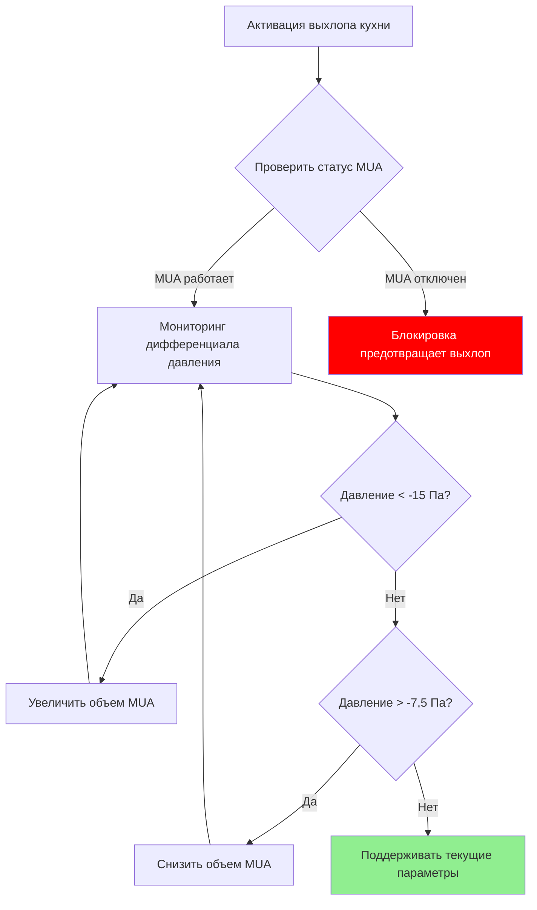

Коммерческие кухни, расположенные рядом с банкетными залами, представляют критические проблемы HVAC, требующие точного управления давлением, координации подпиточного воздуха и предотвращения загрязнения. Физическая близость операций высокотемпературной готовки к климатизированным столовым требует инженерных решений, которые решают задачи баланса массового потока, поддержания дифференциального давления и управления тепловой нагрузкой.

## Основы соотношений давления

Основой эффективного разделения кухни и банкетного зала является установление правильного каскада давления. Кухонные помещения должны работать при отрицательном давлении относительно столовых для предотвращения миграции запахов, в то время как служебные коридоры функционируют как промежуточные буферные зоны.

**Целевые дифференциалы давления:**

| Зона | Давление относительно банкетного зала | Типичный диапазон |
|------|------------------------------|---------------|
| Столовая банкетного зала | Отсчет (0 Па) | — |
| Служебный коридор | -2,5–-5 Па | Отрицательное |
| Область подготовки кухни | -7,5–-10 Па | Более отрицательное |
| Линия готовки | -10–-15 Па | Максимально отрицательное |

Дифференциал давления $\Delta P$ через преграду определяется потоком воздуха через отверстия:

$$\Delta P = \rho \left(\frac{Q}{C_d A}\right)^2 \frac{1}{2}$$

Где:
- $\rho$ = плотность воздуха (кг/м³)
- $Q$ = объемный расход через отверстие (м³/с)
- $C_d$ = коэффициент расхода (обычно 0,6–0,65 для дверных проемов)
- $A$ = эффективная площадь отверстия (м²)

## Интеграция подпиточного воздуха

Кухонные выхлопные системы, удаляющие 8 500–25 500 CFM (м³/ч), требуют эквивалентного подпиточного воздуха для предотвращения подпора здания. Стандарт ASHRAE 90.1 требует, чтобы системы подпиточного воздуха соответствовали определенным требованиям к эффективности, избегая при этом некомфортных воздушных потоков в столовых.

**Методы подачи подпиточного воздуха:**

1. **Прямая подача в вытяжной колпак**: обеспечивает 50–80% объема выхлопа непосредственно по периметру колпака
2. **Потолочное вытеснение**: обеспечивает оставшиеся 20–50% через низкоскоростные потолочные диффузоры
3. **Кондиционирование в преддверии**: предварительно кондиционирует воздух передачи из столовых

Температура подпиточного воздуха $T_{MA}$ должна быть рассчитана во избежание теплового дискомфорта:

$$T_{MA} = T_{kitchen} - \frac{Q_{hood}}{Q_{MA} \cdot \rho \cdot c_p}$$

Во время зимней эксплуатации температуры подпиточного воздуха ниже 10°C создают неприемлемые условия работы. Стандарт ASHRAE 154 рекомендует минимальные температуры подачи 15–18°C в занятых кухонных зонах.

## Предотвращение миграции запахов

Молекулы запахов мигрируют через три механизма: массовый поток воздуха, диффузию и проникновение, вызванное давлением. Эффективный контроль требует решения всех путей.

**Стратегии контроля:**

| Метод | Эффективность | Стоимость внедрения | Влияние на энергию |
|--------|---------------|---------------------|---------------|
| Каскад давления | Высокая (95–98%) | Средняя | Средняя–Высокая |
| Воздушные завесы у служебных дверей | Средняя (70–85%) | Низкая–Средняя | Низкая–Средняя |
| Фильтрация активированным углем | Высокая (90–95%) | Высокая | Высокая |
| Подпрессовка преддверия | Высокая (85–95%) | Средняя | Средняя |

**Расчет размера воздушной завесы на служебной двери:**

Воздушные завесы у кухонных служебных дверей требуют достаточной скорости для предотвращения прорыва запаха. Минимальная скорость воздуха $V_{min}$ должна превышать скорость потока, вызванного давлением:

$$V_{min} = \sqrt{\frac{2\Delta P}{\rho}} \times 1,5$$

При дифференциале давления 10 Па минимальная скорость составляет приблизительно 6 м/с (1 180 FPM). Высота двери определяет требуемый CFM (м³/ч):

$$Q_{curtain} = V \times W \times h \times 60$$

Где $W$ — ширина завесы (ширина двери + 15 см) и $h$ — высота выпуска (обычно 15–20 см).

## Ограничения маршрутизации выхлопа с жиром

Воздуховоды с выхлопом, содержащим жир, требуют специфической маршрутизации для соответствия разделу 506 IMC и NFPA 96. Воздуховоды, проходящие через потолочные пространства банкетного зала, вводят проблемы безопасности от огня и доступа к техническому обслуживанию.

**Принципы маршрутизации воздуховода:**

- **Минимальный зазор**: 45 см от горючих материалов (NFPA 96)
- **Требование наклона**: 0,6 см на фут по направлению к колпаку для дренажа жира
- **Люки доступа**: через каждые 3,7 м и на изменениях направления
- **Сейсмическое крепление**: согласно ASCE 7 для потолочных стояков

Маршрутизация вертикального стояка является предпочтительной для минимизации горизонтальных проходов через занятые пространства. Когда горизонтальная маршрутизация неизбежна, устанавливайте в пределах выделенных огнеупорных каналов с независимой вентиляцией.

**Расчет скорости в воздуховоде с жиром:**

Поддерживайте 460–760 м/мин для предотвращения отложения жира. Для объема выхлопа $Q$ (CFM или м³/ч):

$$A_{duct} = \frac{Q}{V_{duct} \times 60}$$

Колпак 17 000 CFM (28 900 м³/ч), работающий при 610 м/мин, требует 0,46 м² площади воздуховода (приблизительно воздуховод диаметром 76 см).

## Координация вентиляции области подготовки

Предварительные функциональные пространства и служебные коридоры, соединяющие кухни с банкетными залами, требуют независимой вентиляции для предотвращения теплопередачи и поддержания барьеров запаха при переходах пищевого обслуживания.

**Требования области подготовки:**

- **Кратность воздухообмена**: минимум 15–20 ACH при активном обслуживании
- **Контроль температуры**: ±1,1°C от установки банкетного зала
- **Давление**: -2,5 Па относительно банкетного зала, +5 Па относительно кухни
- **Влажность**: соответствие условиям банкетного зала (45–55% ОВ)

Тележки на колесах, передающие горячую пищу, создают переходные тепловые нагрузки:

$$Q_{transient} = m \cdot c_p \cdot \Delta T \cdot N_{trips}$$

Где $m$ — масса пищи в расчете на поездку, и $N_{trips}$ — частота обслуживания. Типичное банкетное обслуживание, перемещающее 91 кг пищи при 74°C через коридор при 22°C каждые 5 минут, генерирует приблизительно 2,4 кВт чувствительной нагрузки.

## Интеграция системы управления

Современные интерфейсы кухня-банкетный зал требуют интегрированного управления DDC, управляющего подпиточным воздухом, потоком выхлопа и мониторингом давления с безопасными блокировками.

**Критические точки управления:**

1. **Блокировка выхлопа-MUA**: предотвращает работу выхлопа без подпиточного воздуха
2. **Мониторинг давления**: непрерывные датчики дифференциального давления на интерфейсах кухня-коридор и коридор-банкетный зал
3. **Управление переменной скоростью**: модулирует подпиточный воздух для поддержания установок давления
4. **Выхлоп по требованию**: оптические или тепловые датчики снижают выхлоп в периоды неиспользования готовки
5. **Интеграция безопасности огня**: система подавления вытяжки инициирует отключение вентилятора выхлопа и закрытие заслонки

Стандарт ASHRAE 90.1, раздел 6.5.7.2, требует, чтобы системы выхлопа кухни, превышающие 8 500 CFM (14 450 м³/ч), включали автоматические элементы управления вентиляцией по требованию, снижающие расход воздуха как минимум на 50% во время периодов неиспользования готовки.

---

**Связанные темы:**
- Одновременное управление нагрузкой
- Интеграция служебного коридора
- Проектирование системы выхлопа с жиром
