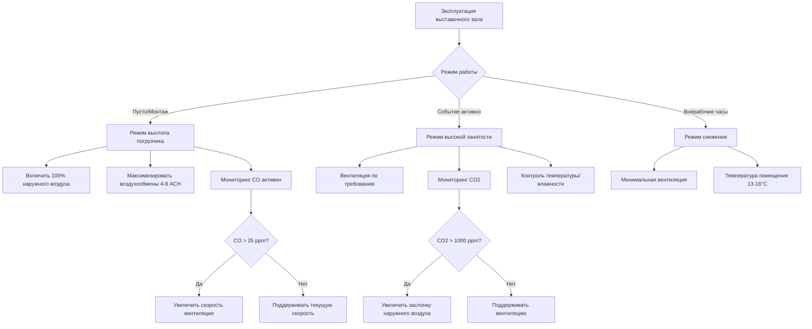

## Обзор проблем климат-контроля выставочных залов

Выставочные залы представляют исключительные сложности в проектировании HVAC из-за их огромных кондиционируемых объемов (обычно 5,660–56,600 м³), чрезвычайно переменчивых схем занятости и уникальных эксплуатационных требований. Эти помещения должны вмещать экстремальные колебания нагрузок от пустого зала (монтаж/демонтаж) до пиковых событий с тысячами посетителей, выставочного освещения и тепловыделения оборудования.

Фундаментальная проблема проектирования вытекает из соотношения $Q = \dot{m} c_p \Delta T$, применяемого к значительно различающимся рабочим состояниям. В периоды установки холодопроизводительность может быть всего 3.2–5.4 Вт/м² (только тепловые потери через ограждающие конструкции), тогда как пиковые нагрузки событий могут достигать 86–129 Вт/м² при объединении ощутимого тепла от людей (0.75 кВт на человека), выставочного освещения (21–43 Вт/м²), аудиовизуального оборудования и стендовых дисплеев.

## Физические принципы и характеристики нагрузок

### Управление тепловой стратификацией

Выставочные залы с высотой потолков 7.6–18.3 м испытывают значительную тепловую стратификацию из-за естественной конвекции. Скорость потока, вызванная плавучестью, можно оценить:

$$v = \sqrt{\frac{2g\beta\Delta T H}{C_d}}$$

где:
- $g$ = ускорение свободного падения (9.81 м/с²)
- $\beta$ = коэффициент теплового расширения (≈0.0055 K⁻¹ для воздуха)
- $\Delta T$ = разность температур между потолком и полом
- $H$ = высота потолка
- $C_d$ = коэффициент сопротивления (обычно 0.6–0.8)

Без надлежащего распределения воздуха градиенты температуры от потолка к полу в 5.6–8.3°C являются обычными, что приводит к потерям энергии при кондиционировании неиспользуемых верхних объемов, в то время как посетители испытывают дискомфорт на уровне пола.

### Анализ нагрузок при переменной занятости

Нагрузки выставочного зала варьируются в зависимости от фазы работы:

| Фаза эксплуатации | Плотность посещаемости | Типичная холодопроизводительность | Требование вентиляции |
|-------------------|------------------------|-----------------------------------|------------------------|
| Пусто/Техническое обслуживание | 0 человек | 3.2–5.4 Вт/м² | Минимум (только потери ограждения) |
| Монтаж/Демонтаж | 0.5–2 человека/93 м² | 16–32 Вт/м² | 7.1 л/(с·м²) + выхлоп |
| Легкая выставка | 5–10 человек/93 м² | 43–65 Вт/м² | 7.1 л/(с·м²) ASHRAE 62.1 |
| Пиковая торговая выставка | 15–30 человек/93 м² | 86–129 Вт/м² | 7.1 л/(с·м²) (минимум по коду) |

Коэффициент ощутимого теплоты (SHR) для выставочных залов обычно находится в диапазоне 0.75–0.85, отражая умеренные скрытые нагрузки от посетителей и минимальные процессы, выделяющие влагу.

## Управление выхлопными газами погрузчиков и оборудования

Во время операций монтажа и демонтажа пропановые и дизельные погрузчики вводят монооксид углерода (CO), оксиды азота (NOₓ) и твердые частицы в помещение. Типичный пропановый погрузчик грузоподъемностью 2,268 кг производит примерно 566–1,132 л/мин выхлопных газов, содержащих 1–3% CO по объему.

### Требования к разбавляющей вентиляции

Требуемая скорость разбавляющей вентиляции для поддержания CO ниже 8-часового предельно допустимого значения OSHA в 35 ppm:

$$Q_{req} = \frac{Q_{exhaust} \times C_{exhaust}}{C_{allowable} - C_{ambient}}$$

При одновременной работе нескольких погрузчиков общие скорости вентиляции 424–1,415 л/мин часто необходимы в периоды ввоза/вывоза. Это представляет отдельный режим вентиляции, который должен быть спроектирован в системные элементы управления.

## Стратегии распределения воздуха

### Подача сверху против подачи снизу пола

Выставочные залы используют два основных подхода к распределению воздуха:

**Подача воздуха сверху с диффузорами дальнего выброса:**
- Дальность выброса: $T = V_x / V_t$ где $V_t$ — конечная скорость (обычно 25.4 см/с)
- Требует дальности выброса 18.3–36.6 м для достижения уровня пола
- Скорости подачи: 7.6–12.7 м/с на диффузоре
- Эффективна для помещений без поднятых полов

**Распределение воздуха под поднятым полом (UFAD):**
- Температура подаваемого воздуха: 15.6–18.3°C (в сравнении с 13°C сверху)
- Принципы вентиляции вытеснением снижают энергию смешивания
- Использует тепловую плавучесть для естественного управления стратификацией
- Требует систем поднятых полов (обычно 30–46 см)

Коэффициент эффективности $\varepsilon$ для систем UFAD находится в диапазоне 1.0–1.2 по сравнению с 0.8–0.9 для систем верхнего смешивания, обеспечивая 10–25% экономию энергии за счет снижения мощности вентилятора распределения воздуха.

## Стратегии управления для переменных нагрузок

Выставочные залы требуют сложных последовательностей управления для решения экстремальной переменности нагрузок:

1. **Вентиляция по требованию:** Датчики CO₂ модулируют наружный воздух с минимума 10% до 100% при высокой занятости
2. **Зональный контроль температуры:** VAV-системы с 1 зоной на 232–465 м²
3. **Выбор режима эксплуатации:** Ручное или программное переключение между режимами монтажа, события и снижения
4. **Интеграция экономайзера:** Бесплатное охлаждение при $T_{OA} < T_{Return} - 1.1°C$

Система управления должна учитывать быстрые изменения нагрузок. Типичный выставочный зал площадью 9,290 м², переходящий из пустого в занятое состояние, может испытывать увеличение нагрузки на 70.8–141.5 кВт в течение 2–3 часов, требуя предвидящих алгоритмов управления, которые предварительно охлаждают помещение на основе расписания событий.

## Рекуперация энергии и соображения эффективности

Учитывая значительные требования к вентиляции, системы рекуперации энергии обеспечивают существенную экономию в эксплуатации. Тепловые колеса полной энтальпии достигают 70–80% эффективности, восстанавливая как ощутимую, так и скрытую энергию. Для системы, обрабатывающей 1,416 л/мин с разностью температур 22.2°C и разностью коэффициента влажности 0.020:

$$Q_{recovered} = \dot{m}(h_{OA} - h_{EA}) \times \varepsilon$$

Годовая экономия энергии на кондиционирование наружного воздуха составляет 30–40% в большинстве климатов с периодами окупаемости 3–5 лет для систем с колесом рекуперации.

## Рекомендации по проектированию согласно стандартам ASHRAE

ASHRAE 90.1 раздел 6.5.3 требует рекуперации энергии для систем, превышающих 70% наружного воздуха при расходах выше 1,416 л/мин. Выставочные залы регулярно превышают эти пороги. ASHRAE 62.1 определяет 3.54 л/(с·м²) для пространств собраний, хотя фактические значения проектирования зависят от расчетов плотности посетителей согласно процедуре определения скорости вентиляции.

Ключевые параметры проектирования для выставочных залов:
- Расчетная скорость воздухообмена: 3–6 ACH во время событий
- Доля наружного воздуха: 15–30% типично, 100% при работах по монтажу
- Температура подаваемого воздуха: 13–14.4°C для верхней подачи, 15.6–18.3°C для UFAD
- Условия помещения: 22.2–24.4°C, 40–55% ОВ согласно ASHRAE 55
- Акустическое проектирование: NC 40–45 во время событий, NC 35 при монтажных работах
