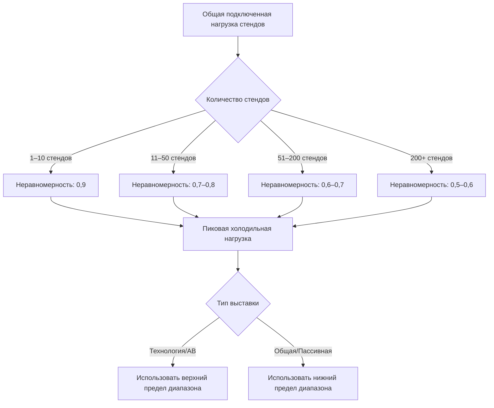

Тепловые нагрузки выставочных стендов представляют один из наиболее сложных сценариев оценки нагрузок в проектировании HVAC из-за высокой вариативности, временных монтажей и концентрированных источников тепла. Точный расчет нагрузок требует понимания преобразования электроэнергии в тепло, коэффициентов неравномерности и физики конвективного и радиационного теплопередачи от оборудования стенда.

## Основы теплопритока от оборудования стенда

Вся электроэнергия, потребляемая в выставочном стенде, в конечном итоге преобразуется в тепловую энергию в кондиционируемом помещении, в соответствии с первым законом термодинамики. Мгновенный тепловой прирост от электрооборудования определяется как:

$$Q_{equip} = P_{elec} \times 3.412 \times f_{rad} \times f_{use}$$

Где:
- $Q_{equip}$ = тепловой прирост (кДж/ч)
- $P_{elec}$ = потребляемая электрическая мощность (ватты)
- $3.412$ = коэффициент преобразования (кДж/ч на ватт)
- $f_{rad}$ = коэффициент радиации (0,1–0,4 типично)
- $f_{use}$ = коэффициент использования (0,3–1,0)

Коэффициент радиации определяет разделение между непосредственной конвективной холодильной нагрузкой и отложенной радиационной нагрузкой, поглощаемой поверхностями. Высокоинтенсивные дисплеи и галогенное освещение имеют более высокие коэффициенты радиации (0,3–0,4), в то время как компьютеры и системы светодиодного освещения в основном конвективные (0,1–0,2).

## Типовые плотности мощности стендов

Выставочные стенды сильно различаются по потреблению электроэнергии в зависимости от типа стенда и категории выставки:

| Тип стенда | Плотность мощности | Типовая нагрузка | Основные источники тепла |
|------------|---------------|--------------|---------------------|
| Стандартный 3×3 м | 54–161 Вт/м² | 500–1 500 Вт | Светодиодные дисплеи, ноутбуки, подсветка брошюр |
| Технология/АВ | 215–431 Вт/м² | 2 000–4 000 Вт | Несколько мониторов, серверы, демооборудование |
| Автомобильный дисплей | 323–538 Вт/м² | 3 000–5 000 Вт | Высокоинтенсивное освещение, системы автомобилей |
| Демонстрация продуктов питания | 538–1 615 Вт/м² | 5 000–15 000 Вт | Кухонное оборудование, холодильные установки, вытяжка |
| Крупные интерактивные | 269–646 Вт/м² | 10 000–25 000 Вт | Видеостены, системы виртуальной реальности, игровые станции |

Эти плотности предполагают полную работу электрической нагрузки. Фактические холодильные нагрузки требуют применения коэффициентов неравномерности и использования.

## Нагрузки от дисплеев и освещения

Современное выставочное освещение перешло от лампового и галогенного к технологии светодиодов, значительно снизив тепловые нагрузки:

**Лампы накаливания/галогенные (устаревшие):**
- Эффективность: 10–20 люмен/ватт
- Преобразование в тепло: 90–95% входной мощности
- Галоген 500 Вт → тепловой прирост 1 706 кДж/ч

**Системы светодиодов (текущие):**
- Эффективность: 80–120 люмен/ватт
- Преобразование в тепло: 65–75% входной мощности (потери драйвера)
- Светодиод 100 Вт → тепловой прирост 256 кДж/ч

Тепловой прирост от светодиодных светильников включает как тепло светодиодного перехода, так и потери в источнике питания:

$$Q_{LED} = P_{input} \times 3.412 \times (1 - \eta_{driver})$$

Где $\eta_{driver}$ обычно находится в диапазоне 0,85–0,92 для качественных светодиодных драйверов.

## Компьютеры и дисплейное оборудование

Компьютерное оборудование и мониторы представляют основную непрерывную нагрузку на технологических выставках:

| Тип оборудования | Типовая мощность | Тепловой прирост (кДж/ч) | Коэффициент неравномерности |
|----------------|---------------|-------------------|------------------|
| Ноутбук (активный) | 30–60 Вт | 102–205 | 0,7 |
| Рабочая станция | 100–200 Вт | 341–683 | 0,6 |
| Монитор 27" LCD | 35–50 Вт | 119–171 | 0,8 |
| Дисплей LED 55" | 100–150 Вт | 341–512 | 0,9 |
| Видеостена панель 85" | 250–400 Вт | 853–1 365 | 1,0 |
| Сервер/демо-стойка | 800–1 500 Вт | 2 730–5 118 | 0,8 |

Современные компьютеры используют динамическое управление энергопотреблением, снижая фактическое потребление мощности во время периодов низкой активности. Исследовательский проект ASHRAE RP-1482 предоставляет подробные данные измерений для неравномерности IT-оборудования.

## Нагрузки от кулинарных демонстраций

Демонстрации продуктов питания генерируют наиболее высокие концентрированные тепловые нагрузки в выставочной среде, сочетая явное и скрытое тепло от процессов приготовления:

$$Q_{cooking} = Q_{sensible} + Q_{latent} + Q_{radiation}$$

Типовые тепловые приросты кухонного оборудования:

| Оборудование | Мощность (Вт) | Явное тепло (кДж/ч) | Скрытое тепло (кДж/ч) | Коэффициент использования |
|-----------|-----------|-------------------|-----------------|--------------|
| Индукционная варочная панель (2 конфорки) | 3 000 | 10 263 | 2 376 | 0,5 |
| Электрическая жарочная поверхность | 3 600 | 12 315 | 3 168 | 0,6 |
| Конвекционная печь | 5 000 | 16 588 | 5 544 | 0,4 |
| Эспрессо-машина | 2 500 | 9 180 | 3 484 | 0,7 |

Кулинарные демонстрации требуют местной вытяжной вентиляции, обычно удаляя 60–80% явного тепла и 90–95% скрытого тепла до того, как оно попадет в кондиционируемое помещение. Чистая холодильная нагрузка становится:

$$Q_{net} = Q_{sensible}(1-\eta_{exhaust,s}) + Q_{latent}(1-\eta_{exhaust,l})$$

## Особенности отображения автомобилей

Автомобильные и механизированные дисплеи представляют уникальные тепловые соображения. Стационарные автомобили с работающими системами генерируют тепло от:

1. **Внутреннего освещения:** 200–500 Вт на автомобиль
2. **Мультимедийные дисплеи:** 300–800 Вт для интегрированных экранов
3. **Демонстрация климат-контроля:** 1 500–3 000 Вт при работе HVAC
4. **Нагреватели блока двигателя (холодные климатические выставки):** 1 000–1 500 Вт

Автомобильные дисплеи обычно работают на уровне 20–30% этих максимальных нагрузок, так как системы климат-контроля переключаются и двигатели остаются выключенными. Тепловая масса корпуса автомобиля создает запаздывание между электрическим входом и теплом в помещении, с постоянными времени 30–60 минут.

## Коэффициенты неравномерности для выставочных залов

Коэффициенты неравномерности учитывают статистическую реальность того, что не все стенды работают с максимальной электрической нагрузкой одновременно. Справочник ASHRAE по приложениям содержит руководство, но коэффициенты, специфичные для выставок:

Коэффициент неравномерности для крупного выставочного зала со смешанными типами стендов:

$$DF_{total} = \frac{\sum Q_{actual,peak}}{\sum Q_{connected}} = 0,5 \text{ до } 0,7$$

Эта взаимосвязь имеет место потому, что:
- Установка/демонтаж экспозиции снижает одновременную работу
- Перерывы на еду и расписание презентаций создают циклическое использование
- Режимы ожидания оборудования снижают непрерывное энергопотребление
- Не все электросхемы стендов несут проектные нагрузки

## Методология расчета нагрузок

Расчет общей холодильной нагрузки выставочного стенда осуществляется как:

**Пошаговый процесс:**

1. **Инвентаризация подключенных нагрузок:** Суммирование всей электрической мощности стендов из планов распределения питания
2. **Категоризация оборудования:** Группировка по освещению, вычислениям, аудиовизуальному, кулинарному и другому
3. **Применение коэффициентов категорий:** Использование коэффициентов преобразования и радиации, специфичных для оборудования
4. **Применение коэффициентов использования:** Учет циклов работы и рабочих режимов
5. **Применение неравномерности:** Использование коэффициентов неравномерности на основе количества и типа стендов
6. **Добавление запаса прочности:** Включение 10–15% на непредвиденные нагрузки и неопределенность измерений

Для выставки с 200 стендами со средней подключенной нагрузкой 2 000 Вт/стенд:

$$Q_{design} = 200 \times 2000\text{ Вт} \times 3.412 \times 0,65_{неравномерность} \times 1,15_{запас}$$
$$Q_{design} = 1 605 000 \text{ кДж/ч (446 кВт)}$$

## Координация с временным электроснабжением

Расчеты теплофизических нагрузок должны согласовываться с распределением временного электроснабжения. Электрический спрос не равен холодильной нагрузке из-за:

- Различий коэффициента мощности (электрический кВА в сравнении с тепловым кВт)
- Потерь в трансформаторах и распределении (обычно 2–4%)
- Коэффициентов неравномерности, применяемых по-разному инженерами-электриками

Проверьте, что предположения HVAC о неравномерности согласуются с расчетами электрических нагрузок, чтобы предотвратить недоразмеривание. Электрический спрос неравномерности обычно работает 0,6–0,7, что тесно соответствует тепловой неравномерности для резистивных нагрузок.

## Вариация нагрузок по типам выставок

Различные категории выставок демонстрируют отличные профили нагрузок:

**Технологические выставки:** Высокие базовые нагрузки с умеренной неравномерностью (0,65–0,75) из-за непрерывной работы демонстрационного оборудования.

**Потребительские товары:** Низкие базовые нагрузки с высокой неравномерностью (0,50–0,60), так как активность стенда коррелирует с характером трафика посетителей.

**Продукты питания и напитки:** Очень высокие пиковые нагрузки с умеренной неравномерностью (0,60–0,70), так как кулинарные демонстрации чередуются в течение дня.

**Автомобили:** Умеренные нагрузки с высокой неравномерностью (0,50–0,65), так как системы автомобилей работают прерывисто для демонстраций.

Понимание этих закономерностей позволяет проектировщикам надлежащим образом сконструировать системы для ожидаемого выставочного программирования, а не использовать консервативные наихудшие предположения, которые приводят к переразмеренным неэффективным системам.

---

**Справочные стандарты:**
- ASHRAE Handbook - HVAC Applications, Chapter 5: Places of Assembly
- ASHRAE RP-1482: Energy Consumption Characteristics of Commercial Building IT Equipment
- NFPA 70: National Electrical Code (temporary power requirements)
