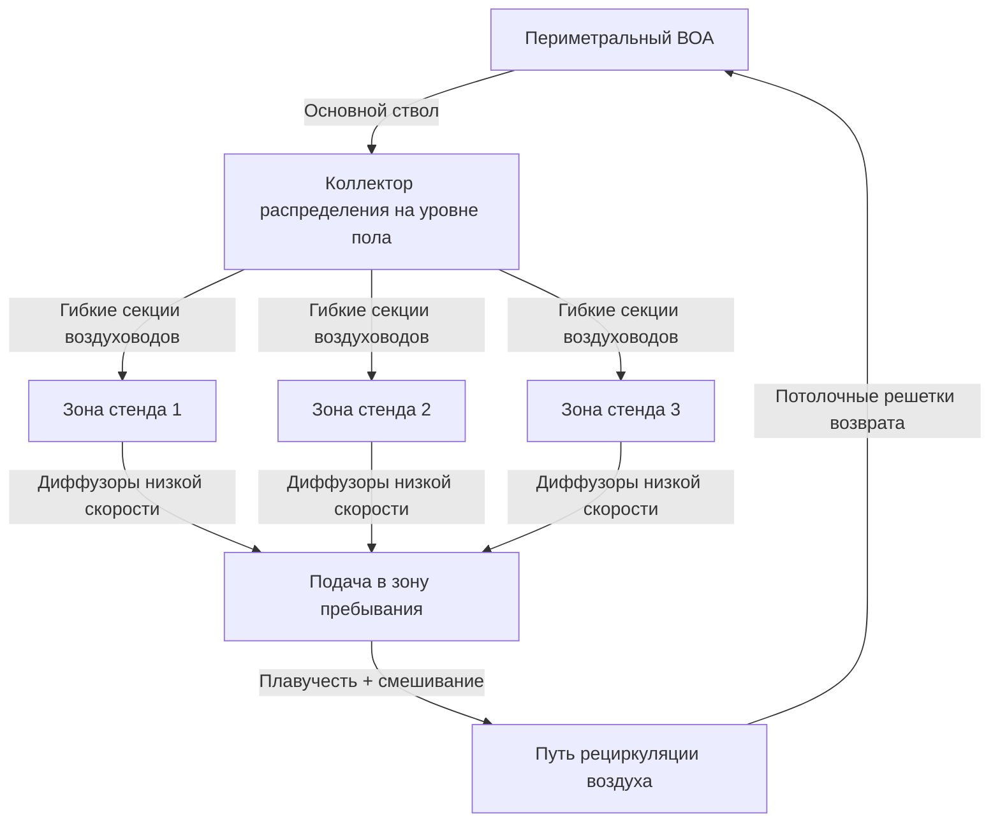
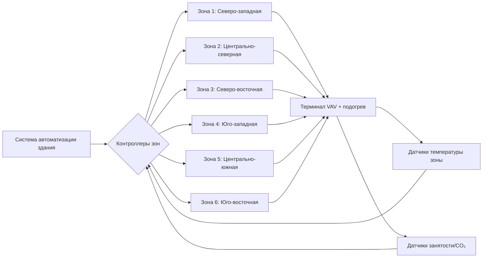

## Инженерный вызов

Выставочные залы представляют уникальную задачу теплового проектирования: одно и то же физическое пространство должно вмещать совершенно разные макеты, плотность людей и тепловые нагрузки в зависимости от конфигурации мероприятия. Зал площадью 9290 м² может разместить разреженную торговую выставку с 50 стендами на одной неделе и плотную потребительскую выставку с 500 стендами на следующей. Система HVAC должна обеспечивать постоянный тепловой комфорт при всех конфигурациях без постоянных воздуховодов, которые ограничивают размещение на полу.

## Вариативность тепловой нагрузки

Фундаментальный вызов проистекает из широкого диапазона сценариев генерирования тепла:

$$Q_{total} = Q_{occupants} + Q_{lighting} + Q_{equipment} + Q_{envelope}$$

Где каждый компонент варьируется на порядки величины:

| Компонент нагрузки | Разреженная конфигурация | Плотная конфигурация | Соотношение |
|---|---|---|---|
| Плотность людей | 9,3 м²/чел. | 1,9 м²/чел. | 5:1 |
| Явное тепло | 73 Вт/чел. | 73 Вт/чел. | — |
| Нагрузка оборудования | 11-32 Вт/м² | 86-161 Вт/м² | 5:1 |
| Нагрузка освещения | 8,6-12,9 Вт/м² | 21,5-32 Вт/м² | 2,5:1 |

Общая охлаждающая нагрузка может варьироваться от 111 кДж/(ч·м²) до 303 кДж/(ч·м²), требуя систем HVAC, рассчитанных на пиковые условия при сохранении приемлемой производительности при частичных нагрузках.

## Стратегии распределения воздуха в высоких помещениях

Традиционные потолочные диффузоры в выставочных залах сталкиваются с двумя конкурирующими требованиями:

1. **Дальность броса**: Воздух должен проходить горизонтально на 12–18 м перед попаданием в зону пребывания
2. **Температурный перепад**: Депрессия температуры подаваемого воздуха ($\Delta T$) влияет на дальность броса и комфорт

Связь между броском и температурным перепадом следует:

$$L = K \cdot \sqrt{\frac{Q}{v_{terminal}}}$$

Где:
- $L$ = дальность броса (м)
- $K$ = константа диффузора (безразмерная)
- $Q$ = расход воздуха (м³/ч)
- $v_{terminal}$ = конечная скорость в зоне пребывания (м/с)

Для приложений с высокими потолками (7,6–12 м высоты потолка) указывайте высокоиндукционные линейные диффузоры с коэффициентами броса 3,5–4,5. Температура подаваемого воздуха должна быть на 4,4–6,7 °C ниже температуры помещения для сохранения адекватного броса без сквозняков на уровне пола.

### Управление стратификацией

Вертикальные температурные градиенты в пространствах с высокими потолками следуют:

$$\frac{dT}{dz} = \frac{Q_{internal}}{A \cdot \rho \cdot c_p \cdot ACH \cdot h}$$

Где:
- $dT/dz$ = температурный градиент (°C/м)
- $A$ = площадь пола (м²)
- $h$ = высота потолка (м)
- $ACH$ = воздухообмены в час

Без дестратификации температурные разницы между полом и потолком в 8–14 °C являются обычными. Установите потолочные вентиляторы, работающие на 0,25–0,50 м/с, или непрерывные воздушные завесы вдоль периметра стен, чтобы ограничить градиенты до 2,8–4,4 °C.

## Системы подачи воздуха на уровне пола

Распределение воздуха на уровне пола устраняет ограничения дальности броса и обеспечивает прямое кондиционирование в зонах пребывания. Существуют две основные конфигурации:

### Подземное распределение воздуха (UFAD)

Поднятые напольные покрытия (0,30–0,61 м) служат в качестве напорного плена. Подаваемый воздух поступает при 17–20 °C и выходит через напольные диффузоры в местах расположения стендов. Ключевые параметры проектирования:

- Давление в плене: 12–37 Па
- Расход подаваемого воздуха: 4,1–6,1 м³/(ч·м²)
- Расстояние между диффузорами: 1,8–3,0 м по осям
- Скорость выхода: 0,25–0,76 м/с

Преимущества:
- Переконфигурируемое размещение диффузоров
- Снижение энергии вентилятора (более низкое статическое давление)
- Естественная стратификация способствует охлаждению
- Прямая вентиляция в дыхательную зону

Вызовы:
- Более высокая стоимость установки (премия 161–269 руб./м²)
- Очистка плена и доступ для обслуживания
- Конфликты управления кабелями с путями потока воздуха

### Системы воздуховодов, установленные на полу

Модульные секции воздуховодов, установленные на готовом полу, подключаются к периметральным воздухообрабатывающим агрегатам. Часто используются в приложениях модернизации или временных установках.

## Модульное распределение коммунальных услуг

Выставочные стенды требуют гибких подключений для:

- Электроэнергии (120 В, 208 В, 480 В)
- Сжатого воздуха (620–860 кПа)
- Данных/телекоммуникаций
- Охлажденной воды (для больших охлаждающих нагрузок экспонатов)

### Временные подключения HVAC

Для выставок с сконцентрированными тепловыми нагрузками (демонстрационное оборудование, серверные стойки, кулинарные демонстрации) предоставляйте быстроразъемные коммунальные услуги в местах сетки:

**Напольные сервисные ящики** (типовой интервал: сетка 6 м × 6 м)
- Электроэнергия 480В/3-фаза: емкость 60–100 А
- Подача/возврат охлажденной воды: подключения 25–50 мм
- Сжатый воздух: быстрый разъем 19 мм
- Связь/данные: CAT6 или оконцевания оптоволокна

**Стенд-уровневые кондиционирующие агрегаты**
Портативные или полупостоянные агрегаты, обслуживающие отдельные экспонаты:

$$Q_{booth} = 1.08 \cdot CFM \cdot \Delta T + 0.68 \cdot CFM \cdot \Delta W \cdot h_{fg}$$

Размеры агрегатов для 188–566 м³/ч в зависимости от размеров стенда (3×3 м до 6×9 м). Используйте водяные тепловые насосы, подключенные к контурам охлажденной/конденсаторной воды здания для максимальной гибкости.

## Архитектура зонирования и управления

Разделите пол выставки на зоны 186–464 м², каждая с независимым управлением температурой. Границы зон должны совпадать со строительными пролетами и коммунальной сеткой.

### Последовательность управления для переменной плотности

ASHRAE Standard 62.1 требует вентиляции в зависимости от занятости, но выставочные пространства не имеют фиксированных графиков занятости. Реализуйте управление вентиляцией по спросу, используя:

1. **Оценка занятости по основе CO₂**: 1 чел. ≈ 0,14 м³/ч при росте на 100 ppm выше окружающей среды
2. **Усреднение нескольких датчиков**: минимум 1 датчик на 232 м²
3. **Постепенная регулировка уставки**: 15-минутное скользящее среднее для предотвращения колебаний

Минимальная доля наружного воздуха:

$$Y = \frac{V_{ot}}{V_{ot} + V_{recirc}} = \frac{R_p \cdot P_z + R_a \cdot A_z}{CFM_{supply}}$$

Где ASHRAE 62.1 указывает $R_p$ = 2,4 м³/(ч·чел.) и $R_a$ = 0,65 м³/(ч·м²) для выставочных пространств.

## Ступенчатое оборудование и модуляция мощности

Согласуйте мощность подачи с вариацией нагрузки посредством:

**Несколько меньших воздухообрабатывающих агрегатов** вместо одного большого:
- (4) блока по 8,8 кВ вместо (1) блока 35,1 кВ
- Позволяет шагам мощности 25%
- Избыточность во время обслуживания

**Приводы с переменной скоростью на всех вентиляторах**:
- Мощность вентилятора: $P \propto (CFM)^3$
- Снижение расхода воздуха на 50% = экономия энергии 87,5%
- Минимальная скорость: 30–40% конструктива для поддержания адекватного смешивания

**Работа экономайзера**:
Выставочные залы значительно выигрывают от свободного охлаждения благодаря высоким внутренним нагрузкам и большим требованиям наружного воздуха в соответствии с ASHRAE 62.1.

## Контрольный список проектирования

- Размеры HVAC для конфигурации пиковой занятости (согласно максимуму по кодексу безопасности)
- Предоставьте коммунальную сетку с интервалом 6 м × 6 м или 9 м × 9 м
- Укажите высокоюбойные диффузоры (коэффициент броса > 3,5) при высоте потолка выше 6 м
- Включите дестратификационные вентиляторы при высоте потолка выше 7,6 м
- Спроектируйте поднятый пол плена на 25 Па или менее
- Предоставьте изоляционные клапаны для охлажденной воды на уровне стенда в каждом сервисном ящике
- Установите датчики CO₂: минимум 1 на 232 м²
- Сконфигурируйте BAS для планирования на уровне зон независимо от работы здания
- Обеспечьте минимум 30% снижение нагрузки на всем оборудовании воздухообработки
- Укажите быстрые разъемы, совместимые с типовым прокатным оборудованием

## Ссылки

- ASHRAE Standard 62.1-2022: Вентиляция для приемлемого качества внутреннего воздуха
- ASHRAE Handbook—HVAC Applications, Глава 5: Места собрания
- ASHRAE RP-1515: Условия теплового комфорта для пребывания людей
