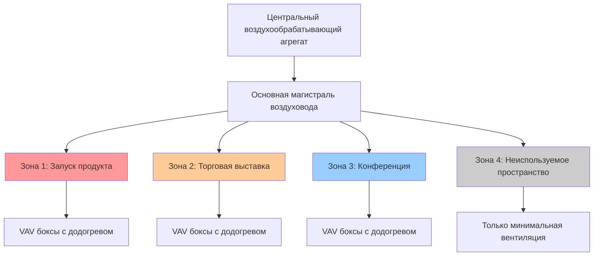
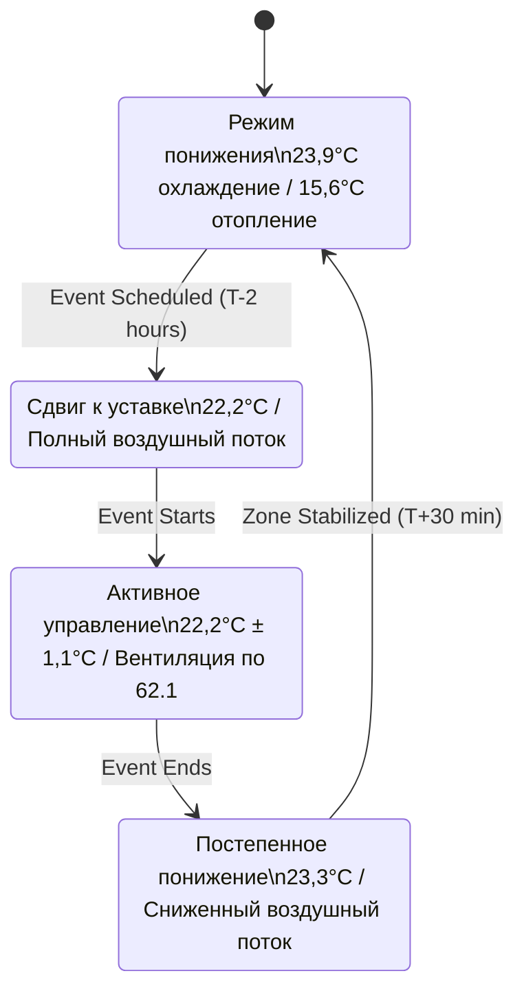

## Основные принципы зонирования выставочных залов

Выставочные залы представляют уникальные проблемы HVAC из-за переменной плотности занятости, одновременных мероприятий с разными тепловыми требованиями и быстро меняющихся тепловых нагрузок. Зонированные системы делят большие пространства на независимо управляемые тепловые области, что позволяет обеспечить энергоэффективную работу при одновременном поддержании комфорта в различных видах деятельности.

Фундаментальное уравнение теплопередачи для отдельной зоны:

$$Q_{zone} = Q_{sensible} + Q_{latent} = \dot{m} \cdot c_p \cdot (T_{supply} - T_{zone}) + \dot{m} \cdot h_{fg} \cdot (\omega_{supply} - \omega_{zone})$$

Где $\dot{m}$ представляет расход воздуха, $c_p$ — удельная теплоемкость, $T$ — температура, $h_{fg}$ — скрытая теплота испарения, а $\omega$ — коэффициент влагосодержания. Каждая зона поддерживает независимые уставки, модулируя параметры приточного воздуха.

## Архитектура многозональных воздухообрабатывающих агрегатов

Крупные выставочные объекты обычно используют специализированные воздухообрабатывающие агрегаты, обслуживающие несколько зон через отдельные воздуховодные ветви. Эта конфигурация обеспечивает:

**Преимущества проектирования системы:**
- Независимое управление температурой для одновременных событий
- Использование разнообразия нагрузок (коэффициент разнообразия обычно 0,6–0,8)
- Выборочная работа неиспользуемых зон
- Изоляция отказов, предотвращающая полный отказ системы

**Стратегия распределения воздушного потока:**

Общая емкость системы следует принципу разнообразия:

$$Q_{total} \neq \sum_{i=1}^{n} Q_{zone,i}$$

Вместо этого требуемая фактическая емкость:

$$Q_{total} = DF \cdot \sum_{i=1}^{n} Q_{zone,peak,i}$$

Где $DF$ — коэффициент разнообразия (0,6–0,8 для выставочных залов согласно ASHRAE Fundamentals Chapter 18).

## VAV системы с зональным додогревом

Системы переменного объема воздуха (VAV) с додогревом терминалов обеспечивают оптимальную гибкость зонирования для выставочных пространств. Демпфер VAV модулирует воздушный поток в ответ на температуру зоны, а катушки додогрева обеспечивают отопление, когда охлаждающий воздушный поток падает ниже минимальных требований вентиляции.

**Последовательность операций:**

1. **Режим охлаждения:** Демпфер VAV открывается для увеличения подачи холодного воздуха
2. **Переходный режим:** Демпфер достигает минимального положения (обычно 30–40% для вентиляции)
3. **Режим отопления:** Катушка додогрева активируется при сохранении минимального воздушного потока

Энергетический баланс для VAV терминала с додогревом:

$$Q_{terminal} = \dot{m}_{min} \cdot c_p \cdot (T_{supply} - T_{zone}) + Q_{reheat}$$

Где $\dot{m}_{min}$ соответствует требованиям вентиляции ASHRAE 62.1:

$$\dot{m}_{min} = V_{oz} = R_p \cdot P_z + R_a \cdot A_z$$

С $R_p$ как расход вентиляции на человека (0,79–1,18 м³/ч на человека для зон сборок), $P_z$ как численность зоны, $R_a$ как расход вентиляции на площадь (0,65 м³/ч на м²), и $A_z$ как площадь зоны.

| Условие зоны | Положение демпфера VAV | Выход катушки додогрева | Энергетическая эффективность |
|----------------|---------------------|-------------------|-------------------|
| Высокая нагрузка (переполненное событие) | 100% открыто | 0% | Оптимальная |
| Средняя нагрузка | 50–70% открыто | 0% | Хорошая |
| Низкая нагрузка (малая посещаемость) | Минимум (30–40%) | 0–50% | Средняя |
| Требуется отопление | Минимум (30–40%) | 50–100% | Нижняя (одновременное охлаждение/отопление) |

## Модульный подход охлаждения

Модульные системы охлаждения выставочных залов используют несколько блоков меньшей производительности вместо одной большой системы. Этот подход обеспечивает:

**Преимущества поэтапного включения мощности:**
- Работа при частичной нагрузке с повышенной эффективностью
- Резервирование при отказе оборудования
- Поэтапная установка, соответствующая расширению объекта
- Улучшенная производительность при частичной нагрузке

Коэффициент производительности (COP) для модульных систем, работающих при частичной нагрузке, обычно превышает показатели одной большой системы:

$$COP_{modular} = \frac{Q_{cooling}}{W_{compressor}} \times \left(1 + k \cdot \left(1 - \frac{Q_{actual}}{Q_{design}}\right)\right)$$

Где $k$ — специфичная для системы константа (0,2–0,4), представляющая выигрыш эффективности при частичной нагрузке. ASHRAE 90.1 требует расчетов интегрированного значения при частичной нагрузке (IPLV), учитывающих работу при 25%, 50%, 75% и 100% производительности.

## Зональное планирование и управление

Выставочные залы часто проводят одновременные мероприятия, требующие независимого управления окружающей средой. Зональное планирование минимизирует потребление энергии при поддержании комфорта.

**Логика управления расписанием:**

Требование энергии для предварительного охлаждения/предварительного отопления:

$$E_{precool} = \frac{m \cdot c_p \cdot \Delta T}{\eta_{system} \cdot t_{ramp}}$$

Где $m$ — тепловая масса зоны, $\Delta T$ — изменение температуры, $\eta_{system}$ — эффективность системы, и $t_{ramp}$ — время разгона (обычно 1–2 часа для зон выставочного зала).

## Управление одновременными событиями

Управление несколькими одновременными событиями с разными тепловыми требованиями требует сложных алгоритмов управления. Система управления зданием (BAS) координирует взаимодействие зон для предотвращения перепадов отрицательного давления и поддержания надлежащей вентиляции.

**Взаимоотношения давления между зонами:**

Для соседних зон с разными подающими потоками перепад давления:

$$\Delta P = \frac{\rho \cdot v^2}{2} \cdot \left[\left(\frac{\dot{V}_1}{A_1}\right)^2 - \left(\frac{\dot{V}_2}{A_2}\right)^2\right]$$

ASHRAE 62.1 требует поддерживать перепады давления ниже 5,0 Па между выставочными зонами для предотвращения миграции воздуха.

**Сравнение стратегий зонирования:**

| Стратегия | Капитальные затраты | Операционные затраты | Гибкость | Техническое обслуживание | Наилучшее применение |
|----------|--------------|----------------|-------------|-------------|------------------|
| Однозональная система | Низкие | Высокие | Низкая | Простое | Малые залы (<930 м²) |
| Многозональный воздухообрабатывающий агрегат | Средние | Средние | Средняя | Умеренное | Средние залы (930–4645 м²) |
| VAV с зональным додогревом | Высокие | Низко-средние | Высокая | Сложное | Большие залы (>4645 м²) |
| Модульное распределение | Наивысшие | Низкие | Наивысшая | Модульное | Премиум объекты, модернизация |

## Разнообразие нагрузок и зоны управления энергией

Выставочные залы значительно выигрывают от разнообразия нагрузок. Когда несколько зон работают одновременно, пиковые нагрузки редко совпадают. ASHRAE Application Handbook рекомендует применять коэффициенты разнообразия на основе количества зон и корреляции событий.

Эффективная емкость системы с учетом разнообразия:

$$Q_{effective} = Q_{largest} + DF \cdot \sum_{i=2}^{n} Q_{zone,i}$$

Где $Q_{largest}$ — единственная наибольшая нагрузка зоны и $DF$ варьируется от 0,5–0,8 в зависимости от независимости события.

Зоны управления энергией объединяют области с аналогичным использованием для оптимизированного управления:
- **Периметральные зоны:** Высокие солнечные/конверт нагрузки, глубина 4,6–6,1 м
- **Внутренние зоны:** Нагрузки, обусловленные занятостью, минимум 37–46 м² на зону
- **Специальные зоны:** Кухни, хранилища, погрузочные доки с уникальными требованиями

ASHRAE 90.1 требует отдельных зон для пространств, превышающих 232 м² с требованиями, отличающимися от смежных пространств более чем на 5,6°C или 20% воздушного потока.

## Соображения реализации

Успешная реализация зонированной системы требует:

1. **Точность расчета нагрузки:** Расчеты блочной нагрузки согласно ASHRAE Handbook Fundamentals с коэффициентами безопасности, ограниченными 10–15%
2. **Размещение датчиков:** Датчики температуры на высоте 1,5 м, вдали от приточных диффузоров и источников тепла
3. **Наладка:** Проверка воздушного потока в минимальном и максимальном положениях, проверка последовательности додогрева
4. **Настройка управления:** Оптимизация цикла PID для стабильной работы без колебаний

Надлежащая спроектированная зонированная система снижает потребление энергии на 25–40% по сравнению с подходами постоянного объема, одновременно улучшая комфорт занятых лиц благодаря локализованному управлению, адаптированному к фактическим схемам использования выставочного зала.
