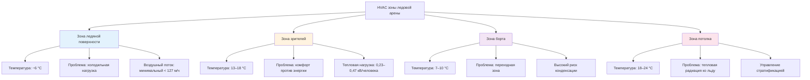

HVAC системы катков и ледовых арен представляют одно из самых сложных приложений климат-контроля, требующее точной координации между холодильной установкой ледяной поверхности, интенсивным осушением воздуха и комфортом зрителей. Фундаментальная проблема заключается в поддержании температуры льда между −9 °C и −4 °C при одновременном обеспечении приемлемых тепловых условий для занимающихся при 10 °C – 18 °C, все это в пределах оболочки здания, подверженной серьезным проблемам конденсации.

## Основные принципы тепловых нагрузок ледяного покрытия

Холодильная система должна непрерывно отводить тепло от ледяного покрытия для поддержания температуры поверхности. Общая тепловая нагрузка состоит из теплопроводности через плиту, радиации от потолка и освещения, конвекции от воздуха и скрытого тепла от операций по подготовке льда.

**Нагрузка теплопроводности через плиту:**

$$Q_{cond} = \frac{A \cdot k \cdot (T_{ground} - T_{ice})}{L}$$

Где:
- $A$ = площадь ледяного покрытия (м²)
- $k$ = теплопроводность грунта (кДж/ч·м·°C)
- $T_{ground}$ = температура грунта (°C)
- $T_{ice}$ = температура ледяной поверхности (°C)
- $L$ = толщина теплоизоляции (м)

**Радиационная нагрузка от потолка:**

$$Q_{rad} = A \cdot \varepsilon \cdot \sigma \cdot (T_{ceiling}^4 - T_{ice}^4)$$

Где:
- $\varepsilon$ = коэффициент излучения ледяной поверхности (0,95–0,98)
- $\sigma$ = постоянная Стефана–Больцмана (0,2042×10⁻⁸ кДж/ч·м²·K⁴)
- Температуры в Кельвинах (°C + 273,15)

**Конвективная нагрузка:**

$$Q_{conv} = h \cdot A \cdot (T_{air} - T_{ice})$$

Где:
- $h$ = коэффициент конвекции (2,8–11,4 кДж/ч·м²·°C, в зависимости от скорости воздуха)
- $T_{air}$ = температура воздуха над льдом (°C)

**Общая холодильная мощность:**

$$Q_{total} = Q_{cond} + Q_{rad} + Q_{conv} + Q_{lights} + Q_{resurfacing} + Q_{misc}$$

Для стандартного хоккейного катка НХЛ (61 м × 26 м = 1 585 м²) общие холодильные нагрузки обычно составляют 1 055–1 585 кВ, с проектной температурой ледяной поверхности −6 °C и температурой воздуха в арене 13 °C.

## Требования по типам катков

Различные виды ледовой деятельности требуют специфических твердости льда, температуры и условий окружающей среды.

| Тип катка | Температура ледяной поверхности | Твердость льда | Температура воздуха в арене | Относительная влажность | Скорость воздуха над льдом |
|-----------|--------------------------------|-----------------|---------------------------|------------------------|--------------------------|
| Хоккей | −6 до −5 °C | Твердый | 13–16 °C | 40–50 % | < 152 м/ч |
| Фигурное катание | −4 до −3 °C | Средний-мягкий | 14–17 °C | 40–50 % | < 101 м/ч |
| Керлинг | −6 до −5 °C | Средний | 7–10 °C | 40–45 % | < 76 м/ч |
| Скоростное катание | −9 до −7 °C | Очень твердый | 10–13 °C | 35–45 % | < 127 м/ч |
| Многоцелевой | −5 до −4 °C | Средний | 13–16 °C | 40–50 % | < 127 м/ч |

## Стратегия осушения воздуха

Контроль влажности представляет критическую проблему HVAC. Теплый влажный воздух, контактирующий с холодными поверхностями, вызывает конденсацию на льду, потолочной конструкции и ограждающей конструкции здания. Туман над ледяной поверхностью возникает, когда точка росы воздуха превышает температуру льда.

**Уравнение управления точкой росы:**

Максимально допустимая точка росы для предотвращения ледяного тумана:

$$T_{dp,max} = T_{ice} + 1,1 °C$$

Для льда при −6 °C поддерживайте точку росы ниже −4,9 °C, требуя воздух при примерно 13 °C и 40 % ОВ.

**Требуемая холодильная мощность осушения:**

$$\dot{m}_{moisture} = \frac{Q_{latent}}{h_{fg}}$$

Где:
- $Q_{latent}$ = скрытая нагрузка (кДж/ч)
- $h_{fg}$ = теплота испарения (2 360 кДж/кг при типичных условиях)

Типичные системы осушения арены удаляют 450–1 360 кг влаги в сутки. Системы адсорбционного осушения часто превосходят обычные охлаждающие системы в этом приложении из-за требований к низким температурам.

## Управление тепловыми зонами

Ледовые арены содержат различные тепловые зоны, требующие разных стратегий обработки.

## Проектирование воздухораспределения

Обычные потолочные системы подачи создают чрезмерное движение воздуха по ледяной поверхности, увеличивая холодильную нагрузку. Предпочтительные стратегии включают:

1. **Вытеснительная вентиляция**: низкоскоростная подача воздуха на уровне мест зрителей, естественный подъем
2. **Периметральная подача**: горизонтальная подача вдоль бортов, выше голов зрителей
3. **Панели лучистого отопления**: в зонах для зрителей обеспечивают комфорт без движения воздуха
4. **Вентиляторы дестратификации**: низкоскоростные потолочные вентиляторы для уменьшения тепловой стратификации (спорно из-за влияния на холодильную нагрузку)

**Требования по кратности воздухообмена:**
- Зоны зрителей: 6–8 воздухообменов в час минимум
- Зона ледяной поверхности: 1–2 воздухообмена в час максимум
- Общая вентиляция здания: в соответствии с требованиями IMC по занятости (обычно 8,5 CFM (14,4 м³/ч)/человека)

## Баланс комфорта зрителей

Проблема теплового комфорта включает поддержание приемлемых условий для сидящих зрителей в холодной среде. Средняя температура излучения (MRT) значительно влияет на комфорт.

$$MRT = \frac{T_{ceiling} + T_{walls} + T_{ice} + T_{equipment}}{4}$$

Даже при температуре воздуха 16 °C зрители испытывают дискомфорт, если MRT падает ниже 10 °C из-за потери лучистого тепла на ледяную поверхность. Стратегии смягчения включают:

- Панели лучистого отопления в зонах сидений (температура поверхности 38–49 °C)
- Изолированные спинки кресел для снижения потери тепла телом
- Более высокая температура воздуха в верхних зонах сидений (18–20 °C против 13–14 °C на уровне льда)
- Тамбуры и воздушные завесы у входов для снижения инфильтрации

## Справочные рекомендации ASHRAE

Справочник ASHRAE по холодоснабжению (Глава 44: Ледовые катки) предоставляет комплексное руководство по проектированию, включая:

- Компоновка холодильных трубопроводов и расходы
- Проектирование системы рассольного охлаждения (хлорид кальция, этиленгликоль)
- Выбор вторичного теплоносителя и защита от замерзания
- Тепловой анализ бетонной плиты и требования теплоизоляции
- Утилизация тепла от холодильных систем для отопления здания

Стандартная холодильная система обеспечивает 7,0–14,0 кВ на 10 м² ледяной поверхности для начального охлаждения, с 5,3–8,8 кВ на 10 м² для установившегося режима.

## Критические вопросы проектирования

**Размещение парозащитного слоя**: непрерывный барьер от водяного пара на теплой стороне всей теплоизоляции ограждающей конструкции предотвращает конденсацию в межстеновых пространствах. Отказы приводят к деградации теплоизоляции и повреждению конструкции.

**Теплоизоляция ледяной плиты**: минимум RSI 1,76 периметральной теплоизоляции, распространяющейся на 3 м за край льда, с рекомендуемым RSI 3,52 для энергоэффективности. Теплоизоляция под плитой должна сопротивляться влаге и нагрузкам.

**Тепловая нагрузка от освещения**: светодиодное освещение снижает тепловую нагрузку на 60–70 % по сравнению с металлогалогенными лампами, уменьшаясь с 3,2–5,4 Вт/м² до 1,1–2,1 Вт/м². Это соответствует снижению холодильной нагрузки на 176–247 кВ для стандартного катка.

**Утилизация тепла холодильной установки**: отвод тепла конденсатором (1 408–2 113 кВ для типичного объекта) обеспечивает экономичное отопление зон для зрителей, вестибюлей и горячего водоснабжения. Типичная эффективность утилизации 30–50 %.

Успех HVAC системы ледового катка зависит от интегрированного проектирования, рассматривающего холодоснабжение, осушение и комфортное отопление как взаимосвязанные системы, а не как изолированные компоненты. Надлежащий пуск и обучение операторов обеспечивают поддержание системами проектных параметров на протяжении переменной занятости и графиков мероприятий.
