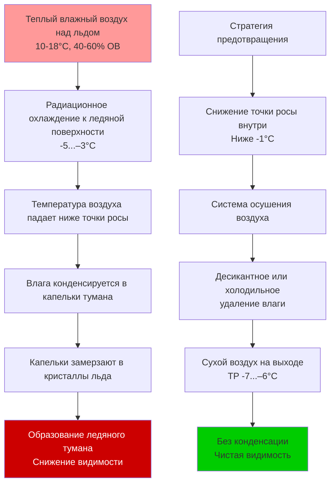

Ледяные катки представляют уникальные задачи осушения воздуха из-за экстремального температурного перепада между ледяной поверхностью (обычно -5...–3°C) и внутренним воздухом (10–18°C). Без надлежащего контроля влажности на ледяной поверхности, потолочной конструкции и оболочке здания происходит конденсация, что приводит к образованию ледяного тумана, разрушению конструкции и снижению видимости.

## Физические принципы контроля влажности на ледяных катках

Основная проблема вытекает из психрометрического поведения воздуха вблизи поверхностей с температурой ниже нуля. Когда влажный воздух контактирует с ледяной поверхностью или входит в тепловую струю над ней, влага конденсируется и замерзает, создавая ледяной туман, который снижает видимость и ухудшает качество льда.

Скрытую нагрузку от зрителей, ледяного покрытия и инфильтрации необходимо непрерывно удалять. Для типичной арены скорость генерации влаги составляет:

$$\dot{m}_{moisture} = N_{occupants} \cdot g_{latent} + A_{ice} \cdot q_{sublimation} + Q_{infiltration} \cdot \Delta \omega$$

Где:
- $N_{occupants}$ = количество людей
- $g_{latent}$ = 200–300 г/ч на человека (зависит от активности)
- $A_{ice}$ = площадь ледяной поверхности (м²)
- $q_{sublimation}$ = скорость сублимации с ледяной поверхности (0,23–0,68 кг/ч на 100 м²)
- $Q_{infiltration}$ = объемный расход инфильтрационного воздуха (м³/ч)
- $\Delta \omega$ = разница в коэффициенте влажности (кг влаги/кг сухого воздуха)

ASHRAE рекомендует поддерживать внутреннюю точку росы ниже -3...–1°C для предотвращения конденсации на ледяной поверхности. Это требует удаления примерно 0,07–0,11 кг влаги на человека в час для зрителей, плюс нагрузки сублимации и инфильтрации.

## Механизм образования ледяного тумана

Ледяной туман образуется в результате процесса радиационного и конвективного теплообмена между теплым влажным воздухом и ледяной поверхностью.

Критическим параметром является поддержание внутренней точки росы достаточно ниже температуры ледяной поверхности. Требуемая депрессия точки росы зависит от скорости воздуха над льдом, радиационного теплопритока и высоты потолка.

## Сравнение систем осушения воздуха

| Параметр | Десикантное осушение | Холодильное осушение | Комбинированная система |
|-----------|---------------------------|------------------------------|-----------------|
| Возможность точки росы | -7...+7°C | 2...+10°C | -6...+7°C |
| Энергопотребление | Высокое (тепло регенерации) | Среднее | Среднее-высокое |
| Капитальные затраты | Высокие | Средние | Самые высокие |
| Техническое обслуживание | Замена фильтра и десиканта | Обслуживание холодильного контура | Обе системы |
| Производительность при малой нагрузке | Отличная | Низкая при точке росы ниже 4°C | Хорошая |
| Типичное применение | Комбинированные арены | Тренировочные катки, мягкий климат | Крупные многофункциональные объекты |
| Производительность по влаге | 23–136 кг/ч | 14–68 кг/ч | 45–182 кг/ч |
| Энергия регенерации | 1270–1900 кДж/кг H₂O | 1160–1480 кДж/кг H₂O | 1160–1690 кДж/кг H₂O |

## Десикантное осушение воздуха для ледяных катков

Десикантные системы используют гигроскопические материалы (силикагель, молекулярное сито или хлорид лития) для адсорбции влаги из воздуха через вращающееся колесо или стационарный слой. Десикант регенерируется с использованием тепла (газовый, электрический или рекуперированное тепло из холодильного цикла).

Для ледяных катков, требующих точки росы ниже -1°C, десикантные осушители являются стандартным решением. Производительность по удалению влаги рассчитывается как:

$$q_{dehumid} = \dot{m}_{air} \cdot (\omega_{inlet} - \omega_{outlet})$$

Где:
- $q_{dehumid}$ = скорость удаления влаги (кг/ч)
- $\dot{m}_{air}$ = массовый расход обрабатываемого воздуха (кг/ч)
- $\omega_{inlet}$ = коэффициент влажности на входе (кг/кг)
- $\omega_{outlet}$ = коэффициент влажности на выходе (кг/кг)

ASHRAE Application Handbook рекомендует размерировать десикантные системы на 150–200% расчетной пиковой скрытой нагрузки для обеспечения быстрого удаления влаги при открытии дверей или обновлении ледяного покрытия.

## Ограничения холодильного осушения воздуха

Стандартное холодильное осушение охлаждает воздух ниже точки росы для конденсации влаги. Однако температура поверхности испарителя должна оставаться выше 0°C для предотвращения образования льда на испарителе. Это ограничивает достижимую точку росы примерно до 2–4°C.

Скорость конденсации на холодильном испарителе:

$$\dot{m}_{condensate} = \dot{V} \cdot \rho_{air} \cdot (\omega_{db,in} - \omega_{sat,coil})$$

Где:
- $\dot{V}$ = объемный расход воздуха (м³/ч)
- $\rho_{air}$ = плотность воздуха (кг/м³)
- $\omega_{db,in}$ = коэффициент влажности входящего воздуха
- $\omega_{sat,coil}$ = коэффициент влажности, насыщенный при температуре поверхности испарителя

Холодильные системы применимы только в мягком климате или на тренировочных объектах, где достаточен умеренный контроль точки росы (2–7°C).

## Предотвращение конденсации на потолке

Потолочная конструкция ледяных катков особенно подвержена конденсации, так как она формирует теплую сторону оболочки здания. Неадекватные паробарьеры или тепловые мосты позволяют влаге мигрировать в изоляцию, где она конденсируется и замерзает.

Разница давления водяного пара вызывает миграцию влаги:

$$\dot{m}_{vapor} = P_{vapor} \cdot \frac{A_{ceiling}}{\mu \cdot t_{insulation}} \cdot (p_{indoor} - p_{cold})$$

Где:
- $P_{vapor}$ = проницаемость материала для водяного пара
- $A_{ceiling}$ = площадь потолка
- $\mu$ = коэффициент сопротивления пара
- $t_{insulation}$ = толщина изоляции
- $p_{indoor}, p_{cold}$ = парциальные давления водяного пара

ASHRAE Standard 160 требует поддержания внутренней относительной влажности ниже 60% и установки непрерывных паробарьеров (паропроницаемость < 0,1 пerm) на теплой стороне изоляции для предотвращения конденсации.

## Рассмотрения при проектировании системы

Эффективные системы осушения воздуха для ледяных катков включают:

- **Системы подачи свежего воздуха (DOAS)** для разделения вентиляции и кондиционирования помещения
- **Вытесняющую вентиляцию** с подачей сухого воздуха на уровне льда для вытеснения влажной струи
- **Рекуперацию тепла** между вытяжным и наружным воздухом для снижения энергопотребления
- **Регулирование производительности переменной мощности** для соответствия колебаниям влажности от занятости и открытия дверей
- **Потолочные вентиляторы дестратификации** для предотвращения скопления теплого влажного воздуха у потолка

Общее энергопотребление системы на осушение воздуха обычно составляет 15–30% от общего энергопотребления HVAC ледяного катка, что делает оптимизацию эффективности критической.

## Руководящие принципы проектирования ASHRAE

ASHRAE Applications Handbook, Глава 43 (Охлаждаемые объекты) содержит конкретные рекомендации по осушению воздуха на ледяных катках:

- Поддерживать внутреннюю точку росы по крайней мере на 3–4°C ниже температуры ледяной поверхности
- Размеривать осушение для пиковых скрытых нагрузок плюс коэффициент безопасности 50%
- Обеспечить быстрое удаление влаги (82–109 кг/ч на 1600 м² катка)
- Установить непрерывные паробарьеры с паропроницаемостью < 0,1 пerm
- Контролировать и управлять внутренней точкой росы как основным параметром управления
- Проектировать с учетом сезонных вариаций энтальпии наружного воздуха, влияющих на скрытые нагрузки

Надлежащо спроектированные системы осушения воздуха устраняют ледяной туман, уменьшают структурную конденсацию, минимизируют увеличение нагрузки на холодильник из-за образования инея и обеспечивают комфортные условия для зрителей и спортсменов.
