Контроль качества ледяного покрытия представляет одно из наиболее требовательных приложений в инженерии HVAC, требующее точного управления температурой, влажностью и радиационными тепловыми нагрузками для поддержания оптимальных условий льда. Ледяной лист должен оставаться при определённых температурах, в то время как пространство над ним работает при комфортных условиях для зрителей, что создаёт значительные тепловые градиенты и проблемы миграции влаги.

## Требования к температуре ледяного покрытия по видам спорта

Температура льда непосредственно влияет на твёрдость, характеристики трения и качество производительности. Различные виды спорта требуют отличающихся условий льда в зависимости от динамики контакта лезвия и требований к скорости.

| Вид спорта | Температура поверхности льда | Твёрдость льда | Основное требование |
|-------|------------------------|--------------|---------------------|
| Хоккей | -5,6 до -4,4°C | Твёрдый | Высокая скорость, минимальное образование снежной пыли |
| Фигурное катание | -3,3 до -2,2°C | Более мягкий | Сцепление лезвия для прыжков и вращений |
| Кёрлинг | -5,0 до -3,9°C | Среднетвёрдый | Консистентное скольжение, сохранение шероховатости |
| Скоростное катание | -7,8 до -6,1°C | Очень твёрдый | Максимальная скорость, минимальное трение |

Холодильная система поддерживает эти температуры через сеть труб с рассолом или гликолем, встроенных в бетонную плиту. Равномерность температуры поверхности в пределах ±0,56°C по всему ледяному листу имеет решающее значение для стабильной производительности.

## Расчёты ёмкости холодильной системы

Общая холодильная нагрузка состоит из множественных источников тепла, которые непрерывно передают энергию на поверхность льда. Требуемая ёмкость рассчитывается как:

$$Q_{total} = Q_{radiant} + Q_{convection} + Q_{lighting} + Q_{envelope} + Q_{ventilation} + Q_{resurfacing}$$

где каждый компонент выражается в кДж/ч или кВт.

### Радиационная тепловая нагрузка

Радиационное тепло от тёплых поверхностей здания, зрителей и освещения представляет доминирующий компонент нагрузки. Чистый радиационный обмен выражается как:

$$Q_{radiant} = \varepsilon \sigma A (T_{ceiling}^4 - T_{ice}^4) F$$

где:
- $\varepsilon$ = эффективная излучательность (0,85–0,95 для типичных поверхностей)
- $\sigma$ = константа Стефана–Больцмана (5,67 × 10⁻⁸ Вт/м²·К⁴)
- $A$ = площадь ледяного покрытия (м²)
- $T_{ceiling}$, $T_{ice}$ = абсолютные температуры (К)
- $F$ = коэффициент видимости (типично 0,7–0,9)

Для типичной хоккейной арены (60,96 м × 25,91 м = 1,579 м²) с температурой потолка 18,3°C и льдом при -4,4°C, радиационная нагрузка приближается к 118–148 кВт.

### Влияние влажности на качество льда

Миграция влаги из тёплого влажного воздуха к холодной поверхности льда создаёт туман, образование инея и деградацию поверхности льда. Скорость массопередачи следует уравнению:

$$\dot{m}_{condensation} = h_m A (W_{air} - W_{surface})$$

где:
- $h_m$ = коэффициент массопередачи (м/ч)
- $W$ = влагосодержание (кг влаги/кг сухого воздуха)

Каждый килограмм влаги, конденсирующейся на льду, выделяет 2 501 кДж скрытого тепла, непосредственно добавляясь к требованию холодильной нагрузки. При условиях воздуха с точкой росы 10°C над льдом при -4,4°C, скорости конденсации могут превышать 22,7 кг/ч, давая вклад более 56,7 кВт к требованию охлаждения.

ASHRAE рекомендует поддерживать условия воздуха в арене при 10–13°C с относительной влажностью 40–50% для минимизации конденсации при обеспечении разумного комфорта зрителей. Системы осушения должны удалять 90,7–181,4 кг/ч влаги в занятых аренах.

## Факторы, влияющие на качество ледяного покрытия

```mermaid
graph TD
    A[Качество ледяного покрытия] --> B[Тепловые нагрузки]
    A --> C[Контроль влажности]
    A --> D[Холодильная система]
    A --> E[Операционные факторы]

    B --> B1[Радиационное тепло от потолка]
    B --> B2[Тепловыделение от освещения]
    B --> B3[Нагрузки от ограждающих конструкций]
    B --> B4[Нагрузки вентиляционного воздуха]

    C --> C1[Точка росы воздуха в арене]
    C --> C2[Образование тумана]
    C --> C3[Накопление инея]
    C --> C4[Ёмкость осушения]

    D --> D1[Температура рассола/гликоля]
    D --> D2[Распределение расхода]
    D --> D3[Ёмкость системы]
    D --> D4[Равномерность температуры]

    E --> E1[Частота нанесения льда]
    E --> E2[Температура воды]
    E --> E3[Режимы занятости]
    E --> E4[Уровень активности]
```

## Тепловое воздействие нанесения нового слоя льда

Нанесение нового слоя льда машиной типа Zamboni или аналогичной добавляет горячую воду (60–82°C) на поверхность, создавая временный тепловой удар, который должна поглотить холодильная система. Тепловая нагрузка от нанесения нового слоя льда выражается как:

$$Q_{resurface} = \dot{m}_{water} c_p (T_{water} - T_{ice}) + \dot{m}_{water} h_{fg}$$

где:
- $\dot{m}_{water}$ = скорость подачи воды (568–946 л на нанесение)
- $c_p$ = удельная теплоёмкость воды (4,18 кДж/кг·°C)
- $h_{fg}$ = теплота плавления (334 кДж/кг)

Типичное нанесение 757 л (757 кг) воды при 71°C на лёд при -4,4°C налагает:

$$Q = 757 \times 4,18 \times (71-(-4,4)) + 757 \times 334 = 238,5 + 252,8 = 491,3 \text{ кДж}$$

Эта энергия должна быть удалена в течение 30–60 минут, представляя переходную нагрузку 137–274 кВт во время восстановления.

## Тепловыделение от освещения

Современные LED системы освещения снижают тепловыделение по сравнению с устаревшими галогенными светильниками, но всё ещё вносят значительные радиационные нагрузки. Для спортивного освещения при 800–1000 люкс:

$$Q_{lighting} = P_{installed} \times F_{radiant}$$

где:
- $P_{installed}$ = установленная мощность освещения (кВт)
- $F_{radiant}$ = доля, достигающая поверхности льда (0,4–0,6)

Система LED мощностью 150 кВ передаёт приблизительно 59–88 кВт на поверхность льда через прямое и отражённое излучение.

## Рекомендации по проектированию

**Размер холодильной системы:**
- Базовая ёмкость: 1,7–2,3 кВт на м² ледяного покрытия
- Пиковая ёмкость при нанесении льда: 2,8–3,4 кВт на м²
- Температура подачи рассола/гликоля: -11 до -9°C
- Температурный перепад: 3,3–4,4°C по ледяной плите

**Требования к осушению:**
- Расчётная точка росы: максимум -1 до 4°C
- Ёмкость: 6,8–11,3 кг/ч на 92,9 м² льда
- Интеграция с системой рекуперации тепла холодильной установки

**Стратегия управления:**
- Датчики температуры поверхности льда (минимум 9 точек)
- Модуляция температуры и расхода рассола
- Блокировки температуры и влажности воздуха в арене
- Предиктивное управление для плановых событий нанесения льда

## Руководство ASHRAE по проектированию

Справочник ASHRAE—Холодильная техника, Глава 44 (Ледовые арены) предоставляет комплексные критерии проектирования для холодильных систем ледовых арен, включая:

- Методологии расчёта нагрузок для всех компонентов теплопоступления
- Расположение трубопроводов и конфигурации коллекторов для равномерности температуры
- Выбор хладагента и проектирование систем вторичного охлаждающего агента
- Последовательности управления для различных температур льда между событиями

Расчётные условия ASHRAE определяют поддержание равномерности температуры ледяного покрытия в пределах ±0,56°C и минимизацию термических циклов для сохранения качества льда на всех операционных периодах. Надлежащий размер системы должен учитывать как установившиеся нагрузки во время событий, так и переходные пиковые нагрузки во время циклов нанесения льда.

Тепловое взаимодействие между холодной поверхностью льда и тёплым влажным окружением арены создаёт уникальные проблемы, требующие интегрированного проектирования холодильных, осушительных и вентиляционных систем для достижения оптимального качества льда при одновременном поддержании приемлемых условий комфорта зрителей.
