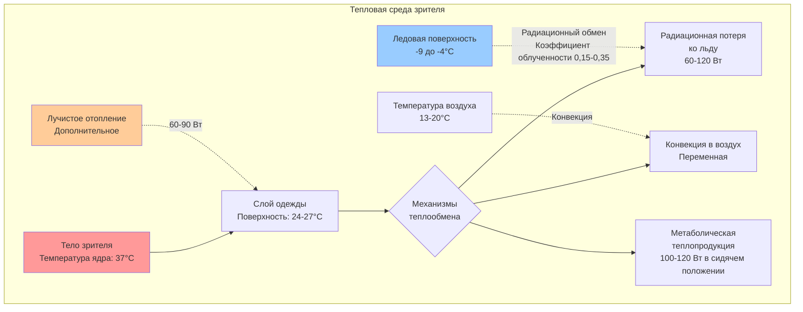

## Обзор

Тепловой комфорт зрителей в ледовых дворцах представляет уникальную задачу: люди должны оставаться в комфортных условиях, сидя рядом с большой холодной излучающей поверхностью, поддерживаемой при температуре -9 до -4°C. Ледовая поверхность создает значительную радиационную асимметрию, которую невозможно компенсировать только температурой воздуха. Эффективное проектирование требует понимания радиационного теплообмена, метаболической теплопродукции и теплоизоляции одежды для поддержания теплового равновесия в зоне зрителей.

ASHRAE Standard 55 определяет критерии теплового комфорта, но применение в ледовых дворцах требует значительных поправок на радиационный дефицит, создаваемый ледовой поверхностью. Средняя радиационная температура (MRT) в зонах зрителей может быть на 8-14°C ниже температуры воздуха, требуя повышенных температур воздуха или дополнительного лучистого отопления для достижения приемлемых условий.

## Радиационные потери теплоты к ледовой поверхности

Зрители испытывают постоянную радиационную теплопотерю к холодной ледовой поверхности. Чистый радиационный обмен определяется законом Стефана-Больцмана и коэффициентами облученности:

$$q_{rad} = \epsilon \sigma A F_{p-i} (T_s^4 - T_{ice}^4)$$

Где:
- $q_{rad}$ = радиационная теплопотеря (Вт)
- $\epsilon$ = эффективная степень черноты (обычно 0,85-0,95 для одетых людей)
- $\sigma$ = постоянная Стефана-Больцмана (5,67 × 10⁻⁸ Вт/м²·К⁴)
- $A$ = площадь поверхности тела (обычно 1,8 м² для взрослого)
- $F_{p-i}$ = коэффициент облученности между человеком и ледовой поверхностью
- $T_s$ = температура поверхности одежды (К)
- $T_{ice}$ = температура ледовой поверхности (К)

Для сидящего зрителя, обращенного к льду, коэффициент облученности варьируется от 0,15 до 0,35 в зависимости от близости и геометрии сидений. Это приводит к радиационным потерям теплоты 60-120 Вт сверх нормальных условий в помещении.

## Расчет средней радиационной температуры

Средняя радиационная температура учитывает все излучающие поверхности, взвешенные по коэффициентам облученности:

$$MRT = \sqrt[4]{\sum_{i=1}^{n} F_i T_i^4}$$

В ледовых дворцах большая холодная поверхность значительно снижает MRT ниже температуры воздуха. Для зрителей с прямым видом на лед:

$$MRT \approx T_{air} - (0,4 \text{ до } 0,7) \times (T_{air} - T_{ice})$$

Эта зависимость демонстрирует, почему требуются температуры воздуха 13-20°C, когда лед находится при -7°C, для достижения теплового комфорта, эквивалентного 20-21°C в стандартных помещениях.

## Метаболическая теплопродукция и теплоизоляция одежды

Малоподвижные зрители производят приблизительно 100-120 Вт (1,0-1,2 мет) метаболической теплоты. Уравнение теплового баланса:

$$M - W = q_{conv} + q_{rad} + q_{evap}$$

Где:
- $M$ = интенсивность метаболизма (Вт/м²)
- $W$ = внешняя работа (ноль для сидящих зрителей)
- $q_{conv}$ = конвективная теплопотеря
- $q_{rad}$ = радиационная теплопотеря
- $q_{evap}$ = испарительная теплопотеря

Требования к теплоизоляции одежды увеличиваются до 1,2-1,5 кло (эквивалент тяжелого свитера и куртки) по сравнению с 0,5-0,7 кло в стандартных зданиях. Более высокие значения изоляции смещают больше теплопотерь на радиационный путь, делая радиационную асимметрию более проблематичной.

## Сравнение систем отопления

| Метод отопления | Температура подачи | Тепловой комфорт | Энергоэффективность | Капитальная стоимость | Применение |
|----------------|-------------------|-----------------|-------------------|--------------|--------------|
| **Потолочное лучистое** | 65-93°C | Отличное - Прямо компенсирует радиацию льда | Высокая - Нацелено на зону занятости | Средняя-Высокая | Премиум-сидения, передние ряды |
| **Принудительная конвекция (высокая скорость)** | 32-49°C | Хорошее - Требует более высокой температуры воздуха | Средняя - Некоторое расслоение | Низкая-Средняя | Общие сидения, верхние уровни |
| **Подпольное отопление** | 27-35°C | Очень хорошее - Теплые ноги, отсутствие сквозняков | Очень высокая - Низкотемпературное распределение | Высокая | Новое строительство, премиум-зоны |
| **Обогреваемые сиденья** | Поверхность 38-43°C | Отличное - Прямой контакт | Высокая - Индивидуальный контроль | Средняя | Премиум-сидения, люкс-боксы |
| **Завесы теплого воздуха** | 38-54°C | Удовлетворительное - Защита только периметра | Средняя - Высокий объем воздуха | Средняя | Входные зоны, периметровые сидения |

## Рекомендации по проектированию

**Уставки температуры:**
- Температура воздуха в зоне зрителей: 13-18°C (стандартные сидения с ожидаемой одеждой)
- Премиум-сидения с лучистым отоплением: 10-14°C температуры воздуха
- Коридоры и вестибюли: 18-21°C
- Температурный градиент не должен превышать 3°C от уровня щиколотки до уровня головы

**Проектирование лучистого отопления:**
Потолочные лучистые панели должны подавать 25-40 Вт/м² в зоны зрителей с прямым видом на лед. Температура поверхности панели 65-82°C обеспечивает удобный радиационный обмен без чрезмерного нагрева потолка.

**Распределение воздуха:**
- Скорость воздуха на уровне головы: <0,15 м/с, чтобы избежать ощущения сквозняка
- Вытеснительная вентиляция с уровня пола, где возможно
- Вертикальное температурное расслоение контролируется через вентиляторы деслоения
- Влажность поддерживается на уровне 40-50% ОВ для предотвращения конденсации и обеспечения комфорта

**Контроль радиационной асимметрии:**
Согласно ASHRAE Standard 55, радиационная асимметрия температур не должна превышать 10°C для потолок-пол и 5,5°C для различий стен. Ледовые дворцы по своей природе нарушают эти пределы, требуя:
- Панели лучистого отопления, расположенные так, чтобы компенсировать коэффициенты облученности к льду
- Ориентация сидений, минимизирующая прямой вид на лед, где возможно
- Предположения о более высокой изоляции одежды (минимум 1,2-1,5 кло)

**Разделение систем:**
Системы HVAC зрителей должны быть полностью отделены от холодильных зон ледовой плиты. Независимый контроль предотвращает:
- Проникновение холодного воздуха с ледовой поверхности
- Миграцию влаги, вызывающую конденсацию
- Потери энергии от конкурирующих нагрузок отопления/охлаждения
- Нестабильность контроля от теплового связывания

## Вентиляция и качество воздуха

Плотность занятости зрителей требует 7-10 л/с свежего воздуха на человека согласно ASHRAE 62.1. Применение в высоких помещениях выигрывает от:
- Управление вентиляцией по спросу на CO₂ (поддерживать <1000 ppm)
- Рекуперация энергии на вентиляционном воздухе (эффективность 60-70%)
- Системы свежего воздуха (DOAS) с отдельным чувствительным охлаждением

## Проверка при пусконаладке

Проверка теплового комфорта должна включать:
- Измерения шаровым термометром на уровне головы сидящего зрителя (проверка MRT)
- Картирование скорости воздуха в местах расположения зрителей
- Съемка температуры поверхности панелей лучистого отопления и ледовой поверхности
- Опросы зрителей о тепловых ощущениях во время мероприятий
- Инфракрасная термография зон зрителей

Надлежащим образом спроектированные системы комфорта зрителей достигают рейтинга приемлемости теплового комфорта выше 80%, одновременно поддерживая температуру ледовой поверхности, подходящую для фигурного катания, что демонстрирует, что физико-обоснованное проектирование может примирить конкурирующие тепловые нагрузки.
