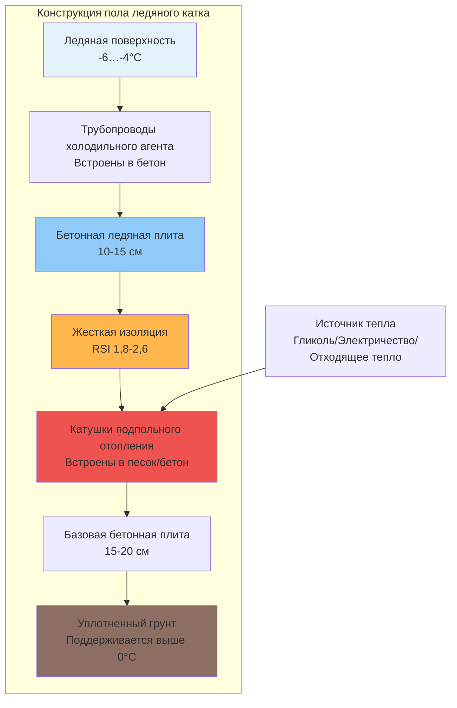

## Обзор

Системы подпольного отопления, установленные под бетонными плитами ледяных катков, предотвращают проникновение мороза в нижележащий грунт, устраняя повреждения от морозного пучения и обеспечивая структурную целостность. Система отопления поддерживает интерфейс грунт-бетон выше температуры замерзания, в то время как ледяная поверхность работает при -6…-4°C, создавая контролируемый температурный градиент через конструкцию.

Без подпольного отопления непрерывное извлечение тепла через охлажденную ледяную плиту вызывает проникновение температур замерзания глубоко в грунты фундамента. Промерзаемые грунты подвергаются объемному расширению во время замерзания, создавая давление пучения свыше 2400 кПа, которое деформирует бетонные плиты и повреждает сети холодильного оборудования.

## Тепловые требования

### Глубина проникновения мороза

Максимальная глубина промерзания без отопления следует модифицированному уравнению Бергрена:

$$Z_f = \sqrt{\frac{48 \cdot k \cdot F}{\pi \cdot L \cdot \rho}}$$

Где:
- $Z_f$ = глубина проникновения мороза (м)
- $k$ = теплопроводность грунта (Вт/(м·°C))
- $F$ = индекс замерзания (°C-дней)
- $L$ = скрытая теплота плавления (334 кДж/кг для воды)
- $\rho$ = плотность сухого грунта (кг/м³)

Система подпольного отопления должна обеспечивать достаточный тепловой поток для поддержания нижней поверхности бетона при температуре 3-7°C.

### Потери тепла через плиту

Требуемая мощность отопления уравновешивает нисходящие потери тепла от системы ледяной плиты:

$$q_{sf} = \frac{T_{sf} - T_{soil}}{\frac{t_{conc}}{k_{conc}} + \frac{t_{ins}}{k_{ins}} + R_{soil}}$$

Где:
- $q_{sf}$ = тепловой поток подпольного отопления (Вт/м²)
- $T_{sf}$ = целевая температура подпольного отопления (4°C)
- $T_{soil}$ = глубокая температура грунта (10-13°C)
- $t_{conc}$ = толщина бетонной плиты (м)
- $t_{ins}$ = толщина изоляции (м)
- $k$ = теплопроводность (Вт/(м·°C))
- $R_{soil}$ = тепловое сопротивление грунта (м²·°C/Вт)

Типичные требования к тепловому потоку составляют 9-25 Вт/м² в зависимости от интенсивности холодильной нагрузки и условий грунта.

## Конфигурация системы

Катушки подпольного отопления встраиваются в смесь песка и цемента толщиной 5-10 см или непосредственно в структурную базовую плиту, расположенные на глубине 5-8 см ниже нижней поверхности изоляции. Расстояние между витками обычно колеблется от 23-46 см в осях, с более плотным расстоянием в периферийных зонах, испытывающих краевые потери тепла.

Датчики температуры, встроенные вблизи катушек отопления, обеспечивают замкнутый контроль, поддерживая заданное значение интерфейса. Несколько зон управления компенсируют различные скорости потерь тепла по площади катка.

## Сравнение систем отопления

| Тип системы | Источник тепла | Стоимость установки | Операционная стоимость | КПД | Точность контроля | Техническое обслуживание |
|-------------|-------------|-------------------|----------------|------------|-------------------|-------------|
| **Гликолевой контур** | Котел/тепловой насос | 160-270 USD/м² | Умеренная | 70-85% | Отличная | Низко-умеренная |
| **Электрическое сопротивление** | Электросеть | 130-190 USD/м² | Высокая | 100% (локально) | Хорошая | Очень низкая |
| **Отходящее тепло холодильной установки** | Отвод конденсатора | 190-320 USD/м² | Очень низкая | 200-300% эффективно | Отличная | Умеренная |
| **Тепловой насос с грунтовой связью** | Связь с землей | 270-430 USD/м² | Низкая | 300-400% | Отличная | Низкая |

### Гликолевой контур отопления

Замкнутые системы с гликолем (обычно 25-35% пропиленгликоля) циркулируют через трубопроводы из PEX или HDPE при температуре подачи 7-16°C. Теплообменник соединяется с отопительной системой объекта или отдельным котлом. Расходы 0,19-0,32 л/мин на 9,3 м² обеспечивают адекватное распределение тепла.

### Электрический обогрев кабелем

Саморегулирующиеся или кабели постоянной мощности устанавливаются с шагом 15-30 см, управляются встроенными термостатами. Плотность мощности колеблется от 10-26 Вт/м² в зависимости от климатической суровости и значения R изоляции. Электрические системы обеспечивают простейшую установку, но влекут наивысшие операционные затраты при большинстве тарифных структур.

### Рекуперация тепла холодильной установки

Перехват отвода тепла конденсатора обеспечивает наиболее энергоэффективное решение. Холодильная система генерирует 35-44 кВт отходящего тепла на тонну холодопроизводительности при подходящих температурных уровнях (27-49°C). Теплообменник передает эту энергию в гликолевой контур подпольного отопления, достигая значений COP отопления 2,5-3,5 при учете паразитной мощности насоса.

При пиковой холодильной нагрузке отходящее тепло часто превышает потребность подпольного отопления. Избыточная энергия интегрируется в отопление объекта, предварительный нагрев горячей воды для хозяйственных нужд или системы таяния снега.

## Конструктивные соображения

**Размещение изоляции** критически влияет на распределение теплового потока. Слой жесткой изоляции (обычно экструдированный полистирол, RSI 1,8-2,6) должен обеспечивать полное покрытие без зазоров, создающих тепловые мосты. Изоляционные плиты перекрывают минимум на 15 см и смещают стыки.

**Пароизоляция** под изоляцией предотвращает миграцию влаги грунта в конструкцию. Накопление влаги снижает производительность изоляции и может привести к разрушению бетона.

**Краевые эффекты** на периферии катков требуют повышенной мощности отопления или более плотного расстояния катушек. Потери тепла к соседним помещениям или внешним стенам создают локальные холодные места без компенсации.

**Условия грунта** определяют восприимчивость к морозному пучению. Глинистые грунты с высокой влажностью представляют наибольший риск, в то время как зернистые грунты с хорошим дренажом создают минимальные риски пучения. Геотехническое исследование устанавливает требования к отоплению, специфичные для объекта.

## Рекомендации ASHRAE

Справочник ASHRAE по применению, глава 44 (Холодильные объекты) предоставляет руководство для подпольного отопления ледяных катков:

- Поддерживать температуру под плитой между 3-7°C
- Проектировать для наихудшего сценария холодильной нагрузки при пиковых условиях окружающей среды
- Включить резервирование для критических систем, обслуживающих Олимпийские или профессиональные объекты
- Мониторить температуру в нескольких местах по площади катка
- Запустить системы перед начальным льдообразованием для проверки равномерного распределения тепла

Отказ системы подпольного отопления приводит к прогрессирующему повреждению от морозного пучения, требующему обширной санации. Надлежащее проектирование, качество установки и непрерывный мониторинг обеспечивают десятилетия надежной эксплуатации с минимальным вмешательством в техническое обслуживание.
