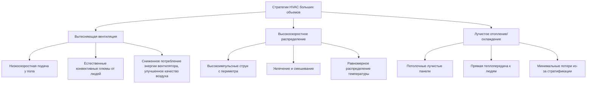
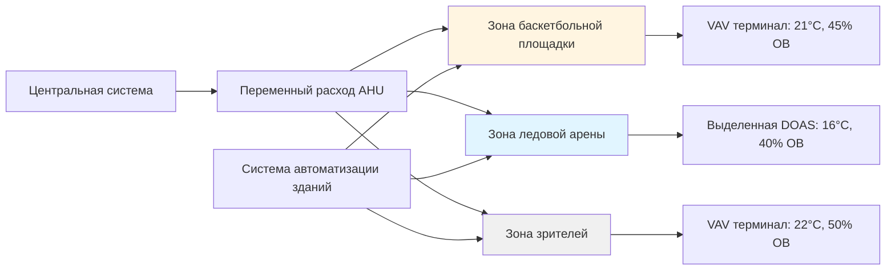

Спортивные сооружения закрытого типа представляют уникальные проблемы HVAC, требующие точного контроля температуры, влажности и движения воздуха для удовлетворения как требований к спортивной производительности, так и комфорту зрителей. Строительство с большими высотами потолков, различные уровни активности и специфические экологические потребности разных видов спорта требуют специализированных подходов к проектированию систем.

## Физические принципы и характеристики тепловых нагрузок

Тепловая среда в спортивных сооружениях определяется тремя основными механизмами теплопередачи, работающими в разных масштабах.

**Конвективные нагрузки:** Спортсмены выделяют метаболическое тепло со скоростью 400–600 Вт на одного человека при интенсивной активности, значительно выше чем 100–120 Вт, характерные для сидящих зрителей. Общее выделение явного тепла рассчитывается как:

$$Q_s = \dot{m} \cdot c_p \cdot \Delta T = \frac{CFM \cdot 1.08 \cdot \Delta T}{60}$$

где коэффициент 1.08 объединяет плотность воздуха (1.2 кг/м³), удельную теплоемкость (1005 Дж/кг·°C) и преобразования единиц.

**Лучистые нагрузки:** Системы высокоинтенсивного освещения для телетрансляций и большие остекленные поверхности создают значительные лучистые тепловые поступления. Эффективная температура излучения, ощущаемая занимающимися, включает как среднюю температуру излучения, так и температуру воздуха с весовыми коэффициентами в зависимости от уровня активности.

**Скрытые нагрузки:** Испарение пота спортсменами производит влагу со скоростью 0,23–0,36 кг/ч на одного человека при интенсивной деятельности. Требуемая мощность осушения рассчитывается как:

$$Q_l = \dot{m} \cdot h_{fg} \cdot \Delta \omega = CFM \cdot 4840 \cdot \Delta GR$$

где $h_{fg}$ — скрытая теплота испарения (2464 кДж/кг), а $\Delta GR$ представляет изменение влаги в граммах на килограмм сухого воздуха.

## Стратегии кондиционирования большого объема

Сооружения с высотой потолков более 9 м требуют специализированного распределения воздуха для преодоления температурной стратификации и доставки кондиционированного воздуха в зону пребывания людей.

**Вытесняющая вентиляция** подает низкоскоростной воздух (0,25–0,51 м/с) температурой 17–19°C у пола, позволяя тепловым плюмам от людей управлять восходящим потоком воздуха. Этот подход достигает эффективности вентиляции (ε) 1,2–1,4 по сравнению с 1,0 для обычных смешивающих систем, сокращая требуемый расход воздуха на 20–30%.

**Высокоскоростные системы** выбрасывают воздух со скоростью 10,2–20,3 м/с из периферийных сопел, создавая коэффициенты увлечения 10:1 до 15:1. Дальность выброса, необходимая для достижения зоны активности без чрезмерной конечной скорости, рассчитывается как:

$$L = \frac{V_0 \cdot d_0}{K \cdot V_t}$$

где $V_0$ — начальная скорость, $d_0$ — диаметр сопла, $V_t$ — максимальная конечная скорость (обычно 0,76 м/с для спортивных зон), а $K$ — константа выброса (0,1–0,2 для турбулентных струй).

## Контроль скорости воздуха для игры

Движение воздуха значительно влияет на игры с использованием летающих снарядов, включая баскетбол, волейбол и бадминтон. Стандарт ASHRAE 62.1 рекомендует максимальные скорости воздуха в игровой зоне:

| Тип спорта | Максимальная скорость | Высота измерения |
|------------|----------------------|-------------------|
| Баскетбол | 0,25 м/с | 3 м над полом |
| Волейбол | 0,25 м/с | 2,4 м над полом |
| Бадминтон | 0,15 м/с | 1,8 м над полом |
| Теннис | 0,51 м/с | Уровень корта |
| Хоккей | 1,0 м/с | Поверхность льда |

Сила сопротивления баскетбольного мяча, летящего со скоростью 9 м/с сквозь воздух, движущийся со скоростью 0,25 м/с, составляет приблизительно 0,07 Н, достаточной для отклонения траектории на 5–8 см на расстоянии 4,6 м. Уравнение сопротивления, управляющее этим эффектом:

$$F_D = \frac{1}{2} \cdot \rho \cdot V_{rel}^2 \cdot C_D \cdot A$$

демонстрирует квадратичную зависимость между относительной скоростью воздуха и отклоняющей силой, делая контроль скорости критическим для спортов, требующих точности.

## Требования к влажности для конкретных видов спорта

Различные спортивные виды деятельности требуют отличающихся стратегий управления влажностью на основе теплового комфорта, сохранения материалов и соображений безопасности.

| Вид спорта | Температура (°C) | Относительная влажность (%) | Основная проблема |
|------------|-----------------|----------------------------|-------------------|
| Баскетбол/Волейбол | 18–21 | 40–60 | Комфорт игроков, стабильность деревянного пола |
| Хоккей | 13–18 | 40–50 | Качество льда, комфорт зрителей |
| Плавание | 26–28 | 50–60 | Комфорт, контроль конденсации |
| Гимнастика | 20–22 | 40–50 | Захват оборудования, целостность ковриков |
| Борьба | 18–21 | 35–45 | Сцепление мата, охлаждение спортсмена |

**Ледовые арены** требуют специального осушения для предотвращения образования туманных облаков при контакте теплого влажного воздуха с поверхностью льда при температуре –7 до –6°C. Точка росы подаваемого воздуха должна оставаться ниже 4°C во избежание конденсации на льду и внешних оболочках здания. Требуемая мощность удаления влаги рассчитывается как:

$$\dot{m}_w = A_{ice} \cdot h_{conv} \cdot (P_{sat,ice} - P_{air})$$

где коэффициент конвективной массопередачи $h_{conv}$ составляет 0,023–0,068 кг/ч·м² в зависимости от скорости воздуха над поверхностью льда.

**Сооружения с деревянными полами** требуют управления влажностью в диапазоне 35–50% ОВ для предотвращения изменений размеров кленового паркета. Содержание влаги в древесине изменяется в зависимости от относительной влажности согласно изотерме сорбции, при этом изменение ОВ на 10% вызывает примерно 2% изменение размера в направлении, перпендикулярном волокнам.

## Проектирование универсальных спортивных сооружений

Сооружения, в которых проводятся различные виды спорта, требуют гибких HVAC систем, способных переходить между уставками, сохраняя энергоэффективность.

**Стратегии зонирования** разделяют игровые зоны от зон зрителей, учитывая предпочтение разницы в 5–8°C между активными спортсменами и сидящими зрителями. Выделенные системы наружного воздуха (DOAS) обеспечивают вентиляционный воздух при нейтральной температуре (16–18°C) в каждой зоне, при этом локальные терминальные устройства добавляют явное отопление или охлаждение по мере необходимости.

**Управление расписанием** корректирует уставки в зависимости от загруженности и типа деятельности. Ночной отсчет во время отсутствия людей экономит 30–40% энергопотребления, в то время как алгоритмы прогрева рассчитывают тепловую инерцию здания для достижения игровых условий в запланированное время начала:

$$t_{warmup} = \frac{C \cdot \Delta T}{Q_{net}}$$

где тепловая емкость здания $C$ включает массу конструкции, сидений и оборудования.

## Интеграция комфорта зрителей

Зоны зрителей требуют координации с кондиционированием игровой зоны при учете различных плотностей от 0,5–1,4 м²/человека. Подпольное распределение воздуха (UFAD) в многоярусных сиденьях обеспечивает индивидуальный контроль диффузоров и улучшенную эффективность вентиляции. Перепад давления, необходимый на плиту доступа:

$$\Delta P = \frac{\rho \cdot V^2}{2} + K \cdot \frac{\rho \cdot V^2}{2}$$

учитывает скоростное давление и потери на трение через проемы плит пола, обычно 12–37 Па для расходов 0,004–0,006 м³/с·м².

Критерии теплового комфорта стандарта ASHRAE 55 применяются к зрителям с целевыми значениями предполагаемой средней оценки (PMV) от –0,5 до +0,5 и прогнозируемым процентом недовольных (PPD) менее 10%. Шесть факторов, влияющих на тепловой комфорт (температура воздуха, температура излучения, влажность, скорость воздуха, скорость метаболизма, теплоизоляция одежды), должны быть сбалансированы для условия пассивного зрителя, избегая помех требованиям спортивной зоны.

**Контроль шума** становится критическим в сооружениях, предназначенных для разборчивости речи во время событий. Системы HVAC должны поддерживать уровни NC-35 до NC-40 в зонах зрителей, что требует конструкции воздуховодов с низкой скоростью (7,6–10,2 м/с), акустической облицовки и виброизоляции механического оборудования. Снижение уровня звукового давления через установленные в воздуховодах глушители определяется как:

$$IL = 1.05 \cdot P \cdot L \cdot \frac{f}{V}$$

где потери вставки (IL) зависят от периметра глушителя $P$, длины $L$, частоты $f$ и скорости воздуха $V$, руководя выбором оборудования для обеспечения акустических характеристик.
