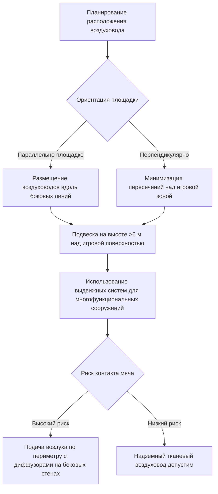

## Обзор

Распределение воздуха в спортивных сооружениях представляет уникальные инженерные задачи: высокие потолки (обычно 6–15 м), большие открытые объемы, строгие ограничения на сквозняки на игровых поверхностях и возможное воздействие на траектории метаемых предметов. Эффективное проектирование балансирует комфорт занимающихся, адекватные показатели вентиляции и минимальное воздействие на спортивные результаты.

## Физика образования сквозняков в спортивных сооружениях

Восприятие сквозняка возникает, когда скорости воздуха в зоне нахождения людей превышают пороги комфорта, а занимающиеся находятся в термонейтральном или слегка прохладном состоянии. Коэффициент конвективной теплопередачи на поверхности тела возрастает со скоростью согласно:

$$h_c = 8.3 V^{0.6}$$

где $h_c$ — коэффициент конвективной теплопередачи (Вт/м²·К) и $V$ — скорость воздуха (м/с).

Для спортсменов, генерирующих метаболическое тепло 5–8 мет (350–560 Вт/м²), допустимы более высокие скорости. Однако зрители и игроки в состоянии покоя требуют защиты от сквозняков. Стандарт ASHRAE 55 рекомендует скорости в зоне нахождения людей ниже 0,25 м/с для малоподвижной деятельности, но проектирование спортивных сооружений предусматривает максимум 0,5 м/с на уровне игровой поверхности.

### Критическая скорость проектирования

Скорость воздуха на игровой поверхности $V_p$ зависит от дальности броска $L$, скорости подачи воздуха $V_0$ и характеристик диффузора:

$$V_p = V_0 \left(\frac{A_0}{A_x}\right) = V_0 \left(\frac{d_0}{K \cdot L}\right)$$

где $A_0$ — площадь выходного отверстия подачи, $d_0$ — диаметр выходного отверстия, $K$ — константа броска (обычно 5–7 для высокоскоростных диффузоров), $L$ — дальность броска до зоны нахождения людей.

## Системы распределения воздуха с высокой скоростью

### Расчет дальности броска

Для надземных систем подачи в гимназиях с высотой потолка $H$ и желаемой конечной скоростью $V_t$ в зоне нахождения людей (1,8–2,4 м над полом):

$$L = \frac{V_0 \cdot d_0}{K \cdot V_t}$$

**Пример расчета:**
- Скорость подачи воздуха: $V_0 = 610$ м/мин
- Диаметр диффузора: $d_0 = 30 см
- Константа броска: $K = 6$
- Целевая скорость: $V_t = 30$ м/мин

$$L = \frac{610 \times 30}{6 \times 30} = 12,2 \text{ м}$$

Для высоты потолка 9 м с зоной нахождения людей на высоте 2,4 м эффективная дальность броска составляет 6,7 м, что требует корректировки скорости подачи воздуха или переположения.

### Стратегия подачи воздуха с высокой боковой стены

Диффузоры на боковых стенах, установленные на высоте 4,5–7,5 м над полом, используют эффект Коанда для поддержания прилегания потока к поверхности стены, рассеивая скорость до достижения игровой поверхности:

Коэффициент вовлечения $E_r$ для настенной струи примерно:

$$E_r = 0.055 \frac{x}{d_0}$$

где $x$ — расстояние вдоль стены. Более высокие коэффициенты вовлечения указывают на большее смешивание и снижение скорости.

## Контроль термической стратификации

Помещения большого объема подвергаются значительным температурным градиентам вследствие стратификации, вызванной плавучестью. Разность температур между потолком и полом может достигать:

$$\Delta T = \frac{q \cdot H}{\rho c_p Q}$$

где $q$ — внутренний источник тепла (Вт), $H$ — высота потолка (м), $\rho$ — плотность воздуха (кг/м³), $c_p$ — удельная теплоемкость (Дж/кг·К), $Q$ — скорость вентиляции (м³/с).

### Стратегии устранения стратификации

| Стратегия | Применение | Эффективность | Энергетическое воздействие |
|-----------|-----------|---------------|---------------------------|
| Потолочные вентиляторы (HVLS) | Высоты >7,5 м | Снижает ΔT на 3–6°C | Низкая энергоемкость, высокое смешивание |
| Подача воздуха с высокой скоростью | Все высоты | Смешивание за счет импульса | Повышенная мощность вентилятора |
| Периметральное отопление | Период отопления | Противодействие нисходящим потокам | Локальный комфорт |
| Вентиляция с вытеснением | Зоны низкой активности | Сохранение стратификации | Сниженная энергия смешивания |

**Воздействие вентилятора HVLS (большой объем, низкая скорость):**

Потолочные вентиляторы, работающие на 50–100 об/мин, создают мягкий нисходящий поток воздуха (60–90 м/мин на уровне вентилятора, <30 м/мин у пола), нарушающий стратификацию без чрезмерных сквозняков. Требуемая мощность:

$$P = \frac{\rho Q \Delta P}{\eta}$$

Для вентилятора диаметром 7,3 м, подающего 70,8 м³/с против 25 Па, потребление энергии составляет примерно 1,1 кВт — значительно меньше, чем кондиционирование стратифицированного воздуха.

## Системы с тканевыми воздуховодами для гимназий

Системы рассеивания воздуха из ткани предлагают равномерное распределение воздуха через пористую текстильную ткань или инженерные отверстия, идеальные для помещений, требующих контроля сквозняков и эстетической интеграции.

### Соображения проектирования

**Скорость выпуска через ткань:**

$$V_{fabric} = \frac{Q}{A_{fabric} \cdot P}$$

где $Q$ — поток воздуха (м³/ч), $A_{fabric}$ — общая площадь поверхности ткани (м²), $P$ — коэффициент пористости (0,3–0,7).

Для равномерного распределения с целевой $V_{fabric} = 15$ м/мин на поверхности ткани и последующим снижением до <6 м/мин на расстоянии 4,5 м:

- Требуемая площадь ткани для 280 м³/ч: $A = \frac{280}{15 \times 0,5} = 37$ м²
- Типичный воздуховод: диаметр 60 см × длина 15 м обеспечивает $\pi \times 0,6 \times 15 = 28$ м²

### Преимущества для спортивных сооружений

| Характеристика | Преимущество | Технологическое обоснование |
|----------------|------------|--------------------------|
| Равномерный низкоскоростной выпуск | Исключение сквозняков | Большая площадь поверхности снижает скорость выпуска |
| Легкая подвеска | Минимальная нагрузка на конструкцию | 2,4–4,8 кг/м против 7–12 кг/м для металлических воздуховодов |
| Эстетическая интеграция | Соответствие цветовой гамме сооружения | Доступна в школьных цветах, логотипы |
| Простая установка | Сниженные затраты на труд | Не требуется тяжелое подъемное оборудование |
| Устойчивость к конденсации | Влажные среды | Пористая ткань предотвращает конденсацию на поверхности |

### Снижение риска помех от летающих мячей

Подвешенные тканевые воздуховды представляют препятствие для мячей с высокой траекторией (баскетбол, волейбол). Проектные меры по снижению риска:

**Требования к зазорам:**
- Баскетбол: минимум 7,6 м над игровой площадкой (стандарт ФИБА)
- Волейбол: минимум 7 м над игровой площадкой (стандарт ФИВБ)
- Общая гимназия: минимум 6 м для зазора

Когда надземное распределение неизбежно ниже этих высот, выдвижные системы или проектирование по периметру с диффузорами на высоких боковых стенах исключают помехи.

## Конфигурации вытяжного воздуха

Расположение вытяжного воздуха значительно влияет на циркуляционные картины:

**Вытяжка с верхнего уровня:**
- Сначала удаляет самый теплый воздух
- Снижает энергию отопления зимой
- Требует большего импульса подачи для достижения зоны нахождения людей

**Вытяжка с нижнего уровня:**
- Лучшая производительность в период охлаждения
- Повышает эффективность вентиляции с вытеснением
- Может потребовать больше фильтрации из-за загрязнений у пола

**Раздельная вытяжка (рекомендуется):**
- 60–70% вытяжки с верхнего уровня для контроля стратификации
- 30–40% вытяжки с нижнего уровня для качества воздуха в зоне нахождения людей
- Заслонки позволяют сезонную оптимизацию

## Краткое описание процесса проектирования

## Ссылки на ASHRAE

- **Стандарт ASHRAE 62.1**: Показатели вентиляции для гимназий (минимум 0,3 м³/(мин·м²))
- **Справочник ASHRAE—HVAC Applications, Глава 4**: Общественные места, включая спортивные сооружения
- **Стандарт ASHRAE 55**: Критерии теплового комфорта, ограничения скорости воздуха
- **Справочник ASHRAE—Fundamentals, Глава 20**: Распределение воздуха в помещении, расчеты дальности броска

## Заключение

Успешное распределение воздуха в спортивных сооружениях требует точного инженерного обеспечения для балансирования конкурирующих требований: адекватная вентиляция, тепловой комфорт для разнообразных паттернов использования помещения, исключение сквозняков на игровых поверхностях и минимальные помехи спортивной деятельности. Высокоскоростные системы подачи воздуха с тщательными расчетами дальности броска, системы с тканевыми воздуховодами для равномерного низкоскоростного распределения и активные меры устранения стратификации предоставляют эффективные решения для этих сложных помещений.
