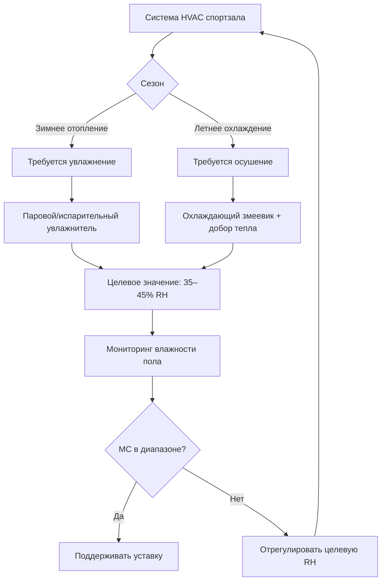
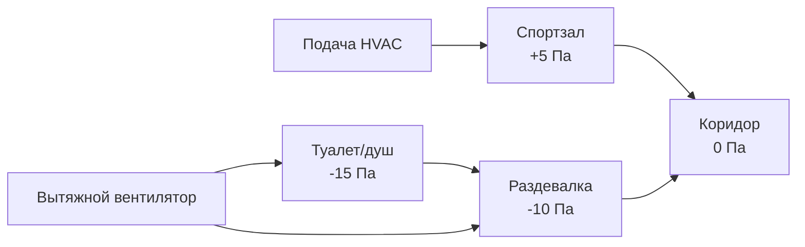

Спортивные залы создают уникальные проблемы HVAC из-за высоких потолков (9–12 м), переменных тепловых нагрузок от занятости (50–500+ человек), чувствительности паркетного пола к влажности и соседства с помещениями с интенсивной вытяжкой, такими как раздевалки. Эффективное проектирование требует управления тепловой стратификацией при одновременной защите систем полов и обеспечении комфорта пользователей в различных сценариях использования.

## Тепловая стратификация в высоких помещениях

Температурная стратификация в спортивных залах подчиняется следующему соотношению:

$$\Delta T = \frac{Q \cdot h}{k_{\text{eff}} \cdot A}$$

Где $\Delta T$ — вертикальный градиент температуры (°C), $Q$ — чувствительная тепловая нагрузка (кДж/ч), $h$ — высота потолка (м), $k_{\text{eff}}$ — эффективная теплопроводность воздуха (кДж/ч·м²·°C), и $A$ — площадь пола (м²).

В типичном спортивном зале 24 м × 37 м с потолками высотой 11 м стратификация может создавать разницу температур 5–8°C между уровнем пола и потолком в режиме отопления. Это приводит к:

- Потерям энергии на отопление верхнего объема воздуха
- Дискомфорту пользователей на уровне деятельности (от пола до 3 м)
- Чрезмерному времени работы отопительного оборудования
- Возможным проблемам конденсации на конструкциях крыши

**ASHRAE Standard 62.1** требует эффективности вентиляции дыхательной зоны, которую стратификация прямо подрывает. Эффективность вентиляции можно рассчитать как:

$$\varepsilon_v = \frac{C_{\text{exhaust}} - C_{\text{supply}}}{C_{\text{breathing}} - C_{\text{supply}}}$$

Где $\varepsilon_v$ — эффективность вентиляции, $C_{\text{exhaust}}$ — концентрация загрязняющих веществ на выходе, $C_{\text{supply}}$ — концентрация загрязняющих веществ на подаче, и $C_{\text{breathing}}$ — концентрация в дыхательной зоне. Стратификация снижает $\varepsilon_v$ ниже предполагаемого значения 1,0, требуя увеличения расходов вентиляции.

## Стратегии распределения воздуха

| Стратегия | Применение | Преимущества | Ограничения |
|----------|-------------|------------|-------------|
| Боковые воздушные струи | Школьные спортзалы, потолки 9–11 м | Простая установка, хорошее перемешивание | Требует достаточного расстояния разброса |
| Вертикальное вытеснение вниз | Рекреационные сооружения, охлаждение-доминанта | Энергоэффективно, контроль стратификации | Ограниченная эффективность отопления |
| Подпольная/низкоуровневая подача | Премиум-сооружения | Отличный комфорт на уровне пола | Высокие затраты на установку, площадь пола |
| Излучение + вентиляция | Многоцелевые сборные помещения | Тихая работа, комфорт | Сложные системы управления, высокая первоначальная стоимость |

### Проектирование боковых воздушных струй

Расстояние разброса для боковых воздушных струй должно охватывать 75–80% ширины спортзала, чтобы избежать короткого замыкания:

$$L = \frac{V_x}{V_0} \cdot \sqrt{\frac{A_0}{C_s}}$$

Где $L$ — расстояние разброса (м), $V_x$ — терминальная скорость (обычно 0,25 м/с), $V_0$ — скорость на выходе (м/с), $A_0$ — площадь сопла (м²), и $C_s$ — коэффициент формы (0,6–0,8 для прямоугольных струй).

Для спортзала шириной 37 м воздухораспределители требуют минимальных скоростей на выходе 10–13 м/с для достижения надлежащего перемешивания. Это соответствует уровням звукового давления, которые должны быть оценены в соответствии с рекомендациями **ASHRAE Applications Handbook** NC 35–40 для спортзалов.

## Защита влажности паркетного пола

Паркетные полы требуют строгого контроля влажности для предотвращения коробления, волнообразности или образования щелей. Равновесие влажности древесины подчиняется:

$$MC = 18,8 + 0,221 \cdot RH - 0,00145 \cdot RH^2$$

Где $MC$ — влажность древесины (%), и $RH$ — относительная влажность (%). Для клена оптимальная влажность древесины составляет 6–9%, что соответствует 30–50% RH при 21°C.

### Требования по сезонному контролю влажности

Зимой наружный воздух при –23°C и 60% RH содержит приблизительно 0,3 г влаги на 1 кг сухого воздуха. При нагревании до 21°C без увлажнения это приводит к 8% RH — значительно ниже приемлемого уровня. Требуемая нагрузка на увлажнение:

$$Q_h = \dot{m} \cdot (W_{\text{target}} - W_{\text{outdoor}}) \cdot h_{fg}$$

Где $Q_h$ — нагрузка увлажнения (кДж/ч), $\dot{m}$ — расход воздуха (кг/ч), $W$ — коэффициент влажности (кг воды/кг сухого воздуха), и $h_{fg}$ — скрытая теплота парообразования (2450 кДж/кг при 21°C).

## Интеграция вытяжки раздевалки

Спортальные залы обычно соседствуют с раздевалками, требующими вытяжки 8–10 м³/ч/м² для контроля запахов и влажности. Это создает соотношения давлений, которые необходимо управлять:

Разница давлений поддерживает направленный поток воздуха, предотвращая миграцию влаги и запахов в спортзал. Это требует, чтобы подача в спортзал превышала вытяжку приблизительно на:

$$\Delta Q = \frac{\Delta P \cdot A}{\rho \cdot C}$$

Где $\Delta Q$ — избыток подачи (м³/ч), $\Delta P$ — целевое давление (Па), $A$ — площадь утечки (м²), $\rho$ — плотность воздуха, и $C$ — коэффициент потока.

Для типичного спортзала с 280 м² площади стен/дверей, общей с раздевалками, поддержание +5 Па требует 95–190 м³/ч избытка подачи над вытяжкой, учитывая характеристики утечки строительного корпуса и перегородок согласно **ASHRAE Fundamentals Chapter 16**.

## Рассмотрение многоцелевого сборного пространства

Когда спортзалы служат в качестве сборных помещений для выпускных вечеров, концертов или мероприятий сообщества, занятость может увеличиться с 50 (баскетбольная тренировка) до 500+ (выпускной). Требование вентиляции масштабируется в соответствии с занятостью согласно **ASHRAE 62.1**:

- **Спорт/физическая активность**: 10 м³/ч на человека
- **Сборное использование**: 2,5 м³/ч на человека (режим зрителя)

Общее требование наружного воздуха должно соответствовать максимальным нагрузкам, одновременно позволяя работу экономайзера при умеренной занятости. Системы с переменным расходом воздуха (VAV) с управлением вентиляцией по спросу CO₂ оптимизируют энергию при сохранении качества воздуха.

Соотношение концентрации CO₂:

$$C_s = C_o + \frac{N \cdot G}{V_{oa}}$$

Где $C_s$ — концентрация CO₂ в помещении (ppm), $C_o$ — концентрация наружного воздуха (обычно 400 ppm), $N$ — количество людей, $G$ — генерация CO₂ (0,15–0,30 м³/ч на человека в зависимости от активности), и $V_{oa}$ — расход вентиляции наружного воздуха (м³/ч).

## Системы вентиляторов дестратификации

Потолочные вентиляторы дестратификации уменьшают стратификацию, создавая нисходящий поток воздуха со скоростью 1–2 м/с, перемешивая тепловые слои. Размещение вентилятора следует:

| Высота потолка | Расстояние между вентиляторами | Диаметр вентилятора | Минимальное перемещение воздуха |
|----------------|-------------|--------------|----------------------|
| 9–11 м | 12–15 м | 2,4–3,7 м | 70 000 м³/ч на вентилятор |
| 11–12 м | 11–14 м | 3–4,3 м | 95 000 м³/ч на вентилятор |

Экономия энергии от дестратификации в режиме отопления составляет 20–30% за счет снижения требований к уставке термостата и повышения эффективности распределения. Период окупаемости установки вентилятора дестратификации обычно составляет 2–4 года в холодном климате.

## Контрольный список проектирования

- Проверьте расчеты разброса для боковых или верхних диффузоров, чтобы обеспечить покрытие
- Определите размер увлажнения/осушения для защиты паркетного пола (35–50% RH круглый год)
- Скоординируйте соотношения давлений с системами вытяжки соседних раздевалок
- Спроектируйте максимальную занятость сборного помещения с управлением вентиляцией по спросу CO₂
- Оцените вентиляторы дестратификации для объектов с высотой потолков >10 м
- Подтвердите соответствие критериям шума (NC 35–40) при расходах проектирования
- Предусмотрите отдельные зоны для мест зрителей, если применимо
