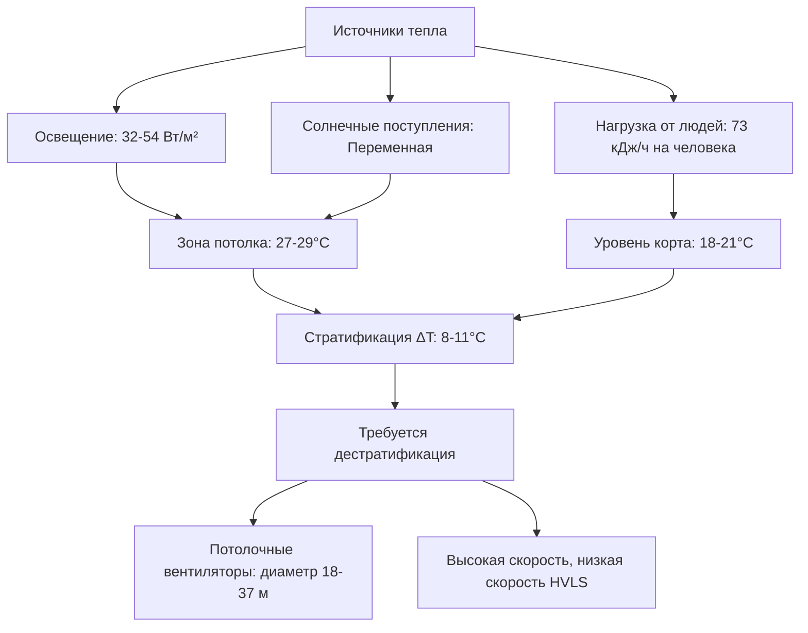
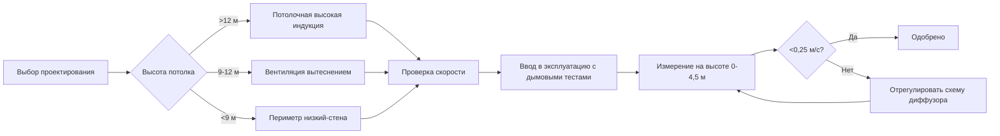

Крытые теннисные комплексы представляют уникальные проблемы для HVAC, вытекающие из значительной высоты потолков (обычно 11–18 м), строгих ограничений скорости воздуха для предотвращения помех траектории мяча, значительных тепловых нагрузок от высокоинтенсивных осветительных приборов и необходимости поддерживать отдельные зоны комфорта для активных игроков и малоподвижных зрителей.

## Ограничения скорости воздуха и динамика полета мяча

Основным ограничением при проектировании HVAC теннисного корта является скорость воздуха на поверхности игровой площадки. Горизонтальные скорости воздуха, превышающие 0,25 м/с (50 CFM), заметно влияют на траекторию теннисного мяча, особенно во время подач и розыгрышей с задней линии, когда мяч движется со скоростью 27–54 м/с.

Аэродинамическая сила сопротивления теннисного мяча подчиняется уравнению:

$$F_d = \frac{1}{2} \rho C_d A v_{rel}^2$$

Где $\rho$ — плотность воздуха (кг/м³), $C_d$ — коэффициент сопротивления (приблизительно 0,55 для теннисного мяча), $A$ — площадь лобового сечения, $v_{rel}$ — относительная скорость между мячом и воздухом. Даже скромные боковые ветры 0,25–0,5 м/с создают латеральное смещение 0,15–0,45 м по длине корта 24 м, значительно влияя на качество игры.

**Максимальные проектные скорости воздуха:**

| Местоположение | Максимальная скорость | Высота измерения |
|----------|------------------|-------------------|
| Активная зона игровой площадки | 0,25 м/с (50 CFM) | 0–4,5 м над кортом |
| Средняя зона | 0,5 м/с (100 CFM) | 4,5–9 м над кортом |
| Верхняя зона потолка | 0,75+ м/с (150+ CFM) | Выше 9 м |

ASHRAE Applications Handbook рекомендует поддерживать скорости ниже 0,25 м/с в зоне игровой площадки, что достигается путем низкоскоростной вентиляции вытеснением или тщательно спроектированными потолочными системами с значительными расстояниями разноса.

## Тепловая стратификация в высоких помещениях

Значительная высота потолков в теннисных комплексах создает ярко выраженную тепловую стратификацию. Температурный градиент в естественно стратифицированном помещении подчиняется уравнению:

$$\frac{dT}{dz} = \frac{Q}{k A}$$

Где $dT/dz$ представляет вертикальный температурный градиент (°C/м), $Q$ — тепловой поток, $k$ — теплопроводность, $A$ — площадь поперечного сечения. Без дестратификации температурные перепады между полом и потолком 8–14 °C являются обычным явлением.

## Требования к комфорту игроков

Активные теннисные игроки выделяют 264–352 кДж/ч метаболического тепла, требуя более низких установок температуры, чем в зонах зрителей. Оперативная температура для комфорта игроков:

$$T_o = \frac{T_a + T_r}{2}$$

Где $T_a$ — температура воздуха и $T_r$ — средняя радиационная температура. Для игроков с уровнем активности 4–5 МЕТ целевой диапазон оперативной температуры составляет 13–18 °C с относительной влажностью, поддерживаемой на уровне 40–50%.

**Стратегия двухзонного климата:**

| Зона | Сухая температура | Относительная влажность | Скорость воздуха | Режим занятости |
|------|---------------|-------------------|--------------|-------------------|
| Уровень корта | 15–18°C | 40–50% | <0,25 м/с (50 CFM) | Высокий метаболический уровень |
| Зона зрителей | 20–22°C | 40–50% | <0,15 м/с (30 CFM) | Малоподвижность |
| Фойе/циркуляция | 21–23°C | 40–50% | Переменная | Переходная |

## Анализ тепловой нагрузки от освещения

Высокоинтенсивные галогенные или светодиодные приборы, необходимые для трансляционного качества освещения (800–1350 люкс), вносят 32–54 Вт/м² от выделения сенсибельного тепла. Для комплекса площадью 3347 м² с четырьмя кортами это представляет:

$$Q_{lighting} = 3347 \times 43 \, \text{Вт/м}^2 = 144 \, \text{кВт}$$

Эта значительная тепловая нагрузка накапливается на уровне потолка, обостряя стратификацию. Современные светодиодные системы сокращают это на 40–60% по сравнению с унаследованными галогенными приборами, обеспечивая при этом превосходную цветопередачу (CRI >90).

## Стратегии распределения воздуха

Два основных подхода решают противоречивые требования минимального движения воздуха и эффективного отвода тепла:

**Потолочные системы высокой индукции:**
- Подача воздуха при температуре 13–13 °C из потолочных диффузоров
- Дальность разноса 24–37 м для обеспечения конечной скорости <0,25 м/с на уровне корта
- Требует высоты потолков >12 м для адекватной длины смешивания
- Охлаждающая способность: 6,8–10,2 м³/ч на 93 м² площади корта

**Подпольная/низкая боковая стенка вытеснением:**
- Подача воздуха при температуре 16–18 °C на уровне пола
- Использует тепловую плавучесть для поднятия теплого воздуха
- Минимальные горизонтальные скорости в зоне игровой площадки
- Превосходна для комплексов с более низкой высотой потолков (9–12 м)

## Требования вентиляции

ASHRAE Standard 62.1 определяет требования к наружному воздуху на основе плотности занятости. Для теннисных комплексов:

$$V_{oa} = R_p \times P + R_a \times A$$

Где $V_{oa}$ — требуемый наружный воздух (м³/ч), $R_p$ — норма наружного воздуха на человека (3,5 м³/ч для спортивных комплексов), $P$ — занятость, $R_a$ — норма наружного воздуха на площадь (0,06 м³/(ч·м²)), $A$ — площадь пола. Для четырёхкортного комплекса со 200 людьми:

$$V_{oa} = 3,5 \times 200 + 0,06 \times 3347 = 901 \, \text{м³/ч минимум}$$

## Рассмотрения управления влажностью

Поддержание 40–50% относительной влажности предотвращает конденсацию на поверхности корта, одновременно обеспечивая комфорт игроков. Нагрузка на удаление влаги включает:

- Perspiration игроков: 0,09–0,14 кг/ч на активного игрока
- Инфильтрация через входные двери: Переменная, 20–40% от общего
- Вентиляция наружного воздуха: Зависит от климата

Осушение обычно интегрировано в центральную систему охлаждения с выделенными десикантными системами, используемыми в влажном климате, где латентные нагрузки превышают 30% от общего охлаждения.

## Интеграция зоны зрителей

Верхний уровень зрительских мест требует отдельной обработки воздуха для поддержания диапазона комфорта 20–22 °C без создания нисходящих потоков, влияющих на игру. Периметральное отопление в зонах зрителей нейтрализует холодное радиационное излучение от ограждающей конструкции во время отопительного сезона, рассчитываемое как:

$$q_{perimeter} = U \times A \times (T_{indoor} - T_{outdoor})$$

Где типичные значения U для изолированных стен колеблются в диапазоне 0,28–0,45 Вт/(м²·К).
